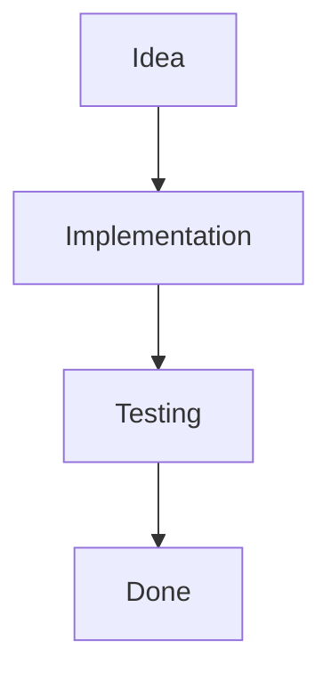

# 🚀 Quick Start Guide

Get up and running with iblogger-feeds in 5 minutes!

---

## Step 1: Explore the Repository (2 min)

**Key Files to Read:**
1. **[README.md](README.md)** - Overview and main concepts
2. **[INDEX.md](INDEX.md)** - Browse all articles by category
3. **[STRUCTURE.md](STRUCTURE.md)** - Understand the folder organization

**Browse Categories:**
- 💻 [Clean Code & Engineering](feeds/clean-code/)
- 📊 [Management & Leadership](feeds/management/)
- 🌐 [Trending Tech](feeds/trending-tech/)
- 🧠 [Mental Health & Well-being](feeds/mental-health/)
- 🎯 [Developer Habits](feeds/developer-habits/)
- ☕ [Daily Dev Stories](feeds/daily-dev/)

---

## Step 2: Read an Article (1-2 min)

Start with this example:
- **[Five Signs You're Heading Toward Burnout](feeds/mental-health/01-five-signs-of-burnout.md)** - A comprehensive example article

---

## Step 3: Want to Contribute? (2-5 min)

### Option A: Start Writing

```bash
# 1. Fork the repository
git clone https://github.com/ichamrong/iblogger-feeds.git
cd iblogger-feeds

# 2. Create a new branch
git checkout -b feature/your-article-topic

# 3. Copy the template
cp _templates/article-template.md feeds/[category]/XX-your-title.md

# 4. Edit your article
# Open in your favorite editor and write!

# 5. Add to INDEX.md
# Add your article to the appropriate category

# 6. Commit and push
git add .
git commit -m "Add: Your Article Title"
git push origin feature/your-article-topic

# 7. Open a Pull Request
# Go to GitHub and create a PR
```

### Option B: Suggest an Article

Open an issue with the **"Article Suggestion"** template:
1. Click "Issues"
2. Click "New Issue"
3. Choose "Article Suggestion"
4. Fill in the template

### Option C: Join a Discussion

Open an issue with the **"Discussion"** template to start a conversation about a topic.

---

## File Structure Quick Reference

```
iblogger-feeds/
├── README.md                         ← Start here
├── INDEX.md                          ← Browse articles
├── STRUCTURE.md                      ← Folder organization
├── CODE_OF_CONDUCT.md               ← Community guidelines
├── QUICK_START.md                   ← This file
│
├── .github/
│   ├── CONTRIBUTING.md              ← Contribution rules
│   ├── PULL_REQUEST_TEMPLATE.md    ← PR template
│   └── ISSUE_TEMPLATE/
│       ├── suggestion.md            ← Suggest articles
│       └── discussion.md            ← Start discussions
│
├── feeds/                           ← All articles
│   ├── clean-code/                ← Design patterns, SOLID, refactoring
│   ├── management/                ← Leadership, communication, teams
│   ├── trending-tech/             ← AI, new frameworks, DevOps
│   ├── mental-health/             ← Burnout, wellness, balance
│   ├── developer-habits/          ← Productivity, learning, growth
│   └── daily-dev/                 ← Stories, lessons, adventures
│
└── _templates/
    └── article-template.md        ← Use this for new articles
```

---

## Common Questions

### Q: How do I write an article?

**A:** Read the [article template](_templates/article-template.md) and follow the structure. Include:
- Title, author, date, tags, category
- Table of Contents
- Clear sections with examples
- Links to related posts
- References

### Q: What topics can I write about?

**A:** Anything in these categories:
- 💻 Clean Code & Engineering
- 📊 Management & Leadership
- 🌐 Trending Tech
- 🧠 Mental Health & Well-being
- 🎯 Developer Habits
- ☕ Daily Dev Stories

### Q: Can I write about controversial topics?

**A:** Yes! We welcome different perspectives. Be respectful and back up your points with examples or evidence.

### Q: How long should articles be?

**A:** Flexible! 500-3000 words is ideal, but shorter or longer is okay. Keep it focused.

### Q: Can I write anonymously?

**A:** Yes. Use a pen name if you prefer, especially for sensitive topics.

### Q: How do I add diagrams?

**A:** Use Mermaid for flowcharts and graphs:



Or ASCII art for code examples:

```
Input
  ↓
Process
  ↓
Output
```

### Q: Can I link to other articles?

**A:** Yes! Use relative paths:
```markdown
[Related Post](../clean-code/2024-05-10-design-patterns.md)
```

---

## Naming Convention

Use this format for article files:

```
[YYYY-MM-DD]-[kebab-case-title].md
```

**Examples:**
- ✅ `01-clean-code-principles.md`
- ✅ `02-remote-team-management.md`
- ❌ `Clean Code Principles.md` (spaces, no prefix)
- ❌ `clean_code_principles.md` (underscores, no prefix)

---

## Next Steps

1. **Explore:** Read articles in your areas of interest
2. **Learn:** Discover new perspectives and techniques
3. **Share:** Write about your experiences and insights
4. **Discuss:** Join conversations in issues and discussions
5. **Grow:** Build with the community

---

## Need Help?

- **Questions?** Open an issue with the "Discussion" template
- **Article idea?** Open an issue with the "Article Suggestion" template
- **Found a bug?** Open a regular issue
- **Want to chat?** Use the discussions tab

---

## Resources

- **[CONTRIBUTING.md](.github/CONTRIBUTING.md)** - Detailed contribution guidelines
- **[STRUCTURE.md](STRUCTURE.md)** - Complete folder organization guide
- **[CODE_OF_CONDUCT.md](CODE_OF_CONDUCT.md)** - Community guidelines
- **[Example Article](feeds/mental-health/01-five-signs-of-burnout.md)** - See a complete article

---

## Let's Build Together! 🚀

We're excited to have you in this community. Whether you're reading, writing, or just exploring, thank you for being here!

Happy sharing and learning! 💡

---

*Last updated: 2026-05-17*
