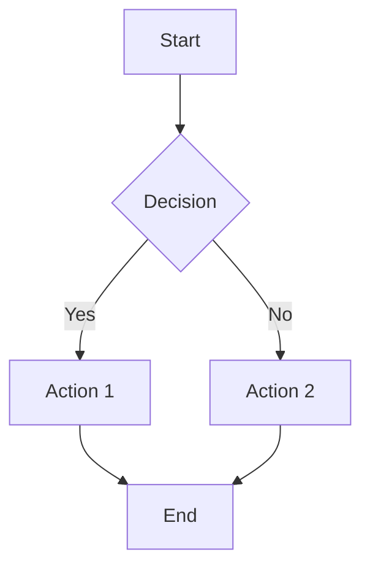

# [Article Title Here]

**Author:** ichamrong  
**Date:** YYYY-MM-DD  
**Tags:** #tag1 #tag2 #tag3  
**Category:** [Management/Clean Code/Trending Tech/Mental Health/Developer Habits/Daily Dev]  
**Read Time:** ~X min

---

## 📋 Table of Contents

- [Overview](#overview)
- [Key Points](#key-points)
- [Implementation Guide](#implementation-guide)
- [Lessons Learned](#lessons-learned)
- [Common Pitfalls](#common-pitfalls)
- [References](#references)
- [Related Posts](#related-posts)

---

## Overview

Brief introduction (2-3 sentences about the topic and why it matters).

**Key Takeaway:** In one sentence, what should readers remember?

---

## Key Points

### Point 1: Main Concept
Explanation with practical examples.

```
Code example or pseudocode here
```

### Point 2: Implementation Strategy
How to apply this in practice.

**Example Scenario:**
- Step 1
- Step 2
- Step 3

### Point 3: Advanced Considerations
Deeper insights and edge cases.

---

## Implementation Guide

### Quick Start

```bash
# Command or setup here
```

### Step-by-Step

1. **First Step:** Description
2. **Second Step:** Description
3. **Third Step:** Description

### Example Code

```python
# Language-specific example
def example_function():
    pass
```

---

## Lessons Learned

What worked, what didn't, and why:

- ✅ **Success:** What worked well
- ❌ **Challenge:** What we struggled with
- 🔄 **Adjustment:** How we adapted
- 💡 **Insight:** Key learning

---

## Common Pitfalls

Things to avoid:

1. **Pitfall:** Description and solution
2. **Pitfall:** Description and solution

---

## Diagrams & Visualizations

### Flowchart Example (Mermaid)



### Process Flow (ASCII)

```
Input
  ↓
Processing Step 1
  ↓
Processing Step 2
  ↓
Output
```

---

## References

- [Useful Article Title](https://example.com)
- [Documentation Link](https://docs.example.com)
- [Research Paper](https://research.example.com)
- [Tool/Resource](https://tool.example.com)

---

## Related Posts

Learn more about related topics:

- [Related Post Title 1](../category/YYYY-MM-DD-post-title.md)
- [Related Post Title 2](../category/YYYY-MM-DD-post-title.md)
- [Related Post Title 3](../category/YYYY-MM-DD-post-title.md)

---

## Discussion

Questions or thoughts? Open an issue or comment below!

---

**Share this post:** [Share on Twitter](#) | [Share on LinkedIn](#) | [Discuss](#)

---

*Last updated: YYYY-MM-DD*
