# Creational Patterns: The Art of Instantiation

**Part of:** [Design Patterns Series](./README.md)  
**Tags:** #design-patterns #creational #gof #java  
**Read Time:** ~25 min

> Creational patterns abstract the instantiation process. They make the system independent of how its objects are created, composed, and represented.

---

## 📌 Table of Contents
- [Patterns in This Section](#patterns-in-this-section)
- [The Singleton](#the-singleton)
  - [The Problem](#the-problem-4)
  - [The Insight](#the-insight-4)
  - [The Structure](#the-structure-4)
  - [The Runtime Flow](#the-runtime-flow-2)
  - [Thread-Safety Decision Flow](#thread-safety-decision-flow)
  - [Industrial Case Study: Database Connection Pool](#industrial-case-study-database-connection-pool)
  - [When to Use / When to Avoid](#when-to-use-when-to-avoid-4)
- [The Builder](#the-builder)
  - [The Problem](#the-problem-4)
  - [The Insight](#the-insight-4)
  - [The Structure](#the-structure-4)
  - [The Runtime Flow](#the-runtime-flow-2)
  - [Industrial Case Study: HTTP Request Client](#industrial-case-study-http-request-client)
  - [When to Use / When to Avoid](#when-to-use-when-to-avoid-4)
- [The Factory Method](#the-factory-method)
  - [The Problem](#the-problem-4)
  - [The Insight](#the-insight-4)
  - [The Structure](#the-structure-4)
  - [The Runtime Flow](#the-runtime-flow-2)
  - [Factory Dispatch Logic](#factory-dispatch-logic)
  - [Industrial Case Study: Multi-Channel Notification System](#industrial-case-study-multi-channel-notification-system)
  - [When to Use / When to Avoid](#when-to-use-when-to-avoid-4)
- [The Abstract Factory](#the-abstract-factory)
  - [The Problem](#the-problem-4)
  - [The Insight](#the-insight-4)
  - [The Structure](#the-structure-4)
  - [Industrial Case Study: Multi-Cloud Storage Abstraction](#industrial-case-study-multi-cloud-storage-abstraction)
  - [When to Use / When to Avoid](#when-to-use-when-to-avoid-4)
- [The Prototype](#the-prototype)
  - [The Problem](#the-problem-4)
  - [The Insight](#the-insight-4)
  - [The Structure](#the-structure-4)
  - [Trade-off Analysis](#trade-off-analysis)
  - [Industrial Case Study: Game Entity Spawner](#industrial-case-study-game-entity-spawner)
  - [When to Use / When to Avoid](#when-to-use-when-to-avoid-4)
- [Summary](#summary)

---

## Patterns in This Section

| Pattern | Problem It Solves | Real-World Analogy |
| :--- | :--- | :--- |
| [Singleton](#the-singleton) | Only one instance should exist | A country has one president |
| [Builder](#the-builder) | Object with many optional parameters | Ordering a custom sandwich |
| [Factory Method](#the-factory-method) | Subclass decides what to create | A hiring agency assigns the right worker |
| [Abstract Factory](#the-abstract-factory) | Families of related objects | A furniture store sells matching sets |
| [Prototype](#the-prototype) | Cloning is cheaper than creating | Copying a cell in biology |

---

## The Singleton

> **The Singleton isn't about laziness — it's about truth. There can only be one source of truth.**
> 
> * 📖 **Read the Parable:** [The Bank's Only Vault (ទូដែកតែមួយគត់របស់ធនាគារ)](../../concepts/parables/75-the-banks-only-vault.md)
> * 🧠 **Read the First Principles Derivation:** [MIT Professor Strategy: Singleton (គោលការណ៍គ្រឹះដំបូងនៃ Singleton)](../../concepts/design-patterns/01-mit-professor/01-singleton.md)
> * 👶 **Read the Feynman Simplification:** [Feynman Technique: Singleton (ការពន្យល់ពី Singleton ដោយគ្មានពាក្យបច្ចេកទេស)](../../concepts/design-patterns/02-feynman-technique/04-singleton.md)
> * 👦 **Read the ELI5 Metaphor:** [ELI5: Singleton (ម៉ាស៊ីនខួងខ្មៅដៃតែមួយគត់ក្នុងថ្នាក់រៀន)](../../concepts/design-patterns/03-eli5/04-singleton.md)
> * 🌉 **Read the Analogy Bridge:** [Analogy Bridge: Singleton (ស្ពានប្រៀបធៀបនៃប្រភពពិតតែមួយគត់)](../../concepts/design-patterns/04-analogy-bridge/04-singleton.md)
> * 🧐 **Read the Socratic Discovery:** [Socratic Method: Singleton (ការបង្កើតប្រព័ន្ធការពិតតែមួយគត់តាមវិធីសាស្ត្រសូក្រាត)](../../concepts/design-patterns/05-socratic-method/04-singleton.md)
> * 📰 **Read the Journalist Summary:** [Journalist: Singleton (ការធានាឱ្យមានការពិតតែមួយគត់ក្នុងប្រព័ន្ធទាំងមូល)](../../concepts/design-patterns/06-journalist-inverted-pyramid/04-singleton.md)
> * 🎭 **Read the Storyteller Narrative:** [Storyteller: Singleton (អាណាព្យាបាលនៃសេចក្តីពិត និងកងទ័ពក្លូនបង្កចលាចល)](../../concepts/design-patterns/07-storyteller-narrative-arc/04-singleton.md)
> * ⚙️ **Read the Engineer Spec:** [Engineer: Singleton (ការសម្របសម្រួលប្រភពពិតតែមួយគត់ និងទប់ស្កាត់ការខ្ជះខ្ជាយធនធាន)](../../concepts/design-patterns/08-engineer-requirements-constraints-solution/03-singleton.md)
> * 📊 **Read the Pros & Cons compared:** [Pros & Cons Compared: Singleton (ការប្រៀបធៀបគុណសម្បត្តិ និងគុណវិបត្តិនៃ Singleton)](../../concepts/design-patterns/09-pros-and-cons-compared/01-singleton.md)

### The Problem

Picture a bank. There are hundreds of tellers, but only one vault. Every teller goes to the same vault — they don't each have their own safe behind their desk. If they did, nobody would know the real balance.

Now picture your application's database connection pool. A pool manages a fixed set of live connections to the database (say, 10). If `UserService`, `OrderService`, and `PaymentService` each create their own `DatabasePool`, you don't have 10 connections — you have 30. Then 300. The database gets flooded, connections time out, and the entire system buckles under load that a correctly-implemented pool would have handled effortlessly.

You don't need *a* pool. You need *the* pool.

### The Insight

The shift is from "this class creates an object" to "this class *is* the object." A Singleton doesn't just limit instantiation — it makes the class responsible for managing its own lifecycle. The class itself is the registry. It guarantees the invariant: one instance, always.

The dangerous cousin of this insight is the temptation to use Singletons everywhere. Singletons are global mutable state dressed in OOP clothing. The moment you reach for one, ask: *Is this genuinely a shared resource, or am I just being lazy about dependency injection?*

### The Structure

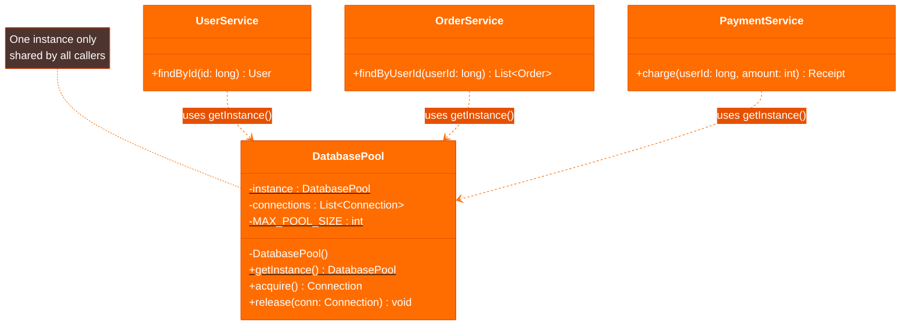

### The Runtime Flow

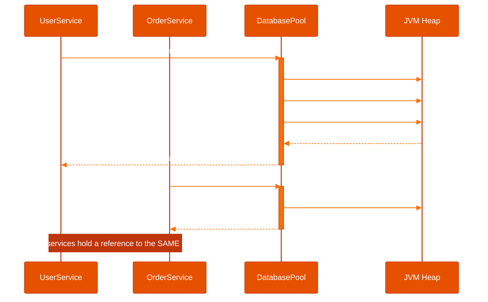

### Thread-Safety Decision Flow

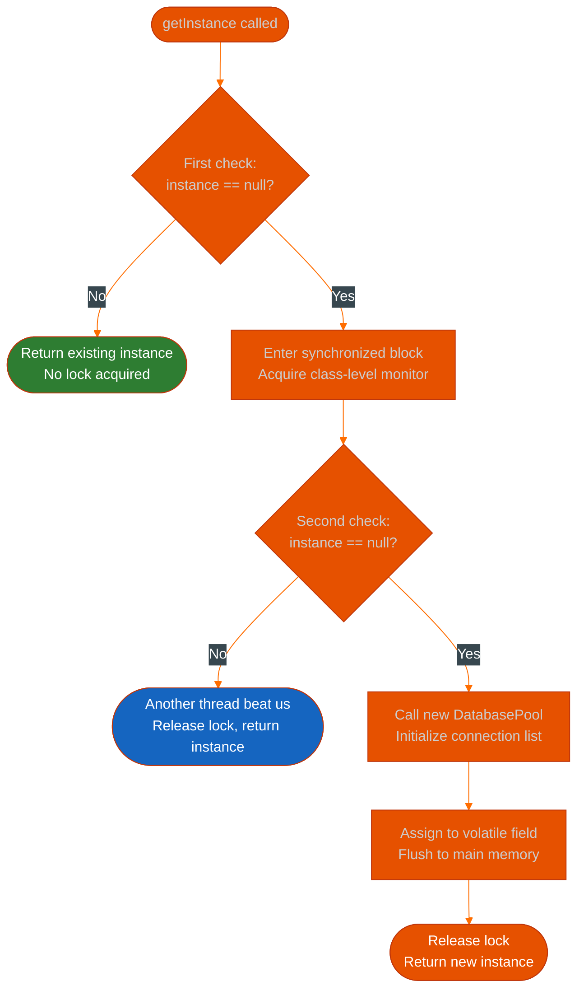

*Why two null-checks?* The outer check avoids acquiring the expensive lock on every call after initialization. The inner check handles the race condition where two threads both pass the outer check simultaneously.

### Industrial Case Study: Database Connection Pool

```java
import java.sql.Connection;
import java.sql.DriverManager;
import java.util.ArrayList;
import java.util.List;

public class DatabasePool {

    // volatile guarantees that writes to 'instance' are immediately visible
    // to all threads — without it, a thread could see a partially-constructed object.
    private static volatile DatabasePool instance;

    private final List<Connection> connections;
    private static final int MAX_POOL_SIZE = 10;
    private static final String JDBC_URL = System.getenv("DATABASE_URL");

    // Private constructor: no code outside this class can call new DatabasePool()
    private DatabasePool() {
        this.connections = new ArrayList<>(MAX_POOL_SIZE);
        for (int i = 0; i < MAX_POOL_SIZE; i++) {
            connections.add(openConnection());
        }
    }

    private Connection openConnection() {
        try {
            return DriverManager.getConnection(JDBC_URL);
        } catch (Exception e) {
            // Fail fast at startup — a broken pool at boot is better than a
            // subtle connection leak discovered under production load.
            throw new IllegalStateException("Cannot establish DB connection", e);
        }
    }

    /**
     * Double-checked locking (DCL) pattern.
     *
     * Thread safety requires:
     *   1. The 'volatile' keyword on the field (prevents instruction reordering)
     *   2. Two null-checks: the outer one avoids locking on every call,
     *      the inner one handles the race where two threads both pass the outer check.
     */
    public static DatabasePool getInstance() {
        if (instance == null) {                        // First check: fast path, no lock
            synchronized (DatabasePool.class) {        // Lock: only if potentially uninitialized
                if (instance == null) {                // Second check: defensive, inside lock
                    instance = new DatabasePool();
                }
            }
        }
        return instance;
    }

    /**
     * Acquire a connection from the pool.
     * In a real implementation, this would block (with a timeout) rather than throw.
     */
    public synchronized Connection acquire() {
        if (connections.isEmpty()) {
            throw new IllegalStateException("Connection pool exhausted — all " + MAX_POOL_SIZE + " connections in use");
        }
        // Remove from the tail: O(1) for ArrayList
        return connections.remove(connections.size() - 1);
    }

    /**
     * Return a connection to the pool. Always call this in a finally block.
     */
    public synchronized void release(Connection conn) {
        if (conn != null) {
            connections.add(conn);
        }
    }

    public int availableConnections() {
        return connections.size();
    }
}

// -----------------------------------------------------------------------
// Usage — every service shares the same pool, no matter how many exist.
// -----------------------------------------------------------------------

class UserService {
    public User findById(long id) {
        // getInstance() returns the same object every time, from any thread
        Connection conn = DatabasePool.getInstance().acquire();
        try {
            return queryUser(conn, id);
        } finally {
            // Always release — or the pool drains and the system deadlocks
            DatabasePool.getInstance().release(conn);
        }
    }
}

class OrderService {
    public List<Order> findByUser(long userId) {
        Connection conn = DatabasePool.getInstance().acquire();
        try {
            return queryOrders(conn, userId);
        } finally {
            DatabasePool.getInstance().release(conn);
        }
    }
}
```

### When to Use / When to Avoid

| Use When | Avoid When |
| :--- | :--- |
| There is a physical/logical constraint to one instance (e.g., a thread pool, a hardware port) | You just want easy global access — use dependency injection instead |
| The resource is expensive to initialize and safe to share (stateless or internally synchronized) | The instance holds mutable state that makes tests order-dependent |
| You're working in a framework that manages it for you (Spring `@Bean`, Guice) | You need to test in isolation — Singletons make mocking painful |
| The shared state is read-mostly (config, feature flags) | Distributed systems where "one instance" means one *per JVM*, not one per cluster |

**Key pitfall:** In a microservice or clustered environment, every JVM has its own Singleton. If you need truly global state across nodes, you need a distributed cache (Redis), not a Singleton.

---

## The Builder

> **The Builder is not a convenience — it is a contract against configuration explosions.**
> 
> * 📖 **Read the Parable:** [The 47-Question Waiter (អ្នករត់តុសួរ ៤៧ សំណួរ)](../../concepts/parables/76-the-overwhelmed-sandwich-shop.md)
> * 🧠 **Read the First Principles Derivation:** [MIT Professor Strategy: Builder (គោលការណ៍គ្រឹះដំបូងនៃ Builder)](../../concepts/design-patterns/01-mit-professor/04-builder.md)
> * 👶 **Read the Feynman Simplification:** [Feynman Technique: Builder (ការពន្យល់ពី Builder ដោយគ្មានពាក្យបច្ចេកទេស)](../../concepts/design-patterns/02-feynman-technique/05-builder.md)
> * 👦 **Read the ELI5 Metaphor:** [ELI5: Builder (ការពន្យល់ពី Builder ដូចក្មេងអាយុ ៥ ឆ្នាំ)](../../concepts/design-patterns/03-eli5/05-builder.md)
> * 🌉 **Read the Analogy Bridge:** [Analogy Bridge: Builder (ស្ពានប្រៀបធៀបនៃ Builder)](../../concepts/design-patterns/04-analogy-bridge/05-builder.md)
> * 🧐 **Read the Socratic Discovery:** [Socratic Method: Builder (ការបង្កើត Object ស្មុគស្មាញតាមវិធីសាស្ត្រសូក្រាត)](../../concepts/design-patterns/05-socratic-method/05-builder.md)
> * 📰 **Read the Journalist Summary:** [Journalist: Builder (ការបង្កើត Object ស្មុគស្មាញជាជំហានៗ)](../../concepts/design-patterns/06-journalist-inverted-pyramid/05-builder.md)
> * 🎭 **Read the Storyteller Narrative:** [Storyteller: Builder (វីរបុរស Builder និងសង្គ្រាមប៉ារ៉ាម៉ែត្ររញ៉េរញ៉ៃ)](../../concepts/design-patterns/07-storyteller-narrative-arc/05-builder.md)
> * ⚙️ **Read the Engineer Spec:** [Engineer Strategy: Builder (ការបង្កើត Object ស្មុគស្មាញជាជំហានៗ)](../../concepts/design-patterns/08-engineer-requirements-constraints-solution/01-builder.md)
> * 📊 **Read the Pros & Cons compared:** [Pros & Cons Compared: Builder (ការប្រៀបធៀបគុណសម្បត្តិ និងគុណវិបត្តិនៃ Builder)](../../concepts/design-patterns/09-pros-and-cons-compared/02-builder.md)

### The Problem

Imagine you're booking a flight. You have 47 options: seat class, meal preference, luggage count, travel insurance, lounge access, carbon offset, priority boarding, seat selection tier... The airline does not ask you for all 47 things in a single intake form you must fill out left to right. They walk you through it, step by step, and you only fill in what matters to you. The rest get defaults.

Now look at this constructor:

```java
new HttpRequest("https://api.example.com", "POST", headers, body, 10000, 3, true, false, "gzip")
```

Which argument is the timeout? Is `3` the retry count or a version number? Is `true` for following redirects, or for SSL verification? You cannot tell without counting positions. Change the order in one place, and you spend two hours hunting a bug.

This is the **telescoping constructor anti-pattern**: constructors that grow one parameter at a time until they collapse under their own weight.

### The Insight

The shift is from "here is everything you need to know upfront" to "tell me what you care about, and I'll handle the rest." A Builder separates *construction* from *representation*. It also makes invalid states unrepresentable: you can validate preconditions inside `build()` rather than scattering guards across every constructor overload.

Notice what this enables: immutability. Once `build()` is called, the resulting object is frozen. Nobody can change the timeout after the request has been built. The object becomes a value — safe to share across threads, safe to cache, safe to pass into any function.

### The Structure

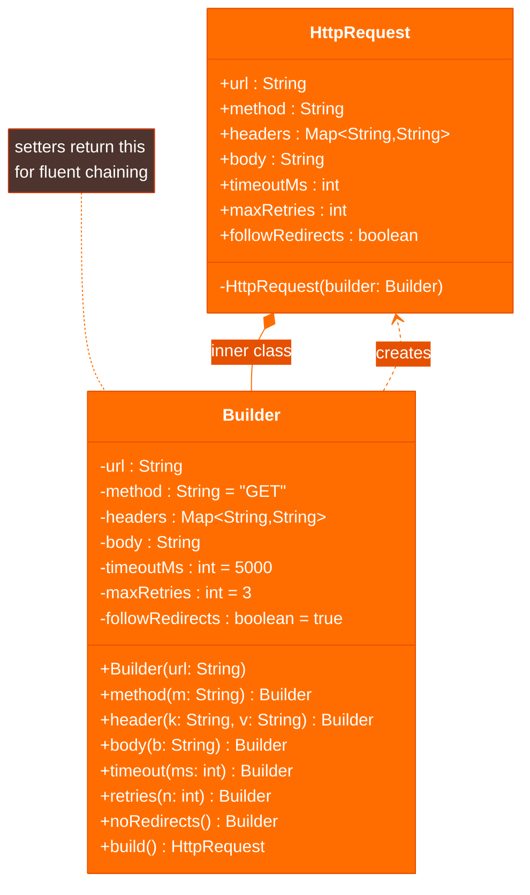

### The Runtime Flow

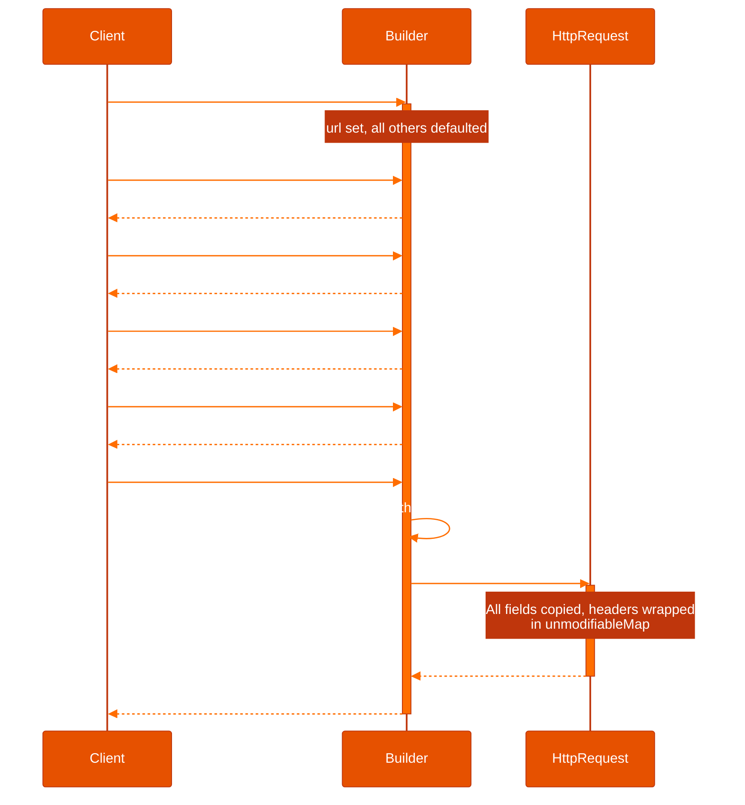

### Industrial Case Study: HTTP Request Client

```java
import java.util.Collections;
import java.util.HashMap;
import java.util.Map;
import java.util.Objects;

public final class HttpRequest {

    // All fields are final — this object cannot be mutated after construction.
    // This makes it safe to pass to async executors, thread pools, and caches.
    private final String url;
    private final String method;
    private final Map<String, String> headers;
    private final String body;
    private final int timeoutMs;
    private final int maxRetries;
    private final boolean followRedirects;

    // Private — the only way to get an HttpRequest is through the Builder.
    // This enforces that validation in build() is never bypassed.
    private HttpRequest(Builder builder) {
        this.url             = builder.url;
        this.method          = builder.method;
        this.headers         = Collections.unmodifiableMap(new HashMap<>(builder.headers)); // Defensive copy + seal
        this.body            = builder.body;
        this.timeoutMs       = builder.timeoutMs;
        this.maxRetries      = builder.maxRetries;
        this.followRedirects = builder.followRedirects;
    }

    // Getters — no setters. The object is a value, not a vessel.
    public String url()             { return url; }
    public String method()          { return method; }
    public Map<String, String> headers() { return headers; }
    public String body()            { return body; }
    public int timeoutMs()          { return timeoutMs; }
    public int maxRetries()         { return maxRetries; }
    public boolean followRedirects(){ return followRedirects; }

    public static class Builder {

        // Required: has no default, must be provided at construction
        private final String url;

        // Optional: all have sensible defaults so callers only set what differs
        private String method          = "GET";
        private Map<String, String> headers = new HashMap<>();
        private String body            = null;
        private int timeoutMs          = 5_000;  // 5 seconds is a sane default for most APIs
        private int maxRetries         = 3;      // Retry on transient network errors
        private boolean followRedirects = true;

        public Builder(String url) {
            // Validate the one required field here, not in build() —
            // fail at the earliest possible moment.
            if (url == null || url.isBlank()) {
                throw new IllegalArgumentException("URL must not be null or blank");
            }
            this.url = url;
        }

        // Each setter returns 'this', enabling fluent method chaining.
        // This is safe because Builder is a mutable accumulator — only HttpRequest is immutable.
        public Builder method(String method) {
            this.method = Objects.requireNonNull(method, "method");
            return this;
        }

        public Builder header(String key, String value) {
            this.headers.put(
                Objects.requireNonNull(key, "header key"),
                Objects.requireNonNull(value, "header value")
            );
            return this;
        }

        public Builder body(String body) {
            this.body = body;
            // Implicitly switch to POST when a body is provided — sensible convention.
            // The caller can still override with .method("PUT") after .body(...).
            if ("GET".equals(this.method)) {
                this.method = "POST";
            }
            return this;
        }

        public Builder timeout(int ms) {
            if (ms <= 0) throw new IllegalArgumentException("Timeout must be positive, got: " + ms);
            this.timeoutMs = ms;
            return this;
        }

        public Builder retries(int count) {
            if (count < 0) throw new IllegalArgumentException("Retry count cannot be negative");
            this.maxRetries = count;
            return this;
        }

        public Builder noRedirects() {
            this.followRedirects = false;
            return this;
        }

        /**
         * Terminal operation. Validates the accumulated state and produces
         * the immutable HttpRequest. After this call, the Builder is dead.
         */
        public HttpRequest build() {
            // Cross-field validation: things that depend on multiple fields together.
            // This is impossible to enforce in a multi-overload constructor approach.
            if (body != null && "GET".equals(method)) {
                throw new IllegalStateException("GET requests cannot have a body");
            }
            return new HttpRequest(this);
        }
    }
}

// -----------------------------------------------------------------------
// Usage — reads like a specification, not a list of positional arguments.
// A new engineer can understand this at a glance without reading the Javadoc.
// -----------------------------------------------------------------------
class PaymentClient {
    public Receipt charge(String token, int amountCents) {
        HttpRequest request = new HttpRequest.Builder("https://api.payments.com/charge")
            .header("Authorization", "Bearer " + token)
            .header("Content-Type", "application/json")
            .header("Idempotency-Key", UUID.randomUUID().toString()) // Prevent double-charges on retry
            .body(String.format("{\"amount\": %d, \"currency\": \"USD\"}", amountCents))
            .timeout(10_000)   // Payment APIs need a longer timeout than search queries
            .retries(2)        // Retry twice — payment APIs are usually idempotent with the key above
            .build();

        return httpClient.execute(request, Receipt.class);
    }
}
```

### When to Use / When to Avoid

| Use When | Avoid When |
| :--- | :--- |
| An object has 4+ constructor parameters, especially optional ones | The object has 1–2 required fields and no optional state |
| You want immutability — `build()` seals the object | Construction is trivial and the Builder adds indirection with no benefit |
| Cross-field validation is needed (e.g., `body` requires non-GET method) | The "object" is really just a data bag — use a record or POJO |
| The API is user-facing and readability matters | You're in a hot loop building millions of objects — the Builder allocates an intermediate object |

**Real-world equivalents:** `OkHttpClient.Builder`, `AlertDialog.Builder` (Android), Lombok `@Builder`, `ProcessBuilder`, `Stream.Builder`.

---

## The Factory Method

> **The Factory Method is a blank check: the parent defines what to do with an object, and the child decides which object to write the check to.**
> 
> * 📖 **Read the Parable:** [The CEO and the Regional Managers (នាយកប្រតិបត្តិ និងអ្នកគ្រប់គ្រងតំបន់)](../../concepts/parables/77-the-ceo-and-regional-managers.md)
> * 🧠 **Read the First Principles Derivation:** [MIT Professor Strategy: Factory Method (គោលការណ៍គ្រឹះដំបូងនៃ Factory Method)](../../concepts/design-patterns/01-mit-professor/02-factory-method.md)
> * 👶 **Read the Feynman Simplification:** [Feynman Technique: Factory Method (ការពន្យល់ពី Factory Method ដោយគ្មានពាក្យបច្ចេកទេស)](../../concepts/design-patterns/02-feynman-technique/06-factory-method.md)
> * 👦 **Read the ELI5 Metaphor:** [ELI5: Factory Method (ការពន្យល់ពី Factory Method ដូចក្មេងអាយុ ៥ ឆ្នាំ)](../../concepts/design-patterns/03-eli5/06-factory-method.md)
> * 🌉 **Read the Analogy Bridge:** [Analogy Bridge: Factory Method (ស្ពានប្រៀបធៀបនៃ Factory Method)](../../concepts/design-patterns/04-analogy-bridge/06-factory-method.md)
> * 🧐 **Read the Socratic Discovery:** [Socratic Method: Factory Method (ការបង្កើត Object តាមតម្រូវការយឺតយ៉ាវតាមវិធីសាស្ត្រសូក្រាត)](../../concepts/design-patterns/05-socratic-method/06-factory-method.md)
> * 📰 **Read the Journalist Summary:** [Journalist: Factory Method (ការបំបែកកូដបង្កើត Object ឱ្យមានសេរីភាពសម្រេចចិត្តលើ Subclass)](../../concepts/design-patterns/06-journalist-inverted-pyramid/06-factory-method.md)
> * 🎭 **Read the Storyteller Narrative:** [Storyteller: Factory Method (វីរបុរស Factory Method និងការដោះលែងប្រព័ន្ធផ្ញើសារពីរនរក switch)](../../concepts/design-patterns/07-storyteller-narrative-arc/06-factory-method.md)
> * ⚙️ **Read the Engineer Spec:** [Engineer: Factory Method (ការបំបែកកូដបង្កើត Object តាមរយៈការវាយតម្លៃតម្រូវការ និងឧបសគ្គកំណត់)](../../concepts/design-patterns/08-engineer-requirements-constraints-solution/04-factory-method.md)
> * 📊 **Read the Pros & Cons compared:** [Pros & Cons Compared: Factory Method (ការប្រៀបធៀបគុណសម្បត្តិ និងគុណវិបត្តិនៃ Factory Method)](../../concepts/design-patterns/09-pros-and-cons-compared/03-factory-method.md)

### The Problem

You're building a notification system. It needs to send alerts via Email, SMS, or Push notification. The obvious approach: write a `NotificationService` with a giant `if/else` block:

```java
// The anti-pattern: a class that knows too much
public void notifyUser(User user, String message) {
    if (user.getPreference().equals("email")) {
        new SmtpClient().send(user.getEmail(), message);
    } else if (user.getPreference().equals("sms")) {
        new TwilioClient().sendSms(user.getPhone(), message);
    } else if (user.getPreference().equals("push")) {
        new FirebaseClient().push(user.getDeviceToken(), message);
    }
    // When Slack integration ships next sprint: add another else if.
    // When WhatsApp launches: add another.
    // This class owns all channels forever.
}
```

This violates the Open/Closed Principle in the most banal way possible. Every new notification channel requires you to open this class, edit it, retest it, and redeploy it. The class becomes a graveyard of every channel decision ever made.

### The Insight

The mental shift is this: *the code that sends a notification doesn't need to know what kind of notifier it's talking to.* It just needs something that has a `send(recipient, message)` method. Who provides that? Not the sender — that's the subclass's job.

Factory Method says: *"I know the algorithm. You know the product."* The parent class defines the workflow (validate, send, audit-log). The subclass plugs in the specific implementation. Adding Slack means adding a class, not modifying a class.

### The Structure

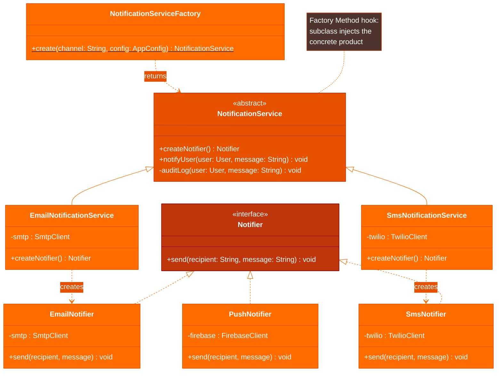

### The Runtime Flow

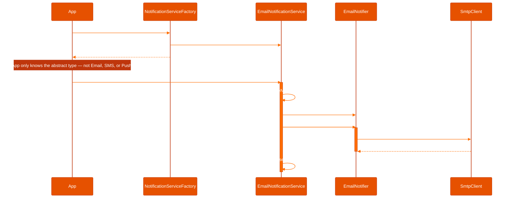

### Factory Dispatch Logic

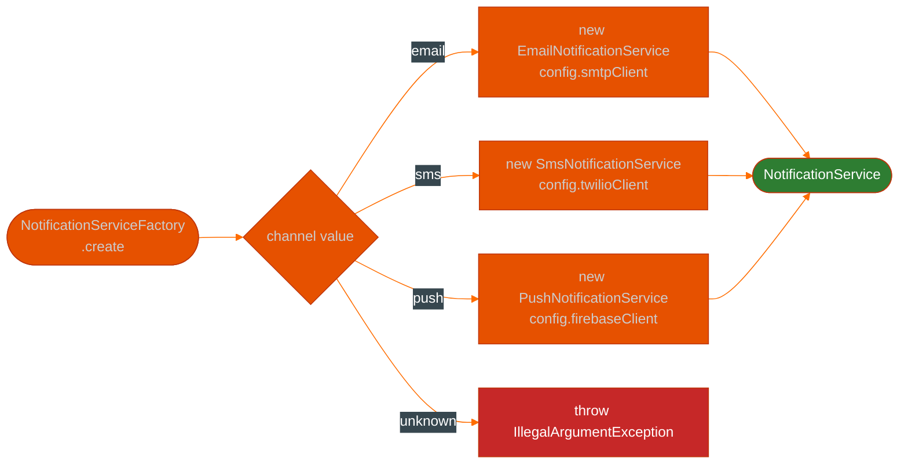

### Industrial Case Study: Multi-Channel Notification System

```java
/**
 * The product interface — the only type the calling code ever sees.
 * Every channel implements exactly this contract.
 */
public interface Notifier {
    void send(String recipient, String message);
}

// -----------------------------------------------------------------------
// Concrete Products — one per channel, each handling its own transport.
// -----------------------------------------------------------------------

public class EmailNotifier implements Notifier {
    private final SmtpClient smtp;

    public EmailNotifier(SmtpClient smtp) {
        this.smtp = Objects.requireNonNull(smtp);
    }

    @Override
    public void send(String recipient, String message) {
        // Wrap in a standard subject; the raw message becomes the body.
        smtp.sendEmail(recipient, "System Notification", message);
    }
}

public class SmsNotifier implements Notifier {
    private final TwilioClient twilio;

    public SmsNotifier(TwilioClient twilio) {
        this.twilio = Objects.requireNonNull(twilio);
    }

    @Override
    public void send(String recipient, String message) {
        // SMS has a 160-character limit — in production, truncate or split here.
        String truncated = message.length() > 160 ? message.substring(0, 157) + "..." : message;
        twilio.sendSms(recipient, truncated);
    }
}

public class PushNotifier implements Notifier {
    private final FirebaseClient firebase;

    public PushNotifier(FirebaseClient firebase) {
        this.firebase = Objects.requireNonNull(firebase);
    }

    @Override
    public void send(String recipient, String message) {
        // 'recipient' here is a Firebase device token, not an email/phone.
        // The interface hides this detail from the caller — it's always just a "recipient".
        firebase.sendPush(recipient, message);
    }
}

// -----------------------------------------------------------------------
// Abstract Creator — defines the workflow, leaves the product to subclasses.
// -----------------------------------------------------------------------

public abstract class NotificationService {

    /**
     * The Factory Method. Subclasses override this to return the correct Notifier.
     * The parent class calls it internally — it never needs to know the concrete type.
     */
    public abstract Notifier createNotifier();

    /**
     * Template method: the algorithm is fixed, the product is variable.
     * NotificationService owns "validate → send → audit". Subclasses own "which notifier."
     */
    public void notifyUser(User user, String message) {
        if (message == null || message.isBlank()) {
            throw new IllegalArgumentException("Cannot send empty notification");
        }

        Notifier notifier = createNotifier(); // Factory Method invocation
        notifier.send(user.getContact(), message);
        auditLog(user, message);
    }

    // Audit logging is universal — every channel must produce an audit trail.
    private void auditLog(User user, String message) {
        System.out.printf("[AUDIT] user=%s channel=%s message=\"%s\"%n",
            user.getId(), getClass().getSimpleName(), message);
    }
}

// -----------------------------------------------------------------------
// Concrete Creators — one per channel. Each knows how to build its notifier.
// -----------------------------------------------------------------------

public class EmailNotificationService extends NotificationService {
    private final SmtpClient smtp;

    public EmailNotificationService(SmtpClient smtp) { this.smtp = smtp; }

    @Override
    public Notifier createNotifier() {
        // Could add retry logic, circuit breaker, or metrics wrapper here —
        // without touching EmailNotifier or NotificationService.
        return new EmailNotifier(smtp);
    }
}

public class SmsNotificationService extends NotificationService {
    private final TwilioClient twilio;

    public SmsNotificationService(TwilioClient twilio) { this.twilio = twilio; }

    @Override
    public Notifier createNotifier() { return new SmsNotifier(twilio); }
}

public class PushNotificationService extends NotificationService {
    private final FirebaseClient firebase;

    public PushNotificationService(FirebaseClient firebase) { this.firebase = firebase; }

    @Override
    public Notifier createNotifier() { return new PushNotifier(firebase); }
}

// -----------------------------------------------------------------------
// Static factory: maps runtime configuration to the correct concrete service.
// This is the entry point — callers never construct the services directly.
// -----------------------------------------------------------------------

public class NotificationServiceFactory {
    public static NotificationService create(String channel, AppConfig config) {
        return switch (channel.toLowerCase()) {
            case "email" -> new EmailNotificationService(config.smtpClient());
            case "sms"   -> new SmsNotificationService(config.twilioClient());
            case "push"  -> new PushNotificationService(config.firebaseClient());
            // Adding Slack: add one case here, add one class. Zero edits to existing code.
            default -> throw new IllegalArgumentException(
                "Unknown notification channel: '" + channel + "'. Supported: email, sms, push"
            );
        };
    }
}

// -----------------------------------------------------------------------
// Usage — the calling code is completely insulated from channel details.
// -----------------------------------------------------------------------

public class OrderService {
    private final AppConfig config;

    public void onOrderShipped(Order order) {
        User user = userRepository.findById(order.getUserId());

        // The caller only knows "NotificationService" — not Email, SMS, or Push.
        NotificationService notifier = NotificationServiceFactory.create(
            user.getPreferredChannel(),  // Could be "email", "sms", or "push"
            config
        );

        notifier.notifyUser(user, "Your order #" + order.getId() + " has shipped!");
    }
}
```

### When to Use / When to Avoid

| Use When | Avoid When |
| :--- | :--- |
| The exact type to instantiate is determined at runtime (config, user preference) | You have exactly one product and no plans to extend — the abstraction is premature |
| Adding new variants should not require modifying existing code (Open/Closed Principle) | The creation logic is trivial — a simple `new` call behind an interface adds noise |
| You want subclasses to customize a step of an algorithm (Template Method + Factory Method) | The factory dispatch ends up being as tangled as the if/else it replaced |
| You're building a plugin/extension system | You need multiple product families together — use Abstract Factory instead |

---

## The Abstract Factory

> **The Abstract Factory doesn't just create objects — it creates *ecosystems*. Each factory produces a family of objects guaranteed to work together.**
> 
> 📖 **Read the Parable:** [The Mismatched Furniture Store (ហាងលក់គ្រឿងសង្ហារឹមចម្រុះ)](../../concepts/parables/78-the-mismatched-furniture-store.md)
> 🧠 **Read the First Principles Derivation:** [MIT Professor Strategy: Abstract Factory (គោលការណ៍គ្រឹះដំបូងនៃ Abstract Factory)](../../concepts/design-patterns/01-mit-professor/03-abstract-factory.md)

### The Problem

Your team has built a file storage service that talks to AWS S3. It works perfectly. Then the enterprise sales team closes a deal with a customer who mandates GCP. Then a healthcare client requires Azure. Then a startup needs MinIO for on-premise deployment.

The naïve response is to scatter `if (provider.equals("aws"))` checks throughout the codebase. Three months later, your codebase is a patchwork of provider-specific branches. Adding Azure requires reading every file touched by the S3 integration and mirroring it for Azure. A bug in the GCP path gets discovered that also exists in the AWS path — but nobody thinks to check.

The deeper problem: each cloud provider is not just a different `StorageClient`. It's a *family*: a storage client, a metadata client, a lifecycle/TTL manager, an access-control client — all from the same provider, all using the same underlying SDK credentials. Mixing an AWS storage client with a GCP metadata client is a runtime error waiting to happen.

### The Insight

The shift is from "choose a product" to "choose a factory, then trust the factory." Once you select the factory, every object it produces is guaranteed to be from the same family. Your application code never mentions AWS or GCP — it only talks to `StorageClient` and `MetadataClient`. Swapping cloud providers is a one-line change at the composition root.

### The Structure

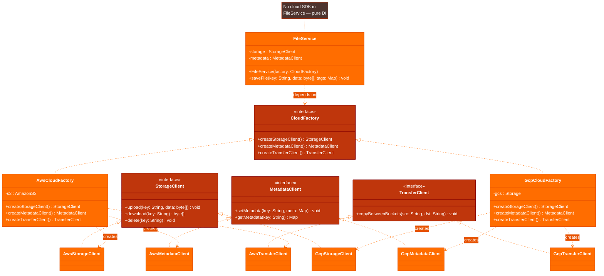

### Industrial Case Study: Multi-Cloud Storage Abstraction

```java
import java.util.Map;

// -----------------------------------------------------------------------
// Abstract Product Interfaces — the only types FileService ever touches.
// -----------------------------------------------------------------------

public interface StorageClient {
    void upload(String key, byte[] data);
    byte[] download(String key);
    void delete(String key);
}

public interface MetadataClient {
    void setMetadata(String key, Map<String, String> meta);
    Map<String, String> getMetadata(String key);
}

public interface TransferClient {
    // Copy between two locations within the same provider's infrastructure.
    // Cross-provider transfers are handled at the application layer, not here.
    void copyBetweenBuckets(String sourceBucket, String destinationBucket, String key);
}

// -----------------------------------------------------------------------
// Abstract Factory — the contract for a complete cloud provider "family."
// -----------------------------------------------------------------------

public interface CloudFactory {
    StorageClient createStorageClient();
    MetadataClient createMetadataClient();
    TransferClient createTransferClient();
}

// -----------------------------------------------------------------------
// AWS Family — all AWS implementations, tied to the same AmazonS3 instance.
// -----------------------------------------------------------------------

public class AwsStorageClient implements StorageClient {
    private final AmazonS3 s3;
    private final String bucket;

    public AwsStorageClient(AmazonS3 s3, String bucket) {
        this.s3 = s3;
        this.bucket = bucket;
    }

    @Override
    public void upload(String key, byte[] data) {
        // PutObjectRequest with ContentLength set avoids S3's chunked upload overhead
        ObjectMetadata meta = new ObjectMetadata();
        meta.setContentLength(data.length);
        s3.putObject(bucket, key, new ByteArrayInputStream(data), meta);
    }

    @Override
    public byte[] download(String key) {
        try (S3ObjectInputStream stream = s3.getObject(bucket, key).getObjectContent()) {
            return stream.readAllBytes();
        } catch (IOException e) {
            throw new StorageException("Failed to download key: " + key, e);
        }
    }

    @Override
    public void delete(String key) {
        s3.deleteObject(bucket, key);
    }
}

public class AwsMetadataClient implements MetadataClient {
    private final AmazonS3 s3;
    private final String bucket;

    public AwsMetadataClient(AmazonS3 s3, String bucket) {
        this.s3 = s3;
        this.bucket = bucket;
    }

    @Override
    public void setMetadata(String key, Map<String, String> meta) {
        // S3 metadata is set at upload time. To update it, the object must be
        // copied to itself — this is an AWS SDK quirk, hidden from the caller.
        ObjectMetadata om = s3.getObjectMetadata(bucket, key);
        meta.forEach(om::addUserMetadata);
        s3.copyObject(
            new CopyObjectRequest(bucket, key, bucket, key).withNewObjectMetadata(om)
        );
    }

    @Override
    public Map<String, String> getMetadata(String key) {
        return s3.getObjectMetadata(bucket, key).getUserMetadata();
    }
}

// The AWS factory holds the single AmazonS3 client and shares it across all products.
// This is correct: the SDK manages connection pooling internally.
public class AwsCloudFactory implements CloudFactory {
    private final AmazonS3 s3;
    private final String bucket;

    public AwsCloudFactory(String bucket) {
        this.s3     = AmazonS3ClientBuilder.defaultClient(); // Reads credentials from env/IAM role
        this.bucket = bucket;
    }

    @Override
    public StorageClient createStorageClient()   { return new AwsStorageClient(s3, bucket); }

    @Override
    public MetadataClient createMetadataClient() { return new AwsMetadataClient(s3, bucket); }

    @Override
    public TransferClient createTransferClient() { return new AwsTransferClient(s3); }
}

// -----------------------------------------------------------------------
// GCP Family — different SDK, same interface contract.
// -----------------------------------------------------------------------

public class GcpCloudFactory implements CloudFactory {
    private final Storage gcs;
    private final String bucket;

    public GcpCloudFactory(String bucket) {
        // Application Default Credentials — reads from GOOGLE_APPLICATION_CREDENTIALS env var
        this.gcs    = StorageOptions.getDefaultInstance().getService();
        this.bucket = bucket;
    }

    @Override
    public StorageClient createStorageClient()   { return new GcpStorageClient(gcs, bucket); }

    @Override
    public MetadataClient createMetadataClient() { return new GcpMetadataClient(gcs, bucket); }

    @Override
    public TransferClient createTransferClient() { return new GcpTransferClient(gcs); }
}

// -----------------------------------------------------------------------
// FileService — never imports AmazonS3, Storage, or any provider SDK.
// It is completely cloud-agnostic. The factory does the wiring.
// -----------------------------------------------------------------------

public class FileService {
    private final StorageClient storage;
    private final MetadataClient metadata;

    public FileService(CloudFactory factory) {
        // The factory guarantees these two are from the same provider —
        // no risk of an AWS storage client paired with a GCP metadata client.
        this.storage  = factory.createStorageClient();
        this.metadata = factory.createMetadataClient();
    }

    public void saveFile(String key, byte[] data, Map<String, String> tags) {
        storage.upload(key, data);
        metadata.setMetadata(key, tags); // Always same provider — always compatible
    }

    public byte[] loadFile(String key) {
        return storage.download(key);
    }
}

// -----------------------------------------------------------------------
// Composition root — the only place that names a provider.
// -----------------------------------------------------------------------

public class AppBootstrap {
    public FileService buildFileService() {
        String provider = System.getenv("CLOUD_PROVIDER"); // "aws" or "gcp"
        String bucket   = System.getenv("STORAGE_BUCKET");

        // Swap provider by changing one line. FileService is unchanged.
        CloudFactory factory = switch (provider) {
            case "aws" -> new AwsCloudFactory(bucket);
            case "gcp" -> new GcpCloudFactory(bucket);
            default    -> throw new IllegalStateException("Unsupported provider: " + provider);
        };

        return new FileService(factory);
    }
}
```

### When to Use / When to Avoid

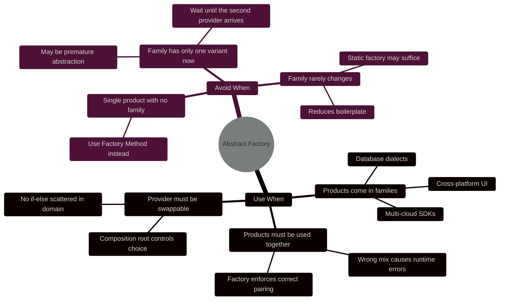

---

## The Prototype

> **The Prototype says: stop building from scratch. You already have the answer — just copy it.**
> 
> 📖 **Read the Parable:** [The Lazy Wizard and the Clone Spell (វេទមន្តខ្ជិល និងមន្តអាគមថតចម្លង)](../../concepts/parables/79-the-lazy-wizard-and-the-clone-spell.md)
> 🧠 **Read the Strategy Explanation:** [Feynman Technique: Prototype (ការថតចម្លងគំរូកូដដោយសាមញ្ញ)](../../concepts/design-patterns/02-feynman-technique/01-prototype.md)

### The Problem

A real-time strategy game spawns 500 zergling enemies in a single second when a wave attack begins. Each zergling has: type, health, speed, attack damage, a list of 12 abilities, pathfinding weights, animation state, and a sprite reference. Building one zergling from scratch means loading all of that from a database.

500 zerglings × one database round-trip each = the game freezes.

This is not a database performance problem. This is an architectural problem. You already built one zergling. It's sitting there in memory, perfectly configured. Why are you ignoring it and calling the database 499 more times?

The same problem appears in test suites: building a fully-wired `User` object with all its nested associations takes 20 lines of boilerplate per test. Copy-constructor semantics let you write one canonical `testUser` and derive every variant with one mutation.

### The Insight

The shift is from "create from definition" to "create from example." A Prototype registry inverts the creation model: instead of asking "what configuration produces a zergling?" you ask "show me the zergling you already made, and I'll copy it."

The critical technical challenge is the difference between a shallow copy and a deep copy. A shallow copy shares references — mutating the clone's ability list mutates the original's ability list. A deep copy is fully independent. You must understand your object graph: which fields are value types (copy by value automatically), which are immutable (shared reference is safe), and which are mutable collections (must be defensively copied).

### The Structure

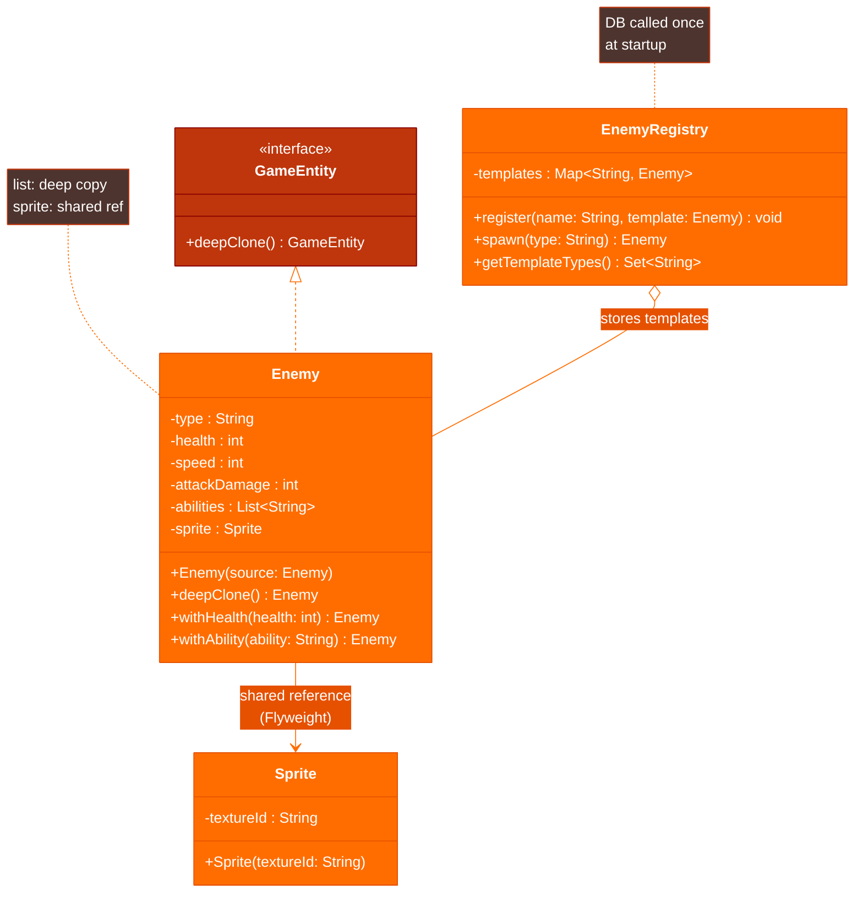

### Trade-off Analysis

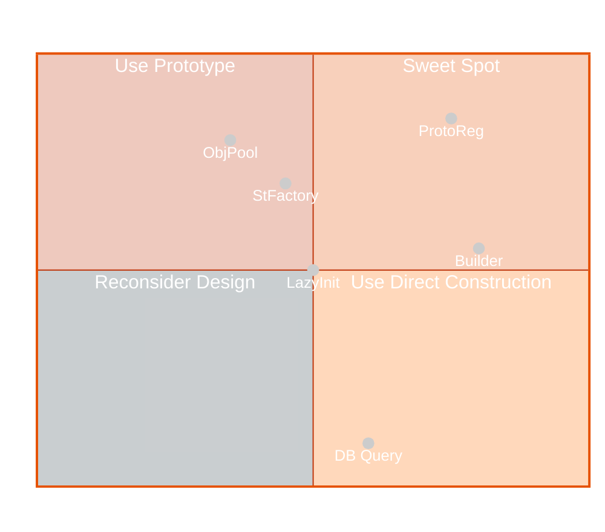

*Prototype sits in the sweet spot: cheap (O(1) clone vs. O(n) database fetch) and flexible (modify the clone without touching the template).*

### Industrial Case Study: Game Entity Spawner

```java
import java.util.ArrayList;
import java.util.HashMap;
import java.util.List;
import java.util.Map;
import java.util.Set;

/**
 * Marker interface for prototype-capable entities.
 * Using a generic return type avoids unchecked casts at the call site.
 */
public interface GameEntity<T extends GameEntity<T>> {
    T deepClone();
}

// -----------------------------------------------------------------------
// The Sprite is shared across all clones — it's immutable and expensive
// to load (GPU texture upload). This is the Flyweight pattern working
// in concert with Prototype.
// -----------------------------------------------------------------------

public final class Sprite {
    private final String textureId; // Reference to GPU texture — copying is wasteful and wrong
    public Sprite(String textureId) { this.textureId = textureId; }
    public String getTextureId() { return textureId; }
    // No setters — Sprite is immutable, safe to share across thousands of clones
}

public class Enemy implements GameEntity<Enemy> {

    private String type;
    private int health;
    private int speed;
    private int attackDamage;
    private List<String> abilities; // Mutable — MUST be deep copied
    private Sprite sprite;          // Immutable — safe to share (Flyweight)

    // Public constructor for the canonical template object (loaded from DB)
    public Enemy(String type, int health, int speed, int attackDamage,
                 List<String> abilities, Sprite sprite) {
        this.type         = type;
        this.health       = health;
        this.speed        = speed;
        this.attackDamage = attackDamage;
        this.abilities    = new ArrayList<>(abilities); // Defensive copy on intake
        this.sprite       = sprite;
    }

    /**
     * Copy constructor — the engine of the Prototype pattern.
     * Explicitly handles each field: value types copy automatically,
     * mutable collections need new instances, immutable objects share references.
     */
    private Enemy(Enemy source) {
        this.type         = source.type;         // String is immutable — sharing is safe
        this.health       = source.health;       // Primitive — copied by value
        this.speed        = source.speed;        // Primitive — copied by value
        this.attackDamage = source.attackDamage; // Primitive — copied by value
        this.abilities    = new ArrayList<>(source.abilities); // NEW list — mutations don't affect template
        this.sprite       = source.sprite;       // Shared intentionally — Flyweight, immutable object
    }

    @Override
    public Enemy deepClone() {
        return new Enemy(this);
    }

    /**
     * "Wither" method: clone and mutate one field.
     * Returns a new Enemy — the original template is never touched.
     * This enables the boss variant pattern: clone + boost stats.
     */
    public Enemy withHealth(int health) {
        Enemy clone = this.deepClone();
        clone.health = health;
        return clone;
    }

    public Enemy withAbility(String ability) {
        Enemy clone = this.deepClone();
        clone.abilities.add(ability); // Safe: clone has its own list
        return clone;
    }

    public Enemy withSpeed(int speed) {
        Enemy clone = this.deepClone();
        clone.speed = speed;
        return clone;
    }

    // Getters
    public String getType()         { return type; }
    public int getHealth()          { return health; }
    public int getSpeed()           { return speed; }
    public int getAttackDamage()    { return attackDamage; }
    public List<String> getAbilities() { return List.copyOf(abilities); } // Defensive read
    public Sprite getSprite()       { return sprite; }
}

// -----------------------------------------------------------------------
// The Registry — loaded once at startup, queried millions of times.
// -----------------------------------------------------------------------

public class EnemyRegistry {
    // The canonical templates — never handed out directly, always cloned first.
    private final Map<String, Enemy> templates = new HashMap<>();

    public void register(String name, Enemy template) {
        // Store a clone of the template so external code can't mutate the registry's copy.
        templates.put(name, template.deepClone());
    }

    /**
     * Spawn a new enemy instance. O(1) clone — no I/O, no DB, no network.
     * This is the core value proposition of Prototype.
     */
    public Enemy spawn(String type) {
        Enemy template = templates.get(type);
        if (template == null) {
            throw new IllegalArgumentException(
                "Unknown enemy type: '" + type + "'. Registered types: " + templates.keySet()
            );
        }
        return template.deepClone(); // Returns an independent copy — mutate freely
    }

    public Set<String> getRegisteredTypes() {
        return Set.copyOf(templates.keySet());
    }
}

// -----------------------------------------------------------------------
// Game startup — expensive initialization happens ONCE.
// -----------------------------------------------------------------------

public class GameInitializer {
    public EnemyRegistry buildRegistry(EnemyRepository repo) {
        EnemyRegistry registry = new EnemyRegistry();

        // Each load() is a database call — O(1) per type, amortized over all spawns.
        registry.register("zergling", repo.load("zergling")); // 1 DB call
        registry.register("marine",   repo.load("marine"));   // 1 DB call
        registry.register("hydralisk",repo.load("hydralisk")); // 1 DB call
        // Total: 3 DB calls for 3 types, regardless of how many instances spawn.

        return registry;
    }
}

// -----------------------------------------------------------------------
// Wave spawn during gameplay — no I/O, just memory allocation.
// -----------------------------------------------------------------------

public class WaveSpawner {
    private final EnemyRegistry registry;
    private final GameWorld world;

    public WaveSpawner(EnemyRegistry registry, GameWorld world) {
        this.registry = registry;
        this.world    = world;
    }

    public void spawnWave(String type, int count) {
        // 500 clones in a single frame — no database, no network, no parsing.
        // Each clone is fully independent: mutating clone 1 doesn't affect clone 2.
        for (int i = 0; i < count; i++) {
            Enemy enemy = registry.spawn(type);
            world.add(enemy);
        }
    }

    public void spawnBossWave() {
        // Boss variant: clone the template and amplify specific stats.
        // The "zergling" template in the registry is untouched.
        Enemy bossZergling = registry.spawn("zergling")
            .withHealth(10_000)                  // 10x the normal health
            .withSpeed(15)                       // Faster than normal
            .withAbility("BURROWING_CHARGE");    // Unique boss ability

        world.addBoss(bossZergling);
    }
}
```

### When to Use / When to Avoid

| Use When | Avoid When |
| :--- | :--- |
| Initialization is expensive (DB, network, GPU) and many similar instances are needed | The object is cheap to construct — cloning adds complexity for no gain |
| You need many variants of a base configuration (boss variants, A/B test users) | The object has no shared base state — each instance is genuinely unique |
| The creation algorithm is complex and you want to encapsulate it in the template | Your clone logic is subtle (deep vs. shallow) and error-prone to maintain |
| Objects share immutable state (Flyweight: sprites, textures, read-only config) | The codebase uses a DI framework that already manages instance caching |

**Deep clone checklist before implementing Prototype:**
- Primitive fields (`int`, `boolean`, `double`): copy by value, always safe.
- Immutable objects (`String`, `Integer`, unmodifiable collections): share the reference, safe.
- Mutable collections (`ArrayList`, `HashMap`): always create a new instance with the same contents.
- Nested mutable objects: recursively clone, or document that the clone is intentionally shallow.

---

## Summary

| Pattern | Key Mechanism | Java Equivalent | Avoid When |
| :--- | :--- | :--- | :--- |
| **Singleton** | Private constructor + volatile static field | Spring `@Bean(scope="singleton")` | Tests need isolation; distributed systems |
| **Builder** | Fluent accumulator + terminal `build()` | Lombok `@Builder`, `OkHttpClient.Builder` | 2 or fewer fields; no optional parameters |
| **Factory Method** | Subclass overrides `createX()` | `DriverManager.getConnection()`, `LoggerFactory` | Only one product type; simple `new` would do |
| **Abstract Factory** | Interface produces a family of products | JDBC `Connection` (hides driver dialect) | Single product; only one provider ever needed |
| **Prototype** | Copy constructor + clone registry | `new ArrayList<>(source)`, `Object.clone()` | Cheap construction; each instance is unique |

---

**Navigation:** [← Back to Index](./README.md) | [Structural Patterns →](./02-structural-patterns.md)

*Last updated: 2026-05-16*

## Related

- [Software Architecture Patterns](../software-architecture/README.md)
- [Refactoring Techniques](../refactoring/README.md)
- [Uncle Bob's Clean Code Rules](../uncle-bob-rules/README.md)
