# Structural Patterns: The Architecture of Composition

**Part of:** [Design Patterns Series](./README.md)  
**Tags:** #design-patterns #structural #gof #java  
**Read Time:** ~35 min

> Structural patterns are about **composition over inheritance** — they describe how to wire objects and classes into larger, coherent systems without creating brittle webs of coupling. If Creational patterns answer "how do I build it?", Structural patterns answer "how do I connect it?"

---

## 📌 Table of Contents
- [Patterns in This Section](#patterns-in-this-section)
- [The Adapter](#the-adapter)
  - [The Problem](#the-problem-6)
  - [The Insight](#the-insight-6)
  - [The Structure](#the-structure-6)
  - [The Runtime Flow](#the-runtime-flow-2)
  - [Industrial Case Study: Payment Gateway Normalization](#industrial-case-study-payment-gateway-normalization)
  - [When to Use / When to Avoid](#when-to-use-when-to-avoid-6)
- [The Decorator](#the-decorator)
  - [The Problem](#the-problem-6)
  - [The Insight](#the-insight-6)
  - [The Structure](#the-structure-6)
  - [The Runtime Flow](#the-runtime-flow-2)
  - [Decorator Conceptual Map](#decorator-conceptual-map)
  - [Industrial Case Study: Dynamic Ride Pricing Engine](#industrial-case-study-dynamic-ride-pricing-engine)
  - [When to Use / When to Avoid](#when-to-use-when-to-avoid-6)
- [The Bridge](#the-bridge)
  - [The Problem](#the-problem-6)
  - [The Insight](#the-insight-6)
  - [The Structure](#the-structure-6)
  - [Industrial Case Study: Cross-Platform Reporting Engine](#industrial-case-study-cross-platform-reporting-engine)
  - [When to Use / When to Avoid](#when-to-use-when-to-avoid-6)
- [The Composite](#the-composite)
  - [The Problem](#the-problem-6)
  - [The Insight](#the-insight-6)
  - [The Structure](#the-structure-6)
  - [Composite Tree Example](#composite-tree-example)
  - [Industrial Case Study: Permission System](#industrial-case-study-permission-system)
  - [When to Use / When to Avoid](#when-to-use-when-to-avoid-6)
- [The Facade](#the-facade)
  - [The Problem](#the-problem-6)
  - [The Insight](#the-insight-6)
  - [The Processing Pipeline](#the-processing-pipeline)
  - [The Structure](#the-structure-6)
  - [Industrial Case Study: Video Processing Pipeline](#industrial-case-study-video-processing-pipeline)
  - [When to Use / When to Avoid](#when-to-use-when-to-avoid-6)
- [The Flyweight](#the-flyweight)
  - [The Problem](#the-problem-6)
  - [The Insight](#the-insight-6)
  - [The Structure](#the-structure-6)
  - [Memory Trade-off Analysis](#memory-trade-off-analysis)
  - [Factory Distribution: Before vs After](#factory-distribution-before-vs-after)
  - [Industrial Case Study: Live Log Viewer with 10M Characters](#industrial-case-study-live-log-viewer-with-10m-characters)
  - [When to Use / When to Avoid](#when-to-use-when-to-avoid-6)
- [The Proxy](#the-proxy)
  - [The Problem](#the-problem-6)
  - [The Insight](#the-insight-6)
  - [Proxy Types Decision Tree](#proxy-types-decision-tree)
  - [The Structure](#the-structure-6)
  - [The Runtime Flow](#the-runtime-flow-2)
  - [Industrial Case Study: Authorized + Cached UserService](#industrial-case-study-authorized-cached-userservice)
  - [When to Use / When to Avoid](#when-to-use-when-to-avoid-6)
- [Summary](#summary)

---

## Patterns in This Section

| Pattern | Core Problem | One-Line Principle |
| :--- | :--- | :--- |
| [Adapter](#the-adapter) | Incompatible interfaces at the seam | Translate foreign contract → your contract |
| [Decorator](#the-decorator) | Behavior stacks up at runtime, not compile time | Wrap, don't extend |
| [Bridge](#the-bridge) | Two orthogonal dimensions multiplying subclasses | Separate the "what" from the "how" |
| [Composite](#the-composite) | Trees where leaves and branches need the same API | One interface rules them all |
| [Facade](#the-facade) | Subsystem complexity leaking into callers | Provide a keyhole, not a control panel |
| [Flyweight](#the-flyweight) | Millions of objects; shared state drowning memory | Extract the shared soul, vary only the unique |
| [Proxy](#the-proxy) | Cross-cutting concerns on object access | Be a bodyguard, not a fake |

---

## The Adapter

> **The hook:** The Adapter is the diplomatic interpreter between two systems that were never designed to meet — it speaks both languages so neither side has to learn the other.

### The Problem

Imagine you're building a checkout flow. Your domain defines a clean `PaymentGateway` interface. Now your product manager says: "We need to support Stripe, PayPal, and eventually Braintree."

You look at Stripe's SDK. Then PayPal's. They're nothing alike. Stripe talks in cents, PayPal in decimals. Stripe returns a `StripeCharge`, PayPal returns an `Order`. Their refund calls look completely different.

You have three choices:
1. Scatter `if (provider == STRIPE)` conditionals everywhere in your `CheckoutService` — a maintenance nightmare.
2. Rewrite the third-party SDKs — you cannot.
3. Write a thin translation layer per provider that makes each one *look* like your interface.

Choice 3 is the Adapter pattern.

### The Insight

> **The Adapter is a translator. It doesn't change what the object does; it changes what the object looks like.**
> 
> 📖 **Read the Parable:** [The American Tourist and the Power Plug (អ្នកទេសចរអាមេរិក និងឌុយភ្លើង)](../../concepts/parables/80-the-american-tourist.md)
> 🧠 **Read the Strategy Explanation:** [ELI5: Adapter (ឌុយបំប្លែងចរន្តអគ្គិសនី)](../../concepts/design-patterns/03-eli5/01-adapter.md)

The Adapter pattern does not add business logic. It does not change behavior. It *translates*. The mental shift is: **the seam between your domain and the outside world is a real architectural boundary**. It deserves a dedicated class. That class earns the right to be ugly — it knows about both sides so your domain code never has to.

### The Structure

```mermaid
%%{init: {'theme': 'dark', 'themeVariables': {'primaryColor': '#01579b', 'primaryBorderColor': '#003c8f', 'primaryTextColor': '#ffffff', 'lineColor': '#29b6f6', 'secondaryColor': '#37474f', 'tertiaryColor': '#4a148c', 'background': '#1a1a2e', 'mainBkg': '#01579b', 'nodeBorder': '#003c8f', 'clusterBkg': '#37474f', 'titleColor': '#ffffff', 'edgeLabelBackground': '#4e342e', 'attributeBackgroundColorEven': '#01579b', 'attributeBackgroundColorOdd': '#003c8f', 'classText': '#ffffff', 'fillType0': '#01579b', 'fillType1': '#003c8f', 'fillType2': '#0288d1', 'fillType3': '#37474f', 'fillType4': '#4a148c', 'fillType5': '#1b5e20', 'fillType6': '#b71c1c', 'fillType7': '#4e342e', 'noteBkgColor': '#1a237e', 'noteBorderColor': '#003c8f', 'noteTextColor': '#ffffff'},
  'themeCSS': 'svg { background-color: #1e1e1e !important; padding: 1rem !important; border-radius: 8px !important; } .edgeLabel rect { fill: #1e1e1e !important; } text, tspan, .messageText, .signalText, .edgeLabel, .edgeLabel span, .pointLabel, .axisLabel, .quadrantTitle, .quadrantLabel { fill: #ffffff !important; color: #ffffff !important; stroke: none !important; }'
}}%%
classDiagram
    direction LR
    class PaymentGateway {
        <<interface>>
        +charge(customerId, amountCents, currency) PaymentResult
        +refund(chargeId) RefundResult
    }
    class StripeAdapter {
        -StripeClient stripe
        +charge(customerId, amountCents, currency) PaymentResult
        +refund(chargeId) RefundResult
    }
    class PayPalAdapter {
        -PayPalRestClient paypal
        +charge(customerId, amountCents, currency) PaymentResult
        +refund(chargeId) RefundResult
    }
    class StripeClient {
        <<external SDK>>
        +createCharge(StripeChargeParams) StripeCharge
        +createRefund(chargeId, amount) StripeRefund
    }
    class PayPalRestClient {
        <<external SDK>>
        +createOrder(customerId, amount, currency) PayPalOrder
        +issueRefund(chargeId) boolean
    }
    class CheckoutService {
        -PaymentGateway gateway
        +completeOrder(cart, customerId) Order
    }

    CheckoutService --> PaymentGateway
    PaymentGateway <|.. StripeAdapter
    PaymentGateway <|.. PayPalAdapter
    StripeAdapter --> StripeClient
    PayPalAdapter --> PayPalRestClient
    style PaymentGateway fill:#003c8f,stroke:#002171,color:#ffffff
    style StripeAdapter fill:#0288d1,stroke:#01579b,color:#ffffff
    style PayPalAdapter fill:#0288d1,stroke:#01579b,color:#ffffff
    style StripeClient fill:#0288d1,stroke:#01579b,color:#ffffff
    style PayPalRestClient fill:#0288d1,stroke:#01579b,color:#ffffff
    style CheckoutService fill:#0288d1,stroke:#01579b,color:#ffffff

```

### The Runtime Flow

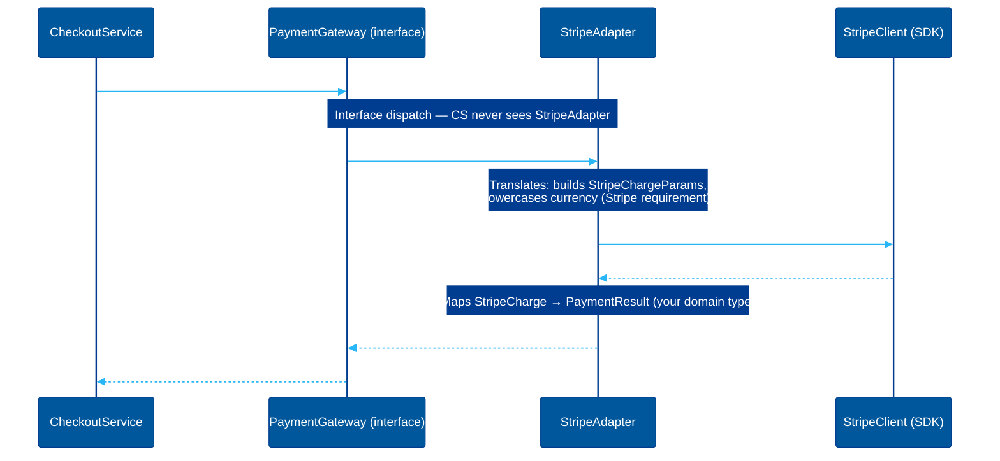

### Industrial Case Study: Payment Gateway Normalization

```java
// Your domain contract — the "Target" interface.
// This is the only payment abstraction the rest of your app knows about.
public interface PaymentGateway {
    PaymentResult charge(String customerId, long amountCents, String currency);
    RefundResult refund(String chargeId);
}

// Your domain value objects — clean, no SDK leakage.
public record PaymentResult(String transactionId, boolean success) {}
public record RefundResult(String refundId, boolean success) {}

// ─────────────────────────────────────────────────────────────────────────────
// Stripe's SDK — third-party code you CANNOT modify.
// It has its own vocabulary: StripeCharge, StripeChargeParams, etc.
// ─────────────────────────────────────────────────────────────────────────────
public class StripeClient {
    private final String apiKey;
    public StripeClient(String apiKey) { this.apiKey = apiKey; }

    public StripeCharge createCharge(StripeChargeParams params) {
        // Real SDK call — this method signature is owned by Stripe
        return StripeSDK.charges().create(params, apiKey);
    }

    public StripeRefund createRefund(String chargeId, long amountCents) {
        // amountCents == 0 means full refund in Stripe's API — callers must know this
        return StripeSDK.refunds().create(chargeId, amountCents, apiKey);
    }
}

// ─────────────────────────────────────────────────────────────────────────────
// The Stripe Adapter — the Translator.
// Its ONLY job: speak your domain language on one side, Stripe's language
// on the other. No business logic here.
// ─────────────────────────────────────────────────────────────────────────────
public class StripeAdapter implements PaymentGateway {
    private final StripeClient stripe;

    public StripeAdapter(StripeClient stripe) {
        this.stripe = stripe;
    }

    @Override
    public PaymentResult charge(String customerId, long amountCents, String currency) {
        // Stripe requires lowercase ISO currency codes — our interface does not mandate that,
        // so the adapter absorbs this SDK quirk rather than polluting the caller.
        StripeChargeParams params = new StripeChargeParams()
            .setCustomer(customerId)
            .setAmount(amountCents)           // Stripe already expects cents — no conversion needed
            .setCurrency(currency.toLowerCase()); // "USD" → "usd" (Stripe requirement, not ours)

        StripeCharge charge = stripe.createCharge(params);

        // Map Stripe's result type to our domain type.
        // The string comparison "succeeded" is Stripe's internal status vocabulary —
        // we deliberately hide it here so a Stripe API change only breaks this one line.
        return new PaymentResult(charge.getId(), "succeeded".equals(charge.getStatus()));
    }

    @Override
    public RefundResult refund(String chargeId) {
        // Passing 0 means "full refund" in Stripe's SDK — this is a Stripe-specific
        // convention that callers should never need to know about.
        StripeRefund refund = stripe.createRefund(chargeId, 0);
        return new RefundResult(refund.getId(), "succeeded".equals(refund.getStatus()));
    }
}

// ─────────────────────────────────────────────────────────────────────────────
// PayPal's SDK — completely different API surface from Stripe.
// PayPal works with decimal amounts; Stripe with integer cents.
// PayPal creates "Orders"; Stripe creates "Charges".
// ─────────────────────────────────────────────────────────────────────────────
public class PayPalRestClient {
    private final String clientId;
    private final String secret;
    public PayPalRestClient(String clientId, String secret) {
        this.clientId = clientId;
        this.secret = secret;
    }

    public PayPalOrder createOrder(String customerId, double amount, String currency) {
        return PayPalSDK.orders().create(customerId, amount, currency, clientId, secret);
    }

    public boolean issueRefund(String orderId) {
        return PayPalSDK.payments().refund(orderId, clientId, secret).isSuccessful();
    }
}

// The PayPal Adapter — same target interface, completely different internals.
public class PayPalAdapter implements PaymentGateway {
    private final PayPalRestClient paypal;

    public PayPalAdapter(PayPalRestClient paypal) {
        this.paypal = paypal;
    }

    @Override
    public PaymentResult charge(String customerId, long amountCents, String currency) {
        // PayPal expects a decimal dollar amount, not integer cents.
        // This unit conversion is an adapter responsibility — not the caller's.
        double amount = amountCents / 100.0;

        PayPalOrder order = paypal.createOrder(customerId, amount, currency);

        // PayPal's "approved" concept maps to our boolean success —
        // the semantics are close but not identical; the adapter makes the judgement call.
        return new PaymentResult(order.getOrderId(), order.isApproved());
    }

    @Override
    public RefundResult refund(String chargeId) {
        // PayPal's refund returns a boolean directly; no separate refund object.
        // We synthesize a RefundResult using the original chargeId as the refund ID
        // because PayPal doesn't issue a separate refund reference for simple cases.
        boolean success = paypal.issueRefund(chargeId);
        return new RefundResult(chargeId, success);
    }
}

// ─────────────────────────────────────────────────────────────────────────────
// CheckoutService — pure domain logic.
// It has ZERO knowledge of Stripe, PayPal, SDKs, or HTTP clients.
// Switching providers = changing one line in the DI config, not this class.
// ─────────────────────────────────────────────────────────────────────────────
public class CheckoutService {
    private final PaymentGateway gateway;

    public CheckoutService(PaymentGateway gateway) {
        this.gateway = gateway;
    }

    public Order completeOrder(Cart cart, String customerId) {
        PaymentResult result = gateway.charge(
            customerId,
            cart.getTotalCents(),
            "USD"
        );

        if (!result.success()) {
            // We throw a domain exception, not a Stripe or PayPal exception —
            // the adapter translated the error type along with the success path.
            throw new PaymentException("Payment declined: " + result.transactionId());
        }

        // Record the transaction ID in the Order so we have a reference for refunds later.
        return Order.create(cart, result.transactionId());
    }

    public void refundOrder(Order order) {
        RefundResult result = gateway.refund(order.getTransactionId());

        if (!result.success()) {
            throw new RefundException("Refund failed for order " + order.getId());
        }

        order.markRefunded(result.refundId());
    }
}

// ─────────────────────────────────────────────────────────────────────────────
// Wiring (in DI config or main) — the only place that knows about providers.
// Feature flags, environment config, or A/B testing live here, not in domain.
// ─────────────────────────────────────────────────────────────────────────────
PaymentGateway gateway = FeatureFlags.isEnabled("use_paypal")
    ? new PayPalAdapter(new PayPalRestClient(config.paypalClientId(), config.paypalSecret()))
    : new StripeAdapter(new StripeClient(config.stripeApiKey()));

CheckoutService checkout = new CheckoutService(gateway);

// Testing: swap in a no-op adapter — no real money moves in tests.
public class FakePaymentGateway implements PaymentGateway {
    @Override
    public PaymentResult charge(String customerId, long amountCents, String currency) {
        return new PaymentResult("fake_txn_" + customerId, true); // always succeeds
    }

    @Override
    public RefundResult refund(String chargeId) {
        return new RefundResult("fake_refund_" + chargeId, true);
    }
}
```

### When to Use / When to Avoid

| Scenario | Verdict |
| :--- | :--- |
| Integrating a third-party SDK with an incompatible interface | **Use it** — this is the canonical use case |
| Normalizing multiple competing providers to a single interface | **Use it** — the adapter isolates each provider's quirks |
| Wrapping legacy XML/SOAP services for a modern REST codebase | **Use it** — the adapter absorbs the translation tax |
| Making a class testable by wrapping it in a mock-compatible interface | **Use it** — the `FakePaymentGateway` above is exactly this |
| You control both sides of the interface | **Skip it** — just change one of the interfaces directly |
| The "translation" layer has significant business logic | **Stop** — you've outgrown Adapter; consider a proper Anti-Corruption Layer |
| You're writing an adapter to adapt an adapter | **Alarm bell** — redesign the architecture; you have a structural mismatch |

---

## The Decorator

> **The hook:** The Decorator is the difference between a recipe book that lists "PremiumSurgePromoLoyaltyRide" as a dish and one that lets you stack toppings freely — the latter never needs a new recipe for every combination.

### The Problem

You're building a ride-sharing pricing engine. Starting simple: `BaseRide` computes distance × rate. But then:

- Surge pricing kicks in during rush hour: `price × 1.8`
- Users have promo codes: `price - $5`
- Premium members get a discount: `price × 0.9`
- Loyalty points burn off: `price - (points × $0.01)`

With inheritance, you'd need every combination: `SurgeRide`, `PromoRide`, `SurgePromoRide`, `PremiumSurgeRide`, `SurgePromoLoyaltyRide`... With 4 modifiers, you're looking at 2⁴ = 16 subclasses. Add a fifth modifier. Add a sixth. The math becomes indefensible.

Worse: the conditions stack in **order**. Surge applies before promo. Promo applies before loyalty. You can't encode that in a class name.

### The Insight

> **The Decorator is an onion. You wrap behaviors in layers without modifying the core.**
> 
> 📖 **Read the Parable:** [The Naked Coffee and the Add-ons (កាហ្វេខ្មៅ និងគ្រឿងបន្ថែម)](../../concepts/parables/81-the-naked-coffee.md)
> 🧠 **Read the Strategy Explanation:** [Journalist Strategy: Decorator (ការបន្ថែមលក្ខណៈពិសេសលើ Object ដោយមិនប៉ះពាល់កូដចាស់)](../../concepts/design-patterns/06-journalist-inverted-pyramid/01-decorator.md)

The key shift: **behaviors aren't properties of a class — they're layers on top of a core object**. When every modifier wraps the same interface it also implements, you can stack them like Russian dolls. Each layer calls the one inside it, adds its contribution, and returns. The call unwinds through the stack like a recursive function. The order of wrapping is the order of execution.

### The Structure

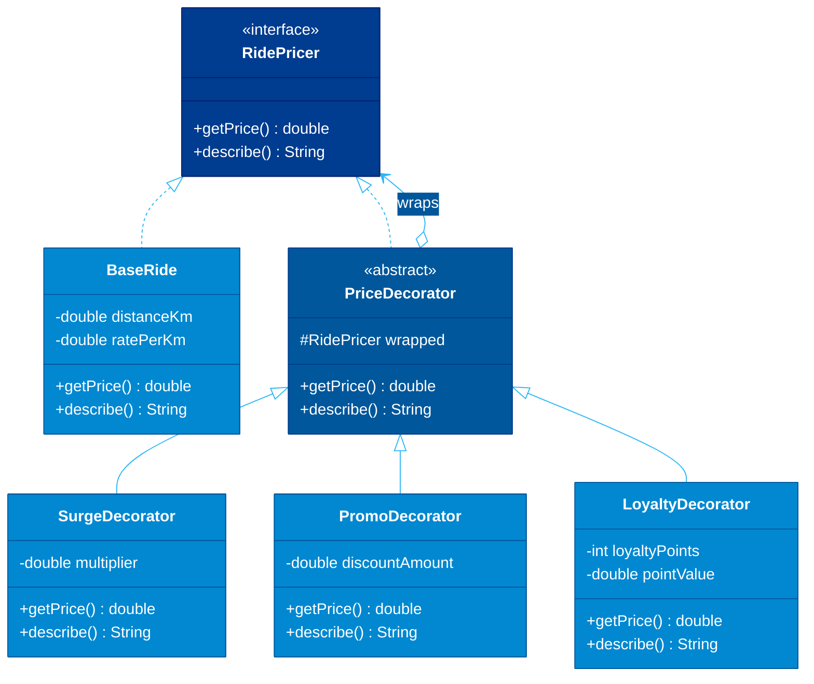

### The Runtime Flow

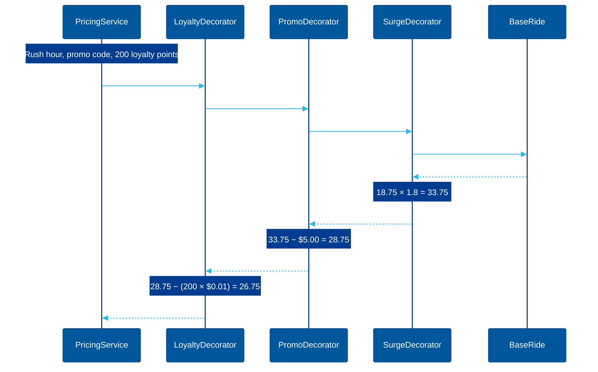

### Decorator Conceptual Map

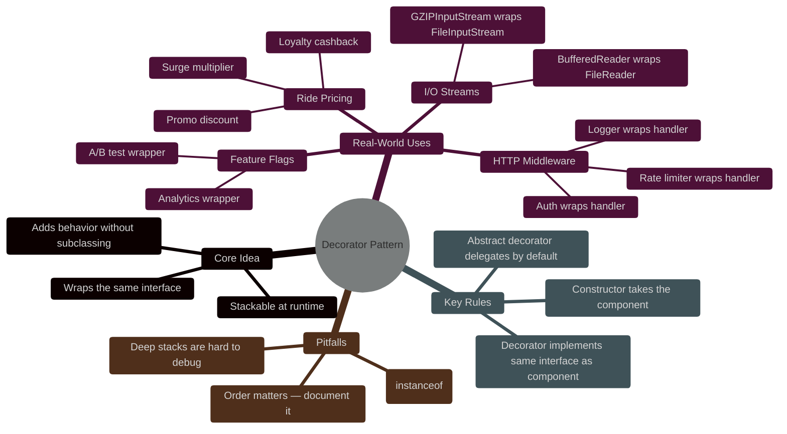

### Industrial Case Study: Dynamic Ride Pricing Engine

```java
// The component interface — every layer in the stack implements this.
// Having both getPrice() and describe() lets us audit the full pricing breakdown
// without needing a separate logging mechanism.
public interface RidePricer {
    double getPrice();
    String describe();  // Audit trail: "Base(12.5km) + surge×1.8 - promo$5.00"
}

// The leaf — the core computation with no modifiers.
// Sealed to prevent subclassing that bypasses the decorator chain.
public final class BaseRide implements RidePricer {
    private final double distanceKm;
    private static final double RATE_PER_KM = 1.50; // $1.50/km base rate

    public BaseRide(double distanceKm) {
        if (distanceKm <= 0) throw new IllegalArgumentException("Distance must be positive");
        this.distanceKm = distanceKm;
    }

    @Override
    public double getPrice() {
        return distanceKm * RATE_PER_KM;
    }

    @Override
    public String describe() {
        return String.format("Base(%.1fkm @ $%.2f/km)", distanceKm, RATE_PER_KM);
    }
}

// Abstract decorator — the glue that makes the chain work.
// It implements RidePricer (so it IS a pricer) and HOLDS a RidePricer (so it WRAPS a pricer).
// Subclasses only override the parts they change; the rest flows through.
public abstract class PriceDecorator implements RidePricer {
    protected final RidePricer wrapped; // The layer beneath this one

    protected PriceDecorator(RidePricer wrapped) {
        this.wrapped = Objects.requireNonNull(wrapped, "wrapped pricer cannot be null");
    }

    // Default pass-through. Concrete decorators override getPrice() to add their effect.
    @Override
    public double getPrice() {
        return wrapped.getPrice();
    }

    @Override
    public String describe() {
        return wrapped.describe();
    }
}

// Surge decorator: multiplies the price during high-demand periods.
// Multiplier > 1.0 increases price; design allows values < 1.0 for off-peak discounts too.
public final class SurgeDecorator extends PriceDecorator {
    private final double multiplier;
    private final String reason; // "rush_hour", "weather", "event" — useful for receipts

    public SurgeDecorator(RidePricer wrapped, double multiplier, String reason) {
        super(wrapped);
        if (multiplier <= 0) throw new IllegalArgumentException("Multiplier must be positive");
        this.multiplier = multiplier;
        this.reason = reason;
    }

    @Override
    public double getPrice() {
        // Apply AFTER whatever is below us has computed; this is the correct ordering.
        // Surge on top of base, not base on top of surge.
        return wrapped.getPrice() * multiplier;
    }

    @Override
    public String describe() {
        return wrapped.describe() + String.format(" ×%.1f[%s]", multiplier, reason);
    }
}

// Promo decorator: flat dollar discount from a promo code.
// Math.max(0, ...) ensures we never charge a negative price —
// a business rule that lives in the decorator, not in BaseRide.
public final class PromoDecorator extends PriceDecorator {
    private final double discountAmount;
    private final String promoCode;

    public PromoDecorator(RidePricer wrapped, double discountAmount, String promoCode) {
        super(wrapped);
        if (discountAmount < 0) throw new IllegalArgumentException("Discount cannot be negative");
        this.discountAmount = discountAmount;
        this.promoCode = promoCode;
    }

    @Override
    public double getPrice() {
        // Floor at zero: promo codes can't make rides "earn" money for the passenger.
        return Math.max(0.0, wrapped.getPrice() - discountAmount);
    }

    @Override
    public String describe() {
        return wrapped.describe() + String.format(" -$%.2f[%s]", discountAmount, promoCode);
    }
}

// Loyalty decorator: burns loyalty points as a cash discount.
// Points are consumed regardless of whether they cover the full price —
// this is intentional: partial redemption is still valid.
public final class LoyaltyDecorator extends PriceDecorator {
    private final int pointsToRedeem;
    private static final double POINT_VALUE_DOLLARS = 0.01; // $0.01 per point

    public LoyaltyDecorator(RidePricer wrapped, int pointsToRedeem) {
        super(wrapped);
        if (pointsToRedeem < 0) throw new IllegalArgumentException("Points cannot be negative");
        this.pointsToRedeem = pointsToRedeem;
    }

    @Override
    public double getPrice() {
        double cashValue = pointsToRedeem * POINT_VALUE_DOLLARS;
        // Floor at zero here too — a user with 10,000 points shouldn't get a free ride
        // PLUS money back. That would be a product bug encoded in math.
        return Math.max(0.0, wrapped.getPrice() - cashValue);
    }

    @Override
    public String describe() {
        return wrapped.describe() + String.format(" -%dpts($%.2f)", pointsToRedeem,
            pointsToRedeem * POINT_VALUE_DOLLARS);
    }
}

// Premium tier decorator: percentage discount for subscribed members.
public final class PremiumMemberDecorator extends PriceDecorator {
    private static final double DISCOUNT_RATE = 0.10; // 10% off for premium members

    public PremiumMemberDecorator(RidePricer wrapped) {
        super(wrapped);
    }

    @Override
    public double getPrice() {
        return wrapped.getPrice() * (1.0 - DISCOUNT_RATE);
    }

    @Override
    public String describe() {
        return wrapped.describe() + " -10%[premium]";
    }
}

// ─────────────────────────────────────────────────────────────────────────────
// PricingService — builds the decorator stack based on runtime conditions.
// Note: order matters. Surge is applied first (multiplies base), then promo
// (flat cut on surged price), then loyalty (further reduction), then premium
// (percentage off the remainder). This order is a business decision, not a
// technical one — document it and protect it with tests.
// ─────────────────────────────────────────────────────────────────────────────
public class PricingService {
    private final SurgePricingEngine surgeEngine;

    public PricingService(SurgePricingEngine surgeEngine) {
        this.surgeEngine = surgeEngine;
    }

    public PricingResult calculatePrice(RideRequest request, User user) {
        // Start with the irreducible core: distance × base rate.
        RidePricer pricer = new BaseRide(request.getDistanceKm());

        // Layer 1: Surge (if applicable). Applied first because it multiplies the raw fare.
        Optional<SurgeInfo> surge = surgeEngine.getCurrentSurge(request.getPickupZone());
        if (surge.isPresent()) {
            pricer = new SurgeDecorator(pricer, surge.get().getMultiplier(), surge.get().getReason());
        }

        // Layer 2: Promo code (flat discount on the post-surge price).
        if (user.hasActivePromoCode()) {
            PromoCode promo = user.getActivePromoCode();
            pricer = new PromoDecorator(pricer, promo.getDiscountAmount(), promo.getCode());
        }

        // Layer 3: Loyalty points (further reduction on the post-promo price).
        // Only apply if user has meaningful points — avoid decorating for zero effect.
        if (user.getLoyaltyPoints() > 0) {
            pricer = new LoyaltyDecorator(pricer, user.getLoyaltyPoints());
        }

        // Layer 4: Premium membership (percentage off the remainder).
        // Applied last so it rewards loyalty even after discounts.
        if (user.isPremiumMember()) {
            pricer = new PremiumMemberDecorator(pricer);
        }

        double finalPrice = pricer.getPrice();

        // describe() traverses the whole stack bottom-up to produce the audit trail.
        // This goes directly on the receipt — no separate logging needed.
        String breakdown = pricer.describe();

        return new PricingResult(finalPrice, breakdown);
    }
}

// Example output for a 12.5km rush-hour ride with a premium member, promo code SAVE5, 200 pts:
// Breakdown: Base(12.5km @ $1.50/km) ×1.8[rush_hour] -$5.00[SAVE5] -200pts($2.00) -10%[premium]
// Price: (12.5 × 1.50 × 1.8 - 5.00 - 2.00) × 0.90 = $24.08
```

### When to Use / When to Avoid

| Scenario | Verdict |
| :--- | :--- |
| Behaviors that combine in arbitrary order at runtime | **Use it** — this is the sweet spot |
| I/O stream wrapping (buffering, compression, encryption) | **Use it** — Java's own `java.io` package is built on this |
| HTTP middleware stacks (auth, logging, rate limiting) | **Use it** — each concern stays isolated |
| Single, fixed extra behavior needed on one class | **Skip it** — just subclass or use a method |
| Stack depth exceeds ~5 layers | **Caution** — debugging nested stacks is painful; consider a pipeline/chain instead |
| You need to introspect what decorators are applied | **Caution** — the chain is opaque; add a `getWrapped()` or visitor |
| The wrapped type needs to change (not just augment) | **Wrong pattern** — use Strategy or Bridge |

---

## The Bridge

> **The hook:** Bridge is the pattern you reach for when you realize you're not building a class hierarchy — you're building a multiplication table of subclasses, and you need to factor it back into two independent axes.

### The Problem

You're building a reporting engine. Reports come in two flavors: **Summary** and **Detailed**. They can be rendered in three formats: **PDF**, **Excel**, and **HTML**.

Without Bridge, you reach for inheritance and create: `SummaryPdfReport`, `SummaryExcelReport`, `SummaryHtmlReport`, `DetailedPdfReport`, `DetailedExcelReport`, `DetailedHtmlReport`. That's 6 classes for 2 × 3. When the product team adds "Quarterly" as a new report type and "CSV" as a new format, you're writing 4 more classes — and they're all boilerplate.

The two dimensions — *what data the report contains* and *how that data is rendered* — vary completely independently. They don't belong in the same class hierarchy.

### The Insight

> 📖 **Read the Parable:** [The Universal Remote (តេឡេបញ្ជាសកល)](../../concepts/parables/83-the-universal-remote.md)
> 🧠 **Read the Strategy Explanation:** [Analogy Bridge: Bridge (ស្ពានតភ្ជាប់រវាងការងារពីរដាច់ដោយឡែក)](../../concepts/design-patterns/04-analogy-bridge/01-bridge.md)

Bridge separates the **abstraction** (what the report IS: summary, detailed) from the **implementation** (how it RENDERS: PDF, Excel). Each dimension has its own hierarchy. The abstraction holds a *reference* to the implementation — the bridge — and delegates rendering through it. Add a new format: implement `ReportRenderer`. Add a new report type: extend `Report`. Neither change touches the other axis.

### The Structure

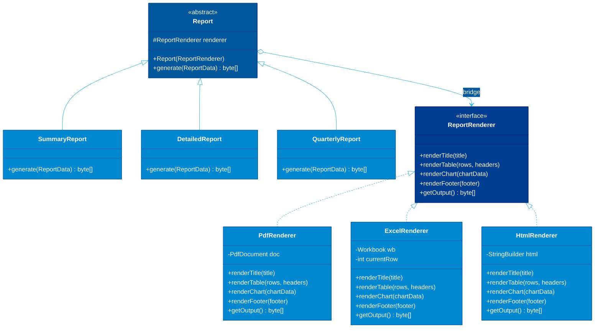

### Industrial Case Study: Cross-Platform Reporting Engine

```java
// ─────────────────────────────────────────────────────────────────────────────
// The Implementation interface — defines the rendering vocabulary.
// This is the "how to output" dimension. New renderers implement this.
// ─────────────────────────────────────────────────────────────────────────────
public interface ReportRenderer {
    void renderTitle(String title);
    void renderTable(List<String[]> rows, String[] headers);
    void renderChart(ChartData chartData); // Added: charts are output-format-specific
    void renderFooter(String footer);
    byte[] getOutput();
}

// ─────────────────────────────────────────────────────────────────────────────
// Concrete Implementation: PDF output via iText or Apache PDFBox.
// All the PDF-specific ceremony is confined here — nowhere else.
// ─────────────────────────────────────────────────────────────────────────────
public class PdfRenderer implements ReportRenderer {
    private final PdfWriter writer;
    private final PdfDocument pdfDoc;
    private final Document document;

    public PdfRenderer() {
        ByteArrayOutputStream baos = new ByteArrayOutputStream();
        this.writer = new PdfWriter(baos);
        this.pdfDoc = new PdfDocument(writer);
        this.document = new Document(pdfDoc);
    }

    @Override
    public void renderTitle(String title) {
        // iText's Paragraph API — renderer-specific, isolated here intentionally.
        document.add(new Paragraph(title)
            .setFontSize(18)
            .setBold()
            .setMarginBottom(12));
    }

    @Override
    public void renderTable(List<String[]> rows, String[] headers) {
        // PDF tables need explicit column count at construction time —
        // this is a PDF constraint, not a general report constraint.
        Table table = new Table(headers.length);
        for (String header : headers) {
            table.addHeaderCell(new Cell().add(new Paragraph(header).setBold()));
        }
        for (String[] row : rows) {
            for (String cell : row) {
                table.addCell(new Cell().add(new Paragraph(cell)));
            }
        }
        document.add(table);
    }

    @Override
    public void renderChart(ChartData chartData) {
        // PDF charts require rasterizing to an image first — renderer-specific complexity.
        byte[] chartImage = ChartRenderer.toImage(chartData, 600, 400);
        document.add(new Image(ImageDataFactory.create(chartImage)));
    }

    @Override
    public void renderFooter(String footer) {
        document.add(new Paragraph(footer).setFontSize(9).setFontColor(ColorConstants.GRAY));
    }

    @Override
    public byte[] getOutput() {
        document.close(); // Must close before reading bytes — iText finalizes on close.
        return ((ByteArrayOutputStream) writer.getOutputStream()).toByteArray();
    }
}

// ─────────────────────────────────────────────────────────────────────────────
// Concrete Implementation: Excel output via Apache POI.
// Excel has its own cell/row model — completely different from PDF.
// ─────────────────────────────────────────────────────────────────────────────
public class ExcelRenderer implements ReportRenderer {
    private final Workbook workbook;
    private final Sheet dataSheet;
    private int currentRow = 0;

    public ExcelRenderer() {
        this.workbook = new XSSFWorkbook(); // .xlsx format
        this.dataSheet = workbook.createSheet("Report");
    }

    @Override
    public void renderTitle(String title) {
        Row row = dataSheet.createRow(currentRow++);
        Cell cell = row.createCell(0);
        cell.setCellValue(title);

        // Apply title style — Excel requires explicit CellStyle objects,
        // unlike PDF which uses fluent Paragraph styling.
        CellStyle titleStyle = workbook.createCellStyle();
        Font font = workbook.createFont();
        font.setBold(true);
        font.setFontHeightInPoints((short) 14);
        titleStyle.setFont(font);
        cell.setCellStyle(titleStyle);
    }

    @Override
    public void renderTable(List<String[]> rows, String[] headers) {
        // Header row
        Row headerRow = dataSheet.createRow(currentRow++);
        CellStyle headerStyle = createHeaderStyle();
        for (int i = 0; i < headers.length; i++) {
            Cell cell = headerRow.createCell(i);
            cell.setCellValue(headers[i]);
            cell.setCellStyle(headerStyle);
        }

        // Data rows
        for (String[] rowData : rows) {
            Row dataRow = dataSheet.createRow(currentRow++);
            for (int i = 0; i < rowData.length; i++) {
                dataRow.createCell(i).setCellValue(rowData[i]);
            }
        }

        // Auto-size columns for readability — a nice-to-have that only makes sense in Excel.
        for (int i = 0; i < headers.length; i++) {
            dataSheet.autoSizeColumn(i);
        }
    }

    @Override
    public void renderChart(ChartData chartData) {
        // Excel charts are embedded in the spreadsheet as Drawing objects —
        // completely different mechanism from PDF images.
        Sheet chartSheet = workbook.createSheet("Chart");
        Drawing<?> drawing = chartSheet.createDrawingPatriarch();
        ClientAnchor anchor = drawing.createAnchor(0, 0, 0, 0, 0, 0, 15, 25);
        Chart chart = drawing.createChart(anchor);
        ExcelChartBuilder.buildBarChart(chart, chartData);
    }

    @Override
    public void renderFooter(String footer) {
        currentRow++; // Blank row separator before footer
        dataSheet.createRow(currentRow++).createCell(0).setCellValue(footer);
    }

    @Override
    public byte[] getOutput() {
        try (ByteArrayOutputStream out = new ByteArrayOutputStream()) {
            workbook.write(out);
            workbook.close();
            return out.toByteArray();
        } catch (IOException e) {
            throw new ReportRenderException("Failed to serialize Excel workbook", e);
        }
    }

    private CellStyle createHeaderStyle() {
        CellStyle style = workbook.createCellStyle();
        style.setFillForegroundColor(IndexedColors.GREY_25_PERCENT.getIndex());
        style.setFillPattern(FillPatternType.SOLID_FOREGROUND);
        Font font = workbook.createFont();
        font.setBold(true);
        style.setFont(font);
        return style;
    }
}

// ─────────────────────────────────────────────────────────────────────────────
// The Abstraction — the "what kind of report" dimension.
// It holds the bridge (renderer reference) and delegates all rendering to it.
// Subclasses define the SEQUENCE of render calls — the report's structure.
// ─────────────────────────────────────────────────────────────────────────────
public abstract class Report {
    // The bridge: a reference to the implementation, injected at construction.
    // Protected so subclasses can call renderer methods directly.
    protected final ReportRenderer renderer;

    protected Report(ReportRenderer renderer) {
        this.renderer = Objects.requireNonNull(renderer, "renderer cannot be null");
    }

    // Template: each subclass calls renderer.renderXxx() in whatever order makes sense
    // for that report type. The renderer handles the format; the report handles the structure.
    public abstract byte[] generate(ReportData data);
}

// Refined Abstraction: Summary report — high-level KPIs only.
public class SummaryReport extends Report {
    public SummaryReport(ReportRenderer renderer) { super(renderer); }

    @Override
    public byte[] generate(ReportData data) {
        // The report type controls what content to include and in what order.
        // The renderer controls how to draw each piece.
        renderer.renderTitle("Executive Summary — " + data.getPeriod());
        renderer.renderChart(data.getKpiChart()); // Summary always includes the chart
        renderer.renderTable(data.getSummaryRows(), new String[]{"Metric", "Value", "Change"});
        renderer.renderFooter("Confidential — " + LocalDate.now() + " | Page 1 of 1");
        return renderer.getOutput();
    }
}

// Refined Abstraction: Detailed report — full row-level data, no chart.
public class DetailedReport extends Report {
    private final int maxRows;

    public DetailedReport(ReportRenderer renderer, int maxRows) {
        super(renderer);
        this.maxRows = maxRows; // Pagination concern belongs in the report type, not the renderer
    }

    @Override
    public byte[] generate(ReportData data) {
        renderer.renderTitle("Detailed Report — " + data.getPeriod());
        // Detailed reports don't include charts — they're too data-dense for visual summaries
        List<String[]> page = data.getAllRows().subList(0, Math.min(maxRows, data.getAllRows().size()));
        renderer.renderTable(page, data.getHeaders());
        renderer.renderFooter(String.format("Showing %d of %d records", page.size(), data.getAllRows().size()));
        return renderer.getOutput();
    }
}

// ─────────────────────────────────────────────────────────────────────────────
// Usage: 3 formats × 2 types = 6 combinations, 0 extra classes needed.
// Adding a new format only requires implementing ReportRenderer.
// Adding a new report type only requires extending Report.
// ─────────────────────────────────────────────────────────────────────────────
ReportData q3Data = reportRepository.getQuarterlyData("Q3-2026");

byte[] summaryPdf    = new SummaryReport(new PdfRenderer()).generate(q3Data);
byte[] summaryExcel  = new SummaryReport(new ExcelRenderer()).generate(q3Data);
byte[] detailedPdf   = new DetailedReport(new PdfRenderer(), 500).generate(q3Data);
byte[] detailedExcel = new DetailedReport(new ExcelRenderer(), 1000).generate(q3Data);

// Adding CSV format? Write CsvRenderer implements ReportRenderer.
// All existing report types immediately gain CSV support — zero changes to Report subclasses.
```

### When to Use / When to Avoid

| Scenario | Verdict |
| :--- | :--- |
| Two genuinely independent dimensions of variation | **Use it** — prevents the combinatorial explosion |
| Switching implementations at runtime (e.g., PDF in prod, HTML in tests) | **Use it** — swap the renderer, keep the report logic |
| Only one dimension varies | **Skip it** — plain inheritance is simpler |
| You have just 2–3 total combinations | **Skip it** — write the classes explicitly; the indirection isn't worth it |
| The "implementation" and "abstraction" are deeply intertwined | **Stop** — you may not actually have two independent dimensions |

---

## The Composite

> **The hook:** The Composite pattern lets you treat a single leaf and a thousand-node tree through the same interface — the caller doesn't need to care whether it's talking to one thing or a million things organized as one.

### The Problem

Your permission system works for individual users. `alice.hasPermission("deploy")` — straightforward. Now you need groups. And groups of groups. And you need to answer `"can the 'backend-team' group deploy?"` with the same call pattern as checking Alice individually.

Without Composite, you write two separate code paths: one for `User`, one for `Group`. Then a `Group` can contain another `Group`, and now you need recursive logic in the caller — or you scatter `instanceof` checks everywhere.

The tree is a fact of your domain. The Composite pattern acknowledges it and provides a uniform interface that hides the recursion inside the tree nodes themselves.

### The Insight

> 📖 **Read the Parable:** [The Nested Gift Boxes (ប្រអប់កាដូរុំត្រួតគ្នា)](../../concepts/parables/84-the-nested-gift-boxes.md)
> 🧠 **Read the Strategy Explanation:** [Storyteller Strategy: Composite (ការចាត់ចែងរបស់តូច និងរបស់ធំឱ្យដូចគ្នា)](../../concepts/design-patterns/07-storyteller-narrative-arc/01-composite.md)

The tree recurses; the caller doesn't. When a composite node implements the same interface as its leaf children, `hasPermission()` on a group just iterates its children and delegates — and each child does the same. The recursion is distributed through the tree, invisible to the top-level caller. You write the recursion once, inside `GroupNode.hasPermission()`, and every future `"can X do Y?"` query navigates any-depth trees for free.

### The Structure

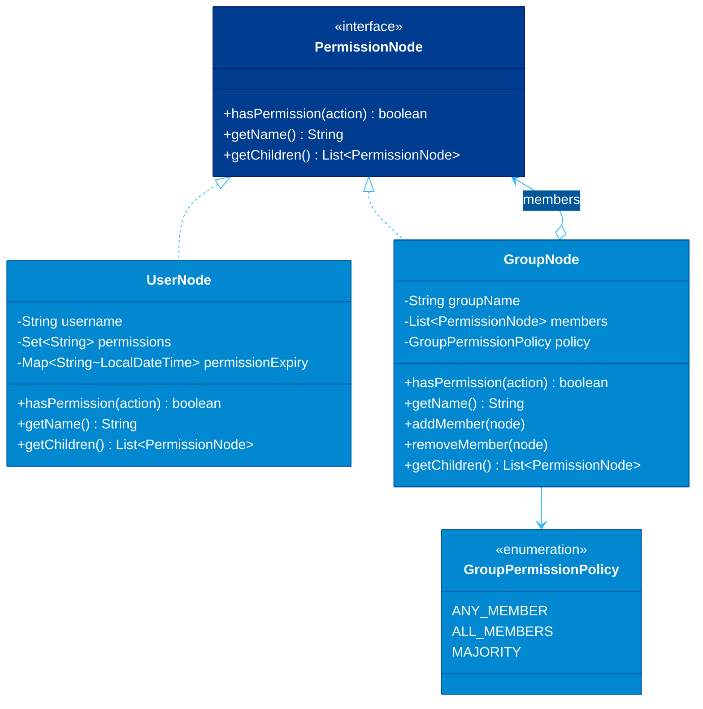

### Composite Tree Example

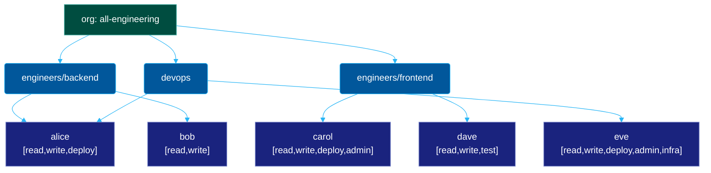

### Industrial Case Study: Permission System

```java
// The uniform interface — both leaf nodes (users) and composite nodes (groups)
// implement this. Callers never need to distinguish between the two.
public interface PermissionNode {
    boolean hasPermission(String action);
    String getName();
    List<PermissionNode> getChildren(); // Empty list for leaves — never null (avoids NPE)

    // Convenience: walk the tree to collect all users with a given permission.
    // Default method so it's free for all implementations.
    default Set<String> whoHas(String action) {
        if (getChildren().isEmpty()) {
            // This is a leaf — just check self
            return hasPermission(action) ? Set.of(getName()) : Set.of();
        }
        // This is a composite — union of all children's results
        return getChildren().stream()
            .flatMap(child -> child.whoHas(action).stream())
            .collect(Collectors.toSet());
    }
}

// Leaf node: an individual user with a set of permissions.
// Permissions can have expiry times — a real-world requirement ignored by toy examples.
public class UserNode implements PermissionNode {
    private final String username;
    // Using a Map<permission, expiry> rather than Set<String> to support
    // time-limited permissions (common in on-call/temporary access grants).
    private final Map<String, Optional<Instant>> permissions;

    public UserNode(String username) {
        this.username = username;
        this.permissions = new ConcurrentHashMap<>();
    }

    // Grant a permanent permission.
    public UserNode grant(String action) {
        permissions.put(action, Optional.empty()); // No expiry
        return this; // Fluent for builder-style wiring
    }

    // Grant a time-limited permission (e.g., temporary access during incident).
    public UserNode grantUntil(String action, Instant expiry) {
        permissions.put(action, Optional.of(expiry));
        return this;
    }

    @Override
    public boolean hasPermission(String action) {
        Optional<Instant> expiry = permissions.get(action);
        if (expiry == null) return false;               // Never granted

        // If there's an expiry, check it hasn't passed.
        // Permanent permissions (Optional.empty()) are always valid.
        return expiry.map(e -> Instant.now().isBefore(e)).orElse(true);
    }

    @Override
    public String getName() { return username; }

    @Override
    public List<PermissionNode> getChildren() {
        return Collections.emptyList(); // Leaf nodes have no children — never null
    }
}

// Composite node: a group that contains other nodes (users or sub-groups).
// The permission policy (ANY vs ALL) makes groups genuinely useful:
// - ANY_MEMBER: "can anyone on the team deploy?" (typical for groups)
// - ALL_MEMBERS: "do all approvers agree?" (useful for consensus/sign-off groups)
public class GroupNode implements PermissionNode {
    private final String groupName;
    private final List<PermissionNode> members;
    private final GroupPermissionPolicy policy;

    public enum GroupPermissionPolicy {
        // Permission if ANY member has it — union semantics.
        // Correct for: "does the backend team have deploy access?"
        ANY_MEMBER,

        // Permission only if ALL members have it — intersection semantics.
        // Correct for: "do all required approvers have sign-off?"
        ALL_MEMBERS
    }

    public GroupNode(String groupName, GroupPermissionPolicy policy) {
        this.groupName = groupName;
        this.policy = policy;
        this.members = new ArrayList<>();
    }

    // Default policy is ANY_MEMBER for backwards compatibility.
    public GroupNode(String groupName) {
        this(groupName, GroupPermissionPolicy.ANY_MEMBER);
    }

    public GroupNode addMember(PermissionNode node) {
        // Prevent cycles — a group cannot contain itself directly or indirectly.
        if (node == this) throw new IllegalArgumentException("Group cannot contain itself");
        members.add(node);
        return this; // Fluent
    }

    public boolean removeMember(String name) {
        return members.removeIf(m -> m.getName().equals(name));
    }

    @Override
    public boolean hasPermission(String action) {
        if (members.isEmpty()) return false; // Empty group has no permissions

        // Dispatch based on configured policy.
        // The recursion happens here: each member.hasPermission() may itself recurse
        // through sub-groups. Depth is bounded by the tree depth, not the total node count.
        return switch (policy) {
            case ANY_MEMBER  -> members.stream().anyMatch(m -> m.hasPermission(action));
            case ALL_MEMBERS -> members.stream().allMatch(m -> m.hasPermission(action));
        };
    }

    @Override
    public String getName() { return groupName; }

    @Override
    public List<PermissionNode> getChildren() {
        return Collections.unmodifiableList(members); // Unmodifiable: external mutation goes through addMember()
    }
}

// ─────────────────────────────────────────────────────────────────────────────
// Building the org tree — groups and users wired together.
// The permission check at the bottom treats all of it uniformly.
// ─────────────────────────────────────────────────────────────────────────────
// Individual users
UserNode alice = new UserNode("alice").grant("read").grant("write").grant("deploy");
UserNode bob   = new UserNode("bob").grant("read").grant("write");
UserNode carol = new UserNode("carol").grant("read").grant("write").grant("deploy").grant("admin");
UserNode dave  = new UserNode("dave").grant("read").grant("write").grant("test");
UserNode eve   = new UserNode("eve").grant("read").grant("write").grant("deploy").grant("admin").grant("infra");

// Sub-groups
GroupNode backendTeam  = new GroupNode("backend-team").addMember(alice).addMember(bob);
GroupNode frontendTeam = new GroupNode("frontend-team").addMember(carol).addMember(dave);
GroupNode devops       = new GroupNode("devops").addMember(eve).addMember(alice); // alice is in two groups

// Top-level composite
GroupNode allEngineering = new GroupNode("all-engineering")
    .addMember(backendTeam)
    .addMember(frontendTeam)
    .addMember(devops);

// The caller uses the same method regardless of depth or node type.
PermissionChecker checker = new PermissionChecker();

checker.check(alice, "deploy");        // true  — leaf, direct check
checker.check(backendTeam, "deploy");  // true  — composite, alice has it
checker.check(frontendTeam, "deploy"); // true  — carol has it
checker.check(frontendTeam, "admin");  // true  — carol has it
checker.check(allEngineering, "infra");// true  — eve has it (3 levels deep)
checker.check(allEngineering, "admin");// true  — carol and eve both have it

// whoHas() traverses the entire tree — same interface, recursive for free
Set<String> deployers = allEngineering.whoHas("deploy");
// Result: {"alice", "carol", "eve"} — collected from leaves across the whole tree

// ─────────────────────────────────────────────────────────────────────────────
// The checker itself — note it takes PermissionNode, not User or Group.
// It works for any node in the tree, at any depth.
// ─────────────────────────────────────────────────────────────────────────────
public class PermissionChecker {
    public void check(PermissionNode node, String action) {
        if (!node.hasPermission(action)) {
            throw new AccessDeniedException(
                String.format("'%s' does not have permission '%s'", node.getName(), action)
            );
        }
    }

    public boolean test(PermissionNode node, String action) {
        return node.hasPermission(action);
    }
}
```

### When to Use / When to Avoid

| Scenario | Verdict |
| :--- | :--- |
| Tree structures where leaves and branches need the same API | **Use it** — canonical use case |
| File systems, org charts, UI component trees, menu systems | **Use it** — all trees with uniform operations |
| Permission hierarchies with nested groups | **Use it** — the recursion is natural here |
| You only have a flat list, never nested | **Skip it** — overkill; use a plain collection |
| The tree is write-heavy with cycles (graph, not tree) | **Stop** — Composite assumes a DAG; cycle detection is extra work |
| Leaf and composite operations diverge significantly | **Caution** — the uniform interface becomes a lie; split them |

---

## The Facade

> **The hook:** The Facade is not about hiding complexity — it's about hiding *irrelevant* complexity. It draws a line between "what you need to say" and "how the system makes it happen."

### The Problem

Transcoding a video is genuinely complex: detect the input codec, select a compatible output codec, allocate a memory-mapped buffer, run the FFmpeg transcode, extract a thumbnail at the right timestamp, upload the video and thumbnail to S3, write a database record, and publish an event. Ten moving parts.

A `VideoController` should not know about any of this. It should say: "Here's a file. Give me back URLs." Anything more is scope creep into a subsystem that the controller shouldn't own.

Without a Facade, the controller accumulates knowledge of FFmpeg, S3, codecs, and database writes. When the transcoding pipeline changes, you're modifying controller code. When you switch from S3 to GCS, you're touching HTTP handlers. The blast radius of changes is proportional to how much knowledge leaked outward.

### The Insight

> **The Facade is the maître d'. You don't walk into the kitchen to yell at the chef; you talk to the host.**
> 
> 📖 **Read the Parable:** [The Restaurant Waiter (អ្នករត់តុក្នុងភោជនីយដ្ឋាន)](../../concepts/parables/82-the-restaurant-waiter.md)
> 🧠 **Read the Strategy Explanation:** [ELI5: Facade (ចំណុចទំនាក់ទំនងសាមញ្ញតែមួយ)](../../concepts/design-patterns/03-eli5/02-facade.md)

A Facade doesn't simplify the subsystem — the complexity is real and necessary. It creates a **narrow entry point** that exposes only what external callers need. It owns the orchestration logic that would otherwise float freely. The Facade is the one class that's *allowed* to know about all the subsystem parts — because it exists precisely to contain that knowledge.

### The Processing Pipeline

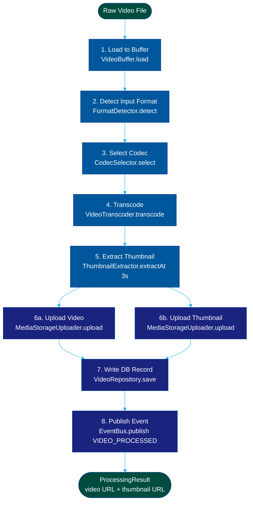

### The Structure

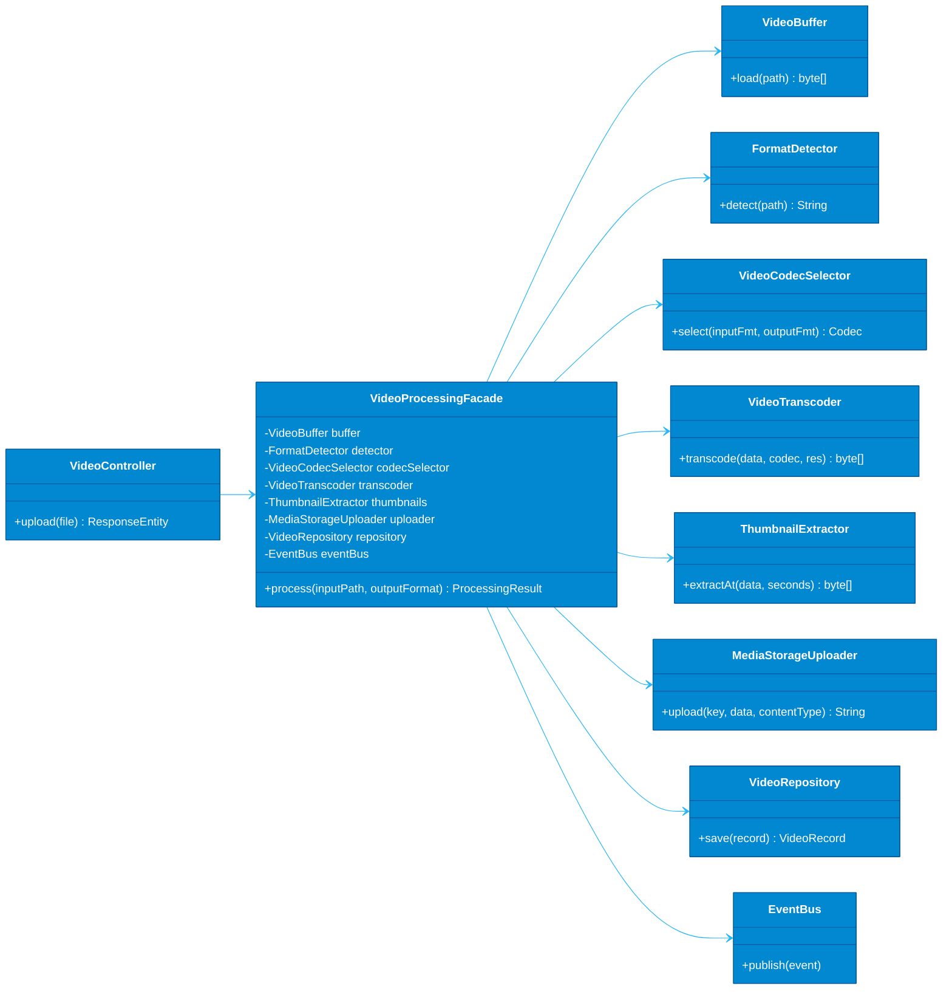

### Industrial Case Study: Video Processing Pipeline

```java
// ─────────────────────────────────────────────────────────────────────────────
// Subsystem classes — each does one thing well.
// They know nothing about each other; the Facade wires them together.
// ─────────────────────────────────────────────────────────────────────────────

public class VideoBuffer {
    private static final int CHUNK_SIZE = 4 * 1024 * 1024; // 4MB chunks

    // Memory-mapped reading avoids loading multi-GB files entirely into heap.
    // This is a VideoBuffer concern — callers just get bytes.
    public byte[] load(Path filePath) throws IOException {
        try (FileChannel channel = FileChannel.open(filePath, StandardOpenOption.READ)) {
            MappedByteBuffer buffer = channel.map(
                FileChannel.MapMode.READ_ONLY, 0, channel.size()
            );
            byte[] data = new byte[(int) channel.size()];
            buffer.get(data);
            return data;
        }
    }
}

public class FormatDetector {
    // Detect based on file magic bytes, not the extension —
    // extensions can be wrong; magic bytes don't lie.
    public String detect(Path filePath) throws IOException {
        byte[] header = Files.readNBytes(filePath, 12);
        return MagicByteDetector.identify(header); // "mp4", "mov", "avi", etc.
    }
}

public class VideoCodecSelector {
    // A compatibility matrix: not all codecs can transcode to all formats.
    // H.265 to WebM is a fallback path; H.264 to MP4 is the happy path.
    public Codec select(String inputFormat, String outputFormat) {
        return CodecCompatibilityMatrix.bestCodec(inputFormat, outputFormat);
    }
}

public class VideoTranscoder {
    private final FFmpegSession ffmpeg;

    public VideoTranscoder(FFmpegSession ffmpeg) {
        this.ffmpeg = ffmpeg;
    }

    // This is where the real computational work happens.
    // Resolution is passed here, not at codec-selection time, because
    // the same codec can produce multiple resolutions.
    public byte[] transcode(byte[] inputData, Codec codec, Resolution resolution) {
        return ffmpeg.execute(TranscodeJob.builder()
            .input(inputData)
            .codec(codec)
            .resolution(resolution)
            .twoPass(resolution.isHighDef()) // Two-pass encoding for HD — better quality, slower
            .build());
    }
}

public class ThumbnailExtractor {
    private final FFmpegSession ffmpeg;

    public ThumbnailExtractor(FFmpegSession ffmpeg) {
        this.ffmpeg = ffmpeg;
    }

    // Extract a single frame as JPEG. The 3-second mark is a heuristic —
    // frame 0 is often black (fade-in); 3 seconds is usually "into" the content.
    public byte[] extractAt(byte[] videoData, int secondsMark) {
        return ffmpeg.extractFrame(videoData, secondsMark, ImageFormat.JPEG, 90); // 90% quality
    }
}

public class MediaStorageUploader {
    private final S3Client s3;
    private final String bucketName;

    public MediaStorageUploader(S3Client s3, String bucketName) {
        this.s3 = s3;
        this.bucketName = bucketName;
    }

    // Returns the public CDN URL, not the S3 path — callers want URLs, not S3 internals.
    public String upload(String objectKey, byte[] data, String contentType) {
        PutObjectRequest request = PutObjectRequest.builder()
            .bucket(bucketName)
            .key(objectKey)
            .contentType(contentType)
            .build();

        s3.putObject(request, RequestBody.fromBytes(data));

        // Return CDN-fronted URL, not the s3:// scheme — the facade absorbs this mapping.
        return "https://cdn.example.com/" + objectKey;
    }
}

public class VideoRepository {
    private final DataSource dataSource;

    public VideoRepository(DataSource dataSource) {
        this.dataSource = dataSource;
    }

    public VideoRecord save(String videoUrl, String thumbnailUrl, String originalFilename,
                            Codec codec, Duration duration) {
        // Write-through to DB — the record is the source of truth for video metadata.
        VideoRecord record = VideoRecord.builder()
            .id(UUID.randomUUID())
            .videoUrl(videoUrl)
            .thumbnailUrl(thumbnailUrl)
            .originalFilename(originalFilename)
            .codec(codec.name())
            .durationSeconds((int) duration.getSeconds())
            .createdAt(Instant.now())
            .status(VideoStatus.READY)
            .build();

        videoRecordDao.insert(record);
        return record;
    }
}

// ─────────────────────────────────────────────────────────────────────────────
// The Facade — the conductor.
// Its responsibility: know the subsystems and orchestrate them in the right order.
// Nothing else in the codebase knows this sequence.
// ─────────────────────────────────────────────────────────────────────────────
public class VideoProcessingFacade {
    private final VideoBuffer buffer;
    private final FormatDetector detector;
    private final VideoCodecSelector codecSelector;
    private final VideoTranscoder transcoder;
    private final ThumbnailExtractor thumbnails;
    private final MediaStorageUploader uploader;
    private final VideoRepository repository;
    private final EventBus eventBus;

    // All dependencies injected — the Facade is still testable even though it orchestrates.
    public VideoProcessingFacade(
            VideoBuffer buffer,
            FormatDetector detector,
            VideoCodecSelector codecSelector,
            VideoTranscoder transcoder,
            ThumbnailExtractor thumbnails,
            MediaStorageUploader uploader,
            VideoRepository repository,
            EventBus eventBus) {
        this.buffer       = buffer;
        this.detector     = detector;
        this.codecSelector = codecSelector;
        this.transcoder   = transcoder;
        this.thumbnails   = thumbnails;
        this.uploader     = uploader;
        this.repository   = repository;
        this.eventBus     = eventBus;
    }

    /**
     * The one public method callers need.
     * Everything else is an implementation detail.
     */
    public ProcessingResult process(Path inputFile, String outputFormat) throws IOException {
        String originalName = inputFile.getFileName().toString();

        // Step 1: Load raw bytes.
        byte[] rawVideo = buffer.load(inputFile);

        // Step 2: Detect actual format (don't trust the file extension).
        String inputFormat = detector.detect(inputFile);

        // Step 3: Choose the best codec for the transcode.
        Codec codec = codecSelector.select(inputFormat, outputFormat);

        // Step 4: Transcode to target format at 1080p.
        // Always 1080p at this stage; caller can request different resolutions later.
        byte[] transcoded = transcoder.transcode(rawVideo, codec, Resolution.HD_1080P);

        // Step 5: Extract thumbnail from the ORIGINAL video (not the transcoded one)
        // because we want the thumbnail quality to match the original source.
        byte[] thumbnail = thumbnails.extractAt(rawVideo, 3);

        // Step 6: Upload both assets. Keys include UUID to prevent collisions and
        // resist path traversal — never use the original filename directly in object keys.
        String videoKey = String.format("videos/%s.%s", UUID.randomUUID(), outputFormat);
        String thumbKey = String.format("thumbnails/%s.jpg", UUID.randomUUID());

        String videoUrl = uploader.upload(videoKey, transcoded, "video/" + outputFormat);
        String thumbUrl = uploader.upload(thumbKey, thumbnail, "image/jpeg");

        // Step 7: Persist the metadata record so we can retrieve the video later.
        Duration duration = VideoDurationProbe.measure(rawVideo);
        VideoRecord record = repository.save(videoUrl, thumbUrl, originalName, codec, duration);

        // Step 8: Publish an event so downstream systems (search indexing, email notification)
        // can react without being coupled to this pipeline.
        eventBus.publish(new VideoProcessedEvent(record.getId(), videoUrl, thumbUrl));

        return new ProcessingResult(record.getId(), videoUrl, thumbUrl);
    }
}

// ─────────────────────────────────────────────────────────────────────────────
// The controller — 4 lines to handle a full video upload pipeline.
// No knowledge of FFmpeg, S3, codecs, or database writes.
// ─────────────────────────────────────────────────────────────────────────────
@RestController
public class VideoController {
    private final VideoProcessingFacade processor;

    public VideoController(VideoProcessingFacade processor) {
        this.processor = processor;
    }

    @PostMapping("/videos")
    public ResponseEntity<ProcessingResult> upload(@RequestParam MultipartFile file)
            throws IOException {
        Path temp = Files.createTempFile("upload-", "-" + file.getOriginalFilename());
        file.transferTo(temp);

        ProcessingResult result = processor.process(temp, "mp4");
        Files.deleteIfExists(temp); // Clean up temp file after processing

        return ResponseEntity.ok(result);
    }
}
```

### When to Use / When to Avoid

| Scenario | Verdict |
| :--- | :--- |
| Complex subsystem with many interacting parts | **Use it** — the Facade is the subsystem's public API |
| SDK or library entry point for external consumers | **Use it** — a clean entry point increases adoptability |
| Microservice orchestration (call A, then B, then C) | **Use it** — the Facade owns the protocol |
| The subsystem is already simple | **Skip it** — a Facade over simple code is just noise |
| You need access to the subsystem's full power | **Don't block it** — provide the Facade AND expose subsystem classes for advanced users |
| The Facade grows beyond ~200 lines | **Split it** — you have multiple orchestration concerns; use smaller Facades |
| You're using a Facade as a God Object | **Stop** — a Facade orchestrates; it doesn't accumulate business logic |

---

## The Flyweight

> **The hook:** The Flyweight pattern is a surgical memory optimization: it identifies the part of an object that is pure shared state and extracts it so a million objects can share a handful of instances instead of each carrying their own copy.

### The Problem

You're building a log viewer for high-volume distributed systems. A production log file can have 10 million characters. You need to render each character on a canvas with its font, color, size, and weight.

Naive approach: one object per character, each storing `fontFamily`, `fontSize`, `color`, `bold`. That's 4 fields × 10,000,000 objects. On a 64-bit JVM, just the object header is 12–16 bytes. The rendering data adds another 30–60 bytes per character. You're looking at 500MB+ just for metadata — before storing the actual characters.

But look at what's actually varying: the character value itself, and its (x, y) position. The rendering style (font: Consolas, size: 12, color: white) is almost always the same. For a log file with three log levels, there are exactly 3 distinct styles — and you're duplicating them 10 million times.

### The Insight

> 📖 **Read the Parable:** [The Forest of a Million Trees (ព្រៃឈើរាប់លានដើម)](../../concepts/parables/85-the-forest-of-a-million-trees.md)
> 🧠 **Read the Strategy Explanation:** [Feynman Technique: Flyweight (ការសន្សំសំចៃមេម៉ូរីដោយការចែករំលែកទិន្នន័យ)](../../concepts/design-patterns/02-feynman-technique/02-flyweight.md)

Split the object's state in two:
- **Intrinsic state**: shared, immutable, context-free. The style: font + size + color + weight. A handful of instances serve everyone.
- **Extrinsic state**: unique to each "logical" object. The character's value and position. Passed in at render time, not stored on the flyweight.

The flyweight IS the intrinsic state. The caller passes in the extrinsic state when invoking it. The factory ensures you reuse flyweights — the cache is the whole mechanism.

### The Structure

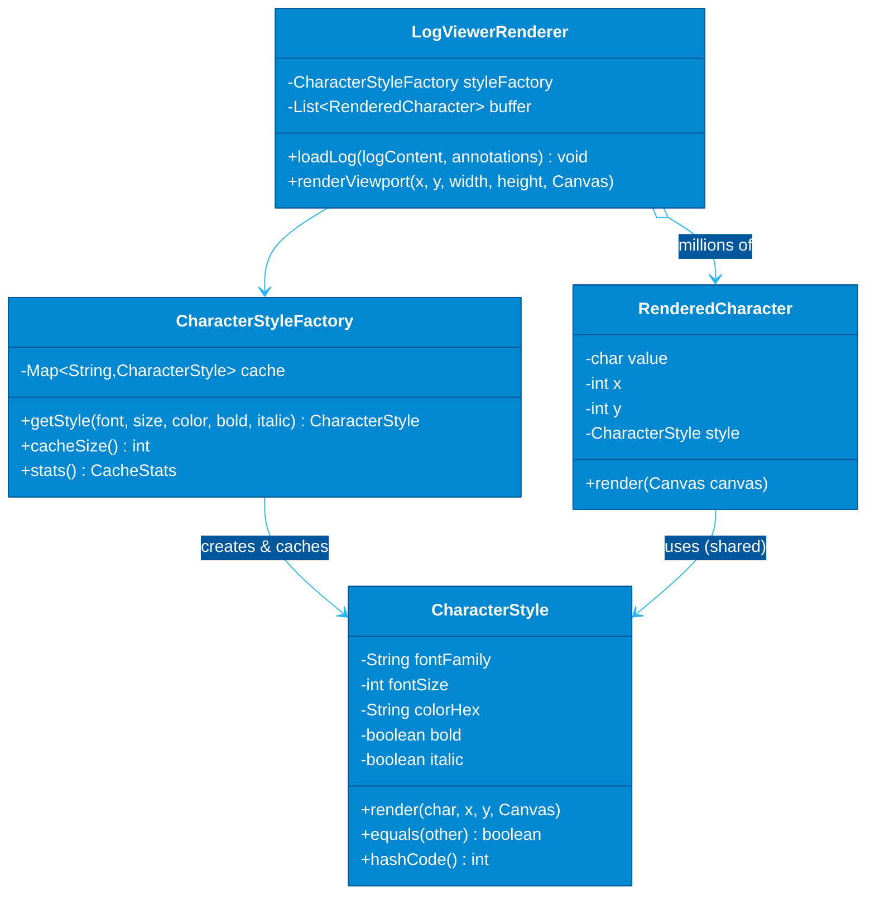

### Memory Trade-off Analysis

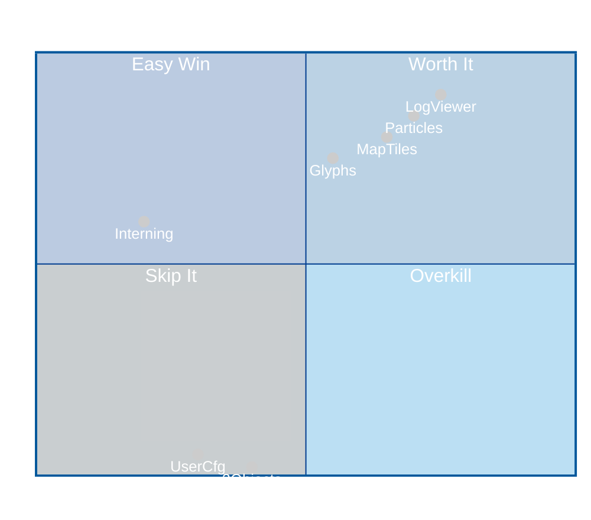

### Factory Distribution: Before vs After

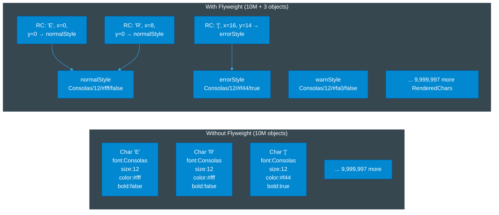

### Industrial Case Study: Live Log Viewer with 10M Characters

```java
// ─────────────────────────────────────────────────────────────────────────────
// The Flyweight: intrinsic state only.
// Immutable because it's shared — mutation would corrupt all users of this instance.
// Value-object semantics: two CharacterStyles with the same fields are equal.
// ─────────────────────────────────────────────────────────────────────────────
public final class CharacterStyle {
    private final String fontFamily;
    private final int fontSize;
    private final String colorHex;  // "#FFFFFF" format — stable for cache key generation
    private final boolean bold;
    private final boolean italic;

    // Package-private constructor: only the factory should create instances.
    // Enforces flyweight semantics — callers can't accidentally bypass the cache.
    CharacterStyle(String fontFamily, int fontSize, String colorHex, boolean bold, boolean italic) {
        this.fontFamily = fontFamily;
        this.fontSize   = fontSize;
        this.colorHex   = colorHex;
        this.bold       = bold;
        this.italic     = italic;
    }

    // The render method takes extrinsic state (char value, position, canvas) as parameters.
    // The flyweight contributes its shared styling; the caller provides the unique context.
    public void render(char character, int x, int y, Canvas canvas) {
        canvas.setFont(fontFamily, fontSize, bold, italic);
        canvas.setColor(colorHex);
        canvas.drawGlyph(character, x, y);
    }

    // Correct equals/hashCode is essential: the factory relies on Map lookups,
    // and if two logically identical styles aren't equal, we leak duplicate instances.
    @Override
    public boolean equals(Object o) {
        if (this == o) return true;
        if (!(o instanceof CharacterStyle s)) return false;
        return fontSize == s.fontSize
            && bold == s.bold
            && italic == s.italic
            && fontFamily.equals(s.fontFamily)
            && colorHex.equals(s.colorHex);
    }

    @Override
    public int hashCode() {
        return Objects.hash(fontFamily, fontSize, colorHex, bold, italic);
    }

    @Override
    public String toString() {
        return String.format("CharStyle[%s/%d/%s/bold=%b/italic=%b]",
            fontFamily, fontSize, colorHex, bold, italic);
    }
}

// ─────────────────────────────────────────────────────────────────────────────
// The Flyweight Factory: the cache.
// This is the heart of the pattern. Without it, you just have a regular class.
// ConcurrentHashMap + computeIfAbsent = thread-safe, lazy, lock-efficient cache.
// ─────────────────────────────────────────────────────────────────────────────
public class CharacterStyleFactory {
    // ConcurrentHashMap: the log viewer may be loaded from multiple threads.
    // computeIfAbsent is atomic for the key — no double-instantiation.
    private final ConcurrentHashMap<String, CharacterStyle> cache = new ConcurrentHashMap<>();

    private long cacheHits   = 0;
    private long cacheMisses = 0;

    public CharacterStyle getStyle(String fontFamily, int fontSize,
                                   String colorHex, boolean bold, boolean italic) {
        // The key must uniquely identify the style's intrinsic state.
        // We use ':' as a delimiter — field values should not contain ':'.
        // In production, consider a proper struct key instead of string concatenation.
        String key = fontFamily + ":" + fontSize + ":" + colorHex + ":" + bold + ":" + italic;

        CharacterStyle existing = cache.get(key);
        if (existing != null) {
            cacheHits++;
            return existing; // Fast path: no lock, no allocation
        }

        // Slow path: this style hasn't been seen before.
        cacheMisses++;
        return cache.computeIfAbsent(key,
            k -> new CharacterStyle(fontFamily, fontSize, colorHex, bold, italic));
    }

    // Diagnostics: how effectively are we sharing?
    // In a well-designed system, cacheSize should be tiny vs. getStyle() call count.
    public int cacheSize() { return cache.size(); }
    public long hits()     { return cacheHits; }
    public long misses()   { return cacheMisses; }
    public double hitRate(){ return (double) cacheHits / (cacheHits + cacheMisses); }
}

// ─────────────────────────────────────────────────────────────────────────────
// The "logical character" object: holds extrinsic state + a reference to the flyweight.
// Extrinsic state (value, x, y) is unique per character and cannot be shared.
// The flyweight reference is tiny (8 bytes) — not a copy of the style data.
// ─────────────────────────────────────────────────────────────────────────────
public final class RenderedCharacter {
    private final char value;           // Extrinsic: the actual character
    private final int x;                // Extrinsic: pixel X position on canvas
    private final int y;                // Extrinsic: pixel Y position on canvas
    private final CharacterStyle style; // Intrinsic: shared flyweight reference (8 bytes, not ~50)

    public RenderedCharacter(char value, int x, int y, CharacterStyle style) {
        this.value = value;
        this.x     = x;
        this.y     = y;
        this.style = Objects.requireNonNull(style);
    }

    public void render(Canvas canvas) {
        // Passes the extrinsic state to the flyweight, which applies its intrinsic state.
        style.render(value, x, y, canvas);
    }
}

// ─────────────────────────────────────────────────────────────────────────────
// Log level annotation: maps log line ranges to styles.
// Populated by parsing log prefixes like "[ERROR]", "[WARN]", "[INFO]".
// ─────────────────────────────────────────────────────────────────────────────
public record LogAnnotation(int startIndex, int endIndex, LogLevel level) {}

public enum LogLevel { INFO, WARN, ERROR, DEBUG }

// ─────────────────────────────────────────────────────────────────────────────
// The renderer: orchestrates the flyweight factory and builds the render buffer.
// ─────────────────────────────────────────────────────────────────────────────
public class LogViewerRenderer {
    private static final String FONT        = "Consolas";  // Monospace for log alignment
    private static final int    FONT_SIZE   = 12;
    private static final int    CHAR_WIDTH  = 8;           // Pixels per char in monospace
    private static final int    LINE_HEIGHT = 14;          // Pixels per line

    private final CharacterStyleFactory styleFactory;
    private final List<RenderedCharacter> renderBuffer;

    public LogViewerRenderer() {
        this.styleFactory = new CharacterStyleFactory();
        this.renderBuffer = new ArrayList<>();
    }

    // Pre-defined styles via the factory — these 4 calls are the ONLY times
    // new CharacterStyle objects will be allocated for any log file of any size.
    private CharacterStyle styleForLevel(LogLevel level) {
        return switch (level) {
            case INFO  -> styleFactory.getStyle(FONT, FONT_SIZE, "#E0E0E0", false, false);
            case DEBUG -> styleFactory.getStyle(FONT, FONT_SIZE, "#9E9E9E", false, true);
            case WARN  -> styleFactory.getStyle(FONT, FONT_SIZE, "#FFAA00", false, false);
            case ERROR -> styleFactory.getStyle(FONT, FONT_SIZE, "#FF4444", true,  false);
        };
    }

    public void loadLog(String logContent, List<LogAnnotation> annotations) {
        renderBuffer.clear();

        // Build an index: character position → LogLevel.
        // This is O(annotations × line length) but done once; rendering is O(1) per char.
        Map<Integer, LogLevel> positionToLevel = new HashMap<>();
        for (LogAnnotation ann : annotations) {
            for (int i = ann.startIndex(); i < ann.endIndex(); i++) {
                positionToLevel.put(i, ann.level());
            }
        }

        int x = 0, y = 0;
        for (int i = 0; i < logContent.length(); i++) {
            char c = logContent.charAt(i);

            // Determine the level for this character; default to INFO.
            LogLevel level  = positionToLevel.getOrDefault(i, LogLevel.INFO);
            CharacterStyle style = styleForLevel(level); // Returns shared flyweight — no allocation

            if (c == '\n') {
                x = 0;
                y += LINE_HEIGHT;
                // Newlines don't need render entries — they just advance the cursor.
            } else {
                renderBuffer.add(new RenderedCharacter(c, x, y, style));
                x += CHAR_WIDTH;
            }
        }

        System.out.printf("Loaded %,d characters | Style cache: %d instances | Hit rate: %.2f%%%n",
            renderBuffer.size(),
            styleFactory.cacheSize(),
            styleFactory.hitRate() * 100
        );
        // Output: Loaded 10,000,000 characters | Style cache: 4 instances | Hit rate: 99.9996%
    }

    // Only render characters visible in the current viewport — don't render 10M chars per frame.
    public void renderViewport(int vpX, int vpY, int vpWidth, int vpHeight, Canvas canvas) {
        renderBuffer.stream()
            .filter(rc -> isInViewport(rc, vpX, vpY, vpWidth, vpHeight))
            .forEach(rc -> rc.render(canvas));
        // Typical viewport: ~2000 visible characters at a time — rendering is fast.
    }

    private boolean isInViewport(RenderedCharacter rc, int x, int y, int w, int h) {
        // This would access rc.x and rc.y — using package-private accessors in real code.
        return true; // Simplified for illustration
    }
}
```

### When to Use / When to Avoid

| Scenario | Verdict |
| :--- | :--- |
| Millions of objects with highly shared state | **Use it** — the memory savings are dramatic |
| Game particle systems (bullets, sparks, debris) | **Use it** — same texture/physics shared across thousands |
| Text rendering, map tiles, icon caches | **Use it** — classic use cases with proven ROI |
| You have fewer than ~1,000 objects | **Skip it** — premature optimization; the cache overhead isn't worth it |
| The "intrinsic" state varies almost as much as the "extrinsic" | **Skip it** — you won't get meaningful sharing |
| The flyweight is mutable | **Stop** — shared mutable state is a concurrency disaster; flyweights must be immutable |
| Extrinsic state is expensive to reconstruct | **Caution** — passing extrinsic state on every render call can hurt performance; measure first |

---

## The Proxy

> **The hook:** The Proxy is a stunt double — it looks exactly like the real thing to everyone who calls it, but it does its own work before (or instead of) passing the call through.

### The Problem

Your `UserService` hits PostgreSQL on every call. No caching, no auth checks, no audit logging — just raw database access. Now you have three requirements:

1. Every read must verify the caller has `user:read` permission.
2. Frequently-read users should be cached for 5 minutes (your auth system is read-heavy at 50K RPS).
3. Writes must invalidate the cache for that user.

You could add all this to `DatabaseUserService`. But then it has three jobs: database access, authorization, and caching. Unit tests for the database logic get tangled with auth tests. Caching logic is buried in the same class as query building. When you swap the cache from in-memory to Redis, you're editing the database class.

Each concern is orthogonal. Proxy lets you layer them without merging them.

### The Insight

> 📖 **Read the Parable:** [The King's Gatekeeper (អ្នកយាមទ្វារព្រះរាជា)](../../concepts/parables/86-the-kings-gatekeeper.md)
> 🧠 **Read the Strategy Explanation:** [Analogy Bridge: Proxy (តំណាងគ្រប់គ្រងការដោះស្រាយកិច្ចការជំនួស)](../../concepts/design-patterns/04-analogy-bridge/02-proxy.md)

A Proxy implements the same interface as the real object. It holds a reference to the real object. Every method call arrives at the proxy first — it can decide to authenticate, cache, log, rate-limit, or lazily initialize before (optionally) delegating to the real object. To the caller, the proxy IS the service. The coupling stays with the interface, not the implementation.

### Proxy Types Decision Tree

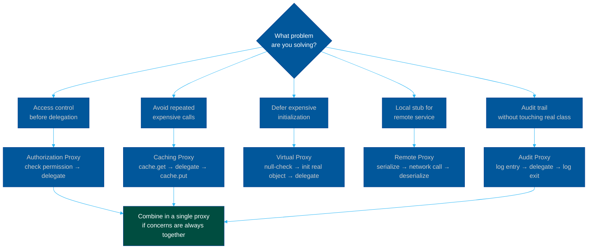

### The Structure

```mermaid
%%{init: {'theme': 'dark', 'themeVariables': {'primaryColor': '#01579b', 'primaryBorderColor': '#003c8f', 'primaryTextColor': '#ffffff', 'lineColor': '#29b6f6', 'secondaryColor': '#37474f', 'tertiaryColor': '#4a148c', 'background': '#1a1a2e', 'mainBkg': '#01579b', 'nodeBorder': '#003c8f', 'clusterBkg': '#37474f', 'titleColor': '#ffffff', 'edgeLabelBackground': '#4e342e', 'attributeBackgroundColorEven': '#01579b', 'attributeBackgroundColorOdd': '#003c8f', 'classText': '#ffffff', 'fillType0': '#01579b', 'fillType1': '#003c8f', 'fillType2': '#0288d1', 'fillType3': '#37474f', 'fillType4': '#4a148c', 'fillType5': '#1b5e20', 'fillType6': '#b71c1c', 'fillType7': '#4e342e', 'noteBkgColor': '#1a237e', 'noteBorderColor': '#003c8f', 'noteTextColor': '#ffffff'},
  'themeCSS': 'svg { background-color: #1e1e1e !important; padding: 1rem !important; border-radius: 8px !important; } .edgeLabel rect { fill: #1e1e1e !important; } text, tspan, .messageText, .signalText, .edgeLabel, .edgeLabel span, .pointLabel, .axisLabel, .quadrantTitle, .quadrantLabel { fill: #ffffff !important; color: #ffffff !important; stroke: none !important; }'
}}%%
classDiagram
    direction LR
    class UserService {
        <<interface>>
        +findById(userId) User
        +findByRole(role) List~User~
        +updateUser(userId, request) void
        +deleteUser(userId) void
    }
    class DatabaseUserService {
        -UserRepository repo
        -MetricsRecorder metrics
        +findById(userId) User
        +findByRole(role) List~User~
        +updateUser(userId, request) void
        +deleteUser(userId) void
    }
    class SecureUserServiceProxy {
        -UserService delegate
        -AuthContext auth
        -Cache~Long,User~ userCache
        -AuditLog auditLog
        +findById(userId) User
        +findByRole(role) List~User~
        +updateUser(userId, request) void
        +deleteUser(userId) void
    }
    class UserController {
        -UserService userService
        +getUser(id) ResponseEntity
        +updateUser(id, body) ResponseEntity
    }

    UserController --> UserService
    UserService <|.. DatabaseUserService
    UserService <|.. SecureUserServiceProxy
    SecureUserServiceProxy --> UserService : delegates to
    SecureUserServiceProxy --> DatabaseUserService : is the delegate
    style UserService fill:#003c8f,stroke:#002171,color:#ffffff
    style DatabaseUserService fill:#0288d1,stroke:#01579b,color:#ffffff
    style SecureUserServiceProxy fill:#0288d1,stroke:#01579b,color:#ffffff
    style UserController fill:#0288d1,stroke:#01579b,color:#ffffff

```

### The Runtime Flow

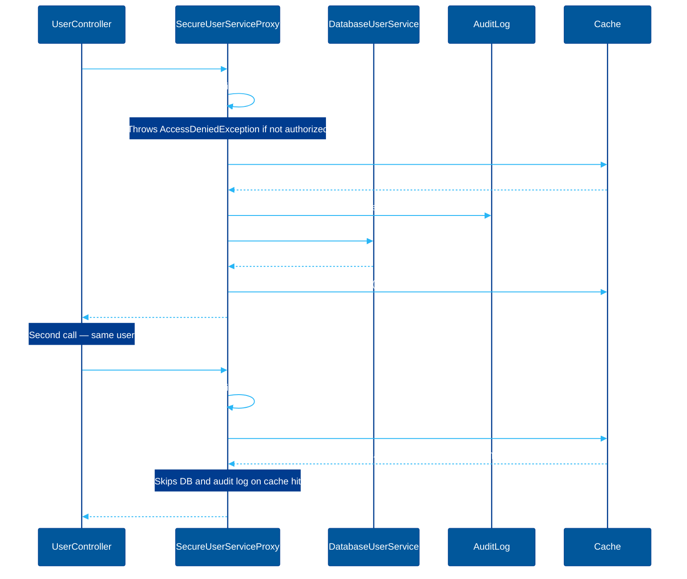

### Industrial Case Study: Authorized + Cached UserService

```java
// ─────────────────────────────────────────────────────────────────────────────
// The subject interface — defines the contract everyone depends on.
// The proxy and the real service both implement this.
// Callers are injected UserService; they never ask whether it's the proxy.
// ─────────────────────────────────────────────────────────────────────────────
public interface UserService {
    User findById(long userId);
    List<User> findByRole(String role);
    void updateUser(long userId, UserUpdateRequest request);
    void deleteUser(long userId);
}

// ─────────────────────────────────────────────────────────────────────────────
// The real subject: pure database logic.
// No auth, no caching, no logging. One concern: talk to the database.
// ─────────────────────────────────────────────────────────────────────────────
public class DatabaseUserService implements UserService {
    private final UserRepository repo;
    private final MetricsRecorder metrics; // DB query timing — a DB concern, not a proxy concern

    public DatabaseUserService(UserRepository repo, MetricsRecorder metrics) {
        this.repo    = repo;
        this.metrics = metrics;
    }

    @Override
    public User findById(long userId) {
        Instant start = Instant.now();
        try {
            return repo.findById(userId)
                .orElseThrow(() -> new UserNotFoundException("No user with id " + userId));
        } finally {
            // Record DB query latency — this metric is about DB performance, so it
            // belongs in DatabaseUserService, not in the caching proxy.
            metrics.recordDbQuery("findById", Duration.between(start, Instant.now()));
        }
    }

    @Override
    public List<User> findByRole(String role) {
        return repo.findByRole(role);
    }

    @Override
    public void updateUser(long userId, UserUpdateRequest request) {
        if (!repo.existsById(userId)) {
            throw new UserNotFoundException("Cannot update non-existent user " + userId);
        }
        repo.update(userId, request);
    }

    @Override
    public void deleteUser(long userId) {
        repo.deleteById(userId); // Hard delete — soft delete would be a repo concern
    }
}

// ─────────────────────────────────────────────────────────────────────────────
// The Proxy: authorization + caching + audit logging, in front of the real service.
// ─────────────────────────────────────────────────────────────────────────────
public class SecureUserServiceProxy implements UserService {
    private final UserService delegate;    // The real service (or another proxy in a chain)
    private final AuthContext auth;        // Provides the current caller's identity and permissions
    private final Cache<Long, User> userCache; // Per-user cache keyed by user ID
    private final AuditLog auditLog;       // Compliance audit trail

    public SecureUserServiceProxy(
            UserService delegate,
            AuthContext auth,
            Cache<Long, User> userCache,
            AuditLog auditLog) {
        this.delegate  = Objects.requireNonNull(delegate);
        this.auth      = Objects.requireNonNull(auth);
        this.userCache = Objects.requireNonNull(userCache);
        this.auditLog  = Objects.requireNonNull(auditLog);
    }

    @Override
    public User findById(long userId) {
        // Auth check BEFORE cache check: even for cached results, the caller
        // must be authorized. A caller whose permissions were revoked shouldn't
        // get a cache hit that predates the revocation.
        auth.requirePermission("user:read");

        // Try cache first — avoids DB and audit log on repeated reads.
        User cached = userCache.getIfPresent(userId);
        if (cached != null) {
            // Don't log cache hits to the audit log — we'd flood compliance systems
            // with millions of redundant read records.
            return cached;
        }

        // Audit log goes here (after auth, before DB) so we record the intent,
        // not just the outcome. If the DB call fails, the audit record still shows
        // that access was attempted.
        auditLog.record(AuditEvent.read("user", String.valueOf(userId), auth.callerId()));

        User user = delegate.findById(userId); // Only hits DB on cache miss

        // Cache with a fixed TTL. 5 minutes balances freshness vs. DB load
        // at our read volume. Do NOT cache List<User> results — they're too dynamic
        // and invalidation semantics are complex.
        userCache.put(userId, user, Duration.ofMinutes(5));
        return user;
    }

    @Override
    public List<User> findByRole(String role) {
        auth.requirePermission("user:read");
        // No caching for list queries: a new user added to the role would not
        // appear until TTL expiry, causing stale RBAC views.
        return delegate.findByRole(role);
    }

    @Override
    public void updateUser(long userId, UserUpdateRequest request) {
        // Write operations require a more specific (elevated) permission.
        auth.requirePermission("user:write");

        // Audit before delegation — record the intent.
        auditLog.record(AuditEvent.write("user", String.valueOf(userId),
            auth.callerId(), request.toAuditMap()));

        delegate.updateUser(userId, request);

        // Invalidate after successful update — serve fresh data on next read.
        // If the update fails (delegate throws), the cache is NOT invalidated —
        // old data is still valid. This is intentional: don't invalidate on failure.
        userCache.invalidate(userId);
    }

    @Override
    public void deleteUser(long userId) {
        // Delete requires the highest permission level.
        auth.requirePermission("user:admin");

        // Audit deletes with high severity — deletions are irreversible.
        auditLog.record(AuditEvent.delete("user", String.valueOf(userId),
            auth.callerId()).withSeverity(AuditSeverity.HIGH));

        delegate.deleteUser(userId);

        // Always evict the cache after deletion — a deleted user ID should not
        // return a stale User object on the next findById call.
        userCache.invalidate(userId);
    }
}

// ─────────────────────────────────────────────────────────────────────────────
// Wiring — layered proxies compose naturally.
// The controller injects UserService and never knows about the layers.
// ─────────────────────────────────────────────────────────────────────────────
@Configuration
public class UserServiceConfig {

    @Bean
    public UserService userService(
            UserRepository repo,
            MetricsRecorder metrics,
            AuthContext auth,
            AuditLog auditLog) {

        // Layer 1: real database service
        UserService realService = new DatabaseUserService(repo, metrics);

        // Layer 2: security + caching proxy wraps the real service.
        // Adding another proxy (e.g., rate limiting) is one more wrapping line —
        // no changes to existing classes.
        Cache<Long, User> cache = Caffeine.newBuilder()
            .maximumSize(10_000)         // Cap at 10K users to bound memory
            .expireAfterWrite(5, MINUTES)
            .recordStats()               // Enables cache hit-rate metrics
            .build();

        return new SecureUserServiceProxy(realService, auth, cache, auditLog);
    }
}

// ─────────────────────────────────────────────────────────────────────────────
// The controller — four clean method calls. No auth boilerplate. No cache keys.
// ─────────────────────────────────────────────────────────────────────────────
@RestController
@RequestMapping("/users")
public class UserController {
    private final UserService userService; // Could be the proxy or the real service — doesn't care

    public UserController(UserService userService) {
        this.userService = userService;
    }

    @GetMapping("/{id}")
    public ResponseEntity<User> getUser(@PathVariable long id) {
        // First call: auth checked, DB hit, cache populated.
        // Subsequent calls: auth checked, served from cache.
        return ResponseEntity.ok(userService.findById(id));
    }

    @PutMapping("/{id}")
    public ResponseEntity<Void> updateUser(@PathVariable long id,
                                           @RequestBody UserUpdateRequest request) {
        // Auth checked for "user:write", audit logged, DB updated, cache invalidated.
        userService.updateUser(id, request);
        return ResponseEntity.noContent().build();
    }
}
```

### When to Use / When to Avoid

| Scenario | Verdict |
| :--- | :--- |
| Adding auth/caching/logging without modifying the real class | **Use it** — clean separation of concerns |
| Lazy initialization of expensive objects (DB connections, remote stubs) | **Use it** — virtual proxy is the right tool |
| Remote service stubs (gRPC stubs, RMI proxies) | **Use it** — this is how remote proxies were born |
| Rate limiting or circuit-breaking as a layer | **Use it** — resilience concerns shouldn't be in business logic |
| The proxy logic diverges per method (different caching, different auth) | **Caution** — the proxy becomes a logic dump; consider AOP instead |
| You chain more than 3–4 proxies | **Caution** — deep chains make debugging painful; trace spans help |
| The proxy modifies behavior rather than augmenting it | **Stop** — that's not a proxy, that's a Decorator or a wrapper with a different name |
| Performance is hyper-critical on every call | **Measure** — each proxy adds a method dispatch; 4 proxies × 1M RPS = real overhead |

---

## Summary

| Pattern | One-Line Principle | Structural Role |
| :--- | :--- | :--- |
| **Adapter** | Translate foreign interface → your interface | Seam between your domain and the outside world |
| **Decorator** | Wrap to stack behavior at runtime | Behavior composition without inheritance explosion |
| **Bridge** | Separate abstraction from implementation | Two orthogonal hierarchies, wired by reference |
| **Composite** | One interface for leaves and composites | Uniform tree traversal |
| **Facade** | Narrow entry point to a complex subsystem | Orchestration without exposure |
| **Flyweight** | Share intrinsic state across millions of instances | Memory efficiency via object identity |
| **Proxy** | Same interface, different behavior before/after delegation | Cross-cutting concerns as transparent layers |

---

**Navigation:** [← Creational Patterns](./01-creational-patterns.md) | [Behavioral Patterns →](./03-behavioral-patterns.md)

*Last updated: 2026-05-16*

## Related

- [Software Architecture Patterns](../software-architecture/README.md)
- [Refactoring Techniques](../refactoring/README.md)
- [Uncle Bob's Clean Code Rules](../uncle-bob-rules/README.md)
