---

## 📌 Table of Contents
- [Patterns in This Section](#patterns-in-this-section)
- [1. Chain of Responsibility](#1-chain-of-responsibility)
  - [The Hook](#the-hook-10)
  - [The Problem](#the-problem-10)
  - [The Insight](#the-insight-10)
  - [The Structure](#the-structure-10)
  - [The Runtime Flow](#the-runtime-flow-4)
  - [Industrial Case Study: HTTP Middleware Pipeline](#industrial-case-study-http-middleware-pipeline)
  - [When to Use / When to Avoid](#when-to-use-when-to-avoid-10)
- [2. Iterator](#2-iterator)
  - [The Hook](#the-hook-10)
  - [The Problem](#the-problem-10)
  - [The Insight](#the-insight-10)
  - [The Structure](#the-structure-10)
  - [Cursor State Machine](#cursor-state-machine)
  - [Industrial Case Study: Paginated API Result Iterator](#industrial-case-study-paginated-api-result-iterator)
  - [When to Use / When to Avoid](#when-to-use-when-to-avoid-10)
- [3. Strategy](#3-strategy)
  - [The Hook](#the-hook-10)
  - [The Problem](#the-problem-10)
  - [The Insight](#the-insight-10)
  - [The Structure](#the-structure-10)
  - [Strategy Selection Flow](#strategy-selection-flow)
  - [Trade-off Analysis](#trade-off-analysis)
  - [Industrial Case Study: E-Commerce Discount Engine](#industrial-case-study-e-commerce-discount-engine)
  - [When to Use / When to Avoid](#when-to-use-when-to-avoid-10)
- [4. Mediator](#4-mediator)
  - [The Hook](#the-hook-10)
  - [The Problem](#the-problem-10)
  - [The Insight](#the-insight-10)
  - [The Structure](#the-structure-10)
  - [The Runtime Flow](#the-runtime-flow-4)
  - [Industrial Case Study: Real-Time Chat Room](#industrial-case-study-real-time-chat-room)
  - [When to Use / When to Avoid](#when-to-use-when-to-avoid-10)
- [5. Memento](#5-memento)
  - [The Hook](#the-hook-10)
  - [The Problem](#the-problem-10)
  - [The Insight](#the-insight-10)
  - [The Structure](#the-structure-10)
  - [The Runtime Flow](#the-runtime-flow-4)
  - [Industrial Case Study: Document Editor with Undo/Redo](#industrial-case-study-document-editor-with-undoredo)
  - [When to Use / When to Avoid](#when-to-use-when-to-avoid-10)
- [6. Observer](#6-observer)
  - [The Hook](#the-hook-10)
  - [The Problem](#the-problem-10)
  - [The Insight](#the-insight-10)
  - [The Structure](#the-structure-10)
  - [Observer Use Cases](#observer-use-cases)
  - [The Runtime Flow](#the-runtime-flow-4)
  - [Industrial Case Study: Real-Time Stock Price Feed](#industrial-case-study-real-time-stock-price-feed)
  - [When to Use / When to Avoid](#when-to-use-when-to-avoid-10)
- [7. Command](#7-command)
  - [The Hook](#the-hook-10)
  - [The Problem](#the-problem-10)
  - [The Insight](#the-insight-10)
  - [The Structure](#the-structure-10)
  - [Command Use Cases](#command-use-cases)
  - [The Runtime Flow](#the-runtime-flow-4)
  - [Industrial Case Study: Smart Home Automation with Undo](#industrial-case-study-smart-home-automation-with-undo)
  - [When to Use / When to Avoid](#when-to-use-when-to-avoid-10)
- [8. State](#8-state)
  - [The Hook](#the-hook-10)
  - [The Problem](#the-problem-10)
  - [The Insight](#the-insight-10)
  - [The Structure](#the-structure-10)
  - [Order Lifecycle State Machine](#order-lifecycle-state-machine)
  - [Industrial Case Study: E-Commerce Order Lifecycle](#industrial-case-study-e-commerce-order-lifecycle)
  - [When to Use / When to Avoid](#when-to-use-when-to-avoid-10)
- [9. Template Method](#9-template-method)
  - [The Hook](#the-hook-10)
  - [The Problem](#the-problem-10)
  - [The Insight](#the-insight-10)
  - [The Structure](#the-structure-10)
  - [Algorithm Flow](#algorithm-flow)
  - [Industrial Case Study: Multi-Format Data Import Pipeline](#industrial-case-study-multi-format-data-import-pipeline)
  - [When to Use / When to Avoid](#when-to-use-when-to-avoid-10)
- [10. Visitor](#10-visitor)
  - [The Hook](#the-hook-10)
  - [The Problem](#the-problem-10)
  - [The Insight](#the-insight-10)
  - [The Structure](#the-structure-10)
  - [Industrial Case Study: Document Export Engine](#industrial-case-study-document-export-engine)
  - [When to Use / When to Avoid](#when-to-use-when-to-avoid-10)
- [11. Interpreter](#11-interpreter)
  - [The Hook](#the-hook-10)
  - [The Problem](#the-problem-10)
  - [The Insight](#the-insight-10)
  - [The Structure](#the-structure-10)
  - [Industrial Case Study: Search Filter DSL](#industrial-case-study-search-filter-dsl)
  - [When to Use / When to Avoid](#when-to-use-when-to-avoid-10)
- [Summary](#summary)

---
title: "Behavioral Design Patterns: The Logic of Interaction"
author: "ichamrong"
date: "2026-05-16"
tags: ["design-patterns", "behavioral", "gof", "java", "software-engineering"]
series: "Design Patterns"
part: 3
readTime: "~35 min"
---

# Behavioral Patterns: The Logic of Interaction

**Part of:** [Design Patterns Series](./README.md)
**Tags:** #design-patterns #behavioral #gof #java
**Read Time:** ~35 min

> Behavioral patterns are the contracts that govern how objects talk to each other, delegate responsibility, and change their mind at runtime. They are not about what objects *are* — that is structural. They are about what objects *do*, and *when*, and *why*.

---

## Patterns in This Section

| Pattern | Problem It Solves | Real-World Analogy |
| :--- | :--- | :--- |
| [Chain of Responsibility](#1-chain-of-responsibility) | Pass a request through a sequence of handlers | Airport security checkpoints |
| [Iterator](#2-iterator) | Traverse a collection without knowing its structure | Reading a book page by page |
| [Strategy](#3-strategy) | Swap algorithms at runtime | Choosing a shipping carrier at checkout |
| [Mediator](#4-mediator) | Centralize object communication | Air traffic control tower |
| [Memento](#5-memento) | Save and restore object state | Ctrl+Z undo |
| [Observer](#6-observer) | Notify many objects on state change | Newsletter subscription |
| [Command](#7-command) | Encapsulate a request as an object | A restaurant order ticket |
| [State](#cursor-state-machine) | Change behavior based on internal state | An order moving through a warehouse |
| [Template Method](#9-template-method) | Define algorithm skeleton, let subclasses fill it | Standardized tax forms with custom sections |
| [Visitor](#10-visitor) | Add operations without modifying classes | A tax auditor examining different accounts |
| [Interpreter](#11-interpreter) | Parse and evaluate a language or expression | A search engine parsing `category:java AND level:senior` |

---

## 1. Chain of Responsibility

> **You do not need to know who will handle your request. You only need to know who to ask first.**

### The Hook

**A pipeline of handlers where each link in the chain either handles the request or passes it forward — and the sender never needs to know which one fires.**

### The Problem

Imagine you are building an API server. Every incoming HTTP request must pass through: a rate limiter, an authentication check, a logging layer, and finally the business logic. Your first instinct is to put it all in one method:

```java
// The nightmare you want to avoid
public HttpResponse handle(HttpRequest req) {
    if (isRateLimited(req)) return tooManyRequests();
    if (!isAuthenticated(req)) return unauthorized();
    log(req);
    return routeToHandler(req);  // Finally the actual work
}
```

Now multiply that by 50 endpoints. Then add CORS. Then add a maintenance-mode check. Then add request tracing. You will end up editing this method every single week — and every change is a landmine. You cannot reorder checks, you cannot test them in isolation, and adding a new step means touching code that already works.

### The Insight

> 📖 **Read the Parable:** [The Customer Service Hotline (ខ្សែទូរស័ព្ទបម្រើអតិថិជន)](../../concepts/parables/87-the-customer-service-hotline.md)
> 🧠 **Read the Strategy Explanation:** [Storyteller Strategy: Chain of Responsibility (ខ្សែសង្វាក់នៃការទទួលខុសត្រូវ)](../../concepts/design-patterns/07-storyteller-narrative-arc/02-chain-of-responsibility.md)

The mental shift is this: **stop thinking about who handles the request, and start thinking about who handles it *first*.**

Each handler is a node that asks one question: "Is this mine to deal with?" If yes, it acts. If no, it passes the request to its successor. The chain is assembled once at startup; the handlers never meet each other. You can reorder, add, or remove handlers without touching anything else.

### The Structure

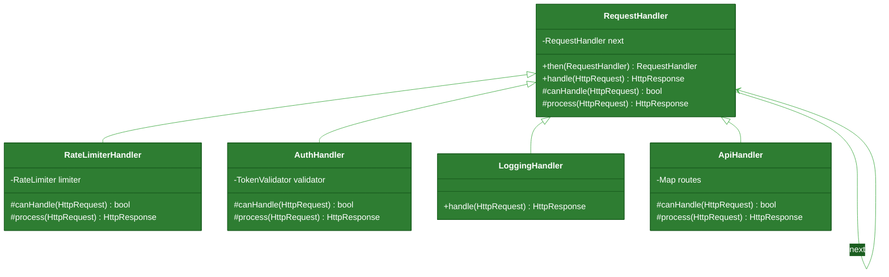
```mermaid
%%{init: {'theme': 'dark', 'themeVariables': {'primaryColor': '#1b5e20', 'primaryBorderColor': '#003300', 'primaryTextColor': '#ffffff', 'lineColor': '#4caf50', 'secondaryColor': '#37474f', 'tertiaryColor': '#4a148c', 'background': '#1a1a2e', 'mainBkg': '#1b5e20', 'nodeBorder': '#003300', 'clusterBkg': '#37474f', 'titleColor': '#ffffff', 'edgeLabelBackground': '#004d40', 'attributeBackgroundColorEven': '#1b5e20', 'attributeBackgroundColorOdd': '#003300', 'classText': '#ffffff', 'fillType0': '#1b5e20', 'fillType1': '#003300', 'fillType2': '#2e7d32', 'fillType3': '#37474f', 'fillType4': '#4a148c', 'fillType5': '#2e7d32', 'fillType6': '#b71c1c', 'fillType7': '#004d40', 'noteBkgColor': '#004d40', 'noteBorderColor': '#003300', 'noteTextColor': '#ffffff'},
  'themeCSS': 'svg { background-color: #1e1e1e !important; padding: 1rem !important; border-radius: 8px !important; } .edgeLabel rect { fill: #1e1e1e !important; } text, tspan, .messageText, .signalText, .edgeLabel, .edgeLabel span, .pointLabel, .axisLabel, .quadrantTitle, .quadrantLabel { fill: #ffffff !important; color: #ffffff !important; stroke: none !important; }'
}}%%
classDiagram
    class RequestHandler {
        -RequestHandler next
        +then(RequestHandler) RequestHandler
        +handle(HttpRequest) HttpResponse
        #canHandle(HttpRequest) bool
        #process(HttpRequest) HttpResponse
    }

    class RateLimiterHandler {
        -RateLimiter limiter
        #canHandle(HttpRequest) bool
        #process(HttpRequest) HttpResponse
    }

    class AuthHandler {
        -TokenValidator validator
        #canHandle(HttpRequest) bool
        #process(HttpRequest) HttpResponse
    }

    class LoggingHandler {
        +handle(HttpRequest) HttpResponse
    }

    class ApiHandler {
        -Map routes
        #canHandle(HttpRequest) bool
        #process(HttpRequest) HttpResponse
    }

    RequestHandler <|-- RateLimiterHandler
    RequestHandler <|-- AuthHandler
    RequestHandler <|-- LoggingHandler
    RequestHandler <|-- ApiHandler
    RequestHandler --> RequestHandler : next
    style RequestHandler fill:#2e7d32,stroke:#1b5e20,color:#ffffff
    style RateLimiterHandler fill:#2e7d32,stroke:#1b5e20,color:#ffffff
    style AuthHandler fill:#2e7d32,stroke:#1b5e20,color:#ffffff
    style LoggingHandler fill:#2e7d32,stroke:#1b5e20,color:#ffffff
    style ApiHandler fill:#2e7d32,stroke:#1b5e20,color:#ffffff

```

### The Runtime Flow

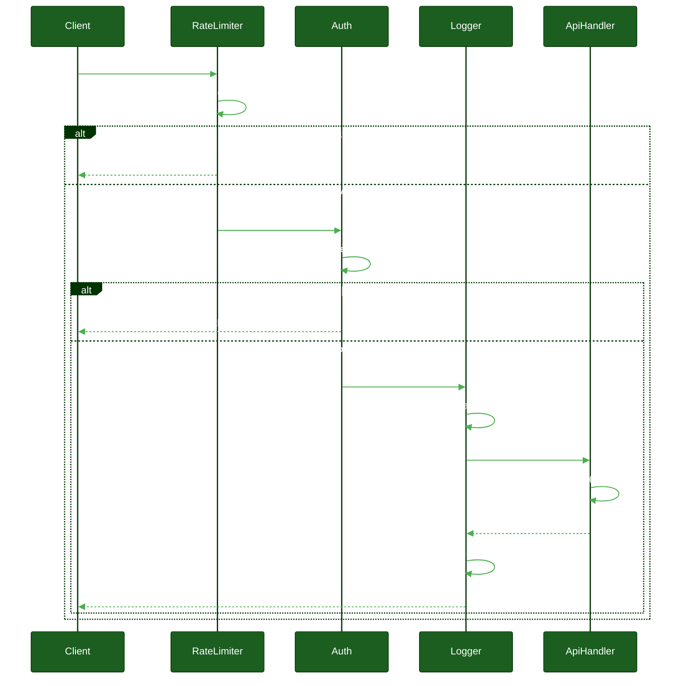
```mermaid
%%{init: {'theme': 'dark', 'themeVariables': {'actorBkg': '#1b5e20', 'actorBorder': '#003300', 'actorTextColor': '#ffffff', 'actorLineColor': '#003300', 'signalColor': '#4caf50', 'signalTextColor': '#ffffff', 'labelBoxBkgColor': '#003300', 'labelBoxBorderColor': '#003300', 'labelTextColor': '#ffffff', 'loopTextColor': '#ffffff', 'noteBkgColor': '#003300', 'noteBorderColor': '#003300', 'noteTextColor': '#ffffff', 'activationBkgColor': '#2e7d32', 'activationBorderColor': '#003300', 'sequenceNumberColor': '#ffffff',
    'background': '#1e1e1e'},
  'themeCSS': 'svg { background-color: #1e1e1e !important; padding: 1rem !important; border-radius: 8px !important; } .edgeLabel rect { fill: #1e1e1e !important; } text, tspan, .messageText, .signalText, .edgeLabel, .edgeLabel span, .pointLabel, .axisLabel, .quadrantTitle, .quadrantLabel { fill: #ffffff !important; color: #ffffff !important; stroke: none !important; }'
}}%%
sequenceDiagram
    participant Client
    participant RateLimiter
    participant Auth
    participant Logger
    participant ApiHandler

    Client->>RateLimiter: handle(request)
    RateLimiter->>RateLimiter: isAllowed(clientIp)?

    alt Rate limit exceeded
        RateLimiter-->>Client: 429 Too Many Requests
    else Allowed
        RateLimiter->>Auth: handle(request)
        Auth->>Auth: validateToken(header)?

        alt Token invalid
            Auth-->>Client: 401 Unauthorized
        else Token valid
            Auth->>Logger: handle(request)
            Logger->>Logger: log(method, path, timestamp)
            Logger->>ApiHandler: handle(request)
            ApiHandler->>ApiHandler: route(path)
            ApiHandler-->>Logger: 200 OK
            Logger->>Logger: log(status, duration)
            Logger-->>Client: 200 OK
        end
    end
```

### Industrial Case Study: HTTP Middleware Pipeline

An API server processes every request through: rate limiter → authentication → logging → business handler. Each concern is isolated, independently testable, and reorderable.

```java
// The abstract handler — defines the chain mechanics.
// Using Template Method internally: handle() is the skeleton,
// canHandle() and process() are the customization points.
public abstract class RequestHandler {
    private RequestHandler next;

    // Returns 'next' so callers can chain: a.then(b).then(c)
    public RequestHandler then(RequestHandler next) {
        this.next = next;
        return next;
    }

    // Final: subclasses cannot break the chain protocol
    public final HttpResponse handle(HttpRequest request) {
        if (canHandle(request)) {
            // This handler owns the request — act on it
            return process(request);
        }
        if (next != null) {
            // Pass along the chain — we are not responsible
            return next.handle(request);
        }
        // End of chain with no handler — nothing matched
        return HttpResponse.notFound();
    }

    // Subclass answers: "Should I intercept this request?"
    protected abstract boolean canHandle(HttpRequest request);

    // Subclass answers: "What do I do when I intercept it?"
    protected abstract HttpResponse process(HttpRequest request);
}

// Handler 1: Rate limiter — short-circuits the chain on abuse
public class RateLimiterHandler extends RequestHandler {
    private final RateLimiter limiter;

    public RateLimiterHandler(RateLimiter limiter) {
        this.limiter = limiter;
    }

    @Override
    protected boolean canHandle(HttpRequest request) {
        // We "handle" it only when the rate is exceeded —
        // meaning we terminate the request with a 429
        return !limiter.isAllowed(request.getClientIp());
    }

    @Override
    protected HttpResponse process(HttpRequest request) {
        return HttpResponse.tooManyRequests("Rate limit exceeded. Retry after 60s.");
    }
}

// Handler 2: Authentication — rejects unauthenticated requests
public class AuthHandler extends RequestHandler {
    private final TokenValidator validator;

    public AuthHandler(TokenValidator validator) {
        this.validator = validator;
    }

    @Override
    protected boolean canHandle(HttpRequest request) {
        String token = request.getHeader("Authorization");
        // Intercept (handle) when token is missing or invalid
        return token == null || !validator.isValid(token);
    }

    @Override
    protected HttpResponse process(HttpRequest request) {
        return HttpResponse.unauthorized("Invalid or missing Bearer token.");
    }
}

// Handler 3: Logging — never short-circuits, but wraps the chain
// It breaks the template method abstraction intentionally:
// we need to log BOTH before AND after the rest of the chain runs.
public class LoggingHandler extends RequestHandler {

    @Override
    protected boolean canHandle(HttpRequest request) {
        return false; // Never intercept — always pass through
    }

    @Override
    protected HttpResponse process(HttpRequest request) {
        // This is never called — canHandle always returns false
        throw new UnsupportedOperationException("LoggingHandler does not short-circuit");
    }

    @Override
    public final HttpResponse handle(HttpRequest request) {
        long start = System.currentTimeMillis();
        // Log the incoming request before processing
        System.out.printf("[%s] → %s %s from %s%n",
            Instant.now(), request.getMethod(), request.getPath(), request.getClientIp());

        // Proceed with the rest of the chain
        HttpResponse response = super.handle(request);

        // Log the result after the chain has resolved
        System.out.printf("[%s] ← %d (%dms)%n",
            Instant.now(), response.getStatus(), System.currentTimeMillis() - start);

        return response;
    }
}

// Handler 4: The business logic — the final node, always handles
public class ApiHandler extends RequestHandler {
    private final Map<String, Endpoint> routes;

    public ApiHandler(Map<String, Endpoint> routes) {
        this.routes = routes;
    }

    @Override
    protected boolean canHandle(HttpRequest request) {
        return true; // Terminal handler — if we reach here, we own it
    }

    @Override
    protected HttpResponse process(HttpRequest request) {
        Endpoint endpoint = routes.get(request.getPath());
        if (endpoint == null) {
            return HttpResponse.notFound("No route for " + request.getPath());
        }
        return endpoint.handle(request);
    }
}

// --- Wiring: assemble the chain once at application startup ---
public class Application {
    public RequestHandler buildPipeline(
            RateLimiter rateLimiter,
            TokenValidator tokenValidator,
            Map<String, Endpoint> routes) {

        RequestHandler pipeline = new RateLimiterHandler(rateLimiter);

        // then() returns the next handler, enabling fluent chaining
        pipeline.then(new AuthHandler(tokenValidator))
                .then(new LoggingHandler())
                .then(new ApiHandler(routes));

        return pipeline;
    }
}

// --- Usage: every incoming request enters the chain at the head ---
RequestHandler pipeline = app.buildPipeline(rateLimiter, tokenValidator, routes);
HttpResponse response = pipeline.handle(incomingRequest);
```

### When to Use / When to Avoid

| Use It When | Avoid It When |
| :--- | :--- |
| Multiple handlers may process the same request | Exactly one handler always applies — use simple dispatch |
| You need to reorder, add, or remove steps at runtime | The chain is deeply nested and hard to trace in production |
| Each handler is independently testable | You need a guaranteed response — end-of-chain fallthrough is unacceptable |
| Middleware, filter pipelines, event processing | Synchronous performance is critical — each hop adds overhead |

---

## 2. Iterator

> **Give me a cursor, not a collection.**

### The Hook

**The Iterator pattern lets you walk through any data source — an array, a database cursor, a paginated API, a graph — using the same two-method protocol: `hasNext()` and `next()`.**

### The Problem

You are writing a batch job that processes every user in the system. There are 200,000 of them. You query the API, which gives you 100 at a time. Here is what your first draft looks like:

```java
// The mess that grows out of control
int page = 1;
List<User> allUsers = new ArrayList<>();
while (true) {
    ApiPage<User> response = api.getUsers(page, 100);
    allUsers.addAll(response.getItems());
    if (response.getItems().size() < 100) break;
    page++;
}
for (User u : allUsers) { sendWelcomeEmail(u); }
```

You loaded 200,000 users into memory before sending a single email. Now imagine the batch job crashes at user 150,000. You restart from scratch. You have also tangled the *traversal* concern (pagination) with the *processing* concern (sending emails). They have no business being in the same method.

### The Insight

> 📖 **Read the Parable:** [The Magical Bookshelf (ធ្នើសៀវភៅវេទមន្ត)](../../concepts/parables/88-the-magical-bookshelf.md)
> 🧠 **Read the Strategy Explanation:** [Socratic Method: Iterator (ការស្វែងរកទិន្នន័យដោយសុវត្ថិភាពតាមវិធីសាស្ត្រសូក្រាត)](../../concepts/design-patterns/05-socratic-method/02-iterator.md)

The key insight is **lazy traversal**. Do not fetch everything upfront. Fetch the minimum needed to answer "do I have a next item?" When you need the next item, fetch it. This decouples the traversal mechanism from the consuming code entirely. A `for-each` loop should not need to know whether it is iterating over an array, a file, or a network call.

### The Structure

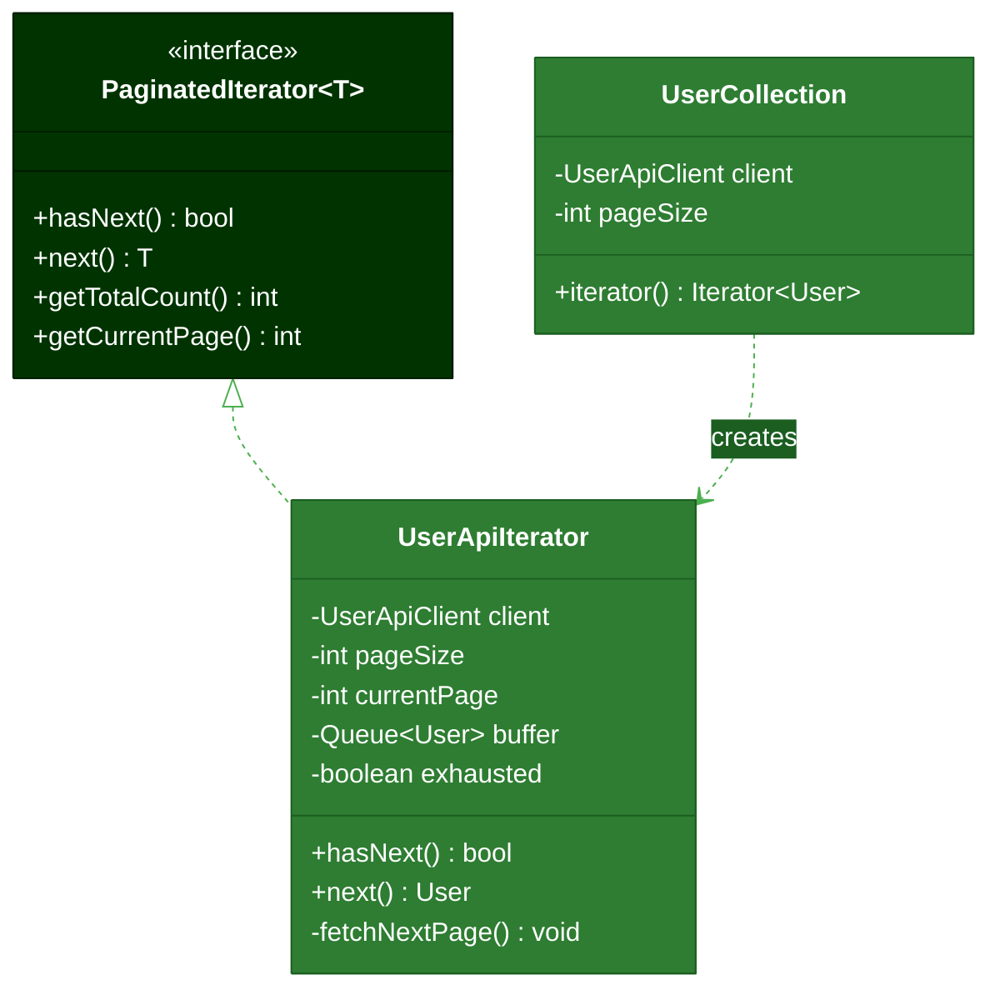
```mermaid
%%{init: {'theme': 'dark', 'themeVariables': {'primaryColor': '#1b5e20', 'primaryBorderColor': '#003300', 'primaryTextColor': '#ffffff', 'lineColor': '#4caf50', 'secondaryColor': '#37474f', 'tertiaryColor': '#4a148c', 'background': '#1a1a2e', 'mainBkg': '#1b5e20', 'nodeBorder': '#003300', 'clusterBkg': '#37474f', 'titleColor': '#ffffff', 'edgeLabelBackground': '#004d40', 'attributeBackgroundColorEven': '#1b5e20', 'attributeBackgroundColorOdd': '#003300', 'classText': '#ffffff', 'fillType0': '#1b5e20', 'fillType1': '#003300', 'fillType2': '#2e7d32', 'fillType3': '#37474f', 'fillType4': '#4a148c', 'fillType5': '#2e7d32', 'fillType6': '#b71c1c', 'fillType7': '#004d40', 'noteBkgColor': '#004d40', 'noteBorderColor': '#003300', 'noteTextColor': '#ffffff'},
  'themeCSS': 'svg { background-color: #1e1e1e !important; padding: 1rem !important; border-radius: 8px !important; } .edgeLabel rect { fill: #1e1e1e !important; } text, tspan, .messageText, .signalText, .edgeLabel, .edgeLabel span, .pointLabel, .axisLabel, .quadrantTitle, .quadrantLabel { fill: #ffffff !important; color: #ffffff !important; stroke: none !important; }'
}}%%
classDiagram
    class PaginatedIterator~T~ {
        <<interface>>
        +hasNext() bool
        +next() T
        +getTotalCount() int
        +getCurrentPage() int
    }

    class UserApiIterator {
        -UserApiClient client
        -int pageSize
        -int currentPage
        -Queue~User~ buffer
        -boolean exhausted
        +hasNext() bool
        +next() User
        -fetchNextPage() void
    }

    class UserCollection {
        -UserApiClient client
        -int pageSize
        +iterator() Iterator~User~
    }

    PaginatedIterator <|.. UserApiIterator
    UserCollection ..> UserApiIterator : creates
    style PaginatedIterator fill:#003300,stroke:#001a00,color:#ffffff
    style UserApiIterator fill:#2e7d32,stroke:#1b5e20,color:#ffffff
    style UserCollection fill:#2e7d32,stroke:#1b5e20,color:#ffffff
    style UserApiClient fill:#2e7d32,stroke:#1b5e20,color:#ffffff

```

### Cursor State Machine

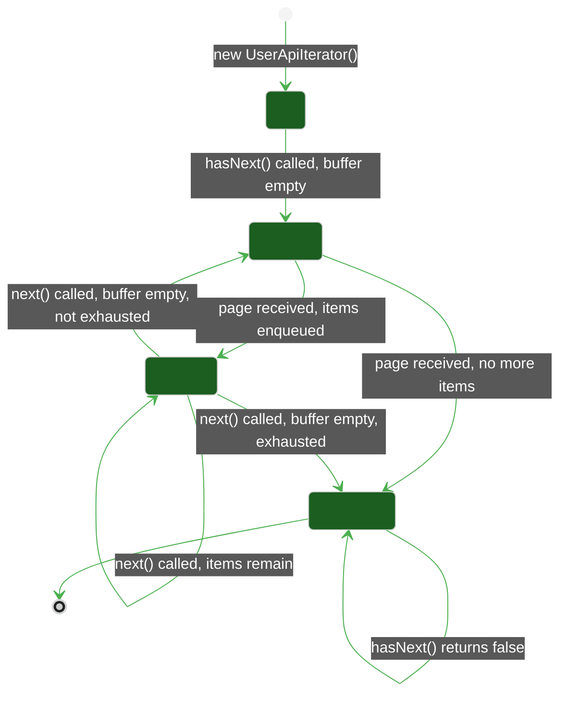
```mermaid
%%{init: {'theme': 'dark', 'themeVariables': {'stateBkg': '#1b5e20', 'stateBorder': '#003300', 'transitionColor': '#4caf50', 'labelColor': '#ffffff', 'altBackground': '#2e7d32', 'errorBkgColor': '#b71c1c', 'errorTextColor': '#ffffff', 'fillType0': '#1b5e20', 'fillType1': '#003300', 'fillType2': '#2e7d32',
    'background': '#1e1e1e'},
  'themeCSS': 'svg { background-color: #1e1e1e !important; padding: 1rem !important; border-radius: 8px !important; } .edgeLabel rect { fill: #1e1e1e !important; } text, tspan, .messageText, .signalText, .edgeLabel, .edgeLabel span, .pointLabel, .axisLabel, .quadrantTitle, .quadrantLabel { fill: #ffffff !important; color: #ffffff !important; stroke: none !important; }'
}}%%
stateDiagram-v2
    [*] --> Idle : new UserApiIterator()

    Idle --> Fetching : hasNext() called, buffer empty
    Fetching --> Buffered : page received, items enqueued
    Fetching --> Exhausted : page received, no more items

    Buffered --> Buffered : next() called, items remain
    Buffered --> Fetching : next() called, buffer empty, not exhausted
    Buffered --> Exhausted : next() called, buffer empty, exhausted

    Exhausted --> Exhausted : hasNext() returns false
    Exhausted --> [*]
```

### Industrial Case Study: Paginated API Result Iterator

A batch job must process all users from a REST API that returns 100 per page. The job should iterate lazily — fetching the next page only when needed.

```java
// Extended iterator interface with pagination metadata
public interface PaginatedIterator<T> extends Iterator<T> {
    int getTotalCount();   // Total items across all pages (from API response metadata)
    int getCurrentPage();  // Which page was last fetched
}

// The concrete iterator — hides all pagination logic from callers
public class UserApiIterator implements PaginatedIterator<User> {
    private final UserApiClient client;
    private final int pageSize;

    private int currentPage = 0;
    private int totalCount = -1;  // -1 means we haven't fetched yet
    private final Queue<User> buffer = new LinkedList<>();
    private boolean exhausted = false;

    public UserApiIterator(UserApiClient client, int pageSize) {
        this.client = client;
        this.pageSize = pageSize;
    }

    @Override
    public boolean hasNext() {
        if (!buffer.isEmpty()) return true;  // Already have items ready
        if (exhausted) return false;          // We know there is nothing more
        fetchNextPage();                       // Lazy fetch — only when needed
        return !buffer.isEmpty();
    }

    @Override
    public User next() {
        if (!hasNext()) throw new NoSuchElementException("No more users in iterator");
        return buffer.poll();  // Remove and return the head of the queue
    }

    private void fetchNextPage() {
        currentPage++;
        System.out.printf("[Iterator] Fetching page %d (pageSize=%d)...%n", currentPage, pageSize);

        ApiPage<User> page = client.getUsers(currentPage, pageSize);
        totalCount = page.getTotalCount();  // Store total for progress reporting
        buffer.addAll(page.getItems());

        // Two conditions signal exhaustion:
        // 1. We got fewer items than requested (final page)
        // 2. We've seen enough items to cover the total count
        long itemsSeen = (long)(currentPage - 1) * pageSize + page.getItems().size();
        if (page.getItems().size() < pageSize || itemsSeen >= totalCount) {
            exhausted = true;
            System.out.printf("[Iterator] Last page reached. Total: %,d users.%n", totalCount);
        }
    }

    @Override
    public int getTotalCount() { return totalCount; }

    @Override
    public int getCurrentPage() { return currentPage; }
}

// The Iterable collection — Java's for-each loop calls iterator() automatically
public class UserCollection implements Iterable<User> {
    private final UserApiClient client;
    private final int pageSize;

    public UserCollection(UserApiClient client, int pageSize) {
        this.client = client;
        this.pageSize = pageSize;
    }

    @Override
    public Iterator<User> iterator() {
        // Each call creates a fresh iterator — stateless collection
        return new UserApiIterator(client, pageSize);
    }
}

// --- Usage: caller sees no pages, no HTTP, no buffering ---
UserCollection users = new UserCollection(apiClient, 100);
int processed = 0;
int failed = 0;

for (User user : users) {
    try {
        emailService.sendWelcomeEmail(user);
        processed++;
    } catch (EmailException e) {
        // Failure on one user does not abort the whole batch
        System.err.printf("[Batch] Failed to email %s: %s%n", user.getEmail(), e.getMessage());
        failed++;
    }
}

System.out.printf("[Batch] Done. Processed: %,d | Failed: %,d%n", processed, failed);
// Output:
// [Iterator] Fetching page 1 (pageSize=100)...
// [Iterator] Fetching page 2 (pageSize=100)...
// ...
// [Iterator] Last page reached. Total: 2,413 users.
// [Batch] Done. Processed: 2,410 | Failed: 3
```

### When to Use / When to Avoid

| Use It When | Avoid It When |
| :--- | :--- |
| Traversal logic is complex and should not leak into callers | Collection is always fully in-memory and simple — just use a list |
| You want lazy evaluation (database cursors, paginated APIs) | You need random access — iterators are sequential by design |
| Multiple traversal strategies over the same collection | The collection is small and performance is not a concern |
| You want to expose a collection without revealing its internals | You need bidirectional iteration — consider `ListIterator` instead |

---

## 3. Strategy

> **The algorithm is a variable. Treat it like one.**

### The Hook

**The Strategy pattern extracts a family of algorithms into interchangeable objects, letting you swap behavior at runtime without touching the code that uses it.**

### The Problem

You are building an e-commerce checkout system. Different customers get different prices: new customers pay full price, members get 10% off, bulk buyers get 15% off, and VIP accounts get negotiated flat rates. Your first attempt:

```java
public double calculateTotal(Customer customer, Cart cart) {
    if (customer.isVip()) {
        return vipTable.getVipPrice(unitPrice) * qty;
    } else if (cart.getTotalQuantity() >= 50) {
        return unitPrice * qty * 0.85;
    } else if (customer.isMember()) {
        return unitPrice * qty * 0.90;
    } else {
        return unitPrice * qty;
    }
}
```

Product launches a new "flash sale" discount. You edit `calculateTotal`. Marketing wants tiered bulk pricing. You edit `calculateTotal`. A/B test wants two discount formulas running simultaneously. Now what? You are testing business rules inside a checkout method, and every change to pricing requires redeploying the entire checkout service.

### The Insight

> 📖 **Read the Parable:** [The Three Transport Tickets (សំបុត្រធ្វើដំណើរទាំងបី)](../../concepts/parables/89-the-three-transport-tickets.md)
> 🧠 **Read the Strategy Explanation:** [Engineer Strategy: Strategy (ការបំប្លែងក្បួនដោះស្រាយតាមកាលៈទេសៈ)](../../concepts/design-patterns/08-engineer-requirements-constraints-solution/02-strategy.md)

The discount *formula* is not part of checkout logic — it is its own first-class concern. The insight is: **if you find yourself choosing between algorithm variants with `if/else`, extract each variant into its own class and inject the right one from outside.** The checkout does not decide which discount to apply. It only applies whatever discount it is given.

### The Structure

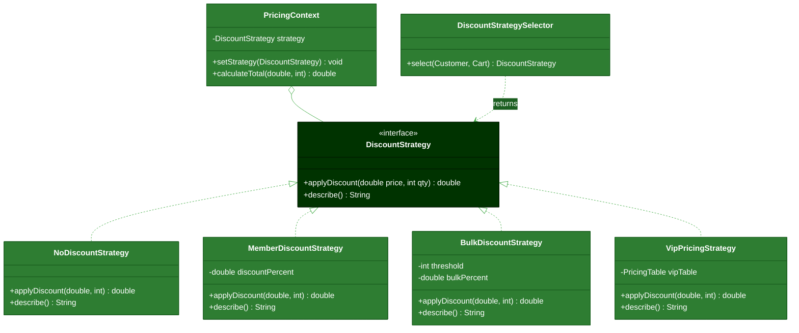
```mermaid
%%{init: {'theme': 'dark', 'themeVariables': {'primaryColor': '#1b5e20', 'primaryBorderColor': '#003300', 'primaryTextColor': '#ffffff', 'lineColor': '#4caf50', 'secondaryColor': '#37474f', 'tertiaryColor': '#4a148c', 'background': '#1a1a2e', 'mainBkg': '#1b5e20', 'nodeBorder': '#003300', 'clusterBkg': '#37474f', 'titleColor': '#ffffff', 'edgeLabelBackground': '#004d40', 'attributeBackgroundColorEven': '#1b5e20', 'attributeBackgroundColorOdd': '#003300', 'classText': '#ffffff', 'fillType0': '#1b5e20', 'fillType1': '#003300', 'fillType2': '#2e7d32', 'fillType3': '#37474f', 'fillType4': '#4a148c', 'fillType5': '#2e7d32', 'fillType6': '#b71c1c', 'fillType7': '#004d40', 'noteBkgColor': '#004d40', 'noteBorderColor': '#003300', 'noteTextColor': '#ffffff'},
  'themeCSS': 'svg { background-color: #1e1e1e !important; padding: 1rem !important; border-radius: 8px !important; } .edgeLabel rect { fill: #1e1e1e !important; } text, tspan, .messageText, .signalText, .edgeLabel, .edgeLabel span, .pointLabel, .axisLabel, .quadrantTitle, .quadrantLabel { fill: #ffffff !important; color: #ffffff !important; stroke: none !important; }'
}}%%
classDiagram
    class DiscountStrategy {
        <<interface>>
        +applyDiscount(double price, int qty) double
        +describe() String
    }

    class NoDiscountStrategy {
        +applyDiscount(double, int) double
        +describe() String
    }

    class MemberDiscountStrategy {
        -double discountPercent
        +applyDiscount(double, int) double
        +describe() String
    }

    class BulkDiscountStrategy {
        -int threshold
        -double bulkPercent
        +applyDiscount(double, int) double
        +describe() String
    }

    class VipPricingStrategy {
        -PricingTable vipTable
        +applyDiscount(double, int) double
        +describe() String
    }

    class PricingContext {
        -DiscountStrategy strategy
        +setStrategy(DiscountStrategy) void
        +calculateTotal(double, int) double
    }

    class DiscountStrategySelector {
        +select(Customer, Cart) DiscountStrategy
    }

    PricingContext o-- DiscountStrategy
    DiscountStrategy <|.. NoDiscountStrategy
    DiscountStrategy <|.. MemberDiscountStrategy
    DiscountStrategy <|.. BulkDiscountStrategy
    DiscountStrategy <|.. VipPricingStrategy
    DiscountStrategySelector ..> DiscountStrategy : returns
    style DiscountStrategy fill:#003300,stroke:#001a00,color:#ffffff
    style NoDiscountStrategy fill:#2e7d32,stroke:#1b5e20,color:#ffffff
    style MemberDiscountStrategy fill:#2e7d32,stroke:#1b5e20,color:#ffffff
    style BulkDiscountStrategy fill:#2e7d32,stroke:#1b5e20,color:#ffffff
    style VipPricingStrategy fill:#2e7d32,stroke:#1b5e20,color:#ffffff
    style PricingContext fill:#2e7d32,stroke:#1b5e20,color:#ffffff
    style DiscountStrategySelector fill:#2e7d32,stroke:#1b5e20,color:#ffffff

```

### Strategy Selection Flow

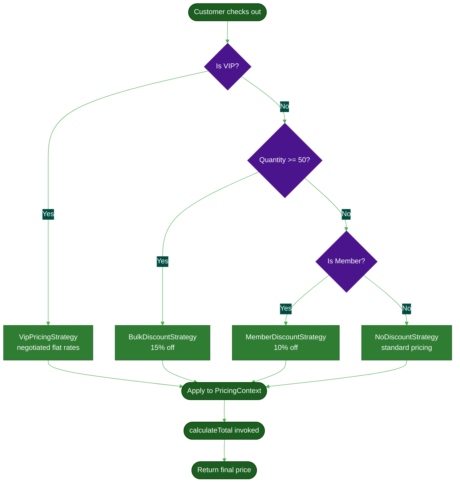
```mermaid
%%{init: {'theme': 'dark', 'themeVariables': {'primaryColor': '#1b5e20', 'primaryBorderColor': '#003300', 'primaryTextColor': '#ffffff', 'lineColor': '#4caf50', 'secondaryColor': '#37474f', 'tertiaryColor': '#4a148c', 'background': '#1a1a2e', 'mainBkg': '#1b5e20', 'nodeBorder': '#003300', 'clusterBkg': '#37474f', 'titleColor': '#ffffff', 'edgeLabelBackground': '#004d40', 'attributeBackgroundColorEven': '#1b5e20', 'attributeBackgroundColorOdd': '#003300', 'classText': '#ffffff', 'fillType0': '#1b5e20', 'fillType1': '#003300', 'fillType2': '#2e7d32', 'fillType3': '#37474f', 'fillType4': '#4a148c', 'fillType5': '#2e7d32', 'fillType6': '#b71c1c', 'fillType7': '#004d40'},
  'themeCSS': 'svg { background-color: #1e1e1e !important; padding: 1rem !important; border-radius: 8px !important; } .edgeLabel rect { fill: #1e1e1e !important; } text, tspan, .messageText, .signalText, .edgeLabel, .edgeLabel span, .pointLabel, .axisLabel, .quadrantTitle, .quadrantLabel { fill: #ffffff !important; color: #ffffff !important; stroke: none !important; }'
}}%%
flowchart TD
    classDef primary  fill:#1b5e20,stroke:#003300,color:#ffffff
    classDef iface    fill:#003300,stroke:#001a00,color:#ffffff
    classDef concrete fill:#2e7d32,stroke:#1b5e20,color:#ffffff
    classDef decision fill:#4a148c,stroke:#6a1b9a,color:#ffffff
    classDef success  fill:#2e7d32,stroke:#1b5e20,color:#ffffff
    classDef danger   fill:#b71c1c,stroke:#7f0000,color:#ffffff
    classDef neutral  fill:#004d40,stroke:#00251a,color:#ffffff
    A([Customer checks out]) --> B{Is VIP?}
    B -- Yes --> C[VipPricingStrategy<br/>negotiated flat rates]
    B -- No --> D{Quantity >= 50?}
    D -- Yes --> E[BulkDiscountStrategy<br/>15% off]
    D -- No --> F{Is Member?}
    F -- Yes --> G[MemberDiscountStrategy<br/>10% off]
    F -- No --> H[NoDiscountStrategy<br/>standard pricing]

    C --> I([Apply to PricingContext])
    E --> I
    G --> I
    H --> I

    I --> J([calculateTotal invoked])
    J --> K([Return final price])
    style A fill:#1b5e20,stroke:#003300,color:#ffffff
    style B fill:#4a148c,stroke:#6a1b9a,color:#ffffff
    style C fill:#2e7d32,stroke:#1b5e20,color:#ffffff
    style D fill:#4a148c,stroke:#6a1b9a,color:#ffffff
    style E fill:#2e7d32,stroke:#1b5e20,color:#ffffff
    style F fill:#4a148c,stroke:#6a1b9a,color:#ffffff
    style G fill:#2e7d32,stroke:#1b5e20,color:#ffffff
    style H fill:#2e7d32,stroke:#1b5e20,color:#ffffff
    style I fill:#1b5e20,stroke:#003300,color:#ffffff
    style J fill:#1b5e20,stroke:#003300,color:#ffffff
    style K fill:#1b5e20,stroke:#003300,color:#ffffff
```

### Trade-off Analysis

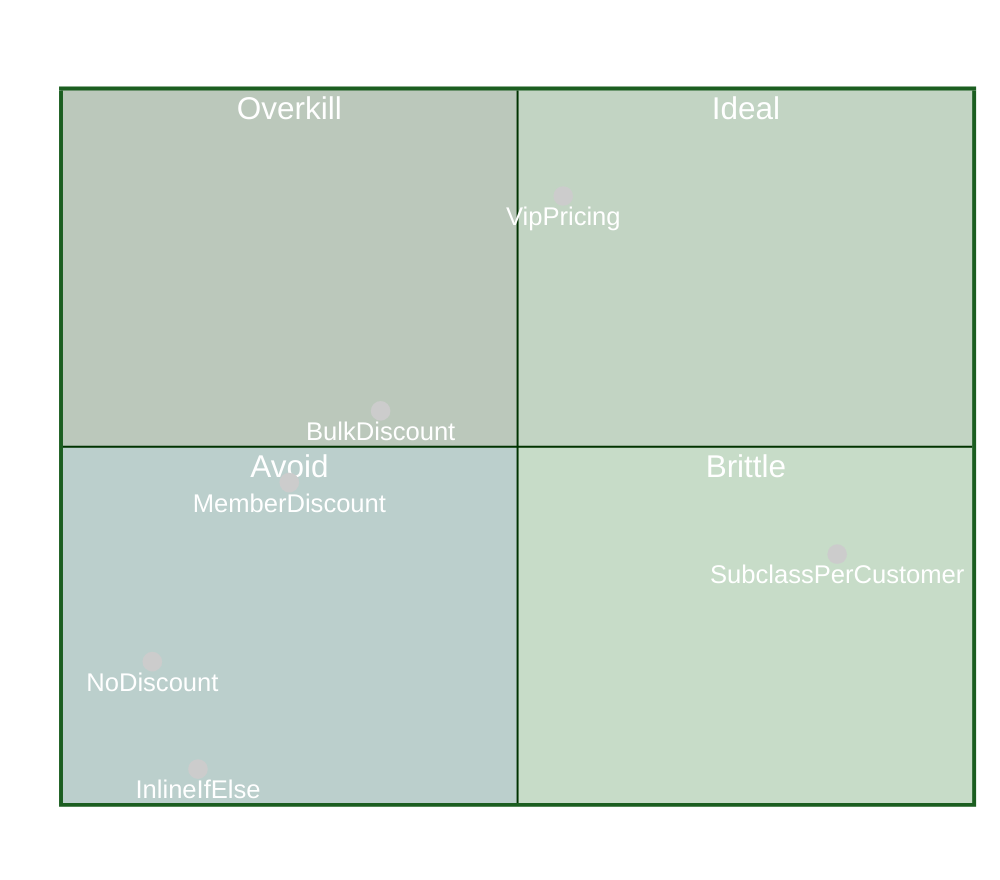
```mermaid
%%{init: {'theme': 'dark', 'quadrantChart': {'chartWidth': 500, 'chartHeight': 440, 'pointRadius': 5, 'pointLabelFontSize': 13}, 'themeVariables': {'quadrantPoint': '#66bb6a', 'quadrantPointTextFill': '#ffffff', 'quadrantTitleFill': '#e0e0e0', 'quadrantLabelFill': '#e0e0e0', 'quadrantInternalBorderStrokeFill': '#003300', 'quadrantExternalBorderStrokeFill': '#1b5e20', 'quadrant1Fill': '#1b5e2044', 'quadrant2Fill': '#00330044', 'quadrant3Fill': '#004d4044', 'quadrant4Fill': '#2e7d3244',
    'background': '#1e1e1e'},
  'themeCSS': 'svg { background-color: #1e1e1e !important; padding: 1rem !important; border-radius: 8px !important; } .edgeLabel rect { fill: #1e1e1e !important; } text, tspan, .messageText, .signalText, .edgeLabel, .edgeLabel span, .pointLabel, .axisLabel, .quadrantTitle, .quadrantLabel { fill: #ffffff !important; color: #ffffff !important; stroke: none !important; }'
}}%%
quadrantChart
    title Strategy Variants: Complexity vs Flexibility
    x-axis Simple --> Complex
    y-axis Low Flexibility --> High Flexibility
    quadrant-1 Ideal
    quadrant-2 Overkill
    quadrant-3 Avoid
    quadrant-4 Brittle
    NoDiscount: [0.1, 0.2]
    MemberDiscount: [0.25, 0.45]
    BulkDiscount: [0.35, 0.55]
    VipPricing: [0.55, 0.85]
    InlineIfElse: [0.15, 0.05]
    SubclassPerCustomer: [0.85, 0.35]
```

### Industrial Case Study: E-Commerce Discount Engine

```java
// The strategy contract — all discount algorithms must implement this
public interface DiscountStrategy {
    // Returns the final price after discount is applied to qty items at unitPrice
    double applyDiscount(double unitPrice, int quantity);

    // Human-readable description for receipts and audit logs
    String describe();
}

// --- Concrete Strategies ---

// Default: no discount, simple multiplication
public class NoDiscountStrategy implements DiscountStrategy {
    @Override
    public double applyDiscount(double price, int qty) {
        return price * qty;
    }

    @Override
    public String describe() { return "Standard pricing (no discount)"; }
}

// Flat percentage off for registered members
public class MemberDiscountStrategy implements DiscountStrategy {
    private final double discountPercent;

    public MemberDiscountStrategy(double discountPercent) {
        this.discountPercent = discountPercent;
    }

    @Override
    public double applyDiscount(double price, int qty) {
        // (1 - rate) applied to the full subtotal
        return price * qty * (1.0 - discountPercent / 100.0);
    }

    @Override
    public String describe() {
        return String.format("%.0f%% member discount", discountPercent);
    }
}

// Discount kicks in only above a quantity threshold
public class BulkDiscountStrategy implements DiscountStrategy {
    private final int threshold;
    private final double bulkDiscountPercent;

    public BulkDiscountStrategy(int threshold, double bulkDiscountPercent) {
        this.threshold = threshold;
        this.bulkDiscountPercent = bulkDiscountPercent;
    }

    @Override
    public double applyDiscount(double price, int qty) {
        if (qty >= threshold) {
            // Entire quantity gets discounted — not just the overage
            return price * qty * (1.0 - bulkDiscountPercent / 100.0);
        }
        return price * qty;  // Below threshold: no discount
    }

    @Override
    public String describe() {
        return String.format("%.0f%% off for %d+ units", bulkDiscountPercent, threshold);
    }
}

// VIP customers have negotiated flat prices stored in a separate table
public class VipPricingStrategy implements DiscountStrategy {
    private final PricingTable vipTable;

    public VipPricingStrategy(PricingTable vipTable) {
        this.vipTable = vipTable;
    }

    @Override
    public double applyDiscount(double unitPrice, int qty) {
        // VIP prices override the catalog price entirely
        double negotiatedPrice = vipTable.getVipPrice(unitPrice);
        return negotiatedPrice * qty;
    }

    @Override
    public String describe() { return "VIP negotiated pricing"; }
}

// The Context — knows it needs to apply a discount, but not which one
public class PricingContext {
    private DiscountStrategy strategy;

    // Strategy is injected — context never instantiates a specific strategy
    public void setStrategy(DiscountStrategy strategy) {
        this.strategy = strategy;
    }

    public double calculateTotal(double unitPrice, int quantity) {
        if (strategy == null) {
            throw new IllegalStateException("No pricing strategy configured");
        }
        double total = strategy.applyDiscount(unitPrice, quantity);
        // Structured log for billing audit trail
        System.out.printf("[Pricing] Strategy: %-35s | Qty: %3d | Unit: $%6.2f | Total: $%8.2f%n",
            strategy.describe(), quantity, unitPrice, total);
        return total;
    }
}

// Strategy Selector — the only place where the selection logic lives
public class DiscountStrategySelector {
    private final PricingTable vipPricingTable;

    public DiscountStrategySelector(PricingTable vipPricingTable) {
        this.vipPricingTable = vipPricingTable;
    }

    public DiscountStrategy select(Customer customer, Cart cart) {
        // Priority order matters: VIP > Bulk > Member > Standard
        if (customer.isVip()) {
            return new VipPricingStrategy(vipPricingTable);
        }
        if (cart.getTotalQuantity() >= 50) {
            return new BulkDiscountStrategy(50, 15.0);
        }
        if (customer.isMember()) {
            return new MemberDiscountStrategy(10.0);
        }
        return new NoDiscountStrategy();
    }
}

// --- Checkout flow ---
DiscountStrategySelector selector = new DiscountStrategySelector(vipPricingTable);
PricingContext pricing = new PricingContext();

DiscountStrategy chosen = selector.select(currentCustomer, currentCart);
pricing.setStrategy(chosen);

double total = pricing.calculateTotal(29.99, currentCart.getTotalQuantity());

// [Pricing] Strategy: 15% off for 50+ units              | Qty:  75 | Unit: $ 29.99 | Total: $ 1912.36
```

### When to Use / When to Avoid

| Use It When | Avoid It When |
| :--- | :--- |
| You have multiple variants of the same algorithm | You have only one algorithm — abstraction adds no value |
| Algorithms need to be swappable at runtime | Strategies need access to private state of the context |
| You want to isolate, name, and test each algorithm separately | The number of strategies is large and each has complex initialization |
| New variants are added frequently without touching existing code | Java lambdas already express the variation clearly enough |

---

## 4. Mediator

> **When everyone talks to everyone, nobody understands anything.**

### The Hook

**The Mediator pattern replaces a tangle of direct references with a single hub object — colleagues only know the mediator, never each other.**

### The Problem

Picture a real-time chat application. User Alice sends a message to the "engineering" room. Who receives it? Bob, Carol, and Dan. When Dave joins, the list grows. When Carol leaves, it shrinks. If each user holds direct references to all other users, adding a new user means updating every existing user's reference list. You now have O(n²) coupling. Remove one user and you have dangling pointers everywhere. The system becomes impossible to reason about.

Worse: now add features like "mute a user," "admin-only channels," "message history," or "@ mentions." All that logic has to live *somewhere*. If it is spread across every user object, your system becomes an unmaintainable mesh.

### The Insight

> 📖 **Read the Parable:** [The Air Traffic Controller (អ្នកបញ្ជាចរាចរណ៍ផ្លូវអាកាស)](../../concepts/parables/90-the-air-traffic-controller.md)
> 🧠 **Read the Strategy Explanation:** [Storyteller Strategy: Mediator (អាជ្ញាកណ្តាលសម្របសម្រួលទំនាក់ទំនង)](../../concepts/design-patterns/07-storyteller-narrative-arc/03-mediator.md)

The insight is that **communication topology is a separate concern from the objects that communicate.** A chat room is not just a container of users — it is the authority over all communication rules within that space. Users should not know who else is in the room, or how many there are. They only need to know how to shout into a room and receive messages from it.

### The Structure

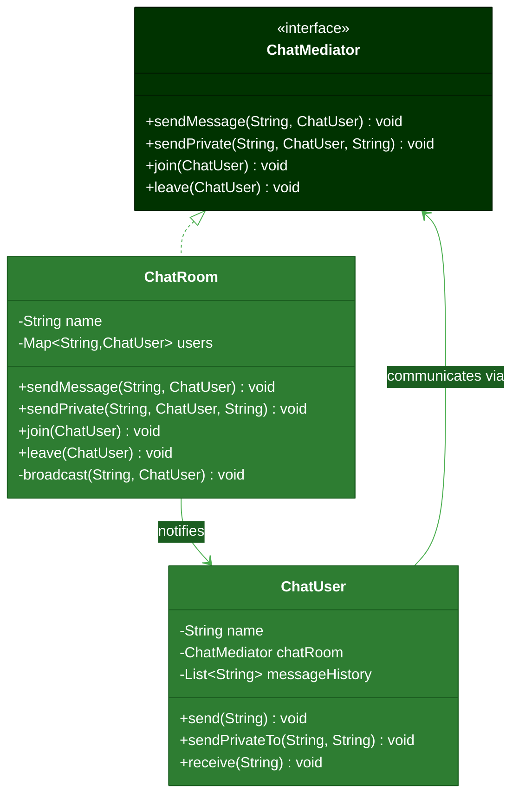
```mermaid
%%{init: {'theme': 'dark', 'themeVariables': {'primaryColor': '#1b5e20', 'primaryBorderColor': '#003300', 'primaryTextColor': '#ffffff', 'lineColor': '#4caf50', 'secondaryColor': '#37474f', 'tertiaryColor': '#4a148c', 'background': '#1a1a2e', 'mainBkg': '#1b5e20', 'nodeBorder': '#003300', 'clusterBkg': '#37474f', 'titleColor': '#ffffff', 'edgeLabelBackground': '#004d40', 'attributeBackgroundColorEven': '#1b5e20', 'attributeBackgroundColorOdd': '#003300', 'classText': '#ffffff', 'fillType0': '#1b5e20', 'fillType1': '#003300', 'fillType2': '#2e7d32', 'fillType3': '#37474f', 'fillType4': '#4a148c', 'fillType5': '#2e7d32', 'fillType6': '#b71c1c', 'fillType7': '#004d40', 'noteBkgColor': '#004d40', 'noteBorderColor': '#003300', 'noteTextColor': '#ffffff'},
  'themeCSS': 'svg { background-color: #1e1e1e !important; padding: 1rem !important; border-radius: 8px !important; } .edgeLabel rect { fill: #1e1e1e !important; } text, tspan, .messageText, .signalText, .edgeLabel, .edgeLabel span, .pointLabel, .axisLabel, .quadrantTitle, .quadrantLabel { fill: #ffffff !important; color: #ffffff !important; stroke: none !important; }'
}}%%
classDiagram
    class ChatMediator {
        <<interface>>
        +sendMessage(String, ChatUser) void
        +sendPrivate(String, ChatUser, String) void
        +join(ChatUser) void
        +leave(ChatUser) void
    }

    class ChatRoom {
        -String name
        -Map~String,ChatUser~ users
        +sendMessage(String, ChatUser) void
        +sendPrivate(String, ChatUser, String) void
        +join(ChatUser) void
        +leave(ChatUser) void
        -broadcast(String, ChatUser) void
    }

    class ChatUser {
        -String name
        -ChatMediator chatRoom
        -List~String~ messageHistory
        +send(String) void
        +sendPrivateTo(String, String) void
        +receive(String) void
    }

    ChatMediator <|.. ChatRoom
    ChatUser --> ChatMediator : communicates via
    ChatRoom --> ChatUser : notifies
    style ChatMediator fill:#003300,stroke:#001a00,color:#ffffff
    style ChatRoom fill:#2e7d32,stroke:#1b5e20,color:#ffffff
    style ChatUser fill:#2e7d32,stroke:#1b5e20,color:#ffffff

```

### The Runtime Flow

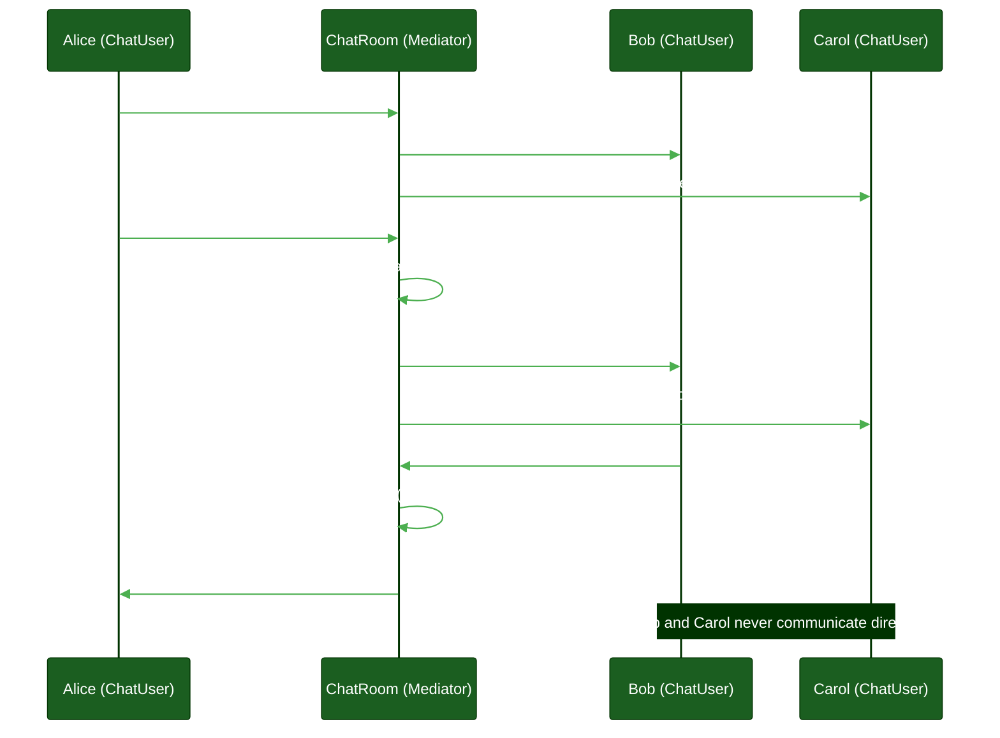
```mermaid
%%{init: {'theme': 'dark', 'themeVariables': {'actorBkg': '#1b5e20', 'actorBorder': '#003300', 'actorTextColor': '#ffffff', 'actorLineColor': '#003300', 'signalColor': '#4caf50', 'signalTextColor': '#ffffff', 'labelBoxBkgColor': '#003300', 'labelBoxBorderColor': '#003300', 'labelTextColor': '#ffffff', 'loopTextColor': '#ffffff', 'noteBkgColor': '#003300', 'noteBorderColor': '#003300', 'noteTextColor': '#ffffff', 'activationBkgColor': '#2e7d32', 'activationBorderColor': '#003300', 'sequenceNumberColor': '#ffffff',
    'background': '#1e1e1e'},
  'themeCSS': 'svg { background-color: #1e1e1e !important; padding: 1rem !important; border-radius: 8px !important; } .edgeLabel rect { fill: #1e1e1e !important; } text, tspan, .messageText, .signalText, .edgeLabel, .edgeLabel span, .pointLabel, .axisLabel, .quadrantTitle, .quadrantLabel { fill: #ffffff !important; color: #ffffff !important; stroke: none !important; }'
}}%%
sequenceDiagram
    participant Alice as Alice (ChatUser)
    participant Room as ChatRoom (Mediator)
    participant Bob as Bob (ChatUser)
    participant Carol as Carol (ChatUser)

    Alice->>Room: join(alice)
    Room->>Bob: receive("alice joined")
    Room->>Carol: receive("alice joined")

    Alice->>Room: sendMessage("Deploy went live!")
    Room->>Room: broadcast to all except Alice
    Room->>Bob: receive("[alice]: Deploy went<br/>live!")
    Room->>Carol: receive("[alice]: Deploy went<br/>live!")

    Bob->>Room: sendPrivate("alice", "Great work!")
    Room->>Room: lookup("alice")
    Room->>Alice: receive("[DM from bob]:<br/>Great work!")
    Note over Bob,Carol: Bob and Carol never communicate directly
```

### Industrial Case Study: Real-Time Chat Room

Users communicate through a chat room. The room holds the routing logic. Users never hold references to each other.

```java
// The mediator contract — the only interface users interact with
public interface ChatMediator {
    void sendMessage(String message, ChatUser sender);
    void sendPrivate(String message, ChatUser sender, String recipientName);
    void join(ChatUser user);
    void leave(ChatUser user);
}

// The concrete mediator — owns all routing intelligence
public class ChatRoom implements ChatMediator {
    private final String name;
    // ConcurrentHashMap for thread-safety in real-time systems
    private final Map<String, ChatUser> users = new ConcurrentHashMap<>();
    private final List<String> messageHistory = new CopyOnWriteArrayList<>();

    public ChatRoom(String name) { this.name = name; }

    @Override
    public void join(ChatUser user) {
        users.put(user.getName(), user);
        String announcement = user.getName() + " joined #" + name;
        messageHistory.add(announcement);
        // Announce to existing members — the joiner does not receive their own join
        broadcastSystem(announcement, user);
        // Deliver message history to the newly joined user
        messageHistory.forEach(user::receive);
    }

    @Override
    public void leave(ChatUser user) {
        users.remove(user.getName());
        String announcement = user.getName() + " left #" + name;
        messageHistory.add(announcement);
        broadcastSystem(announcement, null); // All remaining users notified
    }

    @Override
    public void sendMessage(String message, ChatUser sender) {
        String formatted = String.format("[%s] %s: %s",
            Instant.now().toString(), sender.getName(), message);
        messageHistory.add(formatted);
        // Broadcast to everyone except the sender (they already know what they typed)
        broadcastToMembers(formatted, sender);
    }

    @Override
    public void sendPrivate(String message, ChatUser sender, String recipientName) {
        ChatUser recipient = users.get(recipientName);
        if (recipient == null) {
            // Notify the sender — the recipient may have left the room
            sender.receive("[System] User '" + recipientName + "' is not in this room.");
            return;
        }
        // Format clearly as DM — the mediator controls message formatting
        recipient.receive(String.format("[DM from %s]: %s", sender.getName(), message));
    }

    private void broadcastToMembers(String message, ChatUser exclude) {
        users.values().stream()
            .filter(u -> !u.equals(exclude))  // Do not echo back to sender
            .forEach(u -> u.receive(message));
    }

    private void broadcastSystem(String message, ChatUser exclude) {
        users.values().stream()
            .filter(u -> !u.equals(exclude))
            .forEach(u -> u.receive("[System] " + message));
    }
}

// The colleague — knows only the mediator, never other users
public class ChatUser {
    private final String name;
    private final ChatMediator chatRoom;
    private final List<String> inbox = new ArrayList<>();

    public ChatUser(String name, ChatMediator chatRoom) {
        this.name = name;
        this.chatRoom = chatRoom;
    }

    public void send(String message) {
        // Delegate to mediator — user never decides who gets the message
        chatRoom.sendMessage(message, this);
    }

    public void sendPrivateTo(String recipientName, String message) {
        chatRoom.sendPrivate(message, this, recipientName);
    }

    public void receive(String message) {
        inbox.add(message);
        System.out.printf("[%s inbox] %s%n", name, message);
    }

    public String getName() { return name; }
    public List<String> getInbox() { return Collections.unmodifiableList(inbox); }
}

// --- Usage ---
ChatRoom room = new ChatRoom("engineering");

ChatUser alice = new ChatUser("alice", room);
ChatUser bob   = new ChatUser("bob",   room);
ChatUser carol = new ChatUser("carol", room);

room.join(alice);   // bob and carol receive "alice joined"
room.join(bob);
room.join(carol);

alice.send("Deployment complete. All systems green.");
// bob and carol each receive the message; alice does not see her own message again

bob.sendPrivateTo("alice", "Check the error rate — it spiked.");
// Only alice receives the DM; carol sees nothing

carol.sendPrivateTo("dave", "Are you there?");
// [System] User 'dave' is not in this room. — carol is notified
```

### When to Use / When to Avoid

| Use It When | Avoid It When |
| :--- | :--- |
| Many objects communicate and the coupling forms a web | Only two or three objects interact — a mediator is overhead |
| Communication rules are complex and centralized makes sense | The mediator becomes a "God object" that knows too much |
| Components should be independently reusable | You need full audit of message routing — mediators can obscure flow |
| Real-time systems: chat, game lobbies, trading floors | Objects have clear ownership relationships — use direct calls |

---

## 5. Memento

> **Store the past without exposing it.**

### The Hook

**The Memento pattern lets an object externalize a snapshot of its own state for safekeeping — without leaking its internals to the outside world — so it can restore itself later.**

### The Problem

You are building a document editor. Users expect Ctrl+Z. The first approach seems obvious: keep a `List<String>` of previous content strings. But documents are not just strings. They have cursor positions, selection ranges, formatting spans, embedded objects. A content `String` does not capture all of that. So you expose getters and setters for every field so the undo manager can read and restore them. Congratulations — you have just made every internal implementation detail of your `Document` class part of the public API. Change any field name or type, and the undo manager breaks.

### The Insight

> 📖 **Read the Parable:** [The Checkpoint Crystal (គ្រីស្តាល់រក្សាទុកពេលវេលា)](../../concepts/parables/91-the-checkpoint-crystal.md)
> 🧠 **Read the Strategy Explanation:** [Journalist Strategy: Memento (ការរក្សាទុក និងលុបស្ថានភាពចាស់ដោយសុវត្ថិភាព)](../../concepts/design-patterns/06-journalist-inverted-pyramid/02-memento.md)

The insight is the **opacity principle**: the thing that stores the snapshot should not need to understand it. The `Document` creates the snapshot and is the only one who can read it. The `HistoryManager` only stores and returns snapshots — it is completely ignorant of their contents. This keeps the encapsulation boundary intact: internal changes to `Document` never affect `HistoryManager`.

### The Structure

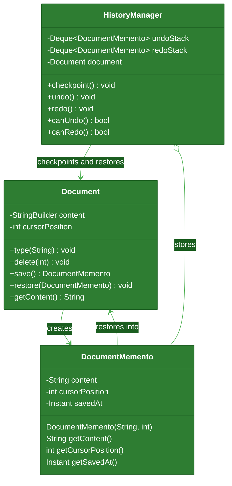
```mermaid
%%{init: {'theme': 'dark', 'themeVariables': {'primaryColor': '#1b5e20', 'primaryBorderColor': '#003300', 'primaryTextColor': '#ffffff', 'lineColor': '#4caf50', 'secondaryColor': '#37474f', 'tertiaryColor': '#4a148c', 'background': '#1a1a2e', 'mainBkg': '#1b5e20', 'nodeBorder': '#003300', 'clusterBkg': '#37474f', 'titleColor': '#ffffff', 'edgeLabelBackground': '#004d40', 'attributeBackgroundColorEven': '#1b5e20', 'attributeBackgroundColorOdd': '#003300', 'classText': '#ffffff', 'fillType0': '#1b5e20', 'fillType1': '#003300', 'fillType2': '#2e7d32', 'fillType3': '#37474f', 'fillType4': '#4a148c', 'fillType5': '#2e7d32', 'fillType6': '#b71c1c', 'fillType7': '#004d40', 'noteBkgColor': '#004d40', 'noteBorderColor': '#003300', 'noteTextColor': '#ffffff'},
  'themeCSS': 'svg { background-color: #1e1e1e !important; padding: 1rem !important; border-radius: 8px !important; } .edgeLabel rect { fill: #1e1e1e !important; } text, tspan, .messageText, .signalText, .edgeLabel, .edgeLabel span, .pointLabel, .axisLabel, .quadrantTitle, .quadrantLabel { fill: #ffffff !important; color: #ffffff !important; stroke: none !important; }'
}}%%
classDiagram
    class DocumentMemento {
        -String content
        -int cursorPosition
        -Instant savedAt
        DocumentMemento(String, int)
        String getContent()
        int getCursorPosition()
        Instant getSavedAt()
    }

    class Document {
        -StringBuilder content
        -int cursorPosition
        +type(String) void
        +delete(int) void
        +save() DocumentMemento
        +restore(DocumentMemento) void
        +getContent() String
    }

    class HistoryManager {
        -Deque~DocumentMemento~ undoStack
        -Deque~DocumentMemento~ redoStack
        -Document document
        +checkpoint() void
        +undo() void
        +redo() void
        +canUndo() bool
        +canRedo() bool
    }

    Document --> DocumentMemento : creates
    Document <-- DocumentMemento : restores into
    HistoryManager --> Document : checkpoints and restores
    HistoryManager o-- DocumentMemento : stores
    style DocumentMemento fill:#2e7d32,stroke:#1b5e20,color:#ffffff
    style Document fill:#2e7d32,stroke:#1b5e20,color:#ffffff
    style HistoryManager fill:#2e7d32,stroke:#1b5e20,color:#ffffff

```

### The Runtime Flow

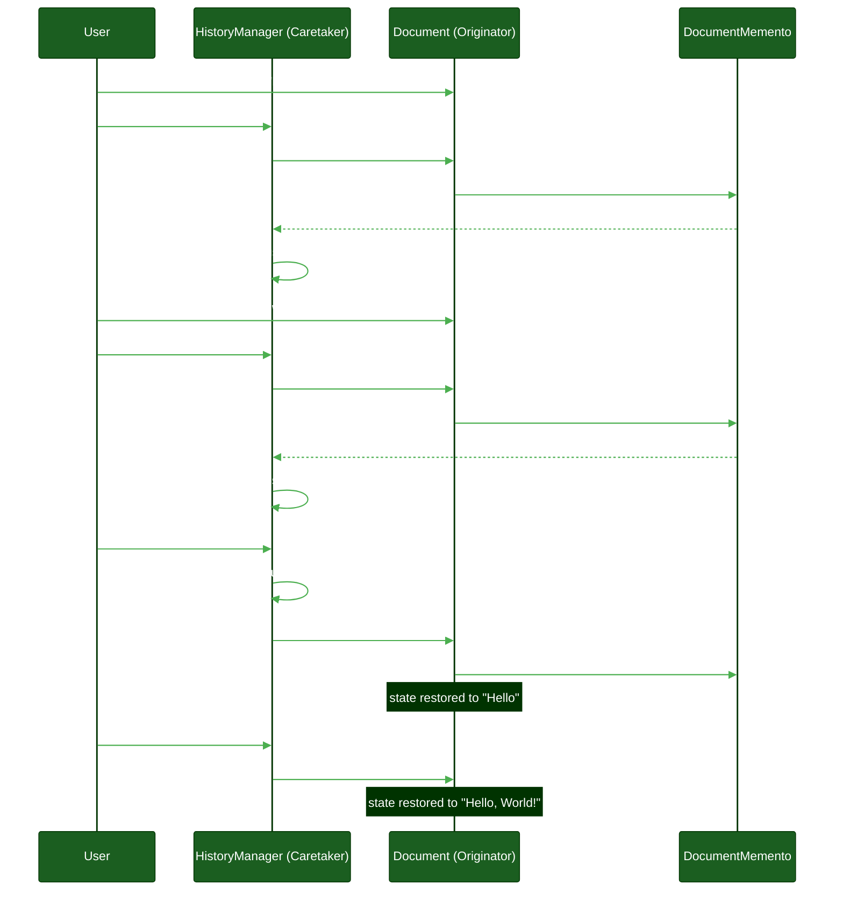
```mermaid
%%{init: {'theme': 'dark', 'themeVariables': {'actorBkg': '#1b5e20', 'actorBorder': '#003300', 'actorTextColor': '#ffffff', 'actorLineColor': '#003300', 'signalColor': '#4caf50', 'signalTextColor': '#ffffff', 'labelBoxBkgColor': '#003300', 'labelBoxBorderColor': '#003300', 'labelTextColor': '#ffffff', 'loopTextColor': '#ffffff', 'noteBkgColor': '#003300', 'noteBorderColor': '#003300', 'noteTextColor': '#ffffff', 'activationBkgColor': '#2e7d32', 'activationBorderColor': '#003300', 'sequenceNumberColor': '#ffffff',
    'background': '#1e1e1e'},
  'themeCSS': 'svg { background-color: #1e1e1e !important; padding: 1rem !important; border-radius: 8px !important; } .edgeLabel rect { fill: #1e1e1e !important; } text, tspan, .messageText, .signalText, .edgeLabel, .edgeLabel span, .pointLabel, .axisLabel, .quadrantTitle, .quadrantLabel { fill: #ffffff !important; color: #ffffff !important; stroke: none !important; }'
}}%%
sequenceDiagram
    participant User
    participant HistoryManager as HistoryManager (Caretaker)
    participant Document as Document (Originator)
    participant Memento as DocumentMemento

    User->>Document: type("Hello")
    User->>HistoryManager: checkpoint()
    HistoryManager->>Document: save()
    Document->>Memento: new DocumentMemento("Hello", 5)
    Memento-->>HistoryManager: memento₁
    HistoryManager->>HistoryManager: undoStack.push(memento₁)

    User->>Document: type(", World!")
    User->>HistoryManager: checkpoint()
    HistoryManager->>Document: save()
    Document->>Memento: new DocumentMemento("Hello, World!", 13)
    Memento-->>HistoryManager: memento₂
    HistoryManager->>HistoryManager: undoStack.push(memento₂)

    User->>HistoryManager: undo()
    HistoryManager->>HistoryManager: redoStack.push(undoStack.pop())
    HistoryManager->>Document: restore(memento₁)
    Document->>Memento: getContent(), getCursorPosition()
    Note over Document: state restored to "Hello"

    User->>HistoryManager: redo()
    HistoryManager->>Document: restore(memento₂)
    Note over Document: state restored to "Hello, World!"
```

### Industrial Case Study: Document Editor with Undo/Redo

The editor must support unlimited undo/redo. The `Document` (Originator) creates snapshots; the `HistoryManager` (Caretaker) stores them without knowing their internals.

```java
// The Memento — an opaque snapshot of Document's private state.
// Package-private constructor and accessors: ONLY Document can create or read these.
// HistoryManager holds references but cannot inspect them.
public final class DocumentMemento {
    private final String content;
    private final int cursorPosition;
    private final Instant savedAt;

    // Package-private: prevents external code from creating fake snapshots
    DocumentMemento(String content, int cursorPosition) {
        this.content = content;
        this.cursorPosition = cursorPosition;
        this.savedAt = Instant.now();
    }

    // Package-private getters: only Document (same package) restores from these
    String getContent() { return content; }
    int getCursorPosition() { return cursorPosition; }
    public Instant getSavedAt() { return savedAt; } // Public only for UI display
}

// The Originator — creates and consumes mementos
public class Document {
    private StringBuilder content;
    private int cursorPosition;

    public Document(String initialContent) {
        this.content = new StringBuilder(initialContent);
        this.cursorPosition = initialContent.length();
    }

    public void type(String text) {
        // Insert at cursor, not at end — mimics real editor behavior
        content.insert(cursorPosition, text);
        cursorPosition += text.length();
    }

    public void delete(int charCount) {
        int deleteFrom = Math.max(0, cursorPosition - charCount);
        content.delete(deleteFrom, cursorPosition);
        cursorPosition = deleteFrom;
    }

    public void moveCursorTo(int position) {
        this.cursorPosition = Math.max(0, Math.min(position, content.length()));
    }

    // Creates a snapshot of current state — only Document knows what to snapshot
    public DocumentMemento save() {
        return new DocumentMemento(content.toString(), cursorPosition);
    }

    // Restores from a snapshot — only Document knows how to apply it
    public void restore(DocumentMemento memento) {
        this.content = new StringBuilder(memento.getContent());
        this.cursorPosition = memento.getCursorPosition();
    }

    public String getContent() { return content.toString(); }
    public int getCursorPosition() { return cursorPosition; }
}

// The Caretaker — stores mementos but cannot inspect them
public class HistoryManager {
    private final Deque<DocumentMemento> undoStack = new ArrayDeque<>();
    private final Deque<DocumentMemento> redoStack = new ArrayDeque<>();
    private final Document document;
    private static final int MAX_HISTORY = 100; // Prevent unbounded memory growth

    public HistoryManager(Document document) {
        this.document = document;
        checkpoint(); // Always save the initial state as the baseline
    }

    public void checkpoint() {
        if (undoStack.size() >= MAX_HISTORY) {
            // Remove oldest entry to stay within memory budget
            ((ArrayDeque<DocumentMemento>) undoStack).removeLast();
        }
        undoStack.push(document.save());
        redoStack.clear(); // New action invalidates the redo future
    }

    public void undo() {
        if (!canUndo()) {
            System.out.println("[History] Nothing to undo.");
            return;
        }
        // Current state goes to redo stack before we pop it
        redoStack.push(undoStack.pop());
        // The new top of the undo stack is the previous state — restore it
        document.restore(undoStack.peek());
        System.out.printf("[History] Undo → \"%s\" (cursor: %d)%n",
            document.getContent(), document.getCursorPosition());
    }

    public void redo() {
        if (!canRedo()) {
            System.out.println("[History] Nothing to redo.");
            return;
        }
        DocumentMemento next = redoStack.pop();
        undoStack.push(next);    // Re-add to undo stack so it can be undone again
        document.restore(next);
        System.out.printf("[History] Redo → \"%s\" (cursor: %d)%n",
            document.getContent(), document.getCursorPosition());
    }

    public boolean canUndo() { return undoStack.size() > 1; } // > 1: keep baseline
    public boolean canRedo() { return !redoStack.isEmpty(); }

    public int getUndoDepth() { return undoStack.size() - 1; }
}

// --- Usage ---
Document doc = new Document("");
HistoryManager history = new HistoryManager(doc);

doc.type("Hello");        history.checkpoint(); // Snapshot: "Hello"
doc.type(", World");      history.checkpoint(); // Snapshot: "Hello, World"
doc.type("!");            history.checkpoint(); // Snapshot: "Hello, World!"
doc.delete(7);            history.checkpoint(); // Snapshot: "Hello"

System.out.println(doc.getContent());  // "Hello"
System.out.println("Undo depth: " + history.getUndoDepth()); // 4

history.undo(); // → "Hello, World!"
history.undo(); // → "Hello, World"
history.redo(); // → "Hello, World!"
history.undo(); // → "Hello, World"
history.undo(); // → "Hello"
history.undo(); // → "" (initial baseline)
history.undo(); // [History] Nothing to undo.
```

### When to Use / When to Avoid

| Use It When | Avoid It When |
| :--- | :--- |
| You need undo/redo and encapsulation must be preserved | State is large and snapshotting is too expensive — use command-based undo instead |
| State snapshots have a natural meaning (game saves, config backups) | The originator's state includes live resources (file handles, connections) |
| The caretaker should not understand the state it manages | Incremental diffs would be far more efficient than full snapshots |
| Rollback semantics are required (deploy configs, transaction scripts) | State contains references to mutable shared objects — snapshots would be stale |

---

## 6. Observer

> **Tell everyone who cares. Tell no one who does not.**

### The Hook

**The Observer pattern lets a subject broadcast state changes to any number of dependent observers — without knowing who they are, or even how many.**

### The Problem

A stock trading platform must update multiple systems when a price changes: the live dashboard, the alert engine, the trading bots, the compliance logger, and the portfolio calculator. Your first approach is direct calls:

```java
public void setPrice(double newPrice) {
    this.price = newPrice;
    dashboard.update(ticker, newPrice);
    alertEngine.check(ticker, newPrice);
    tradingBot.evaluate(ticker, newPrice);
    complianceLogger.log(ticker, newPrice);
    portfolioCalculator.recalculate(ticker, newPrice);
}
```

The `StockTicker` class now imports five other classes. Add a new consumer (a machine learning model, a websocket broadcaster) and you edit `StockTicker`. Remove one (the compliance logger is being replaced) and you edit `StockTicker`. Run a test that only needs the dashboard and you still get all five firing.

### The Insight

> 📖 **Read the Parable:** [The Town Crier and the Villagers (អ្នកប្រកាសព័ត៌មាន និងអ្នកភូមិ)](../../concepts/parables/92-the-newspaper-subscription.md)
> 🧠 **Read the Strategy Explanation:** [ELI5: Observer (ការចុះឈ្មោះជាវព័ត៌មានដោយស្វ័យប្រវត្ត)](../../concepts/design-patterns/03-eli5/03-observer.md)

The insight is **inversion of notification**. Instead of the subject pushing to specific consumers, consumers *register themselves* with the subject. The subject does not know who they are — it just calls `onPriceUpdate()` on each registered observer. Adding a new consumer is additive: zero changes to existing code.

### The Structure

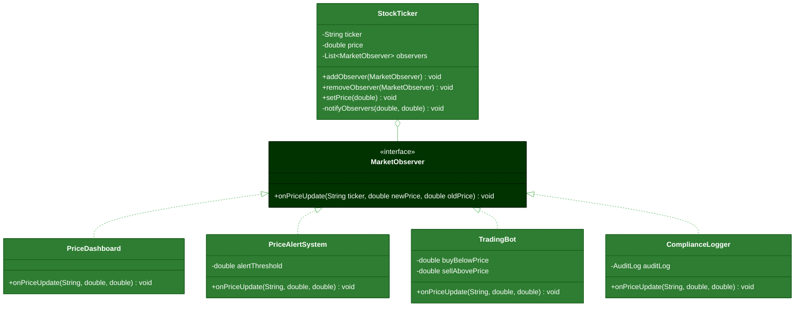
```mermaid
%%{init: {'theme': 'dark', 'themeVariables': {'primaryColor': '#1b5e20', 'primaryBorderColor': '#003300', 'primaryTextColor': '#ffffff', 'lineColor': '#4caf50', 'secondaryColor': '#37474f', 'tertiaryColor': '#4a148c', 'background': '#1a1a2e', 'mainBkg': '#1b5e20', 'nodeBorder': '#003300', 'clusterBkg': '#37474f', 'titleColor': '#ffffff', 'edgeLabelBackground': '#004d40', 'attributeBackgroundColorEven': '#1b5e20', 'attributeBackgroundColorOdd': '#003300', 'classText': '#ffffff', 'fillType0': '#1b5e20', 'fillType1': '#003300', 'fillType2': '#2e7d32', 'fillType3': '#37474f', 'fillType4': '#4a148c', 'fillType5': '#2e7d32', 'fillType6': '#b71c1c', 'fillType7': '#004d40', 'noteBkgColor': '#004d40', 'noteBorderColor': '#003300', 'noteTextColor': '#ffffff'},
  'themeCSS': 'svg { background-color: #1e1e1e !important; padding: 1rem !important; border-radius: 8px !important; } .edgeLabel rect { fill: #1e1e1e !important; } text, tspan, .messageText, .signalText, .edgeLabel, .edgeLabel span, .pointLabel, .axisLabel, .quadrantTitle, .quadrantLabel { fill: #ffffff !important; color: #ffffff !important; stroke: none !important; }'
}}%%
classDiagram
    class MarketObserver {
        <<interface>>
        +onPriceUpdate(String ticker, double newPrice, double oldPrice) void
    }

    class StockTicker {
        -String ticker
        -double price
        -List~MarketObserver~ observers
        +addObserver(MarketObserver) void
        +removeObserver(MarketObserver) void
        +setPrice(double) void
        -notifyObservers(double, double) void
    }

    class PriceDashboard {
        +onPriceUpdate(String, double, double) void
    }

    class PriceAlertSystem {
        -double alertThreshold
        +onPriceUpdate(String, double, double) void
    }

    class TradingBot {
        -double buyBelowPrice
        -double sellAbovePrice
        +onPriceUpdate(String, double, double) void
    }

    class ComplianceLogger {
        -AuditLog auditLog
        +onPriceUpdate(String, double, double) void
    }

    StockTicker o-- MarketObserver
    MarketObserver <|.. PriceDashboard
    MarketObserver <|.. PriceAlertSystem
    MarketObserver <|.. TradingBot
    MarketObserver <|.. ComplianceLogger
    style MarketObserver fill:#003300,stroke:#001a00,color:#ffffff
    style StockTicker fill:#2e7d32,stroke:#1b5e20,color:#ffffff
    style PriceDashboard fill:#2e7d32,stroke:#1b5e20,color:#ffffff
    style PriceAlertSystem fill:#2e7d32,stroke:#1b5e20,color:#ffffff
    style TradingBot fill:#2e7d32,stroke:#1b5e20,color:#ffffff
    style ComplianceLogger fill:#2e7d32,stroke:#1b5e20,color:#ffffff

```

### Observer Use Cases

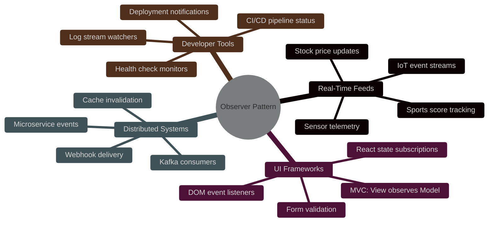
```mermaid
%%{init: {'theme': 'dark', 'themeVariables': {'primaryColor': '#1b5e20', 'primaryBorderColor': '#003300', 'primaryTextColor': '#ffffff', 'lineColor': '#4caf50',
    'background': '#1e1e1e'},
  'themeCSS': 'svg { background-color: #1e1e1e !important; padding: 1rem !important; border-radius: 8px !important; } .edgeLabel rect { fill: #1e1e1e !important; } text, tspan, .messageText, .signalText, .edgeLabel, .edgeLabel span, .pointLabel, .axisLabel, .quadrantTitle, .quadrantLabel { fill: #ffffff !important; color: #ffffff !important; stroke: none !important; }'
}}%%
mindmap
  root((Observer Pattern))
    Real-Time Feeds
      Stock price updates
      Sports score tracking
      Sensor telemetry
      IoT event streams
    UI Frameworks
      DOM event listeners
      MVC: View observes Model
      React state subscriptions
      Form validation
    Distributed Systems
      Kafka consumers
      Webhook delivery
      Microservice events
      Cache invalidation
    Developer Tools
      CI/CD pipeline status
      Log stream watchers
      Health check monitors
      Deployment notifications
```

### The Runtime Flow

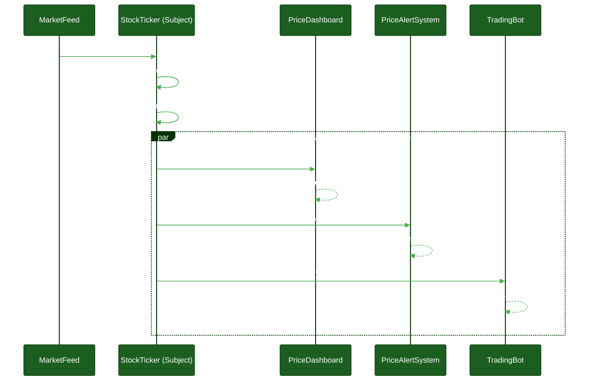
```mermaid
%%{init: {'theme': 'dark', 'themeVariables': {'actorBkg': '#1b5e20', 'actorBorder': '#003300', 'actorTextColor': '#ffffff', 'actorLineColor': '#003300', 'signalColor': '#4caf50', 'signalTextColor': '#ffffff', 'labelBoxBkgColor': '#003300', 'labelBoxBorderColor': '#003300', 'labelTextColor': '#ffffff', 'loopTextColor': '#ffffff', 'noteBkgColor': '#003300', 'noteBorderColor': '#003300', 'noteTextColor': '#ffffff', 'activationBkgColor': '#2e7d32', 'activationBorderColor': '#003300', 'sequenceNumberColor': '#ffffff',
    'background': '#1e1e1e'},
  'themeCSS': 'svg { background-color: #1e1e1e !important; padding: 1rem !important; border-radius: 8px !important; } .edgeLabel rect { fill: #1e1e1e !important; } text, tspan, .messageText, .signalText, .edgeLabel, .edgeLabel span, .pointLabel, .axisLabel, .quadrantTitle, .quadrantLabel { fill: #ffffff !important; color: #ffffff !important; stroke: none !important; }'
}}%%
sequenceDiagram
    participant MarketFeed
    participant Ticker as StockTicker (Subject)
    participant Dashboard as PriceDashboard
    participant Alerts as PriceAlertSystem
    participant Bot as TradingBot

    MarketFeed->>Ticker: setPrice(178.50)
    Ticker->>Ticker: oldPrice=182.00, price=178.50
    Ticker->>Ticker: notifyObservers(178.50, 182.00)
    par Notify all observers simultaneously
        Ticker->>Dashboard: onPriceUpdate("AAPL", 178.50, 182.00)
        Dashboard-->>Dashboard: Display ▼ $178.50
        Ticker->>Alerts: onPriceUpdate("AAPL", 178.50, 182.00)
        Alerts-->>Alerts: change=2.0%, threshold=2.0% → ALERT
        Ticker->>Bot: onPriceUpdate("AAPL", 178.50, 182.00)
        Bot-->>Bot: 178.50 < 180.00 → Place buy order
    end
```

### Industrial Case Study: Real-Time Stock Price Feed

Multiple systems react to price changes. They register once, receive updates automatically, and can be added or removed at any time without touching `StockTicker`.

```java
// The observer contract — all subscribers implement this
public interface MarketObserver {
    void onPriceUpdate(String ticker, double newPrice, double oldPrice);
}

// The subject — manages subscriptions and broadcasts changes
public class StockTicker {
    private final String ticker;
    private double price;
    // CopyOnWriteArrayList: observers can be added/removed while notifications are in-flight
    private final List<MarketObserver> observers = new CopyOnWriteArrayList<>();

    public StockTicker(String ticker, double initialPrice) {
        this.ticker = ticker;
        this.price = initialPrice;
    }

    public void addObserver(MarketObserver observer) {
        observers.add(observer);
    }

    public void removeObserver(MarketObserver observer) {
        observers.remove(observer);
    }

    public void setPrice(double newPrice) {
        double oldPrice = this.price;
        this.price = newPrice;

        // Suppress notification for floating-point noise
        if (Math.abs(newPrice - oldPrice) > 0.001) {
            notifyObservers(newPrice, oldPrice);
        }
    }

    private void notifyObservers(double newPrice, double oldPrice) {
        // Each observer is called in registration order.
        // In production, consider parallel notification for latency-sensitive systems.
        for (MarketObserver observer : observers) {
            try {
                observer.onPriceUpdate(ticker, newPrice, oldPrice);
            } catch (Exception e) {
                // Isolate observer failures: one bad observer cannot disrupt others
                System.err.printf("[Ticker] Observer %s threw: %s%n",
                    observer.getClass().getSimpleName(), e.getMessage());
            }
        }
    }

    public double getPrice() { return price; }
    public String getTicker() { return ticker; }
}

// Observer 1: live display widget
public class PriceDashboard implements MarketObserver {
    @Override
    public void onPriceUpdate(String ticker, double newPrice, double oldPrice) {
        String direction = newPrice > oldPrice ? "▲" : "▼";
        double change = newPrice - oldPrice;
        double changePercent = change / oldPrice * 100.0;
        System.out.printf("[Dashboard] %s %s $%.2f  (%+.2f | %+.2f%%)%n",
            ticker, direction, newPrice, change, changePercent);
    }
}

// Observer 2: threshold-based alert engine
public class PriceAlertSystem implements MarketObserver {
    private final double alertThresholdPercent;
    private final AlertService alertService;

    public PriceAlertSystem(double thresholdPercent, AlertService alertService) {
        this.alertThresholdPercent = thresholdPercent;
        this.alertService = alertService;
    }

    @Override
    public void onPriceUpdate(String ticker, double newPrice, double oldPrice) {
        double changePercent = Math.abs(newPrice - oldPrice) / oldPrice * 100.0;
        if (changePercent >= alertThresholdPercent) {
            String severity = changePercent >= 5.0 ? "CRITICAL" : "WARNING";
            alertService.send(severity,
                String.format("%s moved %.2f%% — from $%.2f to $%.2f",
                    ticker, changePercent, oldPrice, newPrice));
        }
    }
}

// Observer 3: automated trading bot
public class TradingBot implements MarketObserver {
    private final double buyBelowPrice;
    private final double sellAbovePrice;
    private final TradeExecutor executor;

    public TradingBot(double buyBelowPrice, double sellAbovePrice, TradeExecutor executor) {
        this.buyBelowPrice = buyBelowPrice;
        this.sellAbovePrice = sellAbovePrice;
        this.executor = executor;
    }

    @Override
    public void onPriceUpdate(String ticker, double newPrice, double oldPrice) {
        // Buy signal: price just crossed below the buy threshold
        if (newPrice < buyBelowPrice && oldPrice >= buyBelowPrice) {
            executor.placeBuyOrder(ticker, newPrice, 100);
            System.out.printf("[TradingBot] BUY %s @ $%.2f (crossed below $%.2f)%n",
                ticker, newPrice, buyBelowPrice);
        }
        // Sell signal: price just crossed above the sell threshold
        if (newPrice > sellAbovePrice && oldPrice <= sellAbovePrice) {
            executor.placeSellOrder(ticker, newPrice, 100);
            System.out.printf("[TradingBot] SELL %s @ $%.2f (crossed above $%.2f)%n",
                ticker, newPrice, sellAbovePrice);
        }
    }
}

// --- Usage ---
StockTicker apple = new StockTicker("AAPL", 185.00);

apple.addObserver(new PriceDashboard());
apple.addObserver(new PriceAlertSystem(2.0, alertService));   // Alert on 2%+ move
apple.addObserver(new TradingBot(180.00, 190.00, executor)); // Buy < $180, sell > $190

apple.setPrice(182.00); // Dashboard updates; 1.6% drop — no alert; bot: not triggered
apple.setPrice(178.50); // Dashboard; 2.0% drop → alert; bot: buy triggered
apple.setPrice(191.00); // Dashboard; 6.9% rise → critical alert; bot: sell triggered
```

### When to Use / When to Avoid

| Use It When | Avoid It When |
| :--- | :--- |
| One object's state change should trigger updates in many others | Notification order matters and observers are interdependent |
| The subject should not know who its consumers are | Too many observers cause performance bottlenecks (fan-out problem) |
| Consumers can be added and removed dynamically | Debugging is hard: unexpected notifications cause mysterious side effects |
| Event-driven architectures: DOM events, Kafka, webhooks | Memory leaks: observers must be explicitly removed (use `WeakReference` or cleanup hooks) |

---

## 7. Command

> **Turn a verb into a noun. Then you can store it, queue it, and undo it.**

### The Hook

**The Command pattern encapsulates a request as an object with an `execute()` method — making operations first-class citizens that can be queued, logged, undone, and replayed.**

### The Problem

You are building a smart home controller with a touchscreen remote. It has 20 buttons. Each button controls a different device: lights, speakers, thermostats, locks. You wire up button clicks directly to device methods:

```java
button1.onClick(() -> livingRoomLight.turnOn());
button2.onClick(() -> speaker.setVolume(50));
```

Three months later, the product team wants: undo buttons, macro buttons ("Movie Night" that runs 6 commands), a command scheduler ("turn off lights at 10pm"), and a command log for troubleshooting. None of those features are possible when your operations are anonymous lambdas. You cannot inspect them, reverse them, or persist them.

### The Insight

> 📖 **Read the Parable:** [The Waiter's Order Pad (ក្រដាសកុម្ម៉ង់របស់អ្នករត់តុ)](../../concepts/parables/93-the-waiters-order-pad.md)
> 🧠 **Read the Strategy Explanation:** [Socratic Method: Command (ការបំប្លែងសំណើការងារទៅជា Object តាមវិធីសាស្ត្រសូក្រាត)](../../concepts/design-patterns/05-socratic-method/01-command.md)

The insight is that **actions and intent should be separable from execution.** When you wrap an action in a `Command` object, you gain a handle on the *intent* — not just the result. You can reverse it (undo), re-run it (retry), delay it (queue), or combine it with others (macros). The invoker — the remote control — becomes completely decoupled from the receivers — the lights, speakers, locks. It just says "execute this" and "undo that."

### The Structure

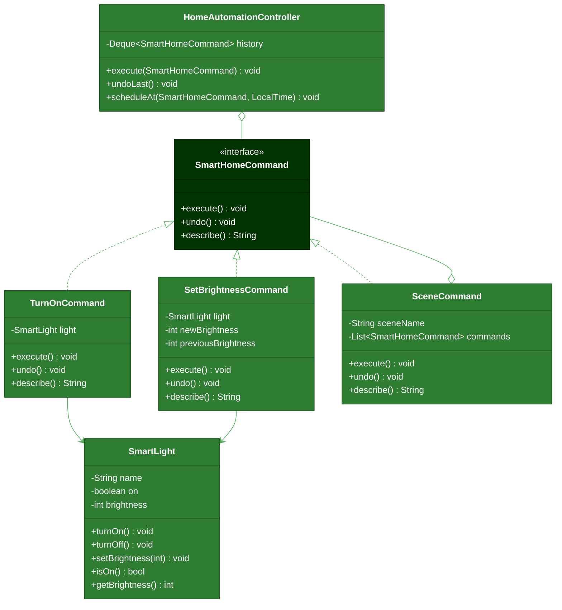
```mermaid
%%{init: {'theme': 'dark', 'themeVariables': {'primaryColor': '#1b5e20', 'primaryBorderColor': '#003300', 'primaryTextColor': '#ffffff', 'lineColor': '#4caf50', 'secondaryColor': '#37474f', 'tertiaryColor': '#4a148c', 'background': '#1a1a2e', 'mainBkg': '#1b5e20', 'nodeBorder': '#003300', 'clusterBkg': '#37474f', 'titleColor': '#ffffff', 'edgeLabelBackground': '#004d40', 'attributeBackgroundColorEven': '#1b5e20', 'attributeBackgroundColorOdd': '#003300', 'classText': '#ffffff', 'fillType0': '#1b5e20', 'fillType1': '#003300', 'fillType2': '#2e7d32', 'fillType3': '#37474f', 'fillType4': '#4a148c', 'fillType5': '#2e7d32', 'fillType6': '#b71c1c', 'fillType7': '#004d40', 'noteBkgColor': '#004d40', 'noteBorderColor': '#003300', 'noteTextColor': '#ffffff'},
  'themeCSS': 'svg { background-color: #1e1e1e !important; padding: 1rem !important; border-radius: 8px !important; } .edgeLabel rect { fill: #1e1e1e !important; } text, tspan, .messageText, .signalText, .edgeLabel, .edgeLabel span, .pointLabel, .axisLabel, .quadrantTitle, .quadrantLabel { fill: #ffffff !important; color: #ffffff !important; stroke: none !important; }'
}}%%
classDiagram
    class SmartHomeCommand {
        <<interface>>
        +execute() void
        +undo() void
        +describe() String
    }

    class TurnOnCommand {
        -SmartLight light
        +execute() void
        +undo() void
        +describe() String
    }

    class SetBrightnessCommand {
        -SmartLight light
        -int newBrightness
        -int previousBrightness
        +execute() void
        +undo() void
        +describe() String
    }

    class SceneCommand {
        -String sceneName
        -List~SmartHomeCommand~ commands
        +execute() void
        +undo() void
        +describe() String
    }

    class SmartLight {
        -String name
        -boolean on
        -int brightness
        +turnOn() void
        +turnOff() void
        +setBrightness(int) void
        +isOn() bool
        +getBrightness() int
    }

    class HomeAutomationController {
        -Deque~SmartHomeCommand~ history
        +execute(SmartHomeCommand) void
        +undoLast() void
        +scheduleAt(SmartHomeCommand, LocalTime) void
    }

    SmartHomeCommand <|.. TurnOnCommand
    SmartHomeCommand <|.. SetBrightnessCommand
    SmartHomeCommand <|.. SceneCommand
    SceneCommand o-- SmartHomeCommand
    TurnOnCommand --> SmartLight
    SetBrightnessCommand --> SmartLight
    HomeAutomationController o-- SmartHomeCommand
    style SmartHomeCommand fill:#003300,stroke:#001a00,color:#ffffff
    style TurnOnCommand fill:#2e7d32,stroke:#1b5e20,color:#ffffff
    style SetBrightnessCommand fill:#2e7d32,stroke:#1b5e20,color:#ffffff
    style SceneCommand fill:#2e7d32,stroke:#1b5e20,color:#ffffff
    style SmartLight fill:#2e7d32,stroke:#1b5e20,color:#ffffff
    style HomeAutomationController fill:#2e7d32,stroke:#1b5e20,color:#ffffff

```

### Command Use Cases

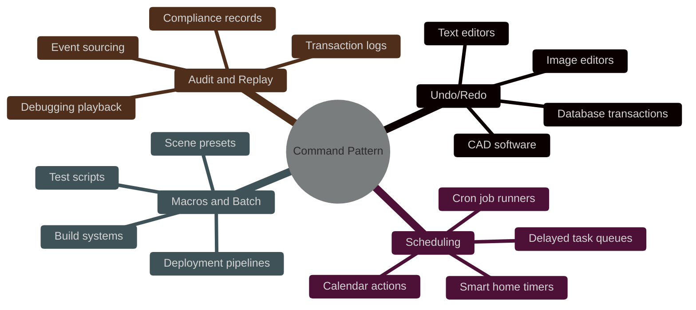
```mermaid
%%{init: {'theme': 'dark', 'themeVariables': {'primaryColor': '#1b5e20', 'primaryBorderColor': '#003300', 'primaryTextColor': '#ffffff', 'lineColor': '#4caf50',
    'background': '#1e1e1e'},
  'themeCSS': 'svg { background-color: #1e1e1e !important; padding: 1rem !important; border-radius: 8px !important; } .edgeLabel rect { fill: #1e1e1e !important; } text, tspan, .messageText, .signalText, .edgeLabel, .edgeLabel span, .pointLabel, .axisLabel, .quadrantTitle, .quadrantLabel { fill: #ffffff !important; color: #ffffff !important; stroke: none !important; }'
}}%%
mindmap
  root((Command Pattern))
    Undo/Redo
      Text editors
      Image editors
      CAD software
      Database transactions
    Scheduling
      Cron job runners
      Smart home timers
      Delayed task queues
      Calendar actions
    Macros and Batch
      Scene presets
      Test scripts
      Deployment pipelines
      Build systems
    Audit and Replay
      Transaction logs
      Event sourcing
      Debugging playback
      Compliance records
```

### The Runtime Flow

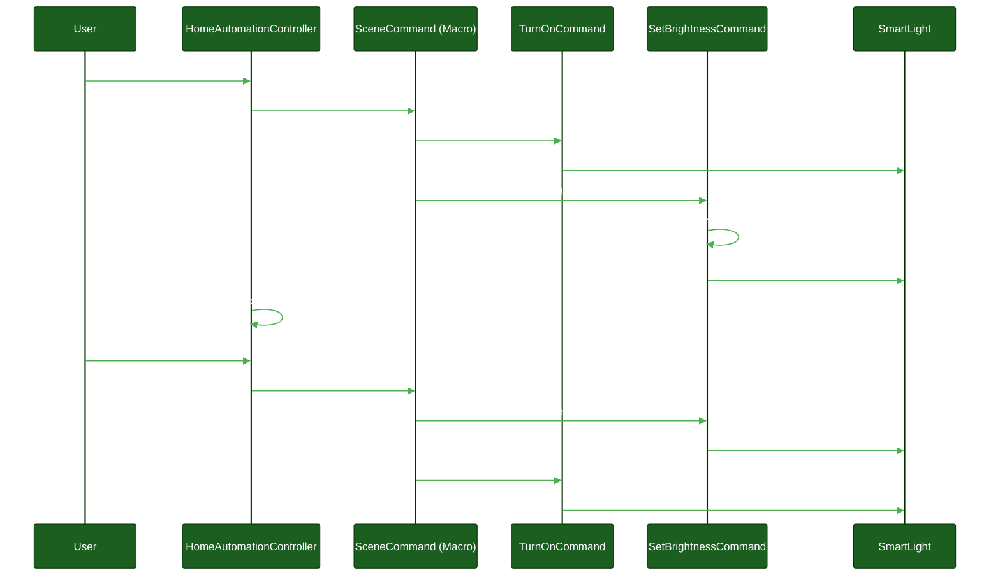
```mermaid
%%{init: {'theme': 'dark', 'themeVariables': {'actorBkg': '#1b5e20', 'actorBorder': '#003300', 'actorTextColor': '#ffffff', 'actorLineColor': '#003300', 'signalColor': '#4caf50', 'signalTextColor': '#ffffff', 'labelBoxBkgColor': '#003300', 'labelBoxBorderColor': '#003300', 'labelTextColor': '#ffffff', 'loopTextColor': '#ffffff', 'noteBkgColor': '#003300', 'noteBorderColor': '#003300', 'noteTextColor': '#ffffff', 'activationBkgColor': '#2e7d32', 'activationBorderColor': '#003300', 'sequenceNumberColor': '#ffffff',
    'background': '#1e1e1e'},
  'themeCSS': 'svg { background-color: #1e1e1e !important; padding: 1rem !important; border-radius: 8px !important; } .edgeLabel rect { fill: #1e1e1e !important; } text, tspan, .messageText, .signalText, .edgeLabel, .edgeLabel span, .pointLabel, .axisLabel, .quadrantTitle, .quadrantLabel { fill: #ffffff !important; color: #ffffff !important; stroke: none !important; }'
}}%%
sequenceDiagram
    participant User
    participant Controller as HomeAutomationController
    participant Scene as SceneCommand (Macro)
    participant LightCmd1 as TurnOnCommand
    participant BrightCmd1 as SetBrightnessCommand
    participant Light as SmartLight

    User->>Controller: execute(movieNightScene)
    Controller->>Scene: execute()
    Scene->>LightCmd1: execute()
    LightCmd1->>Light: turnOn()
    Scene->>BrightCmd1: execute()
    BrightCmd1->>BrightCmd1: previousBrightness = light.getBrightness()
    BrightCmd1->>Light: setBrightness(20)
    Controller->>Controller: history.push(movieNightScene)

    User->>Controller: undoLast()
    Controller->>Scene: undo()
    Scene->>BrightCmd1: undo() [reversed order]
    BrightCmd1->>Light: setBrightness(previousBrightness)
    Scene->>LightCmd1: undo()
    LightCmd1->>Light: turnOff()
```

### Industrial Case Study: Smart Home Automation with Undo

A home controller executes, logs, and undoes device commands. Macros combine multiple commands into a single undoable unit.

```java
// The command contract — every action must support execution and reversal
public interface SmartHomeCommand {
    void execute();
    void undo();
    String describe(); // Human-readable for audit logs and UI
}

// The Receiver — the device that does the actual work
public class SmartLight {
    private final String roomName;
    private boolean on = false;
    private int brightness = 100;

    public SmartLight(String roomName) { this.roomName = roomName; }

    public void turnOn() {
        on = true;
        System.out.printf("[%s Light] ON%n", roomName);
    }

    public void turnOff() {
        on = false;
        System.out.printf("[%s Light] OFF%n", roomName);
    }

    public void setBrightness(int level) {
        brightness = Math.max(0, Math.min(100, level));
        System.out.printf("[%s Light] Brightness → %d%%%n", roomName, brightness);
    }

    public boolean isOn() { return on; }
    public int getBrightness() { return brightness; }
    public String getRoomName() { return roomName; }
}

// Concrete Command 1: toggling a light on/off
public class TurnOnCommand implements SmartHomeCommand {
    private final SmartLight light;
    private boolean wasOnBefore; // Saved at execute-time for correct undo

    public TurnOnCommand(SmartLight light) { this.light = light; }

    @Override
    public void execute() {
        wasOnBefore = light.isOn(); // Capture pre-execute state for undo
        light.turnOn();
    }

    @Override
    public void undo() {
        // Undo to exact prior state, not just "turn off" — light may have already been on
        if (!wasOnBefore) light.turnOff();
    }

    @Override
    public String describe() { return "Turn on " + light.getRoomName() + " light"; }
}

// Concrete Command 2: adjusting brightness
public class SetBrightnessCommand implements SmartHomeCommand {
    private final SmartLight light;
    private final int targetBrightness;
    private int previousBrightness; // Captured at execute-time, not construction-time

    public SetBrightnessCommand(SmartLight light, int brightness) {
        this.light = light;
        this.targetBrightness = brightness;
    }

    @Override
    public void execute() {
        // MUST capture before changing — construction-time capture would be wrong
        // if another command ran between construction and execution
        previousBrightness = light.getBrightness();
        light.setBrightness(targetBrightness);
    }

    @Override
    public void undo() {
        light.setBrightness(previousBrightness);
    }

    @Override
    public String describe() {
        return String.format("Set %s brightness to %d%%", light.getRoomName(), targetBrightness);
    }
}

// Composite Command: a "scene" is many commands executed as one atomic unit
public class SceneCommand implements SmartHomeCommand {
    private final String sceneName;
    private final List<SmartHomeCommand> commands;

    public SceneCommand(String sceneName, List<SmartHomeCommand> commands) {
        this.sceneName = sceneName;
        // Defensive copy: prevent external mutation of the command list
        this.commands = List.copyOf(commands);
    }

    @Override
    public void execute() {
        commands.forEach(SmartHomeCommand::execute);
    }

    @Override
    public void undo() {
        // Undo in reverse order — last command applied should be first undone
        ListIterator<SmartHomeCommand> it = commands.listIterator(commands.size());
        while (it.hasPrevious()) {
            it.previous().undo();
        }
    }

    @Override
    public String describe() { return "Scene: " + sceneName; }
}

// The Invoker — knows only the Command interface, never device details
public class HomeAutomationController {
    private final Deque<SmartHomeCommand> history = new ArrayDeque<>();
    private final ScheduledExecutorService scheduler = Executors.newScheduledThreadPool(1);

    public void execute(SmartHomeCommand command) {
        command.execute();
        history.push(command);
        System.out.printf("[Controller] Executed: %s%n", command.describe());
    }

    public void undoLast() {
        if (history.isEmpty()) {
            System.out.println("[Controller] Nothing to undo.");
            return;
        }
        SmartHomeCommand last = history.pop();
        last.undo();
        System.out.printf("[Controller] Undid: %s%n", last.describe());
    }

    // Schedule a command for future execution — only possible because commands are objects
    public void scheduleAt(SmartHomeCommand command, long delaySeconds) {
        scheduler.schedule(
            () -> execute(command),
            delaySeconds,
            TimeUnit.SECONDS
        );
        System.out.printf("[Controller] Scheduled '%s' in %ds%n", command.describe(), delaySeconds);
    }

    public List<String> getCommandLog() {
        return history.stream()
            .map(SmartHomeCommand::describe)
            .collect(Collectors.toList());
    }
}

// --- Usage ---
SmartLight livingRoom = new SmartLight("Living Room");
SmartLight bedroom    = new SmartLight("Bedroom");

HomeAutomationController controller = new HomeAutomationController();

// Build and execute a "Movie Night" scene macro
SmartHomeCommand movieNight = new SceneCommand("Movie Night", List.of(
    new TurnOnCommand(livingRoom),
    new SetBrightnessCommand(livingRoom, 20),  // Dim for viewing
    new TurnOnCommand(bedroom),
    new SetBrightnessCommand(bedroom, 0)        // Off in bedroom
));

controller.execute(movieNight);
// [Living Room Light] ON
// [Living Room Light] Brightness → 20%
// [Bedroom Light] ON
// [Bedroom Light] Brightness → 0%

controller.undoLast();
// Reverses in order: brightness → on for each light
// [Bedroom Light] Brightness → 100% (restored)
// [Bedroom Light] OFF (restored)
// [Living Room Light] Brightness → 100%
// [Living Room Light] OFF

// Schedule lights-off for 10 seconds from now
controller.scheduleAt(new SceneCommand("Lights Off", List.of(
    new TurnOnCommand(livingRoom) // turns off because wasOnBefore=false after undo
)), 10);
```

### When to Use / When to Avoid

| Use It When | Avoid It When |
| :--- | :--- |
| You need undo/redo functionality | Operations are simple, stateless lambdas with no undo needed |
| Operations need to be queued, scheduled, or replayed | The command hierarchy grows so large it becomes unwieldy |
| You want to build macros (composite operations) | Strong coupling exists between command and receiver — just call the method |
| Audit logs or event sourcing require serializable operations | Performance overhead of object creation per operation is unacceptable |

---

## 8. State

> **An object's behavior is the reflection of its current moment.**

### The Hook

**The State pattern replaces a single class full of `if/else` branches on an enum with a family of state objects — each one knowing exactly what is valid in its moment.**

### The Problem

You are modeling an e-commerce order. An order can be: Pending, Confirmed, Shipped, Delivered, or Cancelled. Each state allows different actions. Your first draft:

```java
public void ship(Order order) {
    if (order.getStatus() == PENDING) throw new IllegalStateException("...");
    if (order.getStatus() == SHIPPED) { System.out.println("Already shipped"); return; }
    if (order.getStatus() == DELIVERED) throw new IllegalStateException("...");
    if (order.getStatus() == CONFIRMED) {
        order.setStatus(SHIPPED);
        warehouse.notifyShipment(order);
    }
}
```

Now do that for `confirm()`, `deliver()`, `cancel()`, and `return()`. You have 5 methods × 5 states = 25 conditional branches, all in one class. Add a "return requested" state, and you touch every method. The transitions are implicit and scattered. You cannot unit test "what happens when you try to cancel a delivered order" without constructing an entire `Order` object and navigating state manually.

### The Insight

> 📖 **Read the Parable:** [The Magic Vending Machine (ម៉ាស៊ីនលក់ភេសជ្ជៈវេទមន្ត)](../../concepts/parables/94-the-magic-vending-machine.md)
> 🧠 **Read the Strategy Explanation:** [Analogy Bridge: State (ការគ្រប់គ្រងស្ថានភាពផ្លាស់ប្តូរនៃប្រព័ន្ធ)](../../concepts/design-patterns/04-analogy-bridge/03-state.md)

The insight is that **state should govern behavior, not annotate it.** Each state is a role an order temporarily plays. When the order is in `ConfirmedState`, it knows everything about what a confirmed order can and cannot do. The `Order` class simply delegates all behavior to whichever state object it currently holds. Adding a new state means adding one new class — not editing five existing methods.

### The Structure

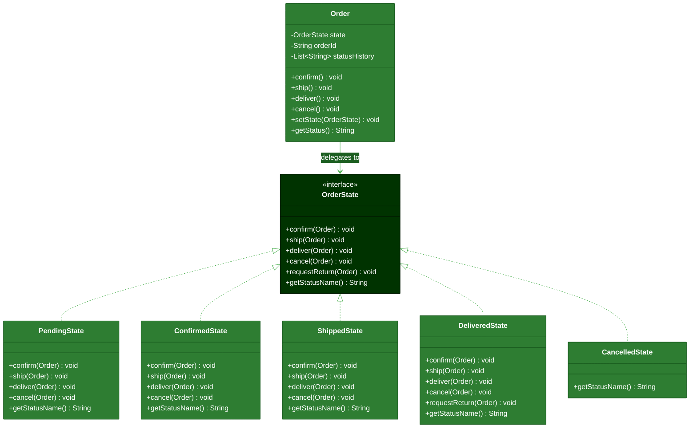
```mermaid
%%{init: {'theme': 'dark', 'themeVariables': {'primaryColor': '#1b5e20', 'primaryBorderColor': '#003300', 'primaryTextColor': '#ffffff', 'lineColor': '#4caf50', 'secondaryColor': '#37474f', 'tertiaryColor': '#4a148c', 'background': '#1a1a2e', 'mainBkg': '#1b5e20', 'nodeBorder': '#003300', 'clusterBkg': '#37474f', 'titleColor': '#ffffff', 'edgeLabelBackground': '#004d40', 'attributeBackgroundColorEven': '#1b5e20', 'attributeBackgroundColorOdd': '#003300', 'classText': '#ffffff', 'fillType0': '#1b5e20', 'fillType1': '#003300', 'fillType2': '#2e7d32', 'fillType3': '#37474f', 'fillType4': '#4a148c', 'fillType5': '#2e7d32', 'fillType6': '#b71c1c', 'fillType7': '#004d40', 'noteBkgColor': '#004d40', 'noteBorderColor': '#003300', 'noteTextColor': '#ffffff'},
  'themeCSS': 'svg { background-color: #1e1e1e !important; padding: 1rem !important; border-radius: 8px !important; } .edgeLabel rect { fill: #1e1e1e !important; } text, tspan, .messageText, .signalText, .edgeLabel, .edgeLabel span, .pointLabel, .axisLabel, .quadrantTitle, .quadrantLabel { fill: #ffffff !important; color: #ffffff !important; stroke: none !important; }'
}}%%
classDiagram
    class OrderState {
        <<interface>>
        +confirm(Order) void
        +ship(Order) void
        +deliver(Order) void
        +cancel(Order) void
        +requestReturn(Order) void
        +getStatusName() String
    }

    class PendingState {
        +confirm(Order) void
        +ship(Order) void
        +deliver(Order) void
        +cancel(Order) void
        +getStatusName() String
    }

    class ConfirmedState {
        +confirm(Order) void
        +ship(Order) void
        +deliver(Order) void
        +cancel(Order) void
        +getStatusName() String
    }

    class ShippedState {
        +confirm(Order) void
        +ship(Order) void
        +deliver(Order) void
        +cancel(Order) void
        +getStatusName() String
    }

    class DeliveredState {
        +confirm(Order) void
        +ship(Order) void
        +deliver(Order) void
        +cancel(Order) void
        +requestReturn(Order) void
        +getStatusName() String
    }

    class CancelledState {
        +getStatusName() String
    }

    class Order {
        -OrderState state
        -String orderId
        -List~String~ statusHistory
        +confirm() void
        +ship() void
        +deliver() void
        +cancel() void
        +setState(OrderState) void
        +getStatus() String
    }

    OrderState <|.. PendingState
    OrderState <|.. ConfirmedState
    OrderState <|.. ShippedState
    OrderState <|.. DeliveredState
    OrderState <|.. CancelledState
    Order --> OrderState : delegates to
    style OrderState fill:#003300,stroke:#001a00,color:#ffffff
    style PendingState fill:#2e7d32,stroke:#1b5e20,color:#ffffff
    style ConfirmedState fill:#2e7d32,stroke:#1b5e20,color:#ffffff
    style ShippedState fill:#2e7d32,stroke:#1b5e20,color:#ffffff
    style DeliveredState fill:#2e7d32,stroke:#1b5e20,color:#ffffff
    style CancelledState fill:#2e7d32,stroke:#1b5e20,color:#ffffff
    style Order fill:#2e7d32,stroke:#1b5e20,color:#ffffff

```

### Order Lifecycle State Machine

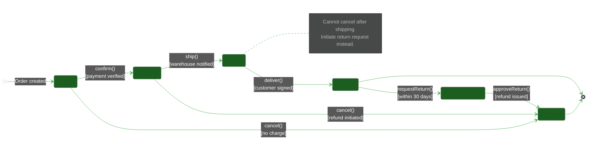
```mermaid
%%{init: {'theme': 'dark', 'themeVariables': {'stateBkg': '#1b5e20', 'stateBorder': '#003300', 'transitionColor': '#4caf50', 'labelColor': '#ffffff', 'altBackground': '#2e7d32', 'errorBkgColor': '#b71c1c', 'errorTextColor': '#ffffff', 'fillType0': '#1b5e20', 'fillType1': '#003300', 'fillType2': '#2e7d32',
    'background': '#1e1e1e'},
  'themeCSS': 'svg { background-color: #1e1e1e !important; padding: 1rem !important; border-radius: 8px !important; } .edgeLabel rect { fill: #1e1e1e !important; } text, tspan, .messageText, .signalText, .edgeLabel, .edgeLabel span, .pointLabel, .axisLabel, .quadrantTitle, .quadrantLabel { fill: #ffffff !important; color: #ffffff !important; stroke: none !important; }'
}}%%
stateDiagram-v2
    direction LR

    [*] --> Pending : Order created

    Pending --> Confirmed : confirm()<br/>[payment verified]
    Pending --> Cancelled : cancel()<br/>[no charge]

    Confirmed --> Shipped : ship()<br/>[warehouse notified]
    Confirmed --> Cancelled : cancel()<br/>[refund initiated]

    Shipped --> Delivered : deliver()<br/>[customer signed]

    Delivered --> ReturnRequested : requestReturn()<br/>[within 30 days]
    ReturnRequested --> Cancelled : approveReturn()<br/>[refund issued]

    Cancelled --> [*]
    Delivered --> [*]

    note right of Shipped
      Cannot cancel after shipping.
      Initiate return request instead.
    end note
```

### Industrial Case Study: E-Commerce Order Lifecycle

Each state encapsulates exactly what actions are valid in that moment. Illegal transitions throw immediately. Adding a new state requires no changes to existing state classes.

```java
// The state interface — every state must handle every possible event
public interface OrderState {
    void confirm(Order order);
    void ship(Order order);
    void deliver(Order order);
    void cancel(Order order);
    void requestReturn(Order order);
    String getStatusName();
}

// State 1: Order exists but payment not yet verified
public class PendingState implements OrderState {
    @Override
    public void confirm(Order order) {
        System.out.println("[Order] Payment verified. Confirmed.");
        order.setState(new ConfirmedState());
    }

    @Override
    public void ship(Order order) {
        // Hard fail — throwing makes invalid transitions obvious and traceable
        throw new IllegalStateException("Cannot ship an unconfirmed order.");
    }

    @Override
    public void deliver(Order order) {
        throw new IllegalStateException("Cannot deliver before shipping.");
    }

    @Override
    public void cancel(Order order) {
        System.out.println("[Order] Cancelled (pending — no payment taken).");
        order.setState(new CancelledState());
    }

    @Override
    public void requestReturn(Order order) {
        throw new IllegalStateException("Cannot return an order that has not been delivered.");
    }

    @Override
    public String getStatusName() { return "PENDING"; }
}

// State 2: Payment confirmed, awaiting warehouse dispatch
public class ConfirmedState implements OrderState {
    @Override
    public void confirm(Order order) {
        System.out.println("[Order] Already confirmed — no action.");
    }

    @Override
    public void ship(Order order) {
        System.out.println("[Order] Warehouse notified. Label printed. Shipped.");
        order.setState(new ShippedState());
    }

    @Override
    public void deliver(Order order) {
        throw new IllegalStateException("Order cannot be delivered before it is shipped.");
    }

    @Override
    public void cancel(Order order) {
        System.out.println("[Order] Cancelled (confirmed — refund initiated).");
        order.setState(new CancelledState());
    }

    @Override
    public void requestReturn(Order order) {
        throw new IllegalStateException("Cannot request a return before delivery.");
    }

    @Override
    public String getStatusName() { return "CONFIRMED"; }
}

// State 3: In transit
public class ShippedState implements OrderState {
    @Override
    public void confirm(Order order) {
        System.out.println("[Order] Already confirmed and shipped.");
    }

    @Override
    public void ship(Order order) {
        System.out.println("[Order] Already shipped.");
    }

    @Override
    public void deliver(Order order) {
        System.out.println("[Order] Delivery confirmed. Order complete.");
        order.setState(new DeliveredState());
    }

    @Override
    public void cancel(Order order) {
        // Business rule: cannot cancel once the carrier has it
        throw new IllegalStateException(
            "Cannot cancel after dispatch. Initiate a return request after delivery.");
    }

    @Override
    public void requestReturn(Order order) {
        throw new IllegalStateException("Cannot return before delivery confirmation.");
    }

    @Override
    public String getStatusName() { return "SHIPPED"; }
}

// State 4: Customer has received the package
public class DeliveredState implements OrderState {
    private final Instant deliveredAt = Instant.now();
    private static final int RETURN_WINDOW_DAYS = 30;

    @Override
    public void confirm(Order order) { throw new IllegalStateException("Already delivered."); }

    @Override
    public void ship(Order order) { throw new IllegalStateException("Already delivered."); }

    @Override
    public void deliver(Order order) {
        System.out.println("[Order] Already marked as delivered.");
    }

    @Override
    public void cancel(Order order) {
        throw new IllegalStateException("Delivered orders cannot be cancelled. Use requestReturn().");
    }

    @Override
    public void requestReturn(Order order) {
        long daysSinceDelivery = ChronoUnit.DAYS.between(deliveredAt, Instant.now());
        if (daysSinceDelivery > RETURN_WINDOW_DAYS) {
            throw new IllegalStateException(
                String.format("Return window of %d days has expired.", RETURN_WINDOW_DAYS));
        }
        System.out.println("[Order] Return request accepted. Return label sent.");
        order.setState(new ReturnRequestedState());
    }

    @Override
    public String getStatusName() { return "DELIVERED"; }
}

// State 5: Terminal — no further transitions allowed
public class CancelledState implements OrderState {
    @Override public void confirm(Order o) { throw new IllegalStateException("Order is cancelled."); }
    @Override public void ship(Order o)    { throw new IllegalStateException("Order is cancelled."); }
    @Override public void deliver(Order o) { throw new IllegalStateException("Order is cancelled."); }
    @Override public void cancel(Order o)  { System.out.println("[Order] Already cancelled."); }
    @Override public void requestReturn(Order o) { throw new IllegalStateException("Order is cancelled."); }
    @Override public String getStatusName() { return "CANCELLED"; }
}

// State 6: Return in progress
public class ReturnRequestedState implements OrderState {
    @Override public void confirm(Order o) { throw new IllegalStateException("Return in progress."); }
    @Override public void ship(Order o)    { throw new IllegalStateException("Return in progress."); }
    @Override public void deliver(Order o) { throw new IllegalStateException("Return in progress."); }
    @Override public void cancel(Order o) {
        System.out.println("[Order] Return approved. Refund initiated.");
        o.setState(new CancelledState()); // Reuse CancelledState as the post-return terminal state
    }
    @Override public void requestReturn(Order o) { System.out.println("[Order] Return already requested."); }
    @Override public String getStatusName() { return "RETURN_REQUESTED"; }
}

// The Context — delegates everything to the current state object
public class Order {
    private OrderState state;
    private final String orderId;
    private final List<String> statusHistory = new ArrayList<>();

    public Order(String orderId) {
        this.orderId = orderId;
        this.state = new PendingState();
        statusHistory.add("CREATED");
    }

    // Called by state objects — only way to change state
    public void setState(OrderState newState) {
        String prev = state.getStatusName();
        this.state = newState;
        String next = newState.getStatusName();
        statusHistory.add(next);
        System.out.printf("[Order %s] %s → %s%n", orderId, prev, next);
    }

    // No if/else here — all logic lives in the state objects
    public void confirm()       { state.confirm(this); }
    public void ship()          { state.ship(this); }
    public void deliver()       { state.deliver(this); }
    public void cancel()        { state.cancel(this); }
    public void requestReturn() { state.requestReturn(this); }

    public String getStatus()          { return state.getStatusName(); }
    public String getOrderId()         { return orderId; }
    public List<String> getHistory()   { return Collections.unmodifiableList(statusHistory); }
}

// --- Usage ---
Order order = new Order("ORD-7841");
order.confirm();        // PENDING → CONFIRMED
order.ship();           // CONFIRMED → SHIPPED
order.deliver();        // SHIPPED → DELIVERED
order.requestReturn();  // DELIVERED → RETURN_REQUESTED
order.cancel();         // RETURN_REQUESTED → CANCELLED (refund)

System.out.println(order.getHistory());
// [CREATED, CONFIRMED, SHIPPED, DELIVERED, RETURN_REQUESTED, CANCELLED]

// Illegal transition — caught immediately
try {
    order.confirm(); // throws IllegalStateException: Order is cancelled.
} catch (IllegalStateException e) {
    System.err.println(e.getMessage());
}
```

### When to Use / When to Avoid

| Use It When | Avoid It When |
| :--- | :--- |
| An object's behavior changes drastically based on internal state | You have only 2-3 states with simple transitions — an enum with a switch is fine |
| Transition logic is complex and state-specific | States are just flags and behavior barely differs |
| You want illegal transitions to fail fast and explicitly | The state machine has hundreds of states — consider a dedicated state machine library |
| Each state needs to be independently testable | States are stateless and can be represented as constants — use the Flyweight variant |

---

## 9. Template Method

> **The algorithm is a contract. The details are negotiable.**

### The Hook

**The Template Method pattern defines the skeleton of an algorithm in a base class and lets subclasses override specific steps without changing the overall structure.**

### The Problem

You maintain three data import pipelines: one reads from CSV files, one calls a REST API, and one queries a database. All three do essentially the same thing: connect, extract, validate, transform, save, disconnect. But you have three completely separate classes, each copy-pasting the same orchestration:

```java
// CSV pipeline
connect → extract CSV → validate → transform → save → disconnect

// API pipeline
authenticate → fetch pages → validate → transform → save → logout

// DB pipeline
openConnection → runQuery → validate → transform → save → closeConnection
```

The `validate` and `save` steps are identical across all three. The import counter, error handling, and logging wrappers are duplicated. When a bug is found in the `validate` step, you fix it in three places — and six months later someone adds a fourth pipeline that still has the bug because nobody knew to copy the fix.

### The Insight

> 📖 **Read the Parable:** [The Master Baker's Recipe (រូបមន្តធ្វើនំរបស់មេចុងភៅ)](../../concepts/parables/95-the-master-bakers-recipe.md)
> 🧠 **Read the Strategy Explanation:** [Journalist Strategy: Template Method (ការកំណត់គ្រោងគំរូនៃជំហានការងារ)](../../concepts/design-patterns/06-journalist-inverted-pyramid/03-template-method.md)

The insight is to separate **what varies** from **what stays the same**. The orchestration — the sequence of steps — never changes. The implementation of each step may differ per source. Put the sequence in a `final` method in the base class. Put the variable steps as `abstract` methods that subclasses must implement. The base class owns the algorithm's structure. Subclasses own only their specific details.

### The Structure

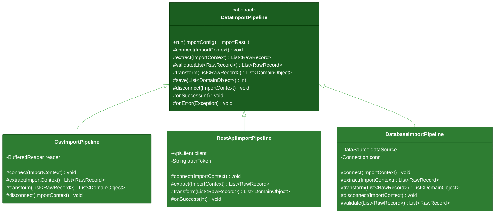
```mermaid
%%{init: {'theme': 'dark', 'themeVariables': {'primaryColor': '#1b5e20', 'primaryBorderColor': '#003300', 'primaryTextColor': '#ffffff', 'lineColor': '#4caf50', 'secondaryColor': '#37474f', 'tertiaryColor': '#4a148c', 'background': '#1a1a2e', 'mainBkg': '#1b5e20', 'nodeBorder': '#003300', 'clusterBkg': '#37474f', 'titleColor': '#ffffff', 'edgeLabelBackground': '#004d40', 'attributeBackgroundColorEven': '#1b5e20', 'attributeBackgroundColorOdd': '#003300', 'classText': '#ffffff', 'fillType0': '#1b5e20', 'fillType1': '#003300', 'fillType2': '#2e7d32', 'fillType3': '#37474f', 'fillType4': '#4a148c', 'fillType5': '#2e7d32', 'fillType6': '#b71c1c', 'fillType7': '#004d40', 'noteBkgColor': '#004d40', 'noteBorderColor': '#003300', 'noteTextColor': '#ffffff'},
  'themeCSS': 'svg { background-color: #1e1e1e !important; padding: 1rem !important; border-radius: 8px !important; } .edgeLabel rect { fill: #1e1e1e !important; } text, tspan, .messageText, .signalText, .edgeLabel, .edgeLabel span, .pointLabel, .axisLabel, .quadrantTitle, .quadrantLabel { fill: #ffffff !important; color: #ffffff !important; stroke: none !important; }'
}}%%
classDiagram
    class DataImportPipeline {
        <<abstract>>
        +run(ImportConfig) ImportResult
        #connect(ImportContext) void
        #extract(ImportContext) List~RawRecord~
        #validate(List~RawRecord~) List~RawRecord~
        #transform(List~RawRecord~) List~DomainObject~
        #save(List~DomainObject~) int
        #disconnect(ImportContext) void
        #onSuccess(int) void
        #onError(Exception) void
    }

    class CsvImportPipeline {
        -BufferedReader reader
        #connect(ImportContext) void
        #extract(ImportContext) List~RawRecord~
        #transform(List~RawRecord~) List~DomainObject~
        #disconnect(ImportContext) void
    }

    class RestApiImportPipeline {
        -ApiClient client
        -String authToken
        #connect(ImportContext) void
        #extract(ImportContext) List~RawRecord~
        #transform(List~RawRecord~) List~DomainObject~
        #onSuccess(int) void
    }

    class DatabaseImportPipeline {
        -DataSource dataSource
        -Connection conn
        #connect(ImportContext) void
        #extract(ImportContext) List~RawRecord~
        #transform(List~RawRecord~) List~DomainObject~
        #disconnect(ImportContext) void
        #validate(List~RawRecord~) List~RawRecord~
    }

    DataImportPipeline <|-- CsvImportPipeline
    DataImportPipeline <|-- RestApiImportPipeline
    DataImportPipeline <|-- DatabaseImportPipeline
    style DataImportPipeline fill:#1b5e20,stroke:#003300,color:#ffffff
    style CsvImportPipeline fill:#2e7d32,stroke:#1b5e20,color:#ffffff
    style RestApiImportPipeline fill:#2e7d32,stroke:#1b5e20,color:#ffffff
    style DatabaseImportPipeline fill:#2e7d32,stroke:#1b5e20,color:#ffffff
    style ImportConfig fill:#2e7d32,stroke:#1b5e20,color:#ffffff
    style ImportResult fill:#2e7d32,stroke:#1b5e20,color:#ffffff
    style ImportContext fill:#2e7d32,stroke:#1b5e20,color:#ffffff

```

### Algorithm Flow

```mermaid
%%{init: {'theme': 'dark', 'themeVariables': {'primaryColor': '#1b5e20', 'primaryBorderColor': '#003300', 'primaryTextColor': '#ffffff', 'lineColor': '#4caf50', 'secondaryColor': '#37474f', 'tertiaryColor': '#4a148c', 'background': '#1a1a2e', 'mainBkg': '#1b5e20', 'nodeBorder': '#003300', 'clusterBkg': '#37474f', 'titleColor': '#ffffff', 'edgeLabelBackground': '#004d40', 'attributeBackgroundColorEven': '#1b5e20', 'attributeBackgroundColorOdd': '#003300', 'classText': '#ffffff', 'fillType0': '#1b5e20', 'fillType1': '#003300', 'fillType2': '#2e7d32', 'fillType3': '#37474f', 'fillType4': '#4a148c', 'fillType5': '#2e7d32', 'fillType6': '#b71c1c', 'fillType7': '#004d40'},
  'themeCSS': 'svg { background-color: #1e1e1e !important; padding: 1rem !important; border-radius: 8px !important; } .edgeLabel rect { fill: #1e1e1e !important; } text, tspan, .messageText, .signalText, .edgeLabel, .edgeLabel span, .pointLabel, .axisLabel, .quadrantTitle, .quadrantLabel { fill: #ffffff !important; color: #ffffff !important; stroke: none !important; }'
}}%%
flowchart TD
    A([run ImportConfig]) --> B[connect<br/>open source]
    B --> C[extract<br/>fetch raw records]
    C --> D[validate<br/>filter bad records]
    D --> E[transform<br/>map to domain objects]
    E --> F[save<br/>persist to repository]
    F --> G{Success?}
    G -- Yes --> H[onSuccess hook<br/>optional override]
    G -- No --> I[onError hook<br/>optional override]
    H --> J[disconnect<br/>cleanup resources]
    I --> J
    J --> K([Return ImportResult])

    style B fill:#1b5e20,color:#fff
    style C fill:#1b5e20,color:#fff
    style D fill:#1565c0,color:#fff
    style E fill:#1565c0,color:#fff
    style F fill:#1b5e20,color:#fff
    style H fill:#4a148c,color:#fff
    style I fill:#4a148c,color:#fff

    classDef abstract fill:#1b5e20,color:#fff
    classDef concrete fill:#1565c0,color:#fff
    classDef hook fill:#4a148c,color:#fff
```

### Industrial Case Study: Multi-Format Data Import Pipeline

Three pipeline implementations share the same algorithm structure. Only the source-specific steps differ. Hooks provide optional extension points.

```java
// The abstract base class — owns the algorithm skeleton
public abstract class DataImportPipeline {

    // The Template Method — FINAL: subclasses cannot reorder or bypass steps.
    // This is the entire value of the pattern: the sequence is locked in.
    public final ImportResult run(ImportConfig config) {
        ImportContext ctx = new ImportContext(config);
        long startTime = System.currentTimeMillis();

        try {
            System.out.printf("[%s] Connecting to source...%n", pipelineName());
            connect(ctx);  // Abstract: each subclass opens its own source

            System.out.printf("[%s] Extracting raw records...%n", pipelineName());
            List<RawRecord> raw = extract(ctx);  // Abstract: source-specific fetch

            System.out.printf("[%s] Validating %d records...%n", pipelineName(), raw.size());
            List<RawRecord> valid = validate(raw);  // Concrete default, overridable
            int rejectedCount = raw.size() - valid.size();
            if (rejectedCount > 0) {
                System.out.printf("[%s] Rejected %d invalid records.%n", pipelineName(), rejectedCount);
            }

            System.out.printf("[%s] Transforming %d records...%n", pipelineName(), valid.size());
            List<DomainObject> transformed = transform(valid);  // Abstract: source-specific mapping

            System.out.printf("[%s] Saving %d objects...%n", pipelineName(), transformed.size());
            int saved = save(transformed);  // Concrete: same repository for all pipelines

            long duration = System.currentTimeMillis() - startTime;
            System.out.printf("[%s] Complete: %d saved in %dms.%n", pipelineName(), saved, duration);

            onSuccess(saved);  // Hook: optional post-success action
            return ImportResult.success(saved, rejectedCount, duration);

        } catch (Exception e) {
            onError(e);  // Hook: optional error handling beyond default log
            return ImportResult.failure(e.getMessage());

        } finally {
            // ALWAYS disconnect, even if an exception occurred midway
            disconnect(ctx);
        }
    }

    // --- Abstract steps: subclasses MUST implement ---
    protected abstract void connect(ImportContext ctx) throws Exception;
    protected abstract List<RawRecord> extract(ImportContext ctx) throws Exception;
    protected abstract List<DomainObject> transform(List<RawRecord> validRecords);

    // --- Concrete step: shared across all pipelines ---
    protected List<RawRecord> validate(List<RawRecord> records) {
        return records.stream()
            .filter(r -> r != null && !r.isEmpty())    // Remove null and empty records
            .filter(r -> r.getFields().size() >= 2)    // At minimum: id + one data field
            .collect(Collectors.toList());
    }

    // All pipelines use the same repository — no need to override
    protected int save(List<DomainObject> objects) {
        return productRepository.saveAll(objects);
    }

    // --- Hooks: optional customization points ---
    protected void onSuccess(int savedCount) {
        // Default: do nothing. Subclasses override only if they need post-success action.
    }

    protected void onError(Exception e) {
        System.err.printf("[%s] ERROR: %s%n", pipelineName(), e.getMessage());
    }

    protected void disconnect(ImportContext ctx) {
        // Default: do nothing. Subclasses override only if they hold open resources.
    }

    protected abstract String pipelineName();
}

// CSV Implementation — only overrides what differs
public class CsvImportPipeline extends DataImportPipeline {
    private BufferedReader reader;

    @Override
    protected void connect(ImportContext ctx) throws IOException {
        // Open the file; exception propagates up and triggers onError + disconnect
        reader = new BufferedReader(new FileReader(ctx.getConfig().getFilePath()));
    }

    @Override
    protected List<RawRecord> extract(ImportContext ctx) throws IOException {
        return reader.lines()
            .skip(1)  // Skip the CSV header row
            .map(RawRecord::fromCsv)
            .collect(Collectors.toList());
    }

    @Override
    protected List<DomainObject> transform(List<RawRecord> records) {
        return records.stream()
            .map(Product::fromCsvRecord)  // CSV-specific field mapping
            .collect(Collectors.toList());
    }

    @Override
    protected void disconnect(ImportContext ctx) {
        // Close reader whether extraction succeeded or failed
        if (reader != null) {
            try { reader.close(); }
            catch (IOException e) { System.err.println("Failed to close CSV reader: " + e.getMessage()); }
        }
    }

    @Override
    protected String pipelineName() { return "CsvPipeline"; }
}

// REST API Implementation — connect authenticates, onSuccess notifies the API
public class RestApiImportPipeline extends DataImportPipeline {
    private final ApiClient client;
    private String authToken;

    public RestApiImportPipeline(ApiClient client) { this.client = client; }

    @Override
    protected void connect(ImportContext ctx) throws Exception {
        // OAuth token exchange — stored for use in extract()
        authToken = client.authenticate(ctx.getConfig().getApiKey());
        if (authToken == null) throw new AuthenticationException("API authentication failed");
    }

    @Override
    protected List<RawRecord> extract(ImportContext ctx) throws Exception {
        // Paginated fetch — returns all items across all pages
        return client.fetchAllPages(ctx.getConfig().getEndpoint(), authToken);
    }

    @Override
    protected List<DomainObject> transform(List<RawRecord> records) {
        return records.stream()
            .map(Product::fromApiRecord)  // API JSON field mapping differs from CSV
            .collect(Collectors.toList());
    }

    @Override
    protected void onSuccess(int savedCount) {
        // Custom hook: notify the upstream API that we've consumed the data
        // This is idempotent — the API uses it to track which batches were imported
        client.markImportComplete(authToken, savedCount);
    }

    @Override
    protected void disconnect(ImportContext ctx) {
        if (authToken != null) {
            client.revokeToken(authToken); // Explicitly revoke the auth token
        }
    }

    @Override
    protected String pipelineName() { return "RestApiPipeline"; }
}

// Database Implementation — overrides validate for stricter SQL-source rules
public class DatabaseImportPipeline extends DataImportPipeline {
    private final DataSource dataSource;
    private Connection conn;

    public DatabaseImportPipeline(DataSource dataSource) { this.dataSource = dataSource; }

    @Override
    protected void connect(ImportContext ctx) throws SQLException {
        conn = dataSource.getConnection();
        conn.setAutoCommit(false); // We manage transactions explicitly
    }

    @Override
    protected List<RawRecord> extract(ImportContext ctx) throws SQLException {
        String sql = ctx.getConfig().getQuery();
        try (PreparedStatement stmt = conn.prepareStatement(sql);
             ResultSet rs = stmt.executeQuery()) {
            List<RawRecord> results = new ArrayList<>();
            while (rs.next()) {
                results.add(RawRecord.fromResultSet(rs));
            }
            return results;
        }
    }

    @Override
    protected List<RawRecord> validate(List<RawRecord> records) {
        // Override: DB records should never be null, but may have referential integrity issues
        List<RawRecord> base = super.validate(records); // Reuse base logic first
        return base.stream()
            .filter(r -> r.getField("product_id") != null)    // DB-specific constraint
            .filter(r -> r.getField("sku").matches("[A-Z0-9-]+")) // SKU format check
            .collect(Collectors.toList());
    }

    @Override
    protected List<DomainObject> transform(List<RawRecord> records) {
        return records.stream()
            .map(Product::fromDatabaseRecord)
            .collect(Collectors.toList());
    }

    @Override
    protected void disconnect(ImportContext ctx) {
        if (conn != null) {
            try { conn.close(); }
            catch (SQLException e) { System.err.println("Failed to close DB connection."); }
        }
    }

    @Override
    protected String pipelineName() { return "DatabasePipeline"; }
}

// --- Usage: same call, completely different behavior ---
ImportResult csvResult = new CsvImportPipeline().run(csvConfig);
ImportResult apiResult = new RestApiImportPipeline(apiClient).run(apiConfig);
ImportResult dbResult  = new DatabaseImportPipeline(dataSource).run(dbConfig);
```

### When to Use / When to Avoid

| Use It When | Avoid It When |
| :--- | :--- |
| Multiple classes share the same algorithm structure with variant steps | The skeleton changes as often as the steps — there is no stable structure to lock in |
| You want to prevent subclasses from breaking the overall flow (`final` method) | You need runtime behavior swapping — Strategy is more flexible |
| Common steps (validation, persistence) should never be duplicated | Deep inheritance hierarchies make it hard to see which steps a subclass overrides |
| Framework lifecycle hooks (JUnit setUp/tearDown, Spring bean lifecycle) | Hooks proliferate and the base class becomes a dumping ground |

---

## 10. Visitor

> **Add new operations to objects without ever touching them.**

### The Hook

**The Visitor pattern lets you add new behaviors to an object hierarchy by creating new visitor classes — leaving the original classes completely unchanged.**

### The Problem

You have a document model: `Heading`, `Paragraph`, `CodeBlock`, `Image`. Four classes, stable for two years. Now the product team wants: HTML export, PDF export, a word-count analyzer, and a spell-checker. Your first instinct is to add an `exportToHtml()`, `exportToPdf()`, `countWords()`, and `spellCheck()` method to each class. Four classes × four operations = sixteen new methods added to classes that used to have one concern each. Next quarter, add Markdown export and accessibility checking. The classes grow without end, and they are pulling in dependencies that have nothing to do with what a `Paragraph` is.

### The Insight

> 📖 **Read the Parable:** [The Royal Tax Collector (អ្នកប្រមូលពន្ធរាជការ)](../../concepts/parables/96-the-royal-tax-collector.md)
> 🧠 **Read the Strategy Explanation:** [Socratic Method: Visitor (ការបន្ថែមមុខងារដោយមិនកែប្រែកូដចាស់តាមវិធីសាស្ត្រសូក្រាត)](../../concepts/design-patterns/05-socratic-method/03-visitor.md)

The insight is the **double-dispatch trick**. An `element.accept(visitor)` call resolves which *element type* is being visited. Inside `accept`, the `visitor.visit(this)` call resolves which *visitor type* is handling it. Two virtual dispatch calls — element type and visitor type — are both resolved at runtime. This is Visitor's superpower: adding a new `VisitorType` is adding a new class, with zero changes to the element hierarchy.

### The Structure

```mermaid
%%{init: {'theme': 'dark', 'themeVariables': {'primaryColor': '#1b5e20', 'primaryBorderColor': '#003300', 'primaryTextColor': '#ffffff', 'lineColor': '#4caf50', 'secondaryColor': '#37474f', 'tertiaryColor': '#4a148c', 'background': '#1a1a2e', 'mainBkg': '#1b5e20', 'nodeBorder': '#003300', 'clusterBkg': '#37474f', 'titleColor': '#ffffff', 'edgeLabelBackground': '#004d40', 'attributeBackgroundColorEven': '#1b5e20', 'attributeBackgroundColorOdd': '#003300', 'classText': '#ffffff', 'fillType0': '#1b5e20', 'fillType1': '#003300', 'fillType2': '#2e7d32', 'fillType3': '#37474f', 'fillType4': '#4a148c', 'fillType5': '#2e7d32', 'fillType6': '#b71c1c', 'fillType7': '#004d40', 'noteBkgColor': '#004d40', 'noteBorderColor': '#003300', 'noteTextColor': '#ffffff'},
  'themeCSS': 'svg { background-color: #1e1e1e !important; padding: 1rem !important; border-radius: 8px !important; } .edgeLabel rect { fill: #1e1e1e !important; } text, tspan, .messageText, .signalText, .edgeLabel, .edgeLabel span, .pointLabel, .axisLabel, .quadrantTitle, .quadrantLabel { fill: #ffffff !important; color: #ffffff !important; stroke: none !important; }'
}}%%
classDiagram
    class DocumentElement {
        <<interface>>
        +accept(DocumentVisitor) void
    }

    class Paragraph {
        -String text
        -String alignment
        +accept(DocumentVisitor) void
        +getText() String
        +getAlignment() String
    }

    class Heading {
        -String text
        -int level
        +accept(DocumentVisitor) void
        +getText() String
        +getLevel() int
    }

    class CodeBlock {
        -String code
        -String language
        +accept(DocumentVisitor) void
        +getCode() String
        +getLanguage() String
    }

    class DocumentVisitor {
        <<interface>>
        +visit(Paragraph) void
        +visit(Heading) void
        +visit(CodeBlock) void
    }

    class HtmlExportVisitor {
        -StringBuilder html
        +visit(Paragraph) void
        +visit(Heading) void
        +visit(CodeBlock) void
        +getOutput() String
    }

    class WordCountVisitor {
        -int totalWords
        -int headingCount
        -int codeLines
        +visit(Paragraph) void
        +visit(Heading) void
        +visit(CodeBlock) void
        +printStats() void
    }

    class MarkdownExportVisitor {
        -StringBuilder md
        +visit(Paragraph) void
        +visit(Heading) void
        +visit(CodeBlock) void
        +getOutput() String
    }

    DocumentElement <|.. Paragraph
    DocumentElement <|.. Heading
    DocumentElement <|.. CodeBlock
    DocumentVisitor <|.. HtmlExportVisitor
    DocumentVisitor <|.. WordCountVisitor
    DocumentVisitor <|.. MarkdownExportVisitor
    DocumentElement --> DocumentVisitor : accept(visitor)
    style DocumentElement fill:#003300,stroke:#001a00,color:#ffffff
    style Paragraph fill:#2e7d32,stroke:#1b5e20,color:#ffffff
    style Heading fill:#2e7d32,stroke:#1b5e20,color:#ffffff
    style CodeBlock fill:#2e7d32,stroke:#1b5e20,color:#ffffff
    style DocumentVisitor fill:#003300,stroke:#001a00,color:#ffffff
    style HtmlExportVisitor fill:#2e7d32,stroke:#1b5e20,color:#ffffff
    style WordCountVisitor fill:#2e7d32,stroke:#1b5e20,color:#ffffff
    style MarkdownExportVisitor fill:#2e7d32,stroke:#1b5e20,color:#ffffff

```

### Industrial Case Study: Document Export Engine

The document model is stable. New operations (HTML export, Markdown export, word count, spell check) are added as new visitor classes. Element classes never change.

```java
// The stable element hierarchy — these classes will never change for operation reasons
public interface DocumentElement {
    // The accept() method is the "hook" for double dispatch.
    // It looks trivial but is critical: it locks in the concrete type
    // when calling visitor.visit(this), enabling correct method overload resolution.
    void accept(DocumentVisitor visitor);
}

public class Heading implements DocumentElement {
    private final String text;
    private final int level; // 1-6, corresponding to H1-H6

    public Heading(String text, int level) {
        if (level < 1 || level > 6) throw new IllegalArgumentException("Heading level must be 1-6");
        this.text = text;
        this.level = level;
    }

    @Override
    public void accept(DocumentVisitor visitor) {
        // 'this' is statically typed as Heading — calls visitor.visit(Heading),
        // not visitor.visit(DocumentElement). This is the double dispatch.
        visitor.visit(this);
    }

    public String getText() { return text; }
    public int getLevel() { return level; }
}

public class Paragraph implements DocumentElement {
    private final String text;
    private final String alignment; // "left", "center", "right", "justify"

    public Paragraph(String text, String alignment) {
        this.text = text;
        this.alignment = alignment;
    }

    @Override
    public void accept(DocumentVisitor visitor) { visitor.visit(this); }

    public String getText() { return text; }
    public String getAlignment() { return alignment; }
}

public class CodeBlock implements DocumentElement {
    private final String code;
    private final String language; // For syntax highlighting hints

    public CodeBlock(String code, String language) {
        this.code = code;
        this.language = language;
    }

    @Override
    public void accept(DocumentVisitor visitor) { visitor.visit(this); }

    public String getCode() { return code; }
    public String getLanguage() { return language; }
}

// The visitor interface — adding a new element type requires updating all visitors
// (the tradeoff: easy to add operations, harder to add element types)
public interface DocumentVisitor {
    void visit(Heading heading);
    void visit(Paragraph paragraph);
    void visit(CodeBlock codeBlock);
}

// Visitor 1: HTML export
public class HtmlExportVisitor implements DocumentVisitor {
    private final StringBuilder output = new StringBuilder();

    @Override
    public void visit(Heading h) {
        // Level-appropriate heading tag with escaped content
        output.append(String.format("<h%d>%s</h%d>\n",
            h.getLevel(), escapeHtml(h.getText()), h.getLevel()));
    }

    @Override
    public void visit(Paragraph p) {
        output.append(String.format("<p style=\"text-align: %s\">%s</p>\n",
            p.getAlignment(), escapeHtml(p.getText())));
    }

    @Override
    public void visit(CodeBlock cb) {
        // Prism.js-compatible class for syntax highlighting in browser
        output.append(String.format("<pre><code class=\"language-%s\">%s</code></pre>\n",
            cb.getLanguage(), escapeHtml(cb.getCode())));
    }

    public String getOutput() { return output.toString(); }

    private String escapeHtml(String text) {
        return text
            .replace("&", "&amp;")
            .replace("<", "&lt;")
            .replace(">", "&gt;")
            .replace("\"", "&quot;");
    }
}

// Visitor 2: Markdown export — a completely new operation, zero changes to elements
public class MarkdownExportVisitor implements DocumentVisitor {
    private final StringBuilder output = new StringBuilder();

    @Override
    public void visit(Heading h) {
        // Markdown headings use # prefix, count equals level
        String prefix = "#".repeat(h.getLevel());
        output.append(prefix).append(" ").append(h.getText()).append("\n\n");
    }

    @Override
    public void visit(Paragraph p) {
        output.append(p.getText()).append("\n\n");
        // Note: alignment is lost in Markdown — acceptable trade-off for the format
    }

    @Override
    public void visit(CodeBlock cb) {
        output.append("```").append(cb.getLanguage()).append("\n")
              .append(cb.getCode()).append("\n")
              .append("```\n\n");
    }

    public String getOutput() { return output.toString(); }
}

// Visitor 3: Analytical visitor — gathering statistics about document content
public class DocumentStatsVisitor implements DocumentVisitor {
    private int totalWords = 0;
    private int headingCount = 0;
    private int paragraphCount = 0;
    private int codeLineCount = 0;
    private final Map<Integer, Integer> headingsByLevel = new TreeMap<>();

    @Override
    public void visit(Heading h) {
        headingCount++;
        headingsByLevel.merge(h.getLevel(), 1, Integer::sum); // Count per H level
        totalWords += wordCount(h.getText());
    }

    @Override
    public void visit(Paragraph p) {
        paragraphCount++;
        totalWords += wordCount(p.getText());
    }

    @Override
    public void visit(CodeBlock cb) {
        // Code lines are not "words" — tracked separately
        codeLineCount += cb.getCode().split("\n").length;
    }

    private int wordCount(String text) {
        return text.isBlank() ? 0 : text.trim().split("\\s+").length;
    }

    public void printReport() {
        System.out.printf("=== Document Stats ===%n");
        System.out.printf("Words:      %,d%n", totalWords);
        System.out.printf("Paragraphs: %d%n", paragraphCount);
        System.out.printf("Headings:   %d%s%n", headingCount,
            headingsByLevel.entrySet().stream()
                .map(e -> String.format(" (H%d: %d)", e.getKey(), e.getValue()))
                .collect(Collectors.joining()));
        System.out.printf("Code lines: %d%n", codeLineCount);
        // Estimated reading time: ~200 words/min for technical content
        System.out.printf("Read time:  ~%d min%n", Math.max(1, totalWords / 200));
    }
}

// --- Usage: same document, multiple visitors, zero changes to element classes ---
List<DocumentElement> document = List.of(
    new Heading("Design Patterns in Java", 1),
    new Paragraph("This guide covers behavioral patterns.", "left"),
    new Heading("Observer Pattern", 2),
    new Paragraph("The Observer pattern notifies interested parties of state changes.", "left"),
    new CodeBlock(
        "ticker.addObserver(new PriceDashboard());\nticker.setPrice(178.50);",
        "java"
    ),
    new Paragraph("Decouples publishers from subscribers.", "left")
);

HtmlExportVisitor htmlVisitor   = new HtmlExportVisitor();
MarkdownExportVisitor mdVisitor  = new MarkdownExportVisitor();
DocumentStatsVisitor statsVisitor = new DocumentStatsVisitor();

// Same traversal, three different operations
document.forEach(el -> el.accept(htmlVisitor));
document.forEach(el -> el.accept(mdVisitor));
document.forEach(el -> el.accept(statsVisitor));

System.out.println("=== HTML Output ===");
System.out.println(htmlVisitor.getOutput());

System.out.println("=== Markdown Output ===");
System.out.println(mdVisitor.getOutput());

statsVisitor.printReport();
```

### When to Use / When to Avoid

| Use It When | Avoid It When |
| :--- | :--- |
| You have a stable element hierarchy and frequently add new operations | The element hierarchy changes often — adding a new element breaks all visitors |
| Operations span many unrelated classes (AST nodes, document elements) | Elements have simple, homogeneous behavior — just use polymorphism |
| You want to accumulate state across multiple element types (stats, export buffer) | The visitor needs access to private fields — it breaks encapsulation |
| Compilers, document export engines, financial reporting | The hierarchy is shallow (1-2 levels) — the overhead of double dispatch is unjustified |

---

## 11. Interpreter

> **If a rule can be spoken, it can be parsed. If it can be parsed, it can be a class.**

### The Hook

**The Interpreter pattern models each rule of a grammar as its own class, then composes rule objects into a tree that evaluates sentences in that grammar.**

### The Problem

Users of your product search engine want to filter results with queries like:

```
category:electronics AND price<500 AND (rating>4 OR inStock:true)
```

You start with a simple if-else parser. It gets worse every week. Marketing wants `OR`. QA wants parentheses. Data science wants `NOT`. Legal wants `brand:X AND NOT brand:Y`. Every new operator means adding a branch to your parser method, which has become a 200-line tangle of string splitting, index tracking, and precedence handling. It is untestable in isolation and breaks unpredictably.

### The Insight

> 📖 **Read the Parable:** [The Musician and the Sheet Music (តន្ត្រីករ និងក្រដាសណោតភ្លេង)](../../concepts/parables/97-the-musician-and-the-sheet-music.md)
> 🧠 **Read the Strategy Explanation:** [Feynman Technique: Interpreter (ការបកប្រែភាសា និងកូដបញ្ជាដោយសាមញ្ញ)](../../concepts/design-patterns/02-feynman-technique/03-interpreter.md)

The key insight is: **a query is a tree, not a string.** `category:electronics AND price<500` is an `And` node with two children: a `CategoryFilter` leaf and a `PriceFilter` leaf. Each node knows how to evaluate itself against a `Product`. Composing them recursively gives you arbitrary expression depth for free. Adding `OR` is a new class. Adding `NOT` is a new class. Adding `BETWEEN` is a new class. The parser becomes a tree-builder; the evaluation is pure recursive delegation.

### The Structure

```mermaid
%%{init: {'theme': 'dark', 'themeVariables': {'primaryColor': '#1b5e20', 'primaryBorderColor': '#003300', 'primaryTextColor': '#ffffff', 'lineColor': '#4caf50', 'secondaryColor': '#37474f', 'tertiaryColor': '#4a148c', 'background': '#1a1a2e', 'mainBkg': '#1b5e20', 'nodeBorder': '#003300', 'clusterBkg': '#37474f', 'titleColor': '#ffffff', 'edgeLabelBackground': '#004d40', 'attributeBackgroundColorEven': '#1b5e20', 'attributeBackgroundColorOdd': '#003300', 'classText': '#ffffff', 'fillType0': '#1b5e20', 'fillType1': '#003300', 'fillType2': '#2e7d32', 'fillType3': '#37474f', 'fillType4': '#4a148c', 'fillType5': '#2e7d32', 'fillType6': '#b71c1c', 'fillType7': '#004d40', 'noteBkgColor': '#004d40', 'noteBorderColor': '#003300', 'noteTextColor': '#ffffff'},
  'themeCSS': 'svg { background-color: #1e1e1e !important; padding: 1rem !important; border-radius: 8px !important; } .edgeLabel rect { fill: #1e1e1e !important; } text, tspan, .messageText, .signalText, .edgeLabel, .edgeLabel span, .pointLabel, .axisLabel, .quadrantTitle, .quadrantLabel { fill: #ffffff !important; color: #ffffff !important; stroke: none !important; }'
}}%%
classDiagram
    class SearchExpression {
        <<interface>>
        +evaluate(Product) bool
        +describe() String
    }

    class CategoryExpression {
        -String category
        +evaluate(Product) bool
        +describe() String
    }

    class MaxPriceExpression {
        -double maxPrice
        +evaluate(Product) bool
        +describe() String
    }

    class MinRatingExpression {
        -double minRating
        +evaluate(Product) bool
        +describe() String
    }

    class InStockExpression {
        +evaluate(Product) bool
        +describe() String
    }

    class AndExpression {
        -SearchExpression left
        -SearchExpression right
        +evaluate(Product) bool
        +describe() String
    }

    class OrExpression {
        -SearchExpression left
        -SearchExpression right
        +evaluate(Product) bool
        +describe() String
    }

    class NotExpression {
        -SearchExpression operand
        +evaluate(Product) bool
        +describe() String
    }

    class SearchQueryParser {
        +parse(String) SearchExpression
        -parseOr(String) SearchExpression
        -parseAnd(String) SearchExpression
        -parseTerm(String) SearchExpression
    }

    SearchExpression <|.. CategoryExpression
    SearchExpression <|.. MaxPriceExpression
    SearchExpression <|.. MinRatingExpression
    SearchExpression <|.. InStockExpression
    SearchExpression <|.. AndExpression
    SearchExpression <|.. OrExpression
    SearchExpression <|.. NotExpression
    AndExpression --> SearchExpression : left, right
    OrExpression --> SearchExpression : left, right
    NotExpression --> SearchExpression : operand
    SearchQueryParser ..> SearchExpression : builds tree
    style SearchExpression fill:#003300,stroke:#001a00,color:#ffffff
    style CategoryExpression fill:#2e7d32,stroke:#1b5e20,color:#ffffff
    style MaxPriceExpression fill:#2e7d32,stroke:#1b5e20,color:#ffffff
    style MinRatingExpression fill:#2e7d32,stroke:#1b5e20,color:#ffffff
    style InStockExpression fill:#2e7d32,stroke:#1b5e20,color:#ffffff
    style AndExpression fill:#2e7d32,stroke:#1b5e20,color:#ffffff
    style OrExpression fill:#2e7d32,stroke:#1b5e20,color:#ffffff
    style NotExpression fill:#2e7d32,stroke:#1b5e20,color:#ffffff
    style SearchQueryParser fill:#2e7d32,stroke:#1b5e20,color:#ffffff

```

### Industrial Case Study: Search Filter DSL

A product catalog accepts structured queries with AND, OR, and NOT operators, parentheses for grouping, and multiple filter types. Each rule is its own class; composition handles all complexity.

```java
// The context: what each expression is evaluated against
public class Product {
    private final String id;
    private final String category;
    private final double price;
    private final double rating;
    private final boolean inStock;
    private final String brand;

    // Full constructor + getters omitted for brevity
    public Product(String id, String category, double price, double rating, boolean inStock, String brand) {
        this.id = id; this.category = category; this.price = price;
        this.rating = rating; this.inStock = inStock; this.brand = brand;
    }

    public String getCategory() { return category; }
    public double getPrice()    { return price; }
    public double getRating()   { return rating; }
    public boolean isInStock()  { return inStock; }
    public String getBrand()    { return brand; }
    public String getId()       { return id; }
}

// The expression interface — every node in the tree implements this
public interface SearchExpression {
    boolean evaluate(Product product);
    String describe();  // For query explanation and debugging
}

// --- Terminal expressions (leaf nodes — no children) ---

public class CategoryExpression implements SearchExpression {
    private final String category;

    public CategoryExpression(String category) { this.category = category.toLowerCase(); }

    @Override
    public boolean evaluate(Product p) {
        return p.getCategory().toLowerCase().equals(category);
    }

    @Override
    public String describe() { return "category:" + category; }
}

public class MaxPriceExpression implements SearchExpression {
    private final double maxPrice;

    public MaxPriceExpression(double maxPrice) { this.maxPrice = maxPrice; }

    @Override
    public boolean evaluate(Product p) { return p.getPrice() <= maxPrice; }

    @Override
    public String describe() { return "price<=" + maxPrice; }
}

public class MinPriceExpression implements SearchExpression {
    private final double minPrice;

    public MinPriceExpression(double minPrice) { this.minPrice = minPrice; }

    @Override
    public boolean evaluate(Product p) { return p.getPrice() >= minPrice; }

    @Override
    public String describe() { return "price>=" + minPrice; }
}

public class MinRatingExpression implements SearchExpression {
    private final double minRating;

    public MinRatingExpression(double minRating) { this.minRating = minRating; }

    @Override
    public boolean evaluate(Product p) { return p.getRating() >= minRating; }

    @Override
    public String describe() { return "rating>=" + minRating; }
}

public class InStockExpression implements SearchExpression {
    private final boolean required;

    public InStockExpression(boolean required) { this.required = required; }

    @Override
    public boolean evaluate(Product p) { return p.isInStock() == required; }

    @Override
    public String describe() { return "inStock:" + required; }
}

public class BrandExpression implements SearchExpression {
    private final String brand;

    public BrandExpression(String brand) { this.brand = brand.toLowerCase(); }

    @Override
    public boolean evaluate(Product p) {
        return p.getBrand().toLowerCase().equals(brand);
    }

    @Override
    public String describe() { return "brand:" + brand; }
}

// --- Non-terminal expressions (composite nodes — have children) ---

// AND: both children must evaluate to true
public class AndExpression implements SearchExpression {
    private final SearchExpression left;
    private final SearchExpression right;

    public AndExpression(SearchExpression left, SearchExpression right) {
        this.left = left;
        this.right = right;
    }

    @Override
    public boolean evaluate(Product p) {
        // Short-circuit: if left is false, skip right entirely
        return left.evaluate(p) && right.evaluate(p);
    }

    @Override
    public String describe() { return "(" + left.describe() + " AND " + right.describe() + ")"; }
}

// OR: at least one child must evaluate to true
public class OrExpression implements SearchExpression {
    private final SearchExpression left;
    private final SearchExpression right;

    public OrExpression(SearchExpression left, SearchExpression right) {
        this.left = left;
        this.right = right;
    }

    @Override
    public boolean evaluate(Product p) {
        // Short-circuit: if left is true, skip right
        return left.evaluate(p) || right.evaluate(p);
    }

    @Override
    public String describe() { return "(" + left.describe() + " OR " + right.describe() + ")"; }
}

// NOT: inverts the child expression
public class NotExpression implements SearchExpression {
    private final SearchExpression operand;

    public NotExpression(SearchExpression operand) { this.operand = operand; }

    @Override
    public boolean evaluate(Product p) {
        return !operand.evaluate(p);
    }

    @Override
    public String describe() { return "NOT(" + operand.describe() + ")"; }
}

// The parser — converts a query string into an expression tree
// Grammar: expr := orExpr
//          orExpr := andExpr (OR andExpr)*
//          andExpr := notExpr (AND notExpr)*
//          notExpr := NOT? term
//          term := "(" expr ")" | filter
public class SearchQueryParser {

    public SearchExpression parse(String query) {
        // Tokenize by splitting on whitespace boundaries around AND/OR/NOT
        // This is a simplified tokenizer; production parsers use Lexer classes
        return parseOr(query.trim());
    }

    private SearchExpression parseOr(String expr) {
        // Split on top-level OR (not inside parentheses)
        List<String> parts = splitOnOperator(expr, "OR");
        if (parts.size() == 1) return parseAnd(parts.get(0));

        SearchExpression result = parseAnd(parts.get(0));
        for (int i = 1; i < parts.size(); i++) {
            result = new OrExpression(result, parseAnd(parts.get(i)));
        }
        return result;
    }

    private SearchExpression parseAnd(String expr) {
        List<String> parts = splitOnOperator(expr.trim(), "AND");
        if (parts.size() == 1) return parseNot(parts.get(0).trim());

        SearchExpression result = parseNot(parts.get(0).trim());
        for (int i = 1; i < parts.size(); i++) {
            result = new AndExpression(result, parseNot(parts.get(i).trim()));
        }
        return result;
    }

    private SearchExpression parseNot(String expr) {
        String trimmed = expr.trim();
        if (trimmed.startsWith("NOT ")) {
            // Recursively parse the rest as the operand
            return new NotExpression(parseNot(trimmed.substring(4).trim()));
        }
        return parseTerm(trimmed);
    }

    private SearchExpression parseTerm(String term) {
        String t = term.trim();

        // Handle parenthesized sub-expressions: "(expr)"
        if (t.startsWith("(") && t.endsWith(")")) {
            return parseOr(t.substring(1, t.length() - 1));
        }

        // Terminal filter tokens: "key:value" or "key<value" etc.
        if (t.startsWith("category:"))  return new CategoryExpression(t.substring(9));
        if (t.startsWith("brand:"))     return new BrandExpression(t.substring(6));
        if (t.startsWith("inStock:"))   return new InStockExpression(Boolean.parseBoolean(t.substring(8)));
        if (t.startsWith("price<="))    return new MaxPriceExpression(Double.parseDouble(t.substring(7)));
        if (t.startsWith("price<"))     return new MaxPriceExpression(Double.parseDouble(t.substring(6)));
        if (t.startsWith("price>="))    return new MinPriceExpression(Double.parseDouble(t.substring(7)));
        if (t.startsWith("rating>="))   return new MinRatingExpression(Double.parseDouble(t.substring(8)));
        if (t.startsWith("rating>"))    return new MinRatingExpression(Double.parseDouble(t.substring(7)));

        throw new IllegalArgumentException("Unknown filter token: '" + t + "'");
    }

    // Splits an expression on a top-level operator, ignoring operators inside parentheses
    private List<String> splitOnOperator(String expr, String operator) {
        List<String> parts = new ArrayList<>();
        int depth = 0;
        int start = 0;
        String padded = " " + operator + " ";

        for (int i = 0; i < expr.length(); i++) {
            if (expr.charAt(i) == '(') depth++;
            if (expr.charAt(i) == ')') depth--;
            // Only split at depth 0 — inside parens are sub-expressions
            if (depth == 0 && expr.regionMatches(true, i, padded, 0, padded.length())) {
                parts.add(expr.substring(start, i).trim());
                start = i + padded.length();
                i += padded.length() - 1;
            }
        }
        parts.add(expr.substring(start).trim());
        return parts;
    }
}

// --- Usage ---
SearchQueryParser parser = new SearchQueryParser();

// Complex query: electronics under $500, 4+ stars, and not sold out
SearchExpression query = parser.parse(
    "category:electronics AND price<500 AND rating>4 AND inStock:true"
);
System.out.println("Query:  " + query.describe());
// (((category:electronics AND price<=500) AND rating>=4) AND inStock:true)

// Query with OR and NOT
SearchExpression complexQuery = parser.parse(
    "category:electronics AND (brand:apple OR brand:sony) AND NOT inStock:false"
);
System.out.println("Query:  " + complexQuery.describe());

// Apply to catalog
List<Product> catalog = productCatalog.getAllProducts();
List<Product> results = catalog.stream()
    .filter(query::evaluate)
    .sorted(Comparator.comparingDouble(Product::getRating).reversed())
    .collect(Collectors.toList());

System.out.printf("Found %d matching products.%n", results.size());
results.forEach(p ->
    System.out.printf("  - %-30s $%.2f ★%.1f %s%n",
        p.getId(), p.getPrice(), p.getRating(), p.isInStock() ? "[In Stock]" : "[Out of Stock]")
);
```

### When to Use / When to Avoid

| Use It When | Avoid It When |
| :--- | :--- |
| You need to parse and evaluate a simple, well-defined language | The grammar is complex — use a proper parser generator (ANTLR, JavaCC) |
| Grammar rules are stable and finite (few dozen tokens) | Performance is critical — recursive tree evaluation is slower than compiled expressions |
| Each grammar rule should be independently testable | You just need string matching — regex is simpler and faster |
| Rule engines, search DSLs, configuration expressions | The "language" is actually a full programming language — use an embedding interpreter |

---

## Summary

| Pattern | Core Mechanism | Java Standard Library |
| :--- | :--- | :--- |
| **Chain of Responsibility** | Handlers linked in a linked list | `javax.servlet.Filter`, Spring `HandlerInterceptor` |
| **Iterator** | `hasNext()` / `next()` cursor | `java.util.Iterator`, `Spliterator`, `Stream` |
| **Strategy** | Pluggable algorithm via interface | `Comparator`, `ExecutorService`, `Codec` |
| **Mediator** | Central coordinator | `java.util.concurrent.Executor`, Guava `EventBus` |
| **Memento** | Opaque state snapshot | `Serializable`, `Cloneable` (for snapshots) |
| **Observer** | Subscribe/notify | `java.util.Observer` (deprecated), Spring `ApplicationEvent` |
| **Command** | Encapsulated action with undo | `Runnable`, `Callable`, `CompletableFuture` |
| **State** | Current state object owns behavior | Spring Statemachine, `javax.faces.lifecycle` |
| **Template Method** | `final` skeleton + `abstract` steps | `HttpServlet.service()`, JUnit lifecycle |
| **Visitor** | `accept(visitor)` double dispatch | `java.nio.file.FileVisitor`, AST visitors |
| **Interpreter** | Grammar rules as class tree | SpEL (Spring Expression Language), ANTLR grammars |

---

**Navigation:** [← Structural Patterns](./02-structural-patterns.md) | [Cheat Sheet →](./04-cheat-sheet.md)

*Last updated: 2026-05-16*

## Related

- [Software Architecture Patterns](../software-architecture/README.md)
- [Refactoring Techniques](../refactoring/README.md)
- [Uncle Bob's Clean Code Rules](../uncle-bob-rules/README.md)
