# Design Patterns Series

**Author:** ichamrong  
**Date:** 2026-05-16  
**Tags:** #design-patterns #architecture #gof #clean-code #engineering #solid  
**Category:** Clean Code & Engineering  

---

## Overview

Design patterns are **discovered solutions** to recurring problems. We categorize them based on the "Axis of Change" they address:

| Category | Primary Focus | Analogy | Core Principle |
| :--- | :--- | :--- | :--- |
| 🟠 **Creational** | How objects are created | Choosing the right factory | Hide instantiation logic |
| 🔵 **Structural** | Composing objects | Adapting a plug to a socket | Simplify relationships |
| 🟢 **Behavioral** | How objects communicate | A conductor leading an orchestra | Decouple sender/receiver |

```mermaid
%%{init: {'theme': 'dark', 'themeVariables': {'primaryColor': '#e65100', 'primaryTextColor': '#fff', 'lineColor': '#ff6d00',
    'background': '#1e1e1e'},
  'themeCSS': 'svg { background-color: #1e1e1e !important; padding: 1rem !important; border-radius: 8px !important; } .edgeLabel rect { fill: #1e1e1e !important; } text, tspan, .messageText, .signalText, .edgeLabel, .edgeLabel span, .pointLabel, .axisLabel, .quadrantTitle, .quadrantLabel { fill: #ffffff !important; color: #ffffff !important; stroke: none !important; }'
}}%%
graph TD
    classDef creational fill:#e65100,stroke:#bf360c,color:#fff;
    classDef structural fill:#01579b,stroke:#003c8f,color:#fff;
    classDef behavioral fill:#1b5e20,stroke:#003300,color:#fff;

    A[Design Patterns] --> B[🟠 Creational]:::creational
    A --> C[🔵 Structural]:::structural
    A --> D[🟢 Behavioral]:::behavioral

    B --> B1[Singleton]:::creational
    B --> B2[Builder]:::creational
    B --> B3[Factory Method]:::creational
    B --> B4[Abstract Factory]:::creational
    B --> B5[Prototype]:::creational

    C --> C1[Adapter]:::structural
    C --> C2[Decorator]:::structural
    C --> C3[Bridge]:::structural
    C --> C4[Composite]:::structural
    C --> C5[Facade]:::structural
    C --> C6[Flyweight]:::structural
    C --> C7[Proxy]:::structural

    D --> D1[Chain of Resp.]:::behavioral
    D --> D2[Iterator]:::behavioral
    D --> D3[Strategy]:::behavioral
    D --> D4[Mediator]:::behavioral
    D --> D5[Memento]:::behavioral
    D --> D6[Observer]:::behavioral
    D --> D7[Command]:::behavioral
    D --> D8[State]:::behavioral
    D --> D9[Template Method]:::behavioral
    D --> D10[Visitor]:::behavioral
    D --> D11[Interpreter]:::behavioral
```

---

## 📖 Featured Articles

| Date | Title | Level | Time | Patterns |
| :--- | :--- | :--- | :--- | :--- |
| 2026-05-16 | [Creational Patterns: The Art of Instantiation](./01-creational-patterns.md) | Intermediate | ~25 min | Singleton, Builder, Factory Method, Abstract Factory, Prototype |
| 2026-05-16 | [Structural Patterns: The Architecture of Composition](./02-structural-patterns.md) | Advanced | ~35 min | Adapter, Decorator, Bridge, Composite, Facade, Flyweight, Proxy |
| 2026-05-16 | [Behavioral Patterns: The Logic of Interaction](./03-behavioral-patterns.md) | Advanced | ~35 min | Chain of Resp., Iterator, Strategy, Mediator, Memento, Observer, Command, State, Template Method, Visitor, Interpreter |
| 2026-05-16 | [Design Patterns Cheat Sheet — Full GoF Reference](./04-cheat-sheet.md) | Reference | ~5 min | All 23 GoF patterns |

---

## When to Use a Pattern

> Only apply a pattern when you expect the **"Axis of Change"** to shift. Applying a pattern prematurely is over-engineering.

| Signal | Pattern Family to Consider |
| :--- | :--- |
| Object creation is complex or conditional | Creational |
| Classes can't be changed but behavior must extend | Structural |
| Too many objects talking directly to each other | Behavioral |

---

## References

- **Gamma et al.** — *Design Patterns: Elements of Reusable Object-Oriented Software* (1994)
- **Refactoring.Guru** — Pattern catalog and examples
- **Martin Fowler** — *Patterns of Enterprise Application Architecture*

---

*Last updated: 2026-05-16*
