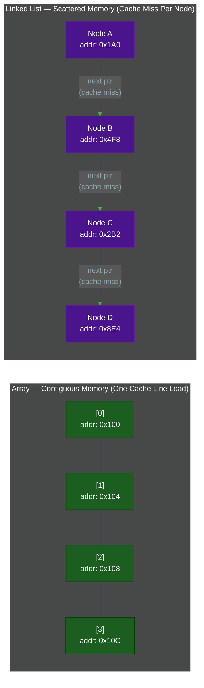
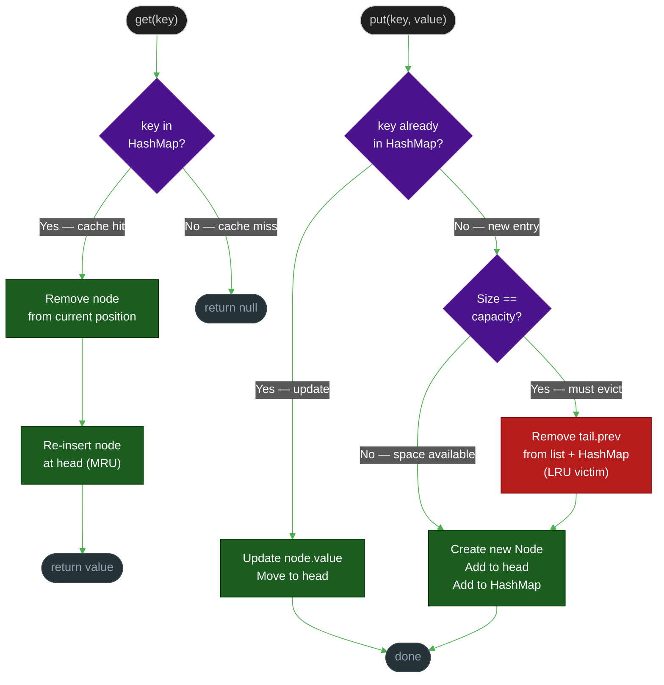
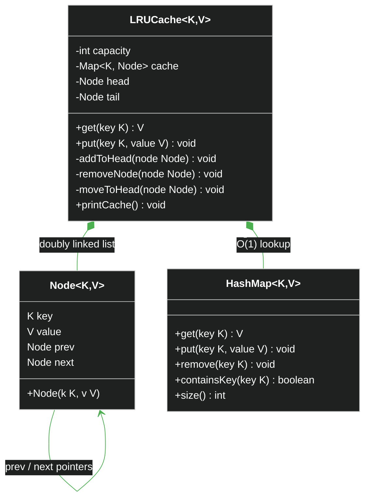

# Linear Data Structures: The Foundation

**Author:** ichamrong  
**Date:** 2026-05-16  
**Tags:** #dsa #linear-structures #java  
**Part of:** [DSA Series](./README.md)  
**Read Time:** ~12 min  

---

## 📌 Table of Contents
- [1. Arrays: Contiguous Power](#1-arrays-contiguous-power)
  - [Hook](#hook-2)
  - [Problem: Why Does Memory Layout Matter?](#problem-why-does-memory-layout-matter)
  - [Insight: Spatial Locality = Free Prefetching](#insight-spatial-locality-free-prefetching)
  - [Memory Layout: Array vs Linked List](#memory-layout-array-vs-linked-list)
  - [Big O Reference](#big-o-reference)
  - [Industrial Case Study: E-Commerce Product Catalog](#industrial-case-study-e-commerce-product-catalog)
  - [When to Use Arrays](#when-to-use-arrays)
- [2. Linked Lists: Dynamic Flexibility](#2-linked-lists-dynamic-flexibility)
  - [Hook](#hook-2)
  - [Problem: The Array Insertion Tax](#problem-the-array-insertion-tax)
  - [Insight: O(1) Surgery — But Only If You Have the Pointer](#insight-o1-surgery-but-only-if-you-have-the-pointer)
  - [LRU Cache Decision Flow](#lru-cache-decision-flow)
  - [LRU Cache Class Structure](#lru-cache-class-structure)
  - [LRU Cache Sequence: Get and Put](#lru-cache-sequence-get-and-put)
  - [Industrial Case Study: The LRU Cache (HashMap + Doubly Linked List)](#industrial-case-study-the-lru-cache-hashmap-doubly-linked-list)
  - [When to Use Linked Lists](#when-to-use-linked-lists)
- [3. Stacks & Queues: Order with Constraints](#3-stacks-queues-order-with-constraints)
  - [Hook](#hook-2)
  - [Problem: Why Raw Arrays Are Painful for Both](#problem-why-raw-arrays-are-painful-for-both)
  - [Insight: LIFO and FIFO Encode Causal Relationships](#insight-lifo-and-fifo-encode-causal-relationships)
  - [Stack States](#stack-states)
  - [Industrial Case Study 1: Text Editor Undo/Redo (Stack)](#industrial-case-study-1-text-editor-undoredo-stack)
  - [Industrial Case Study 2: API Rate Limiter (Sliding Log Queue)](#industrial-case-study-2-api-rate-limiter-sliding-log-queue)
  - [When to Use Stacks](#when-to-use-stacks)
  - [When to Use Queues](#when-to-use-queues)
- [Summary: The Linear Structure Decision Matrix](#summary-the-linear-structure-decision-matrix)

---

## Table of Contents

- [Arrays: Contiguous Power](#1-arrays-contiguous-power)
- [Linked Lists: Dynamic Flexibility](#2-linked-lists-dynamic-flexibility)
- [Stacks & Queues: Order with Constraints](#3-stacks-queues-order-with-constraints)

---

## 1. Arrays: Contiguous Power

### Hook

> **"An array is a lie told by the hardware — and it's the best lie in computing."**

The CPU doesn't actually see `int[] prices`. It sees a starting memory address. Every subsequent element is exactly `sizeof(int)` bytes further along. The "array" is the programmer's fiction layered on top of raw contiguous memory — and that fiction is blazingly fast.

### Problem: Why Does Memory Layout Matter?

Consider two ways to store 1,000 integers:

1. **Array** — elements occupy one unbroken block of memory.
2. **Scattered objects** — each integer lives in a separately heap-allocated node, connected by pointers.

When your CPU reads memory, it doesn't fetch one byte at a time. It fetches a **cache line** — typically 64 bytes on modern hardware. That single cache line holds **16 `int` values**. When the loop touches `prices[0]`, the CPU automatically brings `prices[1]` through `prices[15]` into L1 cache for free. The next fifteen iterations cost zero memory-fetch cycles.

Now try that with pointer-chased linked nodes: every element lives at a random address. The CPU fetches a cache line, finds one pointer, follows it to a completely different cache line, and repeats. You're measuring performance in **cache misses**, not instructions. Empirical benchmarks consistently show **5x–15x slower** iteration over pointer-chased structures vs. contiguous arrays for read-heavy workloads.

### Insight: Spatial Locality = Free Prefetching

> 📖 **Read the Parable:** [The Cinema Seats (កៅអីរោងកុន និងខ្សែភាពយន្ត)](../../concepts/parables/98-the-cinema-seats.md)

```
Memory (Array)          Memory (Linked List)
─────────────────       ──────────────────────────────
[10][20][30][40]        [10]──→[addr_3A]──→[20]──→[addr_7F]──→[30]
 ↑ One cache line        ↑ One cache miss    ↑ Another miss
 loads all four
```

This is **spatial locality** in action. The hardware prefetcher detects sequential access patterns and speculatively loads the next cache line before you ask for it. Arrays trigger this optimization automatically. Linked structures defeat it entirely.

The trade-off: arrays pay for this speed with inflexibility. The size must be known (or estimated), and inserting in the middle is O(n) — you must physically shift every element to the right.

### Memory Layout: Array vs Linked List



### Big O Reference

| Operation | Array (ArrayList) | Notes |
| :--- | :--- | :--- |
| Random access by index | **O(1)** | Direct address calculation |
| Append (amortized) | **O(1)** | Doubling resize keeps amortized constant |
| Insert/delete at middle | **O(n)** | Must shift all subsequent elements |
| Search (unsorted) | **O(n)** | Full scan |
| Search (sorted + binary) | **O(log n)** | Requires sorted invariant |

### Industrial Case Study: E-Commerce Product Catalog

A product catalog serves two contradictory masters: **bulk iteration** (render 500 search results in one shot) and **O(1) indexed access** (jump directly to page 3 of results). Both demands point to the same structure: a dynamic array backed by `ArrayList`.

The key insight about dynamic resizing: when `ArrayList` is full, it allocates a new array at **2× the current capacity** and copies everything over. That single copy is O(n), but because it happens exponentially less often as the array grows, the **amortized cost per insertion is still O(1)**. You pay in bulk once to avoid paying constantly.

```java
import java.util.ArrayList;
import java.util.List;
import java.util.Objects;
import java.util.stream.Collectors;

// Immutable value fields (id, name) set at construction.
// Mutable operational fields (stockCount, isActive) have setters.
class Product {
    private String id;
    private String name;
    private double price;
    private int stockCount;
    private boolean isActive;

    public Product(String id, String name, double price, int stockCount, boolean isActive) {
        // Objects.requireNonNull enforces the invariant at construction time, not at call sites
        this.id = Objects.requireNonNull(id);
        this.name = Objects.requireNonNull(name);
        if (price < 0) throw new IllegalArgumentException("Price cannot be negative.");
        this.price = price;
        if (stockCount < 0) throw new IllegalArgumentException("Stock count cannot be negative.");
        this.stockCount = stockCount;
        this.isActive = isActive;
    }

    // Getters
    public String getId() { return id; }
    public String getName() { return name; }
    public double getPrice() { return price; }
    public int getStockCount() { return stockCount; }
    public boolean isActive() { return isActive; }

    // Setters only for legitimately mutable state — price and id never change after creation
    public void setStockCount(int stockCount) {
        if (stockCount < 0) throw new IllegalArgumentException("Stock count cannot be negative.");
        this.stockCount = stockCount;
    }

    public void setActive(boolean active) {
        isActive = active;
    }

    @Override
    public String toString() {
        return "Product{" +
               "id='" + id + '\'' +
               ", name='" + name + '\'' +
               ", price=" + String.format("%.2f", price) +
               ", stock=" + stockCount +
               ", active=" + isActive +
               '}';
    }
}

public class ProductCatalog {
    // ArrayList<Product> wraps a raw Object[] internally.
    // When capacity is exceeded, it allocates array at 1.5× size and copies — amortized O(1) add.
    // Critical: iteration over ArrayList is cache-friendly because the backing array is contiguous.
    private List<Product> inventory;
    private int nextProductId = 1;

    public ProductCatalog() {
        this.inventory = new ArrayList<>();
    }

    /**
     * Adds a new product to the catalog.
     *
     * Amortized O(1): most calls just write to the next array slot.
     * Occasionally triggers a resize (allocate + copy), but that cost is O(n) spread
     * across n operations — each insertion costs O(1) on average.
     */
    public void addProduct(String name, double price, int stockCount, boolean isActive) {
        String id = "PROD-" + String.format("%04d", nextProductId++);
        Product newProduct = new Product(id, name, price, stockCount, isActive);
        this.inventory.add(newProduct); // May trigger internal array doubling
        System.out.println("Added product: " + newProduct.getName() + " (ID: " + newProduct.getId() + ")");
    }

    /**
     * Filters the catalog to products that are active, in stock, and within budget.
     *
     * O(n) — must visit every element. However, because the backing array is contiguous,
     * the CPU's hardware prefetcher loads the next product objects before we ask for them.
     * This makes the constant factor on that O(n) very small — much faster than an
     * equivalent O(n) scan over a linked list.
     *
     * @param maxPrice Maximum price to include in results.
     * @return Snapshot list of matching products.
     */
    public List<Product> filterActiveProductsInStock(double maxPrice) {
        System.out.println("Filtering products (max price: $" + String.format("%.2f", maxPrice) + ")...");
        return inventory.stream()
            .filter(Product::isActive)       // Predicate 1: soft-delete guard
            .filter(p -> p.getStockCount() > 0) // Predicate 2: warehouse inventory check
            .filter(p -> p.getPrice() <= maxPrice) // Predicate 3: budget gate
            .collect(Collectors.toList());
        // Stream pipeline is lazy: filters are applied in one pass, not three separate scans.
    }

    /**
     * Retrieves a product by its ID.
     *
     * O(n) scan — an ArrayList does not provide key-based lookup.
     * In production, you'd layer a HashMap<String, Product> on top to get O(1) by-ID access,
     * while keeping the ArrayList for ordered, index-based iteration.
     */
    public Product getProductById(String id) {
        for (Product p : inventory) {
            if (p.getId().equals(id)) {
                return p; // Early return: no need to scan the rest once found
            }
        }
        return null;
    }

    /**
     * Updates the stock count for a given product.
     *
     * Delegates lookup to getProductById (O(n)), then mutates in-place (O(1)).
     * No shifting or copying required — this is where arrays shine vs. immutable structures.
     */
    public boolean updateProductStock(String id, int newStock) {
        Product product = getProductById(id);
        if (product != null) {
            product.setStockCount(newStock); // Direct mutation of the object in the backing array
            System.out.println("Updated stock for " + product.getName() + " to " + newStock);
            return true;
        }
        System.out.println("Product with ID " + id + " not found for stock update.");
        return false;
    }

    // Return a defensive copy so callers can't corrupt internal state
    public List<Product> getAllProducts() {
        return new ArrayList<>(inventory);
    }

    public int getTotalProducts() {
        return inventory.size();
    }

    public static void main(String[] args) {
        System.out.println("--- E-Commerce Product Catalog Management ---");

        ProductCatalog catalog = new ProductCatalog();

        catalog.addProduct("Laptop Pro X", 1500.00, 10, true);
        catalog.addProduct("Wireless Mouse", 35.99, 50, true);
        catalog.addProduct("Mechanical Keyboard", 120.00, 20, true);
        catalog.addProduct("USB-C Hub", 49.99, 0, true);      // In catalog, but out of stock
        catalog.addProduct("External SSD 1TB", 99.99, 15, false); // Soft-deleted (inactive)
        catalog.addProduct("Gaming Headset", 75.00, 30, true);

        System.out.println("\n--- All Products (" + catalog.getTotalProducts() + ") ---");
        catalog.getAllProducts().forEach(System.out::println);

        System.out.println("\n--- Active, In-Stock, Under $100.00 ---");
        catalog.filterActiveProductsInStock(100.00).forEach(System.out::println);

        System.out.println("\n--- Updating Wireless Mouse stock ---");
        catalog.updateProductStock("PROD-0002", 45);

        System.out.println("\n--- Re-filter after update ---");
        catalog.filterActiveProductsInStock(100.00).forEach(System.out::println);

        System.out.println("\n--- Complete ---");
    }
}
```

### When to Use Arrays

**Use when:**
- You need O(1) random access by index.
- Iteration dominates (rendering lists, processing batches, scanning metrics).
- The collection size is known or predictable (saves resize overhead).
- Memory efficiency matters — arrays have zero per-element overhead.

**Avoid when:**
- You need O(1) insertions or deletions at arbitrary positions (use a LinkedList or Deque).
- The size is wildly unpredictable and insertions dominate over reads.
- You need key-based lookup (use a HashMap instead, possibly alongside the array).

---

## 2. Linked Lists: Dynamic Flexibility

### Hook

> **"A linked list is memory's honest child — scattered, but free."**

An array makes a rigid promise: all elements must live next to each other. A linked list makes no such promise. Nodes exist wherever the allocator decides to place them. This honesty about memory layout is exactly what makes linked lists powerful — and exactly what makes them costly to iterate.

### Problem: The Array Insertion Tax

Suppose you maintain a sorted list of 10,000 user session objects and you need to insert a new session in position 500. With an array:

1. Shift elements 500–9,999 one position to the right. That's 9,500 individual memory writes.
2. Write the new element at position 500.

Total cost: O(n). With n = 10,000, that's 10,000 writes for a single insertion. Do that 1,000 times per second in a high-traffic system and you've burned 10 million writes per second just on bookkeeping.

### Insight: O(1) Surgery — But Only If You Have the Pointer

> 📖 **Read the Parable:** [The Spy's Treasure Hunt (ចារកម្ម និងល្បែងរកកំណប់)](../../concepts/parables/99-the-spys-treasure-hunt.md)

A linked list replaces those 9,500 shifts with exactly 4 pointer reassignments:

```
Before:  ... → [A] → [C] → ...
After:   ... → [A] → [B] → [C] → ...
         (set B.next = C, set A.next = B)
```

That is O(1). No copying. No shifting. No mass memory writes.

The fine print: you only get that O(1) if you already hold a pointer to node A. Finding node A by value still costs O(n) — you must walk the chain from the head. This is the linked list's central bargain: **pay with cache misses to earn O(1) structural modification**.

In practice, this makes linked lists excellent as the *internal mechanism* of higher-level structures (like the LRU Cache below) where the "find" step is offloaded to a HashMap.

### LRU Cache Decision Flow



### LRU Cache Class Structure



### LRU Cache Sequence: Get and Put

```mermaid
%%{init: {'theme': 'dark', 'themeVariables': {'primaryColor': '#1b5e20', 'primaryTextColor': '#fff', 'lineColor': '#4caf50',
    'background': '#1e1e1e'},
  'themeCSS': 'svg { background-color: #1e1e1e !important; padding: 1rem !important; border-radius: 8px !important; } .edgeLabel rect { fill: #1e1e1e !important; } text, tspan, .messageText, .signalText, .edgeLabel, .edgeLabel span, .pointLabel, .axisLabel, .quadrantTitle, .quadrantLabel { fill: #ffffff !important; color: #ffffff !important; stroke: none !important; }'
}}%%
sequenceDiagram
    participant Client
    participant LRUCache
    participant HashMap
    participant LinkedList

    Note over LRUCache: Capacity = 3<br/>State: [C] ↔ [B] ↔ [A] (MRU → LRU)

    rect rgb(27, 94, 32)
        Note over Client,LinkedList: Cache Hit — get("B")
        Client->>LRUCache: get("B")
        LRUCache->>HashMap: containsKey("B") → true
        HashMap-->>LRUCache: node_B
        LRUCache->>LinkedList: removeNode(node_B)
        LRUCache->>LinkedList: addToHead(node_B)
        LRUCache-->>Client: return "B_value"
        Note over LinkedList: [B] ↔ [C] ↔ [A]
    end

    rect rgb(74, 20, 140)
        Note over Client,LinkedList: Cache Miss — get("X")
        Client->>LRUCache: get("X")
        LRUCache->>HashMap: containsKey("X") → false
        LRUCache-->>Client: return null
    end

    rect rgb(183, 28, 28)
        Note over Client,LinkedList: Eviction — put("D", val)
        Client->>LRUCache: put("D", "D_value")
        LRUCache->>HashMap: containsKey("D") → false
        LRUCache->>LinkedList: tail.prev → node_A (LRU victim)
        LRUCache->>HashMap: remove("A")
        LRUCache->>LinkedList: removeNode(node_A)
        Note over LinkedList: Evicted: A
        LRUCache->>LinkedList: addToHead(node_D)
        LRUCache->>HashMap: put("D", node_D)
        LRUCache-->>Client: done
        Note over LinkedList: [D] ↔ [B] ↔ [C]
    end
```



### Industrial Case Study: The LRU Cache (HashMap + Doubly Linked List)

The LRU Cache is one of the most instructive examples in computer science because it combines two data structures, each contributing what the other lacks:

| Structure | Contribution | Why It's Needed |
| :--- | :--- | :--- |
| **HashMap** | O(1) key lookup — "does key X exist, and where?" | LinkedList alone requires O(n) scan to find a node |
| **Doubly Linked List** | O(1) node promotion and eviction | HashMap alone has no notion of ordered recency |

Together, they deliver **O(1) get** and **O(1) put** — impossible with either structure alone.

The dummy head and tail sentinels eliminate all boundary checks. There is never a "what if the list is empty?" case in the insertion/deletion logic because `head` and `tail` are always present.

```java
import java.util.HashMap;
import java.util.Map;
import java.util.Objects;

class LRUCache<K, V> {
    // Inner Node class — lives inside LRUCache so only LRUCache can construct and mutate nodes.
    // This is encapsulation: the doubly linked list structure is an implementation detail,
    // not a public contract.
    private class Node {
        K key;
        V value;
        Node prev, next;

        Node(K k, V v) {
            this.key = k;
            this.value = v;
            this.prev = null;
            this.next = null;
        }
    }

    private final int capacity;
    // HashMap provides the O(1) "teleport": given a key, instantly get the Node pointer.
    // Without this, every get() would require an O(n) walk through the linked list.
    private final Map<K, Node> cache;
    // Dummy sentinels eliminate all null checks in addToHead/removeNode.
    // head.next = MRU element, tail.prev = LRU element.
    private final Node head; // Dummy head: marks "most recently used" boundary
    private final Node tail; // Dummy tail: marks "least recently used" boundary

    public LRUCache(int capacity) {
        if (capacity <= 0) {
            throw new IllegalArgumentException("Cache capacity must be positive.");
        }
        this.capacity = capacity;
        this.cache = new HashMap<>();
        this.head = new Node(null, null);
        this.tail = new Node(null, null);

        // Initial state: head ↔ tail (empty list)
        head.next = tail;
        tail.prev = head;
    }

    /**
     * Retrieves a value from the cache.
     *
     * O(1): HashMap.get() is O(1) average. moveToHead() is O(1) — just 4 pointer updates.
     * The doubly linked list is critical here: we need O(1) removal from the middle,
     * which requires a prev pointer. A singly linked list would force O(n) traversal.
     */
    public V get(K key) {
        if (!cache.containsKey(key)) {
            System.out.println("GET " + key + ": Not found.");
            return null;
        }
        Node node = cache.get(key); // O(1) teleport: no scanning the linked list
        moveToHead(node);           // Promote: this key was just used, so it's now the MRU
        System.out.println("GET " + key + ": Found " + node.value + ". Moved to front.");
        return node.value;
    }

    /**
     * Inserts or updates a key-value pair.
     *
     * O(1) for all paths:
     *   - Update existing: HashMap.get() + moveToHead() = O(1) + O(1)
     *   - Evict + insert: removeNode(tail.prev) + HashMap.remove() + addToHead() = O(1) + O(1) + O(1)
     *   - Fresh insert under capacity: addToHead() + HashMap.put() = O(1) + O(1)
     */
    public void put(K key, V value) {
        System.out.println("PUT " + key + " -> " + value + ":");
        if (cache.containsKey(key)) {
            // Key exists: update the value in-place and promote to MRU position
            Node node = cache.get(key);
            node.value = value;
            moveToHead(node);
            System.out.println("  Updated existing entry and moved to front.");
        } else {
            // New key: may need to evict before inserting
            if (cache.size() >= capacity) {
                // tail.prev is the LRU victim — it's the node furthest from the head
                Node lruNode = tail.prev;
                cache.remove(lruNode.key); // Remove from HashMap first (we need the key before unlinking)
                removeNode(lruNode);       // Unlink from doubly linked list
                System.out.println("  Cache full. Evicted LRU item: " + lruNode.key + " -> " + lruNode.value);
            }
            // Create new node, register in HashMap, promote to MRU
            Node newNode = new Node(key, value);
            cache.put(key, newNode);
            addToHead(newNode);
            System.out.println("  Added new entry to front.");
        }
        printCache();
    }

    /**
     * Inserts a node immediately after the dummy head (= MRU position).
     *
     * 4 pointer updates, all O(1). Order matters: set node's pointers before
     * updating neighbors, otherwise we lose references.
     */
    private void addToHead(Node node) {
        node.next = head.next;   // Step 1: node will point forward to old MRU
        node.prev = head;        // Step 2: node will point backward to dummy head
        head.next.prev = node;   // Step 3: old MRU now points backward to node
        head.next = node;        // Step 4: dummy head now points forward to node
    }

    /**
     * Removes a node from its current position in the list.
     *
     * 2 pointer updates, O(1). Doubly linked is essential — we need prev to do this
     * without traversal. A singly linked list would require O(n) to find the predecessor.
     */
    private void removeNode(Node node) {
        node.prev.next = node.next; // Predecessor skips over this node
        node.next.prev = node.prev; // Successor skips back over this node
        // Null out references: helps GC collect this node if it's being evicted
        node.prev = null;
        node.next = null;
    }

    /**
     * Moves an existing node to the MRU position.
     * Composed of removeNode() + addToHead(), both O(1).
     */
    private void moveToHead(Node node) {
        removeNode(node);
        addToHead(node);
    }

    /** Prints cache contents from MRU (head side) to LRU (tail side). */
    public void printCache() {
        System.out.print("  Cache State (MRU -> LRU): [");
        Node current = head.next;
        while (current != tail) {
            System.out.print("(" + current.key + ":" + current.value + ")");
            if (current.next != tail) {
                System.out.print(" <-> ");
            }
            current = current.next;
        }
        System.out.println("]");
    }

    public static void main(String[] args) {
        System.out.println("--- LRU Cache Simulation (capacity = 3) ---");
        LRUCache<String, String> cache = new LRUCache<>(3);

        cache.put("user1", "Alice");    // [user1]
        cache.put("user2", "Bob");      // [user2, user1]
        cache.put("user3", "Charlie");  // [user3, user2, user1]

        cache.get("user2");             // Promote user2 → [user2, user3, user1]

        cache.put("user4", "David");    // Capacity hit: evict LRU (user1) → [user4, user2, user3]

        cache.get("user1");             // Miss — user1 was evicted

        cache.put("user3", "Charles");  // Update user3 value, promote → [user3, user4, user2]

        cache.put("user5", "Eve");      // Evict LRU (user2) → [user5, user3, user4]

        System.out.println("\n--- Final Cache State ---");
        cache.printCache();
    }
}
```

### When to Use Linked Lists

**Use when:**
- Your access pattern is "find via external index, then modify in-place" (like LRU Cache: HashMap finds, LinkedList modifies).
- You need O(1) insertions and deletions at the head/tail (Deque, message queue internals).
- You're building a structure where iteration is rare but structural modification is frequent.

**Avoid when:**
- Your access pattern is predominantly sequential iteration (cache misses will dominate).
- You need O(1) random access by index (use an array).
- Memory overhead matters — each node carries two extra pointers (16 bytes on 64-bit JVM) on top of the value.

---

## 3. Stacks & Queues: Order with Constraints

### Hook

> **"A Stack is a promise: you'll undo what you did, in reverse. A Queue is a contract: first come, first served."**

Both structures are linear. Both can be backed by arrays or linked lists. Their power comes entirely from the **constraints** they impose on access:

- **Stack (LIFO)** removes from the same end it inserts. The last item in is always the first item out.
- **Queue (FIFO)** removes from the opposite end from insertion. The first item in is always the first item out.

These constraints aren't limitations — they're guarantees. And systems that need those guarantees can build significant correctness properties on top of them.

### Problem: Why Raw Arrays Are Painful for Both

Consider a naive array-backed stack with a fixed capacity:
- Push: `arr[++top] = val` — fine.
- Pop: `return arr[top--]` — fine.
- But if `top` reaches `arr.length - 1`, you must resize. And if you want to use the same array for a queue (add to one end, remove from the other), the "front" index drifts rightward, wasting space until you reset — a non-trivial bookkeeping problem.

Java's `Stack` class fixes this with `ArrayList` backing. Java's `Queue`/`Deque` uses `LinkedList` (O(1) add to tail, O(1) remove from head) or `ArrayDeque` (circular array, amortized O(1) both ends). In production, `ArrayDeque` typically outperforms `LinkedList`-backed queues due to cache locality — the same spatial locality argument from Section 1 applies here.

### Insight: LIFO and FIFO Encode Causal Relationships

> 📖 **Read the Parable:** [The Dish Stack and the Ticket Queue (គំនរចាន និងជួររង់ចាំ)](../../concepts/parables/100-the-dish-stack-and-the-ticket-queue.md)

LIFO isn't just "backwards order." It encodes **reverse causality**: to undo the effects of action A, you must first undo everything that happened after A (because those later actions may depend on A's result). A stack forces this order mechanically — you cannot pop what's underneath without first popping what's on top.

FIFO isn't just "forwards order." It encodes **arrival preservation**: in a fair system, the entity that arrived first should be served first. Rate limiters, message queues, print spoolers, and BFS traversal all rely on this guarantee. Violating it produces unfairness at the protocol level.

### Stack States

```mermaid
%%{init: {'theme': 'dark', 'themeVariables': {'primaryColor': '#1b5e20', 'primaryTextColor': '#fff', 'lineColor': '#4caf50',
    'background': '#1e1e1e'},
  'themeCSS': 'svg { background-color: #1e1e1e !important; padding: 1rem !important; border-radius: 8px !important; } .edgeLabel rect { fill: #1e1e1e !important; } text, tspan, .messageText, .signalText, .edgeLabel, .edgeLabel span, .pointLabel, .axisLabel, .quadrantTitle, .quadrantLabel { fill: #ffffff !important; color: #ffffff !important; stroke: none !important; }'
}}%%
stateDiagram-v2
    [*] --> Empty : initialized

    Empty --> HasItems : push(item)
    HasItems --> HasItems : push(item) [size < capacity]
    HasItems --> Empty : pop() [size == 1]
    HasItems --> Full : push(item) [size == capacity - 1]

    Full --> HasItems : pop()
    Full --> Full : peek() [no state change]

    Empty --> Empty : peek() / pop() → throws EmptyStackException

    note right of Empty : undoStack and redoStack<br/>both start here
    note right of Full : triggers ArrayList resize<br/>on next push (amortized O(1))
    note right of HasItems : most common state<br/>during active editing
```



### Industrial Case Study 1: Text Editor Undo/Redo (Stack)

The undo/redo pattern is a textbook application of two coordinated stacks. The insight is subtle: **type** and **delete** are operations that produce state; **undo** is an operation that restores state. Redo restores state that was previously un-done.

The key invariant: every time you take a new action (type or delete), you must clear the redo stack. Why? Because the redo stack represents "a future that was undone." Once you take a new action, that future is invalidated — the timeline has branched.

```java
import java.util.Stack;

class TextEditor {
    private StringBuilder currentText;
    // undoStack: each entry is the complete text state before the most recent action.
    // Stack enforces LIFO — undo always reverses the most recent change first.
    private Stack<String> undoStack;
    // redoStack: each entry is a state that was undone and can be re-applied.
    // Only valid until the next new action — then it's cleared (timeline diverged).
    private Stack<String> redoStack;

    public TextEditor() {
        currentText = new StringBuilder();
        undoStack = new Stack<>();
        redoStack = new Stack<>();
        System.out.println("TextEditor initialized. Current text: '" + currentText + "'");
    }

    public void type(String text) {
        undoStack.push(currentText.toString()); // Snapshot current state before mutation
        currentText.append(text);
        redoStack.clear(); // New action invalidates the "undone futures" — they no longer apply
        System.out.println("Typed: '" + text + "'. Current text: '" + currentText + "'");
    }

    public void deleteLastChar() {
        if (currentText.length() > 0) {
            undoStack.push(currentText.toString()); // Snapshot before destructive edit
            currentText.deleteCharAt(currentText.length() - 1);
            redoStack.clear(); // Same invariant: new action clears redo history
            System.out.println("Deleted last char. Current text: '" + currentText + "'");
        } else {
            System.out.println("Text is empty, nothing to delete.");
        }
    }

    /**
     * Restores the text to the state before the most recent action.
     *
     * O(1) stack pop — the beauty of this design is that undo is structurally
     * guaranteed to be correct. There's no "figure out what to reverse" logic;
     * the stack simply gives you the previous state.
     */
    public void undo() {
        if (!undoStack.isEmpty()) {
            // Before restoring, save current state to redo stack so it can be re-applied
            redoStack.push(currentText.toString());
            // LIFO pop: always gets the most recent snapshot, preserving causal order
            currentText = new StringBuilder(undoStack.pop());
            System.out.println("Undo performed. Current text: '" + currentText + "'");
        } else {
            System.out.println("Nothing to undo.");
        }
    }

    /**
     * Restores the text to the state after a previously undone action.
     *
     * Symmetric to undo — save current to undo stack, restore from redo stack.
     * Only works if no new actions have been taken since the last undo (redoStack is cleared on type/delete).
     */
    public void redo() {
        if (!redoStack.isEmpty()) {
            undoStack.push(currentText.toString()); // Current state is now undoable again
            currentText = new StringBuilder(redoStack.pop()); // Restore previously undone state
            System.out.println("Redo performed. Current text: '" + currentText + "'");
        } else {
            System.out.println("Nothing to redo.");
        }
    }

    public String getCurrentText() {
        return currentText.toString();
    }

    public static void main(String[] args) {
        System.out.println("--- Text Editor Undo/Redo Simulation ---");
        TextEditor editor = new TextEditor();

        editor.type("Hello");
        editor.type(" World");
        editor.deleteLastChar(); // Removes 'd' from "World"
        editor.type("!");        // Now "Hello Worl!" — this clears redo history

        System.out.println("\n--- Performing Undo ---");
        editor.undo(); // Undo '!' → "Hello Worl"
        editor.undo(); // Undo deleteLastChar → "Hello World"
        editor.undo(); // Undo ' World' → "Hello"
        editor.undo(); // Undo 'Hello' → ""
        editor.undo(); // Empty undoStack: nothing to undo

        System.out.println("\n--- Performing Redo ---");
        editor.redo(); // Redo 'Hello' → "Hello"
        editor.redo(); // Redo ' World' → "Hello World"
        editor.redo(); // Redo deleteLastChar → "Hello Worl"
        editor.redo(); // Redo '!' → "Hello Worl!"
        editor.redo(); // Empty redoStack: nothing to redo

        System.out.println("\nFinal text: '" + editor.getCurrentText() + "'");
    }
}
```

### Industrial Case Study 2: API Rate Limiter (Sliding Log Queue)

The sliding log algorithm is the most accurate rate limiting strategy: it tracks the exact timestamp of every request in the current window. A Queue is the ideal structure because:

- **Oldest requests are at the front** (FIFO insertion order).
- **Eviction is O(1)** — `poll()` from the front removes expired timestamps in constant time.
- **No rebuilding required** — as time advances, you just drain expired entries from the front.

The alternative (a fixed window counter) resets at clock boundaries, which allows a burst of 2× the limit straddling the boundary. The sliding log has no blind spots.

```java
import java.util.LinkedList;
import java.util.Queue;
import java.util.concurrent.TimeUnit;

public class APIRateLimiter {
    private final int maxRequests;
    private final long timeWindowMillis;
    // Queue<Long> stores the millisecond timestamp of each accepted request.
    // FIFO guarantees that peek() always returns the oldest timestamp — the next
    // candidate for expiry as the window slides forward.
    private final Queue<Long> requestTimestamps;

    /**
     * @param maxRequests Maximum number of requests allowed in the time window.
     * @param timeWindowSeconds Duration of the sliding window in seconds.
     */
    public APIRateLimiter(int maxRequests, long timeWindowSeconds) {
        if (maxRequests <= 0) throw new IllegalArgumentException("Max requests must be positive.");
        if (timeWindowSeconds <= 0) throw new IllegalArgumentException("Time window must be positive.");
        this.maxRequests = maxRequests;
        this.timeWindowMillis = TimeUnit.SECONDS.toMillis(timeWindowSeconds);
        // LinkedList: O(1) offer() at tail, O(1) poll() at head — exactly what FIFO sliding window needs.
        this.requestTimestamps = new LinkedList<>();
        System.out.println("Rate Limiter initialized: " + maxRequests + " requests per " + timeWindowSeconds + " seconds.");
    }

    /**
     * Decides whether to allow an incoming request.
     *
     * Algorithm:
     *   1. Drain all timestamps from the front of the queue that fall outside the current window.
     *      This "slides" the window forward to the present moment.
     *   2. Count remaining timestamps — these are all requests that happened within the window.
     *   3. If count < maxRequests, allow and record this request's timestamp.
     *      If count >= maxRequests, reject (HTTP 429).
     *
     * Time: O(k) where k = number of expired entries drained, amortized O(1) per request.
     * Space: O(maxRequests) — the queue never holds more than maxRequests entries at steady state.
     *
     * synchronized: ensures thread safety for concurrent API requests hitting the same limiter.
     */
    public synchronized boolean allowRequest() {
        long now = System.currentTimeMillis();

        // Step 1: Evict expired timestamps from the front (oldest entries).
        // peek() checks without removing; poll() removes only if the condition holds.
        // This loop is O(1) amortized — each timestamp is added once and removed at most once.
        while (!requestTimestamps.isEmpty() && (now - requestTimestamps.peek() > timeWindowMillis)) {
            requestTimestamps.poll(); // FIFO removal: always evicts the oldest timestamp first
        }

        // Step 2: How many requests are still "alive" within the window?
        if (requestTimestamps.size() < maxRequests) {
            // Step 3a: Within limit — record this request's arrival timestamp and allow it
            requestTimestamps.offer(now); // offer() adds to the rear of the queue
            System.out.println("  Request ALLOWED at " + now + ". Window count: " + requestTimestamps.size() + "/" + maxRequests);
            return true;
        } else {
            // Step 3b: Limit exceeded — reject without recording (we don't count blocked requests)
            System.out.println("  Request BLOCKED at " + now + ". Window full (" + requestTimestamps.size() + "/" + maxRequests + ").");
            return false; // Caller should return HTTP 429 Too Many Requests
        }
    }

    public static void main(String[] args) throws InterruptedException {
        System.out.println("--- API Rate Limiter Simulation (3 req / 5 sec) ---");
        APIRateLimiter limiter = new APIRateLimiter(3, 5);

        System.out.println("\n--- Burst: 5 requests (expect: 3 allowed, 2 blocked) ---");
        for (int i = 0; i < 5; i++) {
            limiter.allowRequest();
            Thread.sleep(100);
        }

        System.out.println("\n--- Waiting 3 seconds (window partially slides) ---");
        Thread.sleep(3000);

        System.out.println("\n--- 5 more requests (window not fully clear yet) ---");
        for (int i = 0; i < 5; i++) {
            limiter.allowRequest();
            Thread.sleep(100);
        }

        System.out.println("\n--- Waiting 6 seconds (window fully slides past all prior requests) ---");
        Thread.sleep(6000);

        System.out.println("\n--- Single request after full window expiry (should allow) ---");
        limiter.allowRequest();
    }
}
```

### When to Use Stacks

**Use when:**
- You need LIFO access: undo/redo, function call management, DFS traversal, expression parsing.
- You need to reverse a sequence (reverse iteration, balanced parentheses checking).
- You need to track "state at point N so you can return to it" (backtracking algorithms).

**Avoid when:**
- You need random access by index (the middle of the stack is unreachable by design).
- You need FIFO order (use a Queue).

### When to Use Queues

**Use when:**
- You need FIFO access: BFS traversal, task scheduling, rate limiting, message buffering.
- Order of arrival must be preserved (fairness guarantees in job schedulers).
- You're building a producer-consumer buffer (use `BlockingQueue` for thread-safe variants).

**Avoid when:**
- You need the most recently added item (use a Stack or Deque).
- You need priority ordering (use a `PriorityQueue`/Heap — covered in `02-non-linear-structures.md`).

---

## Summary: The Linear Structure Decision Matrix

| Structure | Access | Insert (Head/Tail) | Insert (Middle) | Delete | Cache-Friendly? |
| :--- | :--- | :--- | :--- | :--- | :--- |
| **Array** | O(1) index | O(n) / O(1)* | O(n) shift | O(n) shift | Yes — contiguous |
| **Linked List** | O(n) scan | O(1) | O(1) with pointer | O(1) with pointer | No — scattered |
| **Stack** | O(1) top only | O(1) push | N/A (by design) | O(1) pop | Depends on backing |
| **Queue** | O(1) front only | O(1) enqueue | N/A (by design) | O(1) dequeue | Depends on backing |

*ArrayList append is amortized O(1); worst-case single insert at tail triggers O(n) resize.*

---

**Navigation:** [← Back to Index](./README.md) | [Non-Linear Structures →](./02-non-linear-structures.md)

---

*Last updated: 2026-05-16*

## Related

- [Design Patterns](../design-patterns/README.md)
- [Refactoring Techniques](../refactoring/README.md)
- [Software Architecture](../software-architecture/README.md)
