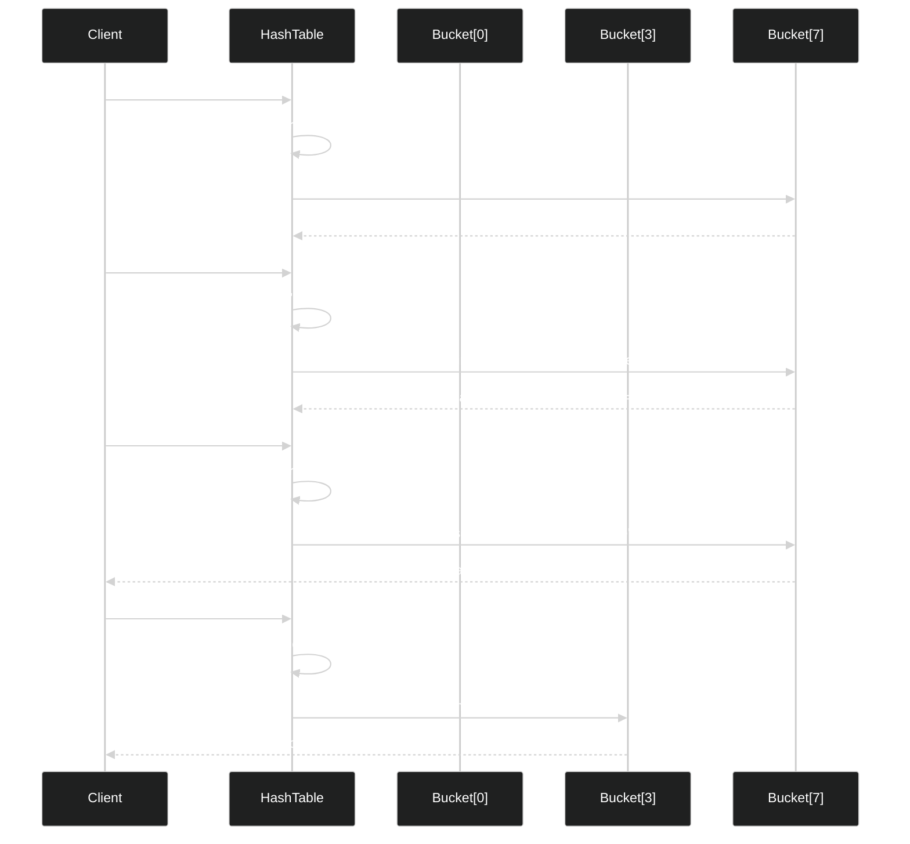
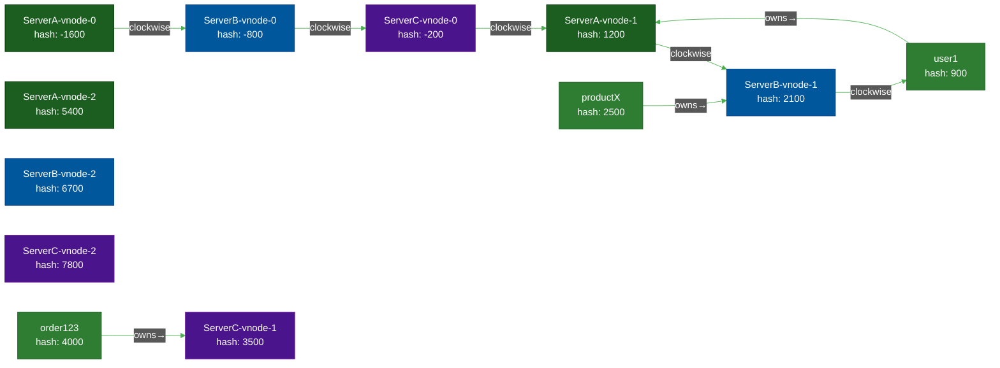
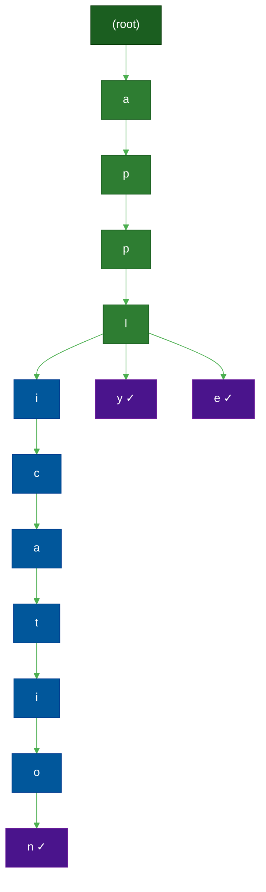
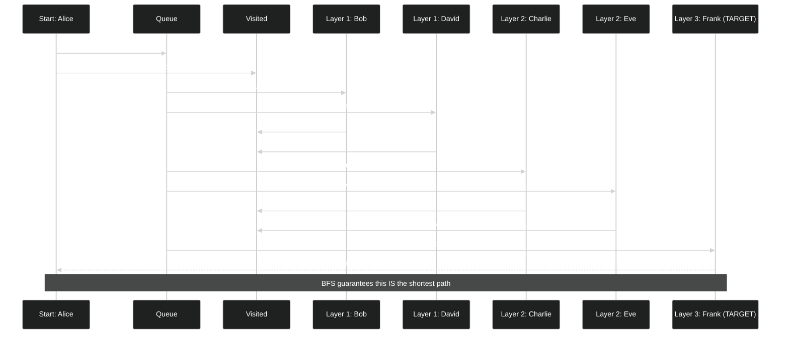
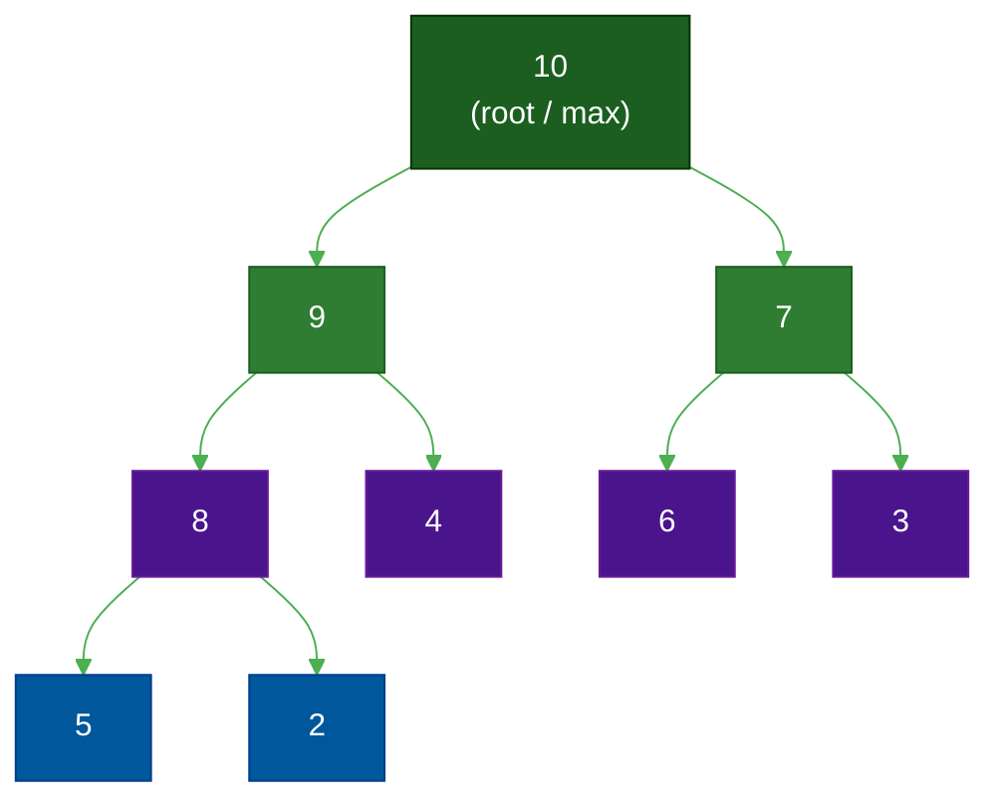
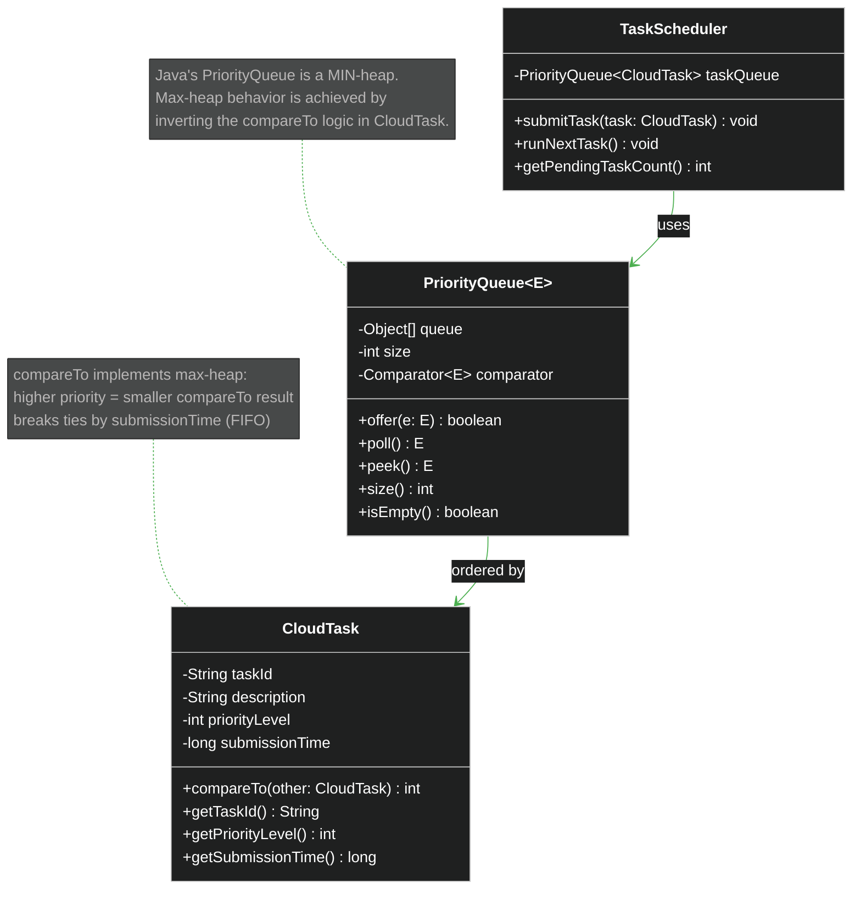
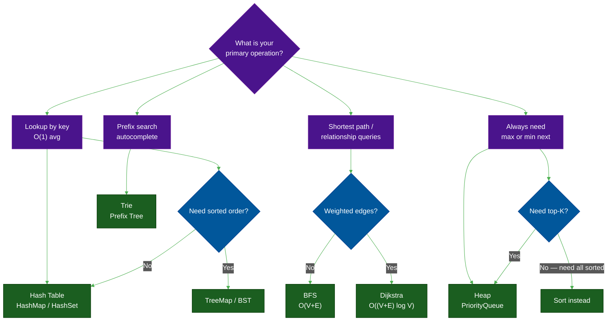

# Non-Linear Data Structures: The Power of Hierarchy

**Author:** ichamrong
**Date:** 2026-05-16
**Tags:** #dsa #non-linear-structures #java
**Part of:** [DSA Series](./README.md)
**Read Time:** ~15 min

---

## 📌 Table of Contents
- [Overview](#overview)
- [1. Hash Tables: O(1) or a Lie?](#1-hash-tables-o1-or-a-lie)
  - [The Problem](#the-problem-3)
  - [The Insight](#the-insight-3)
  - [The Structure](#the-structure-3)
  - [Runtime Reference](#runtime-reference-3)
  - [Industrial Case Study: Consistent Hashing for Distributed Sharding](#industrial-case-study-consistent-hashing-for-distributed-sharding)
  - [When to Use / When to Avoid](#when-to-use-when-to-avoid-3)
- [2. Trees & Tries: Navigating Hierarchy](#2-trees-tries-navigating-hierarchy)
  - [The Problem](#the-problem-3)
  - [The Insight](#the-insight-3)
  - [The Structure](#the-structure-3)
  - [Runtime Reference](#runtime-reference-3)
  - [Industrial Case Study: Search Bar Autocomplete](#industrial-case-study-search-bar-autocomplete)
  - [When to Use / When to Avoid](#when-to-use-when-to-avoid-3)
- [3. Graphs: The Universal Model](#3-graphs-the-universal-model)
  - [The Problem](#the-problem-3)
  - [The Insight](#the-insight-3)
  - [The Structure](#the-structure-3)
  - [Runtime Reference](#runtime-reference-3)
  - [Industrial Case Study: Social Network Degrees of Separation](#industrial-case-study-social-network-degrees-of-separation)
  - [When to Use / When to Avoid](#when-to-use-when-to-avoid-3)
- [4. Heaps: The Priority Engine](#4-heaps-the-priority-engine)
  - [The Problem](#the-problem-3)
  - [The Insight](#the-insight-3)
  - [The Structure](#the-structure-3)
  - [Runtime Reference](#runtime-reference-3)
  - [Industrial Case Study: Cloud Task Scheduler](#industrial-case-study-cloud-task-scheduler)
  - [When to Use / When to Avoid](#when-to-use-when-to-avoid-3)
- [Summary: Non-Linear Structures at a Glance](#summary-non-linear-structures-at-a-glance)

---

## Table of Contents

- [Hash Tables: O(1) or a Lie?](#1-hash-tables-o1-or-a-lie)
- [Trees & Tries: Navigating Hierarchy](#2-trees-tries-navigating-hierarchy)
- [Graphs: The Universal Model](#3-graphs-the-universal-model)
- [Heaps: The Priority Engine](#4-heaps-the-priority-engine)
- [Summary: Non-Linear Structures at a Glance](#summary-non-linear-structures-at-a-glance)

---

## Overview

| Structure | Core Promise | Industrial Use Case |
| :--- | :--- | :--- |
| [Hash Tables](#1-hash-tables-o1-or-a-lie) | O(1) average lookup by key | Distributed database sharding (Cassandra, DynamoDB) |
| [Trees & Tries](#2-trees-tries-navigating-hierarchy) | O(prefix_length) prefix search | Search bar autocomplete |
| [Graphs](#3-graphs-the-universal-model) | Model any relationship | Social network degrees of separation |
| [Heaps](#4-heaps-the-priority-engine) | O(log n) insert and extract-max | Cloud task scheduler |

---

## 1. Hash Tables: O(1) or a Lie?

> **"A hash table promises O(1). It almost never lies — and when it does, it's your fault."**

### The Problem

Every lookup in a sorted array costs O(log n) — you binary search your way in. That's great. But what if you need *true* instant access, regardless of how large your dataset grows? You want a structure where retrieving a value by key costs the same whether you have 10 records or 10 million.

Hash tables deliver that promise.

### The Insight

> 📖 **Read the Parable:** [The Apothecary's Cabinet (ទូថ្នាំវេទមន្តរបស់គ្រូពេទ្យ)](../../concepts/parables/101-the-apothecarys-cabinet.md)

The trick is to **trade space for time**. A hash function converts any key (a string, an integer, an object) into an integer index into an underlying array. Array access by index is O(1). So: key → hash(key) → array[index] → value. Done.

The catch: two different keys may hash to the same index — a **collision**. There are two classic strategies to resolve this:

- **Chaining:** Each array slot holds a linked list. Collisions are appended to the same list. Average case O(1), worst case O(n) if all keys collide.
- **Open Addressing:** On collision, probe the next available slot (linear, quadratic, or double-hashing). Sensitive to load factor — once the array is more than 70–80% full, probe sequences lengthen dramatically.

The O(1) guarantee holds *on average*, assuming a good hash function and a managed load factor. A terrible hash function that clusters all keys into a few buckets degrades a hash table to a linked list — O(n). That's the lie, and it's your fault for choosing a bad hash function.

### The Structure



### Runtime Reference

| Operation | Average Case | Worst Case | Condition |
| :--- | :--- | :--- | :--- |
| Insert | O(1) | O(n) | All keys collide |
| Lookup | O(1) | O(n) | All keys collide |
| Delete | O(1) | O(n) | All keys collide |
| Resize | O(n) | O(n) | Load factor exceeded |

### Industrial Case Study: Consistent Hashing for Distributed Sharding

In large distributed systems (Cassandra, DynamoDB, Redis Cluster), the naive approach is `hash(key) % numberOfServers`. The problem: add or remove one server, and *almost every key* maps to a different server. That means a full data migration on every topology change — catastrophic at scale.

**Consistent Hashing** solves this by mapping both keys *and* servers onto an abstract circular ring. When a server is added or removed, only the keys that were owned by that server's immediate clockwise neighbor need to migrate. On average, only `K/N` keys move (where K = total keys, N = number of servers).

**Virtual Nodes** take this further: each physical server claims multiple positions on the ring. This distributes load more evenly and ensures that when a server fails, its keys spread across *all* remaining servers rather than overloading one.



```java
import java.util.Collection;
import java.util.SortedMap;
import java.util.TreeMap;
import java.util.HashSet;
import java.util.Set;
import java.util.Objects;

public class ConsistentHashRouter {
    // TreeMap simulates the hash ring: the keys are integer positions on the ring,
    // sorted automatically. This lets us find the "next clockwise node" in O(log N).
    private final SortedMap<Integer, String> ring = new TreeMap<>();

    // Each physical server gets `numberOfReplicas` virtual nodes on the ring.
    // More virtual nodes = better load balance, but more memory per server.
    private final int numberOfReplicas;
    private final Set<String> physicalServers = new HashSet<>();

    public ConsistentHashRouter(int numberOfReplicas) {
        if (numberOfReplicas <= 0) {
            throw new IllegalArgumentException("Number of replicas must be positive.");
        }
        this.numberOfReplicas = numberOfReplicas;
    }

    /**
     * Adds a physical server by placing `numberOfReplicas` virtual nodes on the ring.
     *
     * WHY virtual nodes? Without them, each server owns a single arc of the ring.
     * If servers are unevenly distributed, one server carries a disproportionate share
     * of the keys. With virtual nodes, each server owns multiple small arcs spread
     * around the ring, producing near-uniform key distribution even with few servers.
     */
    public void addServer(String serverId) {
        Objects.requireNonNull(serverId, "Server ID cannot be null.");
        if (physicalServers.contains(serverId)) {
            System.out.println("Server " + serverId + " already exists.");
            return;
        }
        physicalServers.add(serverId);
        for (int i = 0; i < numberOfReplicas; i++) {
            // Each virtual node gets a unique name so that its hash position differs
            // from other virtual nodes of the same physical server.
            String virtualNodeName = serverId + "-vnode-" + i;
            int hash = getHash(virtualNodeName);
            ring.put(hash, serverId); // Place the virtual node on the ring
            System.out.println("  Added virtual node " + virtualNodeName
                    + " at hash " + hash + " for server " + serverId);
        }
        System.out.println("Server " + serverId + " added to the ring.");
    }

    /**
     * Removes a physical server and ALL of its virtual nodes from the ring.
     *
     * WHY remove all virtual nodes? Leaving orphaned virtual nodes would route traffic
     * to a dead server. By removing all, the keys owned by this server's arcs are
     * automatically claimed by the next clockwise node (belonging to a live server).
     * This is the key property: only ~K/N keys move, not all K keys.
     */
    public void removeServer(String serverId) {
        Objects.requireNonNull(serverId, "Server ID cannot be null.");
        if (!physicalServers.contains(serverId)) {
            System.out.println("Server " + serverId + " not found in the ring.");
            return;
        }
        physicalServers.remove(serverId);
        for (int i = 0; i < numberOfReplicas; i++) {
            String virtualNodeName = serverId + "-vnode-" + i;
            int hash = getHash(virtualNodeName);
            ring.remove(hash);
            System.out.println("  Removed virtual node " + virtualNodeName
                    + " at hash " + hash + " for server " + serverId);
        }
        System.out.println("Server " + serverId + " removed from the ring.");
    }

    /**
     * Looks up which server owns the given key by finding the nearest clockwise
     * virtual node on the ring.
     *
     * WHY tailMap? TreeMap.tailMap(k) returns all entries with keys >= k in O(log N).
     * The first entry in that view IS the nearest clockwise virtual node.
     * If no entry exists (the key's hash is larger than all virtual nodes), we wrap
     * around by taking the ring's smallest key — the "0-degree" position.
     *
     * Overall complexity: O(log S) where S = numberOfServers * numberOfReplicas.
     */
    public String getServerForKey(String key) {
        Objects.requireNonNull(key, "Key cannot be null.");
        if (ring.isEmpty()) {
            return null; // No servers available — caller should handle this
        }

        int keyHash = getHash(key);

        // tailMap gives us all ring positions that are clockwise from (or equal to) keyHash.
        SortedMap<Integer, String> tailMap = ring.tailMap(keyHash);

        // Wrap-around: if keyHash is past the last virtual node, go back to the start.
        int serverHash = tailMap.isEmpty() ? ring.firstKey() : tailMap.firstKey();

        String assignedServer = ring.get(serverHash);
        System.out.println("  Key '" + key + "' (hash " + keyHash
                + ") mapped to server " + assignedServer
                + " (via virtual node hash " + serverHash + ")");
        return assignedServer;
    }

    /**
     * Simple hash using Java's String.hashCode().
     *
     * WHY not use this in production? hashCode() can return negative values and is
     * not guaranteed to be uniformly distributed. Production systems use MurmurHash3
     * or SHA-1 for more even ring coverage, especially with few virtual nodes.
     */
    private int getHash(String value) {
        return value.hashCode();
    }

    public void printRing() {
        System.out.println("\n--- Current Hash Ring State ---");
        if (ring.isEmpty()) {
            System.out.println("  Ring is empty.");
            return;
        }
        ring.forEach((hash, server) ->
                System.out.println("  Hash: " + hash + " -> Server: " + server));
        System.out.println("-------------------------------");
    }

    public static void main(String[] args) {
        System.out.println("--- Consistent Hashing Simulation ---");

        // 3 virtual nodes per server: modest distribution improvement without
        // excessive memory overhead. Production systems often use 150-200 vnodes.
        ConsistentHashRouter router = new ConsistentHashRouter(3);

        router.addServer("ServerA");
        router.addServer("ServerB");
        router.addServer("ServerC");
        router.printRing();

        System.out.println("\n--- Mapping Keys to Servers (initial state) ---");
        router.getServerForKey("user1");
        router.getServerForKey("productX");
        router.getServerForKey("order123");
        router.getServerForKey("sessionABC");
        router.getServerForKey("user100");

        System.out.println("\n--- Adding ServerD (only ~25% of keys should move) ---");
        router.addServer("ServerD");
        router.printRing();

        System.out.println("\n--- Remapping Keys after adding ServerD ---");
        router.getServerForKey("user1");
        router.getServerForKey("productX");
        router.getServerForKey("order123");
        router.getServerForKey("sessionABC");
        router.getServerForKey("user100");

        System.out.println("\n--- Removing ServerB (only ~25% of keys should move) ---");
        router.removeServer("ServerB");
        router.printRing();

        System.out.println("\n--- Remapping Keys after removing ServerB ---");
        router.getServerForKey("user1");
        router.getServerForKey("productX");
        router.getServerForKey("order123");
        router.getServerForKey("sessionABC");
        router.getServerForKey("user100");

        System.out.println("\n--- Consistent Hashing Simulation Complete ---");
    }
}
```

### When to Use / When to Avoid

| Use Hash Tables When... | Avoid Hash Tables When... |
| :--- | :--- |
| You need O(1) average key lookup | You need sorted iteration over keys |
| You're building a cache or deduplication set | Your key space has terrible hash distribution |
| You need frequency counting at scale | You need range queries (use TreeMap/B-Tree) |
| Keys are arbitrary types (strings, composites) | Memory is extremely constrained |

---

## 2. Trees & Tries: Navigating Hierarchy

> **"A Trie is a tree that thinks in prefixes. It doesn't store words — it stores paths."**

### The Problem

You have a dictionary of 100,000 words loaded into a `HashSet`. A user types "app" into a search bar. You need to return every word that starts with "app".

With a `HashSet`, you have no choice but to scan every element: O(n). At 100,000 words with a common prefix, that's a lot of wasted work on every keystroke.

A Trie solves this in O(prefix_length). You traverse three nodes — `a` → `p` → `p` — and then DFS everything below that node to collect all completions.

### The Insight

> 📖 **Read the Parable:** [The Family Tree of Kings (មែកធាងរាជវង្សានុវង្ស)](../../concepts/parables/102-the-family-tree-of-kings.md)

A Trie is a tree where each node represents one character. The *path* from root to a marked node spells a word. Nodes with children are shared across all words with the same prefix.

- **Insert:** Walk character by character. If a node for the character doesn't exist, create it. At the last character, mark `isEndOfWord = true`. O(L).
- **Prefix search:** Walk character by character to find the prefix node, then DFS from there. O(P + M) where P = prefix length, M = total characters in all matched words.
- **Space trade-off:** Tries use more memory per node than a sorted array, but amortize this cost for large vocabularies with common prefixes.

### The Structure



*The path `root → a → p → p → l → e` spells "apple". The path `root → a → p → p → l → y` spells "apply". They share the first 4 nodes — that's the prefix compression Tries provide.*

### Runtime Reference

| Operation | Time Complexity | Notes |
| :--- | :--- | :--- |
| Insert word | O(L) | L = word length |
| Search exact | O(L) | Walk to end, check `isEndOfWord` |
| Prefix search | O(P + M) | P = prefix length, M = chars in results |
| Delete | O(L) | Walk and prune leaf nodes |

### Industrial Case Study: Search Bar Autocomplete

Every time you type a letter into a search bar — Google, Amazon, Slack — there is a Trie (or a prefix-aware data structure) looking up completions. The response must arrive in under 100ms to feel instant. O(n) scanning over millions of indexed terms cannot meet that budget. O(prefix_length) can.

```java
import java.util.HashMap;
import java.util.Map;
import java.util.ArrayList;
import java.util.List;
import java.util.Collections;

// A single node in the Trie. Each node represents one character in the alphabet.
// Children are stored in a HashMap: O(1) child lookup by character.
class TrieNode {
    // WHY HashMap instead of a fixed char[26] array?
    // A fixed array wastes memory for non-ASCII characters and sparse alphabets.
    // A HashMap only allocates entries for characters that actually appear.
    Map<Character, TrieNode> children;

    // WHY a boolean flag instead of a special sentinel node?
    // Marking the end of a word at the node level allows any node to be both
    // a word terminus AND an intermediate node for longer words.
    // Example: "app" is a word, but also the prefix for "apple" and "application".
    boolean isEndOfWord;

    public TrieNode() {
        children = new HashMap<>();
        isEndOfWord = false;
    }
}

public class AutocompleteService {
    private final TrieNode root;

    public AutocompleteService() {
        root = new TrieNode();
        System.out.println("AutocompleteService initialized.");
    }

    /**
     * Inserts a word into the Trie character by character.
     *
     * WHY putIfAbsent? We only create a new child node if one doesn't exist.
     * If two words share a prefix ("apple", "apply"), the shared prefix nodes
     * are created once and reused — this is the memory efficiency of Tries.
     *
     * Time: O(L) where L is the length of the word.
     */
    public void insert(String word) {
        TrieNode current = root;
        for (char c : word.toLowerCase().toCharArray()) {
            // Create the node for this character if it's the first word to pass through here.
            // All subsequent words sharing this prefix will reuse the same node.
            current.children.putIfAbsent(c, new TrieNode());
            current = current.children.get(c);
        }
        // Mark the last node as a word terminus. Without this flag, we couldn't
        // distinguish "app" (a word) from "app" (just a prefix to "apple").
        current.isEndOfWord = true;
        System.out.println("  Inserted: '" + word + "'");
    }

    /**
     * Returns all words in the Trie that start with the given prefix.
     *
     * Phase 1 — Prefix traversal: O(P) to walk to the prefix node.
     * Phase 2 — DFS collection: O(M) to collect all words below that node.
     * Total: O(P + M), far better than O(n) for large n.
     *
     * WHY DFS and not BFS? DFS naturally builds words character by character
     * along each path, requiring only a string accumulator on the call stack.
     * BFS would require storing partial words in the queue — more memory for
     * no algorithmic benefit in this case.
     */
    public List<String> getSuggestions(String prefix) {
        List<String> results = new ArrayList<>();
        TrieNode current = root;

        // Phase 1: Navigate to the node that represents the end of the prefix.
        // If any character of the prefix is missing from the Trie, no suggestions exist.
        for (char c : prefix.toLowerCase().toCharArray()) {
            if (!current.children.containsKey(c)) {
                return results; // Prefix not found — return empty list immediately
            }
            current = current.children.get(c);
        }

        // Phase 2: DFS from the prefix node to collect all complete words below it.
        findWordsDFS(current, prefix.toLowerCase(), results);
        Collections.sort(results); // Sort alphabetically for consistent UX
        return results;
    }

    /**
     * Recursive DFS helper: walks every path from `node` downward, accumulating
     * characters in `currentWord`. When `isEndOfWord` is true, a complete word
     * has been found and is added to `results`.
     */
    private void findWordsDFS(TrieNode node, String currentWord, List<String> results) {
        // Base case for this path: we're at a word terminus. Record the word.
        if (node.isEndOfWord) {
            results.add(currentWord);
            // NOTE: don't return — this node can still have children (e.g., "app" → "apple")
        }

        // Recurse into every child, extending the word by one character.
        for (Map.Entry<Character, TrieNode> entry : node.children.entrySet()) {
            findWordsDFS(entry.getValue(), currentWord + entry.getKey(), results);
        }
    }

    public static void main(String[] args) {
        System.out.println("--- Autocomplete Service Simulation ---");
        AutocompleteService service = new AutocompleteService();

        service.insert("apple");
        service.insert("application");
        service.insert("apply");
        service.insert("apricot");
        service.insert("banana");
        service.insert("band");
        service.insert("cat");
        service.insert("catalog");
        service.insert("category");

        System.out.println("\n--- Testing Suggestions ---");
        System.out.println("Suggestions for 'ap': " + service.getSuggestions("ap"));
        // Expected: [apple, application, apply, apricot]

        System.out.println("Suggestions for 'ban': " + service.getSuggestions("ban"));
        // Expected: [banana, band]

        System.out.println("Suggestions for 'cat': " + service.getSuggestions("cat"));
        // Expected: [cat, catalog, category] — "cat" itself is a word AND a prefix

        System.out.println("Suggestions for 'xyz': " + service.getSuggestions("xyz"));
        // Expected: [] — prefix not in trie

        System.out.println("\n--- Autocomplete Service Simulation Complete ---");
    }
}
```

### When to Use / When to Avoid

| Use Tries When... | Avoid Tries When... |
| :--- | :--- |
| You need autocomplete or prefix matching | Keys are not string-like (integers, UUIDs) |
| Spell checking / dictionary compression | The alphabet is huge (Unicode without pruning) |
| IP routing (longest prefix match) | A sorted map would suffice and memory is tight |
| You have millions of words with shared prefixes | Most words share no common prefix |

---

## 3. Graphs: The Universal Model

> **"Everything is a graph. Social networks, roads, dependencies, the internet — all graphs. BFS finds the shortest path. DFS finds if a path exists."**

### The Problem

You run LinkedIn. A recruiter asks: "How many connections separate Alice from Bob?" Your user graph has 900 million nodes. You cannot scan everything — you need a systematic way to explore outward from Alice, layer by layer, and stop the moment you reach Bob.

That is Breadth-First Search.

### The Insight

> 📖 **Read the Parable:** [The Web of Friendship (បណ្តាញនៃមិត្តភាព និងការធ្វើដំណើរ)](../../concepts/parables/103-the-web-of-friendship.md)

A graph is a collection of **nodes** (vertices) and **edges** (connections). Edges can be directed (one-way) or undirected (two-way), and weighted (with cost) or unweighted.

**BFS** uses a queue. It processes nodes level by level — first all nodes 1 hop away, then 2 hops, then 3. Because it expands outward uniformly, the *first time* BFS reaches a target node, it has found the shortest path (in hop count) on an unweighted graph.

**DFS** uses a stack (or recursion). It goes as deep as possible along one path before backtracking. Useful for: detecting cycles, topological sort, connected components, and path existence — but it does *not* guarantee shortest paths.

### The Structure



### Runtime Reference

| Operation | Time Complexity | Space Complexity | Notes |
| :--- | :--- | :--- | :--- |
| BFS | O(V + E) | O(V) | V = vertices, E = edges |
| DFS | O(V + E) | O(V) | Recursion stack depth = V |
| Dijkstra (weighted) | O((V + E) log V) | O(V) | Uses a min-heap |
| Adjacency list storage | O(V + E) | O(V + E) | Sparse graphs |
| Adjacency matrix storage | O(V²) | O(V²) | Dense graphs only |

### Industrial Case Study: Social Network Degrees of Separation

LinkedIn's "You and Alice are 3rd-degree connections" is computed with BFS. Facebook's "People You May Know" surfaces 2nd-degree connections (friends of friends). Twitter's recommendation engine finds users 2 hops away. All of them: BFS.

```java
import java.util.*;

// Represents a user in the social network — a node in the graph.
// WHY store connections as a List directly on the node instead of a separate adjacency map?
// For a social graph, the connection list IS the node's primary data. Embedding it
// simplifies traversal and keeps related data co-located (better cache behavior).
class UserNode {
    String userId;
    List<UserNode> connections; // Adjacency list: direct connections (edges)

    public UserNode(String id) {
        this.userId = id;
        this.connections = new ArrayList<>();
    }

    /**
     * Adds a bidirectional connection between this user and another.
     *
     * WHY bidirectional? Social networks like LinkedIn and Facebook model friendships
     * as undirected edges — if Alice knows Bob, Bob knows Alice. Twitter uses directed
     * edges (follower/following), which would require only one-directional add.
     */
    public void addConnection(UserNode friend) {
        if (!this.connections.contains(friend)) {
            this.connections.add(friend);
        }
        if (!friend.connections.contains(this)) {
            friend.connections.add(this);
        }
    }

    public String getUserId() { return userId; }
    public List<UserNode> getConnections() { return connections; }

    @Override public String toString() { return userId; }

    @Override
    public boolean equals(Object o) {
        if (this == o) return true;
        if (o == null || getClass() != o.getClass()) return false;
        return Objects.equals(userId, ((UserNode) o).userId);
    }

    @Override
    public int hashCode() { return Objects.hash(userId); }
}

public class ConnectionFinder {

    /**
     * Finds the shortest path (in hops) between two users using BFS.
     *
     * WHY BFS and not DFS? DFS might find a path of length 7 while a path of
     * length 2 exists in a completely different direction. BFS explores all
     * 1-hop neighbors before any 2-hop neighbor, so the FIRST time it reaches
     * the target, it has found the minimum hop count.
     *
     * Time: O(V + E) where V = users visited, E = connections examined.
     * Space: O(V) for the visited set and distance map.
     */
    public int findDegreesOfSeparation(UserNode start, UserNode target) {
        if (start.equals(target)) return 0;

        // WHY a Queue? BFS processes nodes in FIFO order — all level-1 nodes before
        // level-2, all level-2 before level-3. This is the "breadth-first" invariant.
        Queue<UserNode> queue = new LinkedList<>();

        // WHY a visited Set? Without it, cycles in the graph cause infinite loops.
        // A HashSet gives O(1) membership check.
        Set<UserNode> visited = new HashSet<>();

        // WHY store distance in a separate Map instead of modifying the node?
        // The node is part of the persistent graph; we don't want BFS state
        // leaking into the data model. The map is local to this call.
        Map<UserNode, Integer> distance = new HashMap<>();

        queue.add(start);
        visited.add(start);
        distance.put(start, 0);

        System.out.println("  Starting BFS from " + start.getUserId()
                + " to find " + target.getUserId());

        while (!queue.isEmpty()) {
            UserNode current = queue.poll(); // Dequeue: process next node in FIFO order
            int currentDistance = distance.get(current);
            System.out.println("  Visiting " + current.getUserId()
                    + " at degree " + currentDistance);

            for (UserNode friend : current.getConnections()) {
                if (!visited.contains(friend)) {
                    visited.add(friend);
                    distance.put(friend, currentDistance + 1);
                    queue.add(friend);

                    // Early termination: the FIRST time we reach the target in BFS,
                    // we have found the SHORTEST path. No need to continue.
                    if (friend.equals(target)) {
                        return currentDistance + 1;
                    }
                }
            }
        }

        return -1; // Target not reachable from start (disconnected component)
    }

    public static void main(String[] args) {
        System.out.println("--- Social Network Connection Finder ---");

        UserNode alice   = new UserNode("Alice");
        UserNode bob     = new UserNode("Bob");
        UserNode charlie = new UserNode("Charlie");
        UserNode david   = new UserNode("David");
        UserNode eve     = new UserNode("Eve");
        UserNode frank   = new UserNode("Frank");
        UserNode grace   = new UserNode("Grace"); // isolated

        alice.addConnection(bob);
        alice.addConnection(david);
        bob.addConnection(charlie);
        david.addConnection(eve);
        charlie.addConnection(frank);
        eve.addConnection(frank);

        ConnectionFinder finder = new ConnectionFinder();

        System.out.println("\n--- Test 1: Alice to Charlie (expected: 2) ---");
        System.out.println("Result: " + finder.findDegreesOfSeparation(alice, charlie));
        // Alice → Bob → Charlie = 2 hops

        System.out.println("\n--- Test 2: Alice to Frank (expected: 3) ---");
        System.out.println("Result: " + finder.findDegreesOfSeparation(alice, frank));
        // Alice → Bob → Charlie → Frank = 3 (or Alice → David → Eve → Frank = 3)

        System.out.println("\n--- Test 3: Alice to Alice (expected: 0) ---");
        System.out.println("Result: " + finder.findDegreesOfSeparation(alice, alice));

        System.out.println("\n--- Test 4: Alice to Grace (expected: -1, no path) ---");
        System.out.println("Result: " + finder.findDegreesOfSeparation(alice, grace));

        System.out.println("\n--- Social Network Connection Finder Complete ---");
    }
}
```

### When to Use / When to Avoid

| Use Graphs When... | Avoid Graphs When... |
| :--- | :--- |
| Relationships between entities matter | Data is purely hierarchical (use Tree) |
| You need shortest path (BFS / Dijkstra) | No relationships between records |
| Dependency resolution (topological sort) | A simpler linear or hash structure fits |
| Network flow, circuit analysis, web crawling | Maintenance complexity isn't justified |

---

## 4. Heaps: The Priority Engine

> **"A heap doesn't care about sorting everything — it only cares about one thing: who's next."**

### The Problem

Your cloud platform receives thousands of tasks per second. Some are critical (SLA breach alerts), some are routine (background backups). You cannot sort the full list on every insertion — that's O(n log n) per cycle. You need a structure that always gives you the highest-priority item in O(log n) time, regardless of the queue size.

That structure is a heap.

### The Insight

> 📖 **Read the Parable:** [The Emergency Room Triage (គិលានុបដ្ឋាយិកា និងបន្ទប់សង្គ្រោះបន្ទាន់)](../../concepts/parables/104-the-emergency-room-triage.md)

A **max-heap** is a complete binary tree (usually stored as an array) where every parent is greater than or equal to its children. This means the maximum element is always at the root.

- **Insert:** Add the new element at the next leaf position (end of the array), then **bubble up** — swap with parent until the heap property is restored. O(log n).
- **Extract-max:** Swap root with the last leaf, remove the last element, then **bubble down** (sift down) — swap with the larger child until the heap property is restored. O(log n).
- **Peek-max:** Return the root without removing it. O(1).

You never sort the whole structure. You only maintain a local invariant: parent ≥ children. The rest of the structure can be in any order.

### The Structure



*Array representation: `[10, 9, 7, 8, 4, 6, 3, 5, 2]`. For node at index `i`: left child at `2i+1`, right child at `2i+2`, parent at `(i-1)/2`.*



### Runtime Reference

| Operation | Time Complexity | Notes |
| :--- | :--- | :--- |
| Insert (offer) | O(log n) | Bubble up |
| Extract-max/min (poll) | O(log n) | Bubble down |
| Peek max/min | O(1) | Root access |
| Build heap from array | O(n) | Floyd's algorithm |
| Heapsort | O(n log n) | In-place, not stable |

### Industrial Case Study: Cloud Task Scheduler

AWS Lambda, GCP Cloud Run, Kubernetes — all of them have schedulers that must continuously pick the highest-priority pending work. Java's `PriorityQueue` is a min-heap by default; to implement max-heap behavior for priority levels, we invert the comparison in `compareTo`.

```java
import java.util.PriorityQueue;
import java.util.UUID;

// A task submitted to the cloud scheduler.
// Implements Comparable to define the ordering inside the PriorityQueue.
class CloudTask implements Comparable<CloudTask> {
    String taskId;
    String description;
    int priorityLevel;   // Higher number = higher priority (10 = critical, 1 = low)
    long submissionTime; // Nanoseconds — used to break priority ties with FIFO ordering

    public CloudTask(String description, int priority) {
        this.taskId = "TASK-" + UUID.randomUUID().toString().substring(0, 8);
        this.description = description;
        this.priorityLevel = priority;
        this.submissionTime = System.nanoTime();
    }

    public String getTaskId()        { return taskId; }
    public String getDescription()   { return description; }
    public int getPriorityLevel()    { return priorityLevel; }
    public long getSubmissionTime()  { return submissionTime; }

    /**
     * Defines the ordering for PriorityQueue (which is a MIN-heap by default).
     *
     * WHY return Integer.compare(other.priorityLevel, this.priorityLevel)?
     * PriorityQueue always puts the element with the SMALLEST compareTo result at the head.
     * By reversing the comparison (other vs this, not this vs other), a task with a HIGHER
     * priorityLevel will appear "smaller" to the heap, so it rises to the top.
     * This is the standard idiom for turning a min-heap into a max-heap.
     *
     * WHY the secondary sort by submissionTime?
     * When two tasks have the same priority level, the one submitted FIRST should run FIRST
     * (fairness). submissionTime is in ascending order (this vs other), which is natural
     * FIFO ordering within the same priority tier.
     */
    @Override
    public int compareTo(CloudTask other) {
        // Primary: higher priorityLevel = smaller compareTo result → rises to heap top
        int priorityComparison = Integer.compare(other.priorityLevel, this.priorityLevel);
        if (priorityComparison != 0) {
            return priorityComparison;
        }
        // Secondary: earlier submissionTime = smaller compareTo result → FIFO within same priority
        return Long.compare(this.submissionTime, other.submissionTime);
    }

    @Override
    public String toString() {
        return "CloudTask{id='" + taskId + "', desc='" + description
                + "', priority=" + priorityLevel + '}';
    }
}

public class TaskScheduler {
    // PriorityQueue is backed by a binary heap array.
    // offer() = insert + bubble up = O(log N)
    // poll()  = extract minimum (our "maximum" after inversion) + bubble down = O(log N)
    // peek()  = read root = O(1)
    private final PriorityQueue<CloudTask> taskQueue;

    public TaskScheduler() {
        // No explicit Comparator needed — CloudTask.compareTo() defines the ordering.
        this.taskQueue = new PriorityQueue<>();
        System.out.println("Task Scheduler initialized.");
    }

    /**
     * Submits a task to the queue.
     *
     * WHY offer() instead of add()? offer() returns false if the element cannot be
     * added (e.g., capacity-bounded queues); add() throws an exception. For unbounded
     * PriorityQueue, they behave identically, but offer() is the idiomatic Queue API.
     *
     * Time: O(log N) — the new element is placed at the last position and bubbled up
     * until the heap property is satisfied.
     */
    public void submitTask(CloudTask task) {
        taskQueue.offer(task);
        System.out.println("  Submitted: " + task.getDescription()
                + " [priority=" + task.getPriorityLevel() + "]");
    }

    /**
     * Executes the highest-priority task currently in the queue.
     *
     * WHY poll() and not peek()? poll() removes the element from the heap so it
     * won't be executed again. After removal, the heap restructures itself in O(log N):
     * the last leaf replaces the root, then bubbles down until heap property holds.
     *
     * Time: O(log N).
     */
    public void runNextTask() {
        if (taskQueue.isEmpty()) {
            System.out.println("  No tasks in the queue.");
            return;
        }
        CloudTask nextTask = taskQueue.poll();
        System.out.println("  Executing: " + nextTask.getDescription()
                + " [priority=" + nextTask.getPriorityLevel() + "]");
        try {
            Thread.sleep(50); // Simulate task execution
        } catch (InterruptedException e) {
            Thread.currentThread().interrupt();
        }
    }

    public int getPendingTaskCount() { return taskQueue.size(); }

    public static void main(String[] args) {
        System.out.println("--- Cloud Task Scheduler Simulation ---");

        TaskScheduler scheduler = new TaskScheduler();

        // Submit tasks in arbitrary order — the heap will always surface highest priority next.
        scheduler.submitTask(new CloudTask("Process user login", 8));
        scheduler.submitTask(new CloudTask("Generate daily report", 3));
        scheduler.submitTask(new CloudTask("Critical system alert", 10));
        scheduler.submitTask(new CloudTask("Update user profile", 7));
        scheduler.submitTask(new CloudTask("Backup database", 5));
        // Same priority as "Critical system alert" — FIFO tiebreaking applies:
        // the first one submitted will run first.
        scheduler.submitTask(new CloudTask("Another critical alert", 10));

        System.out.println("\n--- Running Tasks (highest priority first) ---");
        while (scheduler.getPendingTaskCount() > 0) {
            scheduler.runNextTask();
        }
        // Expected order: Critical system alert (10) → Another critical alert (10, FIFO)
        // → Process user login (8) → Update user profile (7) → Backup database (5)
        // → Generate daily report (3)

        System.out.println("\n--- Cloud Task Scheduler Simulation Complete ---");
    }
}
```

### When to Use / When to Avoid

| Use Heaps When... | Avoid Heaps When... |
| :--- | :--- |
| You repeatedly need the max or min element | You need fast arbitrary lookup by key |
| Priority queues: task schedulers, Dijkstra | You need sorted iteration over all elements |
| Top-K problems (K largest/smallest) | Fully sorted output is required (use sort) |
| Streaming median (two heaps trick) | Data is small enough that sort is simpler |

---

## Summary: Non-Linear Structures at a Glance



| Structure | Best Case | Worst Case | Memory | When to Reach For It |
| :--- | :--- | :--- | :--- | :--- |
| **Hash Table** | O(1) lookup | O(n) collision storm | O(n) | Key-value, caches, dedup |
| **Trie** | O(L) prefix | O(L) always | O(alphabet × L × N) | Autocomplete, routing |
| **Graph (BFS)** | O(1) found immediately | O(V + E) | O(V) | Relationships, shortest path |
| **Heap** | O(1) peek | O(log n) insert/extract | O(n) | Priority queues, top-K |

---

**Navigation:** [← Linear Structures](./01-linear-structures.md) | [Algorithms →](./03-algorithms.md)

---

*Last updated: 2026-05-16*

## Related

- [Design Patterns](../design-patterns/README.md)
- [Refactoring Techniques](../refactoring/README.md)
- [Software Architecture](../software-architecture/README.md)
