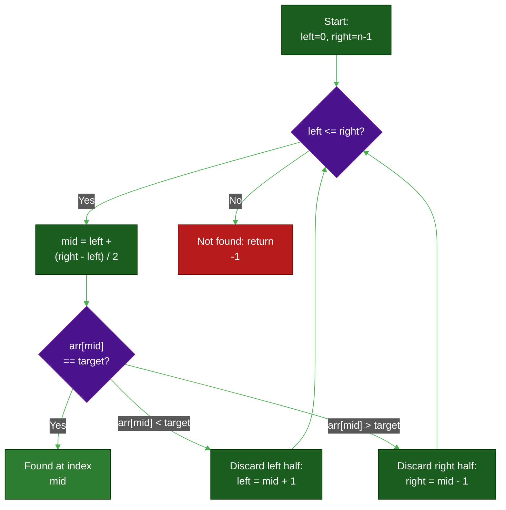
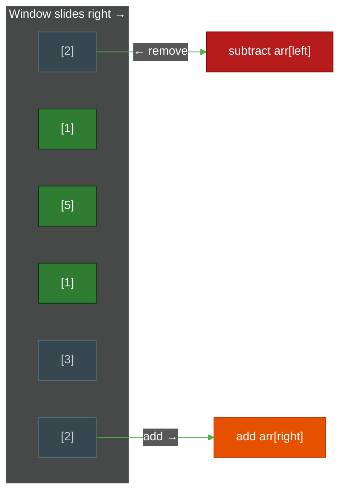
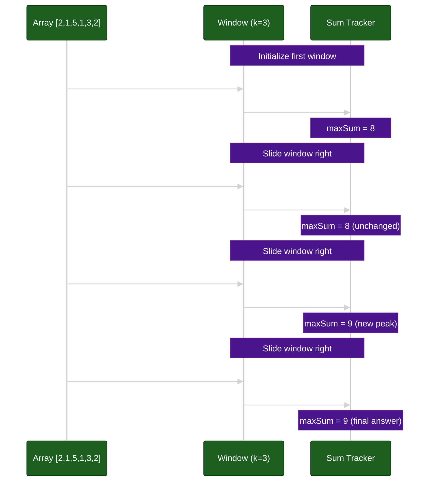
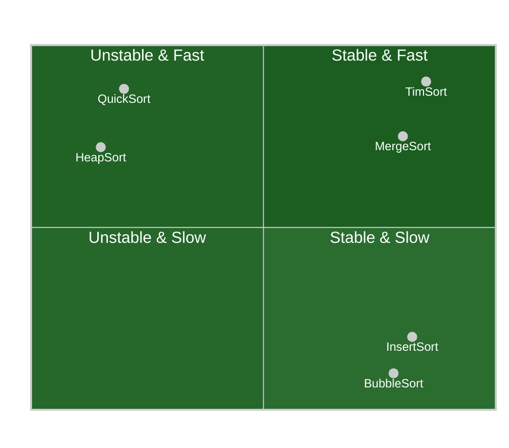
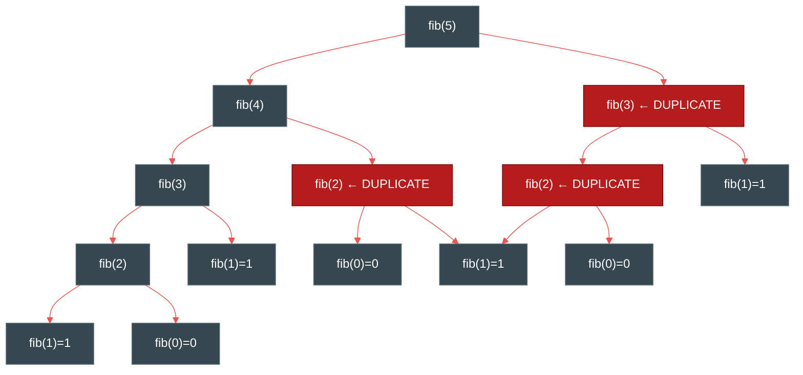
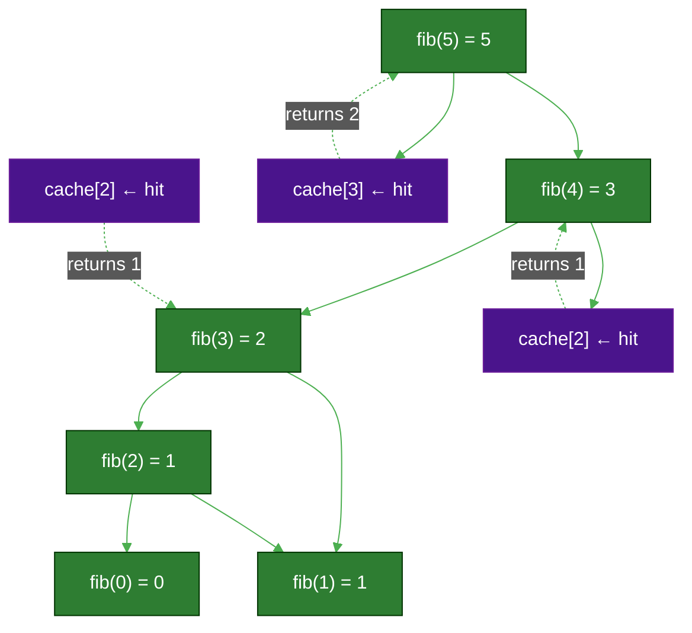

# Core Algorithmic Patterns: Binary Search, Two Pointers, Sorting Stability & Dynamic Programming

**Author:** ichamrong  
**Date:** 2026-05-16  
**Tags:** #dsa #algorithms #dynamic-programming #java  
**Category:** Clean Code & Engineering  
**Read Time:** ~20 min  

---

## 📌 Table of Contents
- [Patterns in This Article](#patterns-in-this-article)
- [1. Binary Search: The Logarithmic Scalpel](#1-binary-search-the-logarithmic-scalpel)
  - [The Problem](#the-problem-3)
  - [The Insight](#the-insight-2)
  - [The Hidden Cost: Sorted Data](#the-hidden-cost-sorted-data)
  - [The Structure](#the-structure)
  - [Industrial Case Study: Database Index Lookups](#industrial-case-study-database-index-lookups)
  - [When NOT to Use Binary Search](#when-not-to-use-binary-search)
- [2. Two Pointers & Sliding Window](#2-two-pointers-sliding-window)
  - [The Problem](#the-problem-3)
  - [The Insight](#the-insight-2)
  - [Sliding Window Visual](#sliding-window-visual)
  - [Step-by-Step: Window Sum Updates](#step-by-step-window-sum-updates)
  - [Industrial Case Study: Anomaly Detection in Metrics](#industrial-case-study-anomaly-detection-in-metrics)
  - [Two Pointers Variant: Pair Sum in a Sorted Array](#two-pointers-variant-pair-sum-in-a-sorted-array)
- [3. Sorting Stability: Why It Matters in Production](#3-sorting-stability-why-it-matters-in-production)
  - [The Problem](#the-problem-3)
  - [The Insight](#the-insight-2)
  - [Algorithm Stability Reference](#algorithm-stability-reference)
  - [Industrial Case Study: E-Commerce Multi-Column Sorting](#industrial-case-study-e-commerce-multi-column-sorting)
  - [Algorithm Comparison: Stability vs Speed](#algorithm-comparison-stability-vs-speed)
- [4. Dynamic Programming: The Memoization Masterclass](#4-dynamic-programming-the-memoization-masterclass)
  - [The Problem](#the-problem-3)
  - [The Two Necessary Conditions](#the-two-necessary-conditions)
  - [Industrial Case Study: Cloud Resource Allocation (0/1 Knapsack)](#industrial-case-study-cloud-resource-allocation-01-knapsack)
  - [DP Decision Framework](#dp-decision-framework)
- [Pattern Summary](#pattern-summary)

---

## Table of Contents

- [Binary Search: The Logarithmic Scalpel](#1-binary-search-the-logarithmic-scalpel)
- [Two Pointers & Sliding Window](#2-two-pointers-sliding-window)
- [Sorting Stability: Why It Matters in Production](#3-sorting-stability-why-it-matters-in-production)
- [Dynamic Programming: The Memoization Masterclass](#4-dynamic-programming-the-memoization-masterclass)
- [Pattern Summary](#pattern-summary)

---

## Patterns in This Article

| Pattern | Core Insight | Complexity Gain |
| :--- | :--- | :--- |
| [Binary Search](#core-algorithmic-patterns-binary-search-two-pointers-sorting-stability-dynamic-programming) | Eliminate half the candidates per step | O(n) → O(log n) |
| [Two Pointers & Sliding Window](#2-two-pointers-sliding-window) | Maintain state as the window moves | O(n·k) → O(n) |
| [Sorting Stability](#core-algorithmic-patterns-binary-search-two-pointers-sorting-stability-dynamic-programming) | Equal elements preserve relative order | Correctness guarantee |
| [Dynamic Programming](#core-algorithmic-patterns-binary-search-two-pointers-sorting-stability-dynamic-programming) | Never solve the same sub-problem twice | O(2ⁿ) → O(n²) |

---

## 1. Binary Search: The Logarithmic Scalpel

> **"Binary search doesn't find things faster — it finds things in a fundamentally different universe of time."**

### The Problem

You have 1 billion items. A linear scan costs **1 billion operations** in the worst case.  
Binary search costs **30**.

Not 30 times faster. Not 30%. Thirty *total* operations. Against a billion. This is not a micro-optimization. It is the difference between a query that resolves in milliseconds and one that times out the connection.

### The Insight

> 📖 **Read the Parable:** [The Dictionary of Secrets (វចនានុក្រមនៃអាថ៌កំបាំង)](../../concepts/parables/105-the-dictionary-of-secrets.md)

Each comparison eliminates **half** the remaining candidates. The cost of eliminating the first 500 million items is *exactly the same* as the cost of eliminating the last 2: one comparison.

This is the essence of logarithmic thinking. When each step halves the problem space, the total number of steps is `log₂(n)`. For n = 1,000,000,000, that is ≈ 30 steps.

```
n = 1,000,000,000
Step 1: 500,000,000 remain
Step 2: 250,000,000 remain
...
Step 30: 1 remains
```

### The Hidden Cost: Sorted Data

Binary search only works on **sorted** data. This is the price of admission. If your dataset is not sorted — or cannot be kept sorted as it grows — binary search is unavailable to you. That cost must be accounted for upfront.

**Pre-sorting cost:** O(n log n) once, amortized over many O(log n) lookups.  
**Break-even point:** If you perform `k` lookups, binary search pays off when `k * O(log n) + O(n log n) < k * O(n)`.

### The Structure



### Industrial Case Study: Database Index Lookups

When you execute `SELECT * FROM Users WHERE id = 123`, the database engine does not scan every row. It consults a **sorted index** — typically backed by a B-Tree or sorted array of keys — and performs a binary search variant to locate the record's position in O(log n) time.

```java
import java.util.Arrays;

public class DatabaseIndexSearch {

    /**
     * Performs a binary search on a sorted array of user IDs to find the index of a target ID.
     *
     * This simulates how a database index locates a record without scanning the full table.
     *
     * Time Complexity:  O(log N) — each iteration halves the search space.
     * Space Complexity: O(1)     — no extra memory; only two pointer variables.
     *
     * @param sortedUserIds A sorted array of user IDs (the "index").
     * @param targetId      The ID to locate.
     * @return The index position if found; -1 otherwise.
     */
    public int findRecordIndex(int[] sortedUserIds, int targetId) {
        int left  = 0;
        int right = sortedUserIds.length - 1;

        System.out.println("  Searching for target ID: " + targetId);

        while (left <= right) {
            // KEY TRICK: Use (left + right) / 2 and you risk integer overflow when
            // left + right exceeds Integer.MAX_VALUE (~2 billion). This form is always safe.
            int mid = left + (right - left) / 2;

            System.out.println("    Range: [" + left + ", " + right + "]  mid=" + mid
                    + "  value=" + sortedUserIds[mid]);

            if (sortedUserIds[mid] == targetId) {
                // Exact match — record found at this index position.
                return mid;
            } else if (sortedUserIds[mid] < targetId) {
                // The midpoint value is too small.
                // Everything to the left of mid (inclusive) cannot be the answer.
                // Advance the left boundary past mid to search the RIGHT half.
                left = mid + 1;
            } else {
                // The midpoint value is too large.
                // Everything to the right of mid (inclusive) cannot be the answer.
                // Pull the right boundary below mid to search the LEFT half.
                right = mid - 1;
            }
        }

        // The search space is exhausted — target does not exist in the index.
        return -1;
    }

    public static void main(String[] args) {
        System.out.println("--- Database Index Lookup Simulation ---");

        // Simulated sorted index of user IDs (as a database B-Tree leaf page might look)
        int[] userIds = {101, 105, 110, 115, 120, 125, 130, 135, 140, 145, 150};
        System.out.println("Sorted Index: " + Arrays.toString(userIds));

        DatabaseIndexSearch searcher = new DatabaseIndexSearch();

        // Test 1: Target is in the middle of the array
        int target1 = 120;
        int index1 = searcher.findRecordIndex(userIds, target1);
        System.out.println("Result: ID " + target1 + (index1 != -1
                ? " found at index " + index1 : " NOT found") + ".\n");

        // Test 2: Target is the first element
        int target2 = 101;
        int index2 = searcher.findRecordIndex(userIds, target2);
        System.out.println("Result: ID " + target2 + (index2 != -1
                ? " found at index " + index2 : " NOT found") + ".\n");

        // Test 3: Target is the last element
        int target3 = 150;
        int index3 = searcher.findRecordIndex(userIds, target3);
        System.out.println("Result: ID " + target3 + (index3 != -1
                ? " found at index " + index3 : " NOT found") + ".\n");

        // Test 4: Target is absent (gap between 110 and 115)
        int target4 = 112;
        int index4 = searcher.findRecordIndex(userIds, target4);
        System.out.println("Result: ID " + target4 + (index4 != -1
                ? " found at index " + index4 : " NOT found") + ".\n");

        // Test 5: Target is below the minimum — would be caught immediately
        int target5 = 99;
        int index5 = searcher.findRecordIndex(userIds, target5);
        System.out.println("Result: ID " + target5 + (index5 != -1
                ? " found at index " + index5 : " NOT found") + ".\n");

        System.out.println("--- Database Index Lookup Complete ---");
    }
}
```

### When NOT to Use Binary Search

| Situation | Why Binary Search Fails |
| :--- | :--- |
| **Unsorted data** | Precondition violated — incorrect results, not just slow results |
| **Array size < 20 items** | Overhead of computing `mid` and branches outweighs linear scan's simplicity |
| **Single one-time lookup** | O(n log n) sort cost is never amortized; just do a linear scan |
| **Frequent insertions into the sorted list** | Maintaining sorted order (O(n) shifts per insert) may negate the lookup gain |

---

## 2. Two Pointers & Sliding Window

> **"Two pointers don't just optimize — they reveal the hidden structure of the problem."**

### The Problem

Find the maximum sum subarray of exactly `k` consecutive elements.

**Naive approach:** For each starting index `i`, sum `k` elements from `i` to `i+k-1`. That is O(n · k) — roughly O(n²) for large k.

**Sliding window:** Sum the first window once. Then for every subsequent window, add one new element and subtract one old element. The window *slides*, carrying its state forward.

```
Array:  [2, 1, 5, 1, 3, 2]   k = 3

Window 1: [2, 1, 5]           sum = 8
Window 2: [1, 5, 1]           sum = 8 - 2 + 1 = 7   (subtract left, add right)
Window 3: [5, 1, 3]           sum = 7 - 1 + 3 = 9   ← maximum
Window 4: [1, 3, 2]           sum = 9 - 5 + 2 = 6
```

**Total additions/subtractions:** n − k. Versus n · k for naive. This is not a constant-factor improvement. At k = 1,000 and n = 1,000,000, the naive approach does **1 billion** operations. Sliding window does **999,000**.

### The Insight

> 📖 **Read the Parable:** [The Photographer's Lens (កែវយឹតរបស់អ្នកថតរូប)](../../concepts/parables/106-the-photographers-lens.md)

The window **remembers its state**. Rather than recomputing the sum from scratch for every new position, you maintain an invariant: `currentSum` always equals the sum of the last `k` elements. Moving the window one step requires exactly two arithmetic operations, regardless of k.

This insight generalises. Any time you find yourself computing something over a contiguous range and then re-computing it for a slightly shifted range, ask: *what part of this computation can I carry forward?*

### Sliding Window Visual



### Step-by-Step: Window Sum Updates



### Industrial Case Study: Anomaly Detection in Metrics

Monitoring systems like Datadog and Prometheus aggregate telemetry over rolling windows. Finding the window with the highest peak load — to trigger alerts or scale-out decisions — is exactly the sliding window maximum sum problem.

```java
import java.util.Arrays;

public class MetricsAnalyzer {

    /**
     * Finds the maximum sum CPU load over any contiguous window of 'windowSize' readings.
     *
     * This is a textbook sliding window application. Instead of re-summing k elements
     * for every starting position (O(n*k)), we carry the running sum forward with
     * one addition and one subtraction per step: O(n) total.
     *
     * Time Complexity:  O(N) — one pass after the initial window.
     * Space Complexity: O(1) — only two scalar variables regardless of window size.
     *
     * @param cpuLoads   Array of CPU load readings (e.g., % usage per minute).
     * @param windowSize Number of consecutive readings to consider per window.
     * @return Maximum sum of any contiguous window; 0 if input is invalid.
     */
    public double getMaxSlidingWindowSum(double[] cpuLoads, int windowSize) {
        if (cpuLoads == null || cpuLoads.length == 0
                || windowSize <= 0 || windowSize > cpuLoads.length) {
            System.out.println("  Invalid input.");
            return 0;
        }

        double currentWindowSum = 0;
        double maxWindowSum;

        // Phase 1: Compute the sum for the very first window (indices 0 → windowSize-1).
        // This is the only time we touch more than two elements in a single step.
        for (int i = 0; i < windowSize; i++) {
            currentWindowSum += cpuLoads[i];
        }
        maxWindowSum = currentWindowSum;
        System.out.printf("  Initial window [0..%d] sum: %.2f%n", windowSize - 1, currentWindowSum);

        // Phase 2: Slide the window one position to the right on each iteration.
        //   - cpuLoads[i]              = the new element entering the window on the right
        //   - cpuLoads[i - windowSize] = the old element leaving the window on the left
        // These two operations replace re-summing k elements from scratch every time.
        for (int i = windowSize; i < cpuLoads.length; i++) {
            currentWindowSum += cpuLoads[i] - cpuLoads[i - windowSize];
            maxWindowSum = Math.max(maxWindowSum, currentWindowSum);
            System.out.printf("  Slid to [%d..%d]: sum=%.2f  max=%.2f%n",
                    i - windowSize + 1, i, currentWindowSum, maxWindowSum);
        }

        return maxWindowSum;
    }

    public static void main(String[] args) {
        System.out.println("--- Anomaly Detection in Metrics (Sliding Window) ---");

        MetricsAnalyzer analyzer = new MetricsAnalyzer();

        // CPU readings across 12 consecutive minutes
        double[] cpuReadings = {10.5, 12.0, 15.3, 11.8, 20.1, 25.5, 18.7, 13.2, 16.0, 22.4, 28.9, 19.5};
        int window = 3;

        System.out.println("CPU Readings: " + Arrays.toString(cpuReadings));
        System.out.println("Window Size : " + window + " minutes\n");

        double maxSum = analyzer.getMaxSlidingWindowSum(cpuReadings, window);
        System.out.printf("%nMax CPU load sum over any %d-minute window: %.2f%n", window, maxSum);
        System.out.printf("Average load in worst window:               %.2f%%%n", maxSum / window);

        System.out.println("\n--- Anomaly Detection Simulation Complete ---");
    }
}
```

### Two Pointers Variant: Pair Sum in a Sorted Array

The two-pointer technique is distinct from sliding window but shares the same core idea: use two index variables that move *toward* each other to avoid an O(n²) nested loop.

```java
import java.util.Arrays;
import java.util.ArrayList;
import java.util.List;

public class PairFinder {

    /**
     * Finds all pairs in a sorted array whose values sum to the given target.
     *
     * Classic two-pointer approach:
     *   - left  pointer starts at the beginning (smallest value).
     *   - right pointer starts at the end       (largest value).
     *   - If sum < target: move left  right to increase the sum.
     *   - If sum > target: move right left  to decrease the sum.
     *   - If sum == target: record the pair, then advance both pointers.
     *
     * Time Complexity:  O(N) after sorting — one pass with two pointers.
     * Space Complexity: O(1) extra (output list not counted).
     *
     * @param sortedArr Sorted array of integers.
     * @param target    Desired sum.
     * @return List of [a, b] pairs where a + b == target.
     */
    public List<int[]> findPairs(int[] sortedArr, int target) {
        List<int[]> pairs = new ArrayList<>();
        int left  = 0;
        int right = sortedArr.length - 1;

        while (left < right) {
            int sum = sortedArr[left] + sortedArr[right];

            if (sum == target) {
                // Pair found. Record it and advance both pointers inward.
                pairs.add(new int[]{sortedArr[left], sortedArr[right]});
                left++;
                right--;
            } else if (sum < target) {
                // Sum is too small. Increasing left pointer raises the sum.
                left++;
            } else {
                // Sum is too large. Decreasing right pointer lowers the sum.
                right--;
            }
        }
        return pairs;
    }

    public static void main(String[] args) {
        System.out.println("--- Two Pointers: Pair Sum in Sorted Array ---");

        PairFinder finder = new PairFinder();
        int[] sorted = {1, 2, 3, 4, 6, 7, 9, 10};
        int target = 10;

        System.out.println("Array : " + Arrays.toString(sorted));
        System.out.println("Target: " + target);

        List<int[]> result = finder.findPairs(sorted, target);
        System.out.println("Pairs that sum to " + target + ":");
        result.forEach(p -> System.out.println("  [" + p[0] + ", " + p[1] + "]"));

        System.out.println("\n--- Two Pointers Simulation Complete ---");
    }
}
```

---

## 3. Sorting Stability: Why It Matters in Production

> **"An unstable sort will silently destroy the business logic you spent a week building."**

### The Problem

Your e-commerce backend receives a request: sort orders first by **customer name**, then by **order date**.

The team uses two sequential sorts — sort by date first, then sort by customer. On day one, everything looks correct. A new intern optimises the date sort with QuickSort for performance. The next day, a customer calls: their orders are out of date order. Support tickets pile up. The root cause? **An unstable sort on customer scrambled the date ordering for customers with identical names.**

No exception was thrown. No test failed. The output was simply *wrong*.

### The Insight

> 📖 **Read the Parable:** [The Graduating Class (ការរៀបចំជួរនិស្សិតបញ្ចប់ការសិក្សា)](../../concepts/parables/107-the-graduating-class.md)

A sort is **stable** if elements that compare as *equal* retain their original relative order in the output. This property is what makes sequential multi-key sorting correct.

When you sort by date first, then sort by customer, you are relying on the customer sort to leave same-customer rows in their date order. That guarantee only holds if the customer sort is stable.

```
Before (sorted by date):
  Alice  2026-01-01
  Bob    2026-01-02
  Alice  2026-01-03

Stable sort by customer → Alice rows retain date order:
  Alice  2026-01-01   ← correct: earlier date first
  Alice  2026-01-03
  Bob    2026-01-02

Unstable sort by customer → Alice rows scrambled:
  Alice  2026-01-03   ← WRONG: later date appears first
  Alice  2026-01-01
  Bob    2026-01-02
```

### Algorithm Stability Reference

| Algorithm | Stable? | Average Time | Notes |
| :--- | :---: | :--- | :--- |
| **MergeSort** | Yes | O(n log n) | Java uses this for `Arrays.sort(Object[])` |
| **TimSort** | Yes | O(n log n) | Java `List.sort()` / `Collections.sort()` since Java 7 |
| **QuickSort** | **No** | O(n log n) | Java uses this for `Arrays.sort(int[])` (primitive arrays) |
| **HeapSort** | **No** | O(n log n) | Not stable; useful when memory is constrained |
| **Insertion Sort** | Yes | O(n²) | Stable and fast on nearly-sorted small arrays |
| **Bubble Sort** | Yes | O(n²) | Stable but impractical at scale |

**Java's rule of thumb:** Sorting objects (`List.sort`, `Arrays.sort(Object[])`) is guaranteed stable (TimSort). Sorting primitives (`Arrays.sort(int[])`) uses dual-pivot QuickSort, which is not stable — but primitives have no "identity" beyond their value, so stability is irrelevant for them.

### Industrial Case Study: E-Commerce Multi-Column Sorting

A product listing page sorts by review score first, then by price. Products with the same price must retain their review-score order so the best-reviewed items within each price tier float to the top.

```java
import java.util.ArrayList;
import java.util.Comparator;
import java.util.List;
import java.util.Objects;

class StoreProduct {
    private final String name;
    private final double price;
    private final double reviewScore; // 0.0–5.0

    public StoreProduct(String name, double price, double reviewScore) {
        this.name        = Objects.requireNonNull(name);
        if (price < 0 || reviewScore < 0 || reviewScore > 5)
            throw new IllegalArgumentException("Invalid product values.");
        this.price       = price;
        this.reviewScore = reviewScore;
    }

    public String getName()        { return name; }
    public double getPrice()       { return price; }
    public double getReviewScore() { return reviewScore; }

    @Override
    public String toString() {
        return String.format("%-20s $%-8.2f ★%.1f", name, price, reviewScore);
    }
}

public class StoreCatalog {

    /**
     * Multi-column sort: primary key = price (ascending),
     *                    tiebreaker   = reviewScore (descending, i.e., best first).
     *
     * This demonstrates WHY stability matters:
     *   Step 1 — sort by reviewScore descending (establishes the tiebreaker order).
     *   Step 2 — sort by price ascending (primary key).
     *
     * Because Java's List.sort() uses TimSort (stable), products that share the
     * same price will stay in the order established by Step 1 — highest review first.
     * Swap TimSort for an unstable sort and Step 1's work is silently discarded.
     *
     * @param products List of products to sort in-place.
     */
    public void sortProducts(List<StoreProduct> products) {
        System.out.println("--- Step 1: Sort by Review Score (descending) ---");
        // TimSort is stable — the relative order of equal-score items is preserved.
        products.sort(Comparator.comparingDouble(StoreProduct::getReviewScore).reversed());
        products.forEach(System.out::println);

        System.out.println("\n--- Step 2: Sort by Price (ascending) ---");
        // Because TimSort is stable, products at the SAME PRICE retain the
        // review-score order from Step 1. Best-reviewed items within a price
        // tier float to the top automatically.
        products.sort(Comparator.comparingDouble(StoreProduct::getPrice));
        products.forEach(System.out::println);

        System.out.println("\nProducts sorted by price. Within each price tier, " +
                           "highest review score appears first (stability preserved).");
    }

    public static void main(String[] args) {
        System.out.println("--- E-Commerce Multi-Column Sorting ---");

        List<StoreProduct> products = new ArrayList<>();
        // Three products at $25.00 — the review scores must decide their internal order.
        products.add(new StoreProduct("Laptop Pro X",     1200.00, 4.5));
        products.add(new StoreProduct("Wireless Mouse",      25.00, 3.8));
        products.add(new StoreProduct("Mechanical Keyboard",  75.00, 4.2));
        products.add(new StoreProduct("Monitor 27\"",       250.00, 4.0));
        products.add(new StoreProduct("Webcam HD",            25.00, 4.1)); // same price as Mouse
        products.add(new StoreProduct("Headphones Pro",       75.00, 3.9)); // same price as Keyboard
        products.add(new StoreProduct("Desk Lamp",            25.00, 4.9)); // same price as Mouse & Webcam

        StoreCatalog catalog = new StoreCatalog();
        catalog.sortProducts(products);

        System.out.println("\n--- E-Commerce Sorting Simulation Complete ---");
    }
}
```

### Algorithm Comparison: Stability vs Speed



---

## 4. Dynamic Programming: The Memoization Masterclass

> **"DP is not an algorithm. It's a mindset: stop solving the same problem twice."**

### The Problem

`fibonacci(40)` computed naively with recursion makes approximately **2⁴⁰ = 1 trillion** function calls.  
With memoization: **40** unique calls. The rest are cache lookups.

The recursive tree for `fib(5)` illustrates why:



Nodes in red are recalculated from scratch. For `fib(5)`, `fib(3)` is computed twice, `fib(2)` three times. For `fib(40)`, the explosion is exponential.

With memoization, each sub-problem is solved once and cached. Duplicate calls become O(1) cache lookups:



Green = computed once. Purple = cache hit (zero recomputation).

### The Two Necessary Conditions

> 📖 **Read the Parable:** [The Fibonacci Staircase (ជណ្តើរហ្វ៊ីបូណាស៊ី និងសៀវភៅកំណត់ហេតុ)](../../concepts/parables/108-the-fibonacci-staircase.md)

For DP to apply, **both** conditions must hold:

1. **Optimal Substructure:** The optimal solution to the problem can be built from optimal solutions to its sub-problems.  
   *Fibonacci:* `fib(n) = fib(n-1) + fib(n-2)` — the solution to `fib(n)` uses solutions to smaller instances.

2. **Overlapping Sub-problems:** The same sub-problems appear multiple times during recursion.  
   *Fibonacci:* `fib(3)` is needed by both `fib(5)` and `fib(4)`. Without memoization, it is recomputed from scratch each time.

If only Optimal Substructure holds without overlapping sub-problems, the problem calls for **Divide and Conquer** (e.g., MergeSort), not DP.

### Industrial Case Study: Cloud Resource Allocation (0/1 Knapsack)

A DevOps team needs to deploy microservices onto a fixed-budget server cluster. Each service has a **cost** (CPU/memory units) and a **throughput value**. The goal: maximize total throughput without exceeding the budget. No service can be deployed partially — it's all or nothing (the "0/1" constraint).

This is the 0/1 Knapsack problem. The DP table `dp[i][w]` encodes: *"the maximum throughput achievable using the first `i` services with a total budget of exactly `w`."*

The recurrence:

```
dp[i][w] = max(
    dp[i-1][w],                                  // skip service i
    throughput[i] + dp[i-1][w - cost[i]]         // deploy service i (if affordable)
)
```

```java
import java.util.ArrayList;
import java.util.Collections;
import java.util.List;

public class CloudResourceAllocator {

    /**
     * Solves the 0/1 Knapsack problem using bottom-up dynamic programming.
     *
     * dp[i][w] = maximum throughput achievable using the first 'i' services
     *            with a total cost budget of 'w'.
     *
     * For each service i and each budget level w, we choose the better of:
     *   (a) NOT deploying service i → inherit the result from dp[i-1][w].
     *   (b) Deploying service i     → add its throughput to dp[i-1][w - cost[i]].
     *       Only legal if cost[i] <= w (we can actually afford it).
     *
     * Time Complexity:  O(N * W) — fill every cell of the N × W table once.
     * Space Complexity: O(N * W) — the DP table itself.
     *
     * @param costs       costs[i] = resource cost of service i.
     * @param throughputs throughputs[i] = throughput value of service i.
     * @param budget      Maximum total cost allowed.
     * @return Maximum achievable throughput.
     */
    public int optimizeDeployments(int[] costs, int[] throughputs, int budget) {
        int n = costs.length;

        // Allocate the DP table. Row 0 = "no services considered" (all zeros baseline).
        int[][] dp = new int[n + 1][budget + 1];

        for (int i = 1; i <= n; i++) {
            int serviceCost       = costs[i - 1];
            int serviceThroughput = throughputs[i - 1];

            for (int w = 1; w <= budget; w++) {
                // Option A: Skip service i entirely.
                // The answer is the same as if we only had i-1 services and budget w.
                int withoutService = dp[i - 1][w];

                // Option B: Deploy service i (only if we can afford it).
                // We "spend" serviceCost units of budget, then look up what the first
                // (i-1) services could achieve with the remaining (w - serviceCost) budget.
                int withService = 0;
                if (serviceCost <= w) {
                    withService = serviceThroughput + dp[i - 1][w - serviceCost];
                }

                // Store the best of both options in the DP table.
                dp[i][w] = Math.max(withoutService, withService);
            }
        }

        // dp[n][budget] = the answer: maximum throughput using all n services within budget.
        return dp[n][budget];
    }

    /**
     * Traces back through the filled DP table to identify which services were chosen.
     *
     * Starting at dp[n][budget], we move upward:
     *   If dp[i][w] != dp[i-1][w], service i was included (we took Option B).
     *   Otherwise, service i was skipped (we took Option A).
     *
     * @param costs       Service costs array.
     * @param throughputs Service throughputs array (unused here, but kept for clarity).
     * @param budget      Total budget.
     * @param dp          The filled DP table from optimizeDeployments().
     * @return Zero-indexed list of chosen service indices.
     */
    public List<Integer> reconstructChosenServices(int[] costs, int[] throughputs,
                                                    int budget, int[][] dp) {
        List<Integer> chosen = new ArrayList<>();
        int remainingBudget = budget;

        for (int i = costs.length; i > 0; i--) {
            // If this row differs from the row above, service i was deployed.
            if (dp[i][remainingBudget] != dp[i - 1][remainingBudget]) {
                chosen.add(i - 1); // Convert 1-indexed row to 0-indexed service
                remainingBudget -= costs[i - 1]; // Reclaim the budget this service consumed
            }
        }

        Collections.reverse(chosen); // Return in original service order for readability
        return chosen;
    }

    public static void main(String[] args) {
        System.out.println("--- Cloud Resource Allocator (0/1 Knapsack via DP) ---");

        // Available microservices:
        //   Index 0: Web Server     (cost: 10, throughput:  60)
        //   Index 1: Database       (cost: 20, throughput: 100)
        //   Index 2: Cache Layer    (cost: 30, throughput: 120)
        //   Index 3: Load Balancer  (cost: 15, throughput:  70)
        String[] serviceNames = {"Web Server", "Database", "Cache Layer", "Load Balancer"};
        int[]    costs        = {10, 20, 30, 15};
        int[]    throughputs  = {60, 100, 120, 70};
        int      budget       = 50;

        System.out.println("Available Services:");
        for (int i = 0; i < serviceNames.length; i++) {
            System.out.printf("  %-18s cost=%-4d throughput=%d%n",
                    serviceNames[i], costs[i], throughputs[i]);
        }
        System.out.println("Total Budget: " + budget + " units\n");

        CloudResourceAllocator allocator = new CloudResourceAllocator();

        // Build the DP table (needed for both the answer and the reconstruction)
        int n = costs.length;
        int[][] dpTable = new int[n + 1][budget + 1];
        for (int i = 1; i <= n; i++) {
            int sc = costs[i - 1];
            int st = throughputs[i - 1];
            for (int w = 1; w <= budget; w++) {
                int withoutI = dpTable[i - 1][w];
                int withI    = (sc <= w) ? st + dpTable[i - 1][w - sc] : 0;
                dpTable[i][w] = Math.max(withoutI, withI);
            }
        }

        // The bottom-right cell of the DP table holds the global optimum.
        System.out.println("Maximum achievable throughput: " + dpTable[n][budget]);

        // Trace the choices that produced the optimal result.
        List<Integer> chosen = allocator.reconstructChosenServices(costs, throughputs, budget, dpTable);
        System.out.println("Optimal service set:");
        int totalCost = 0;
        for (int idx : chosen) {
            System.out.printf("  + %-18s (cost=%d, throughput=%d)%n",
                    serviceNames[idx], costs[idx], throughputs[idx]);
            totalCost += costs[idx];
        }
        System.out.println("Total cost used: " + totalCost + " / " + budget + " units");

        System.out.println("\n--- Cloud Resource Allocation Complete ---");
    }
}
```

### DP Decision Framework

Before reaching for DP, verify both conditions hold:

| Question | If YES | If NO |
| :--- | :--- | :--- |
| Does the problem have Optimal Substructure? | Continue | DP does not apply |
| Are the same sub-problems solved more than once? | Use DP (memoize) | Use Divide & Conquer (no cache needed) |
| Is memory for the DP table acceptable? | Bottom-up tabulation | Consider space-optimized DP (rolling array) |

---

## Pattern Summary

| Pattern | Time Complexity | Space Complexity | Key Prerequisite |
| :--- | :--- | :--- | :--- |
| **Binary Search** | O(log n) | O(1) | Sorted data |
| **Sliding Window** | O(n) | O(1) | Contiguous subarray structure |
| **Two Pointers** | O(n) | O(1) | Sorted array (for pair sum) |
| **Stable Sort** | O(n log n) | O(n) | Multi-key sort correctness |
| **DP (Knapsack)** | O(n · W) | O(n · W) | Optimal substructure + overlapping sub-problems |

---

**Navigation:** [← Non-Linear Structures](./02-non-linear-structures.md) | [Back to Index →](./README.md)

---

*Last updated: 2026-05-16*

## Related

- [Design Patterns](../design-patterns/README.md)
- [Refactoring Techniques](../refactoring/README.md)
- [Software Architecture](../software-architecture/README.md)
