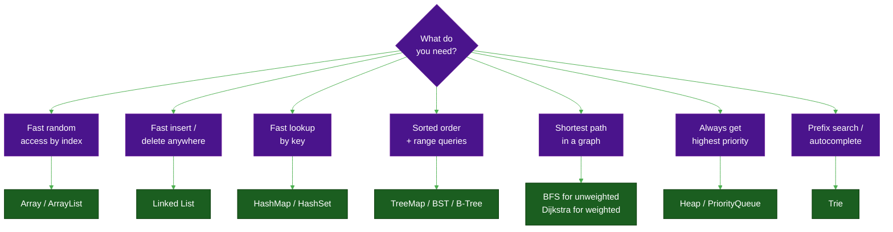

# The Architecture of Efficiency: Data Structures & Algorithms

**Author:** ichamrong  
**Date:** 2026-05-16  
**Tags:** #dsa #algorithms #data-structures #big-o #computer-science  
**Category:** Clean Code & Engineering  

---

## What Is DSA, Really?

> **"A bad algorithm on a supercomputer will eventually be beaten by a good algorithm on a calculator."**

Data Structures and Algorithms are the **fundamental laws of physics for software**. They define how you organize information and how you process it. Throwing more hardware at a bad algorithm doesn't fix it — it just delays the crash.

The entire discipline answers one question: **given unlimited ways to solve a problem, which way scales?**

---

## Big O: The Ruler of Growth

Big O describes how an algorithm's resource requirements grow as input size `n` grows — not its exact time, but its **rate of growth**.

| Notation | Name | Real-World Analogy | Efficiency |
| :--- | :--- | :--- | :--- |
| **O(1)** | Constant | Picking a book by shelf number | Excellent |
| **O(log n)** | Logarithmic | Binary search in a dictionary | Great |
| **O(n)** | Linear | Reading every page | Good |
| **O(n log n)** | Linearithmic | MergeSort, HeapSort | Fair |
| **O(n²)** | Quadratic | Comparing every pair | Poor |
| **O(2ⁿ)** | Exponential | Trying every password | Terrible |

```mermaid
%%{init: {'theme': 'dark', 'themeVariables': {'primaryColor': '#1b5e20', 'primaryTextColor': '#fff', 'lineColor': '#4caf50',
    'background': '#1e1e1e'},
  'themeCSS': 'svg { background-color: #1e1e1e !important; padding: 1rem !important; border-radius: 8px !important; } .edgeLabel rect { fill: #1e1e1e !important; } text, tspan, .messageText, .signalText, .edgeLabel, .edgeLabel span, .pointLabel, .axisLabel, .quadrantTitle, .quadrantLabel { fill: #ffffff !important; color: #ffffff !important; stroke: none !important; }'
}}%%
graph LR
    classDef excellent fill:#1b5e20,stroke:#003300,color:#fff
    classDef good     fill:#e65100,stroke:#bf360c,color:#fff
    classDef bad      fill:#b71c1c,stroke:#7f0000,color:#fff

    O1["O(1)<br/>Constant"]:::excellent --- Olog["O(log n)<br/>Logarithmic"]:::excellent
    Olog --- On["O(n)<br/>Linear"]:::good
    On --- Onlogn["O(n log n)<br/>Linearithmic"]:::good
    Onlogn --- On2["O(n²)<br/>Quadratic"]:::bad
    On2 --- O2n["O(2ⁿ)<br/>Exponential"]:::bad
```

---

## 📖 Featured Articles

| Date | Title | Level | Time | Topics |
| :--- | :--- | :--- | :--- | :--- |
| 2026-05-16 | [Linear Data Structures: The Foundation](./01-linear-structures.md) | Intermediate | ~12 min | Arrays, Linked Lists (LRU Cache), Stacks (Undo/Redo), Queues (Rate Limiter) |
| 2026-05-16 | [Non-Linear Data Structures: Graphs, Trees & Heaps](./02-non-linear-structures.md) | Advanced | ~15 min | Hash Tables (Consistent Hashing), Trees/Tries (Autocomplete), Graphs (BFS), Heaps (Task Scheduler) |
| 2026-05-16 | [Algorithms: Search, Sort, and Dynamic Programming](./03-algorithms.md) | Advanced | ~15 min | Binary Search, Two Pointers, Sliding Window, Sorting Stability, Dynamic Programming |

---

## 🎭 Pedagogical Parables

To make these abstract DSA concepts unforgettable, each structure and algorithm is paired with a real-world, bilingual (Khmer/English) parable:

| Concept | Parable Story | Insight |
| :--- | :--- | :--- |
| **Arrays** | [The Cinema Seats (កៅអីរោងកុន)](../../concepts/parables/98-the-cinema-seats.md) | Contiguous memory, O(1) access, and the pain of shifting. |
| **Linked Lists** | [The Spy's Treasure Hunt (ល្បែងរកកំណប់)](../../concepts/parables/99-the-spys-treasure-hunt.md) | O(1) insertions, non-contiguous pointers, and the pain of traversing. |
| **Stacks & Queues** | [The Dish Stack & Ticket Queue (គំនរចាន និងជួររង់ចាំ)](../../concepts/parables/100-the-dish-stack-and-the-ticket-queue.md) | LIFO vs FIFO causal relationships. |
| **Hash Tables** | [The Apothecary's Cabinet (ទូថ្នាំវេទមន្ត)](../../concepts/parables/101-the-apothecarys-cabinet.md) | O(1) magical lookups and chained collision handling. |
| **Trees & Tries** | [The Family Tree of Kings (មែកធាងរាជវង្សានុវង្ស)](../../concepts/parables/102-the-family-tree-of-kings.md) | Hierarchical routing and rapid O(L) prefix search. |
| **Graphs** | [The Web of Friendship (បណ្តាញនៃមិត្តភាព)](../../concepts/parables/103-the-web-of-friendship.md) | Directed/Undirected relationships without a strict root. |
| **Heaps** | [The Emergency Room Triage (បន្ទប់សង្គ្រោះបន្ទាន់)](../../concepts/parables/104-the-emergency-room-triage.md) | Bypassing the queue to grant O(1) access to highest priority. |
| **Binary Search** | [The Dictionary of Secrets (វចនានុក្រមនៃអាថ៌កំបាំង)](../../concepts/parables/105-the-dictionary-of-secrets.md) | The logarithmic scalpel requiring pre-sorted data. |
| **Sliding Window** | [The Photographer's Lens (កែវយឹតរបស់អ្នកថតរូប)](../../concepts/parables/106-the-photographers-lens.md) | Converting O(N²) overlapping loops to O(N) by shifting a frame. |
| **Sorting Stability** | [The Graduating Class (ការរៀបចំជួរនិស្សិត)](../../concepts/parables/107-the-graduating-class.md) | Maintaining historical order during tie-breakers. |
| **Dynamic Programming** | [The Fibonacci Staircase (ជណ្តើរហ្វ៊ីបូណាស៊ី)](../../concepts/parables/108-the-fibonacci-staircase.md) | Memoization: The cure for overlapping subproblems. |

---

## When to Use What

---

## The Space-Time Trade-off

There is no free lunch in computing. Every efficiency gain in time costs space, and every space saving costs time.

| Structure | Time Trade-off | Space Trade-off | Use When |
| :--- | :--- | :--- | :--- |
| **Array** | O(1) access | Fixed size | Random access, iteration |
| **HashMap** | O(1) lookup | 2–3× memory | Frequent key lookups |
| **Bloom Filter** | O(1) membership | Tiny | Can tolerate false positives |
| **DP Table** | O(n²) → O(n) | O(n²) extra space | Overlapping subproblems |
| **Trie** | O(L) prefix search | High per node | Autocomplete, spell check |

---

## References

- **Cormen, T. H., et al.** — *Introduction to Algorithms* (CLRS)
- **Sedgewick, R., & Wayne, K.** — *Algorithms* (4th ed.)
- **Big-O Cheat Sheet** — [bigocheatsheet.com](https://www.bigocheatsheet.com)

---

*Last updated: 2026-05-16*
