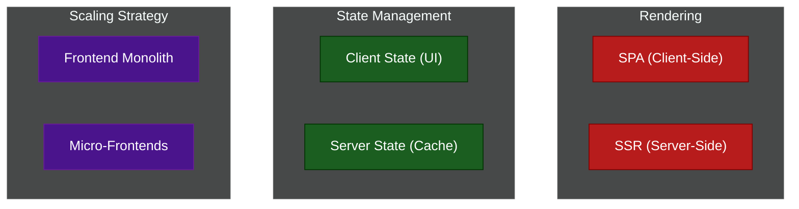

# ⚛️ Frontend Architecture

A comprehensive guide to scaling user interfaces. As web applications grow from simple landing pages to massive, enterprise-grade SPA platforms, organizing your React, Vue, or Angular code becomes critical.

---

## 📖 Table of Contents

- [The Complexity of the Client](#the-complexity-of-the-client)
- [📚 Module Index](#module-index)
- [Architecture Landscape](#architecture-landscape)

---

## The Complexity of the Client

Ten years ago, the frontend was just HTML and CSS generated by a backend server. Today, the frontend is a massive distributed system running inside the user's browser. It must handle routing, state management, complex data fetching, and bundle optimization. 

Structuring a frontend codebase properly is the only way to prevent it from becoming an unmaintainable "Big Ball of Mud."

---

## 📚 Module Index

### 1. Core Architecture
The fundamental pillars of how data is fetched, managed, and rendered to the user.
| Module | Title | Level | Read Time | Key Topics |
| :--- | :--- | :--- | :--- | :--- |
| **01** | [Rendering Strategies (SPA vs SSR vs SSG)](./core-architecture/01-rendering-strategies.md) | Fundamental | ~8 min | React, Next.js, SEO, Time-to-Interactive |
| **02** | [State Management Architecture](./core-architecture/02-state-management.md) | Advanced | ~10 min | Client vs Server State, Redux, Context API |
| **03** | [Network & Data Protocols](./core-architecture/03-network-protocols.md) | Intermediate | ~8 min | REST vs GraphQL vs WebSockets vs SSE |

### 2. Scaling & Build Systems
How to scale a frontend across multiple teams and thousands of files.
| Module | Title | Level | Read Time | Key Topics |
| :--- | :--- | :--- | :--- | :--- |
| **01** | [Monorepo Architecture](./scaling-and-builds/01-monorepo-architecture.md) | Advanced | ~10 min | Nx, Turborepo, Code Sharing, Remote Caching |
| **02** | [Build Tools & Bundlers](./scaling-and-builds/02-build-tools-bundlers.md) | Expert | ~8 min | Webpack, Vite, ESBuild, Transpilation, AST |
| **03** | [Micro-Frontends](./scaling-and-builds/03-micro-frontends.md) | Expert | ~10 min | Module Federation, Scaling Frontend Teams |
| **04** | [Standalone vs Micro-Apps](./scaling-and-builds/04-standalone-vs-micro-apps.md) | Advanced | ~8 min | Super Apps, App Shells, WeChat Mini Programs |

### 3. Performance & Security
How to protect your users and optimize the browser's execution.
| Module | Title | Level | Read Time | Key Topics |
| :--- | :--- | :--- | :--- | :--- |
| **01** | [Performance & Optimization](./performance-and-security/01-performance-optimization.md) | Advanced | ~10 min | Code Splitting, Tree Shaking, Web Vitals, Virtualization |
| **02** | [Frontend Security](./performance-and-security/02-frontend-security.md) | Advanced | ~10 min | XSS, CSRF, JWT Storage, Content Security Policy |
| **03** | [PWAs & Offline-First](./performance-and-security/03-pwa-offline-first.md) | Expert | ~8 min | Service Workers, IndexedDB, Background Sync |

### 4. Code Organization
How folders are structured and the strict rules dictating component responsibilities.
| Module | Title | Level | Read Time | Key Topics |
| :--- | :--- | :--- | :--- | :--- |
| **01** | [Folder Organization (Feature-Based)](./code-organization/01-feature-based-folder-structure.md) | Intermediate | ~12 min | Vertical Slices, Barrel Files (`index.ts`) |
| **02** | [Component-Driven Design (Atomic)](./code-organization/02-component-driven-design.md) | Intermediate | ~8 min | Smart vs Dumb Components, Atomic Design |
| **03** | [Component Architecture Deep Dive](./code-organization/03-component-architecture-deep-dive.md) | Advanced | ~10 min | Smart vs Dumb, API Hooks, UI Fragment State |
| **04** | [Frontend Testing Strategy](./code-organization/04-testing-strategy.md) | Intermediate | ~8 min | Test Pyramid, React Testing Library, Cypress, Playwright |

### 5. Design Systems
How to maintain visual consistency across thousands of components globally.
| Module | Title | Level | Read Time | Key Topics |
| :--- | :--- | :--- | :--- | :--- |
| **01** | [Design Systems & UI Libraries](./design-systems/01-design-systems.md) | Intermediate | ~8 min | Design Tokens, Tailwind, Headless UI |
| **02** | [Multiple Design Systems in One App](./design-systems/02-multi-design-systems.md) | Expert | ~8 min | CSS Encapsulation, White-labeling, Multi-tenant |
| **03** | [Accessibility (a11y) & i18n](./design-systems/03-a11y-and-i18n.md) | Advanced | ~10 min | Screen Readers, Focus Trapping, ARIA, RTL Layouts |

---

## Architecture Landscape

