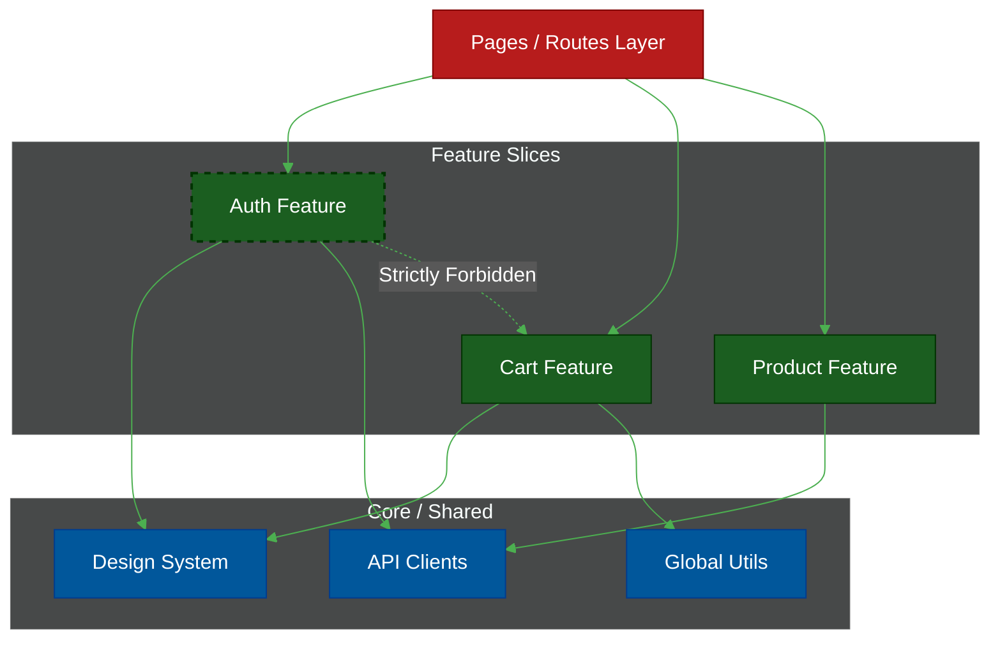

# 📂 Enterprise Folder Structures (TypeScript)

> **Series:** Clean Code › Frontend Architecture · **Level:** Intermediate · **Read Time:** ~12 min

---

## 📖 Table of Contents

- [1. The Enterprise Layering Strategy](#1-the-enterprise-layering-strategy)
- [2. React (Vite) + TypeScript](#2-react-vite-typescript)
- [3. Next.js (App Router) + TypeScript](#3-nextjs-app-router-typescript)
- [4. Vue 3 (Composition API) + TypeScript](#4-vue-3-composition-api-typescript)
- [5. Angular (Standalone) + TypeScript](#5-angular-standalone-typescript)

---

## 1. The Enterprise Layering Strategy

In a large-scale frontend, everything is split into two strict categories:
1. **Core / Global Layer:** Things that configure the *entire application* (API interceptors, error logging, env variables, global routing, formatting utilities).
2. **Feature Layer:** Things that solve a *specific business problem* (Shopping Cart, User Auth).



Below are the **exhaustive**, maximalist industry-standard TypeScript folder structures, detailing exactly where every conceivable architectural pattern (Directives, Pipes, Middlewares, Web Workers, HOCs) belongs.

---

## 2. React (Vite) + TypeScript

React is highly unopinionated. This is an exhaustive blueprint for a massive React Single Page Application (SPA).

```text
src/
├── assets/                 # 🖼️ Static files bundled by Webpack/Vite
│   ├── images/
│   └── fonts/
│
├── config/                 # ⚙️ App-wide configurations
│   ├── env.ts              # Validates process.env variables (using Zod)
│   ├── constants.ts        # Global constants (API_BASE_URL, Pagination limits)
│   └── theme.ts            # Global styling configuration (Tailwind config values)
│
├── lib/                    # 🛠️ Third-party wrappers (Never import libraries directly!)
│   ├── axios.ts            # Central API client with request/response Interceptors
│   ├── logger.ts           # Central logging wrapper (Datadog, Sentry)
│   ├── socket.ts           # WebSockets (Socket.io) configuration
│   └── query-client.ts     # React Query global configuration
│
├── context/                # 🌐 Global Providers (Keep to an absolute minimum!)
│   ├── AuthProvider.tsx
│   └── ThemeProvider.tsx
│
├── store/                  # 💾 Global State (Zustand / Redux)
│   └── uiStore.ts          # Only for global UI state (sidebar open/closed)
│
├── hooks/                  # 🎣 Global custom hooks
│   ├── useDebounce.ts
│   └── useClickOutside.ts
│
├── hoc/                    # 🛡️ Higher Order Components
│   └── withAuth.tsx        # Route protection wrapper
│
├── utils/                  # 🧮 Pure functions (No React code allowed here)
│   ├── formatters/         # formatCurrency.ts, formatDate.ts
│   └── validators/         # Global Zod/Yup schemas
│
├── types/                  # 🏷️ Global TypeScript Definitions
│   └── global.d.ts         # Window extensions, generic API response types
│
├── workers/                # ⚙️ Web Workers (Off-main-thread processing)
│   └── heavy-compute.worker.ts
│
├── components/             # 🧱 Global Shared UI (The Design System)
│   ├── ui/                 # Atoms (Buttons, Inputs, Spinners)
│   ├── form/               # Molecules (FormFields, ErrorMessages)
│   └── layouts/            # Templates (SidebarLayout, TopnavLayout)
│
├── features/               # 🟢 THE CORE BUSINESS LOGIC (Vertical Slices)
│   ├── auth/               
│   │   ├── api/            # loginUser.ts, refreshSession.ts
│   │   ├── components/     # LoginForm.tsx
│   │   ├── hooks/          # useLogin.ts
│   │   ├── store/          # Feature-specific Zustand store
│   │   ├── types/          # AuthUser.ts
│   │   └── index.ts        # 🔒 PUBLIC API BARREL FILE
│   │
│   └── cart/               # Another isolated feature slice...
│
├── router/                 # 🗺️ Global Routing Context
│   ├── routes.ts           # Route definitions array
│   ├── AuthGuard.tsx       # Route protection logic
│   └── AppRouter.tsx       # React Router setup
│
├── App.tsx                 # Root component (Wraps Providers & Router)
└── main.tsx                # Entry point (React.render)
```

---

## 3. Next.js (App Router) + TypeScript

Next.js is a meta-framework. It dictates exactly where Middlewares and Server-Side configurations belong.

```text
src/
├── config/                 # ⚙️ Configurations
│   └── site.ts             # SEO metadata, navigation links
│
├── lib/                    # 🛠️ Central Singletons
│   ├── db.ts               # Prisma/Drizzle database client (Server-side only)
│   ├── auth.ts             # NextAuth / Auth.js configuration
│   └── logger.ts           # Winston/Pino server-side logger
│
├── types/                  # 🏷️ TypeScript definitions
│   └── index.ts
│
├── components/             # 🧱 Global UI (Shadcn/UI, Tailwind components)
│   ├── ui/                 # button.tsx, dialog.tsx
│   └── providers.tsx       # Wraps children in Context (Theme, QueryClient)
│
├── features/               # 🟢 THE CORE BUSINESS LOGIC
│   ├── dashboard/          
│   │   ├── actions/        # ⚡ Server Actions (Database Mutations)
│   │   ├── api/            # External API fetches
│   │   ├── components/     # Client/Server UI blocks
│   │   └── index.ts
│
├── middleware.ts           # 🛡️ Next.js Edge Middleware (Intercepts all requests for Auth/i18n)
├── instrumentation.ts      # 📡 Boot-time tasks (Sentry server-side initialization)
│
└── app/                    # 🌐 The Next.js File-System Router
    ├── api/                # Next.js Route Handlers (Backend endpoints)
    │   └── webhooks/stripe/route.ts
    │
    ├── (auth)/             # Route Group (doesn't affect URL path)
    │   ├── login/page.tsx
    │   └── layout.tsx      # Auth-specific layout
    │
    ├── dashboard/          # /dashboard URL
    │   ├── page.tsx        # Imports <DashboardData> from @/features/dashboard
    │   ├── loading.tsx     # Suspense boundary fallback (Shows a spinner)
    │   └── error.tsx       # Error boundary (Catches client-side crashes)
    │
    ├── layout.tsx          # Root HTML layout (<body>)
    └── global-error.tsx    # Catches catastrophic root layout errors
```

---

## 4. Vue 3 (Composition API) + TypeScript

Vue pairs the React-like component structure with a highly structured global `plugins/` and `directives/` ecosystem.

```text
src/
├── assets/                 # 🖼️ Static assets
├── config/                 # ⚙️ App configurations
│
├── plugins/                # 🔌 Vue Plugins (Injected at app mount)
│   ├── i18n.ts             # Internationalization setup
│   ├── sentry.ts           # Error tracking initialization
│   └── pinia.ts            # Global State setup
│
├── directives/             # 🕹️ Global Custom Directives
│   ├── v-click-outside.ts  # v-click-outside
│   └── v-focus.ts          # v-focus
│
├── utils/                  # 🛠️ Utilities & API Wrappers
│   ├── http.ts             # Axios interceptors
│   └── formatters.ts
│
├── composables/            # 🎣 Global Hooks (Vue Composition API)
│   ├── useWindowSize.ts
│   └── useLocalStorage.ts
│
├── components/             # 🧱 Global Shared UI
│   ├── BaseButton.vue
│   └── BaseModal.vue
│
├── features/               # 🟢 THE CORE BUSINESS LOGIC
│   ├── articles/          
│   │   ├── api/            # fetchArticles.ts
│   │   ├── components/     # ArticleCard.vue
│   │   ├── composables/    # useArticles.ts
│   │   ├── store/          # Pinia stores specific to this feature
│   │   ├── types/          # Article.ts
│   │   └── index.ts
│
├── router/                 # 🗺️ Vue Router
│   ├── index.ts            # Router instance
│   └── guards.ts           # Navigation guards (Auth redirects)
│
├── App.vue                 # Root layout `<router-view />`
└── main.ts                 # `createApp(App).use(router).use(pinia).mount('#app')`
```

---

## 5. Angular (Standalone) + TypeScript

Modern Angular (v15+) enforces the absolute strictest architectural separation via its legendary `core/` and `shared/` pattern.

```text
src/
├── environments/           # ⚙️ Built-in Angular environment configs
│   ├── environment.ts
│   └── environment.prod.ts
│
├── app/
│   ├── core/               # 🧠 SINGLETONS (Loaded exactly ONCE in app.config.ts)
│   │   ├── interceptors/   # Global HTTP Interceptors
│   │   │   ├── auth.interceptor.ts
│   │   │   ├── error.interceptor.ts
│   │   │   └── logging.interceptor.ts
│   │   ├── guards/         # Router Navigation Guards
│   │   │   ├── auth.guard.ts
│   │   │   └── admin.guard.ts
│   │   ├── resolvers/      # Pre-fetches data before routing
│   │   │   └── user-profile.resolver.ts
│   │   ├── services/       # Global Services
│   │   │   ├── theme.service.ts
│   │   │   └── storage.service.ts
│   │   ├── models/         # Global Interfaces
│   │   └── constants/      # Global Constants
│   │
│   ├── shared/             # 🧱 GLOBAL UI (Imported anywhere, never depends on Core)
│   │   ├── components/     # shared-button.component.ts
│   │   ├── pipes/          # Custom formatting templates
│   │   │   ├── currency-format.pipe.ts
│   │   │   └── safe-html.pipe.ts
│   │   ├── directives/     # DOM manipulation attributes
│   │   │   ├── click-outside.directive.ts
│   │   │   └── drag-drop.directive.ts
│   │   └── validators/     # Custom ReactiveForm validators
│   │       └── password-strength.validator.ts
│   │
│   ├── features/           # 🟢 THE CORE BUSINESS LOGIC
│   │   ├── cart/
│   │   │   ├── components/ # cart-list.component.ts|html|scss
│   │   │   ├── services/   # cart-api.service.ts
│   │   │   ├── store/      # NgRx State Management (Highly isolated!)
│   │   │   │   ├── cart.actions.ts
│   │   │   │   ├── cart.reducer.ts
│   │   │   │   ├── cart.selectors.ts
│   │   │   │   └── cart.effects.ts
│   │   │   ├── models/     # cart-item.interface.ts
│   │   │   └── cart.routes.ts # Feature-specific lazy routing
│   │
│   ├── app.component.ts    # Root component `<router-outlet>`
│   ├── app.routes.ts       # Global router (lazy loads feature routes)
│   └── app.config.ts       # Application providers (Replaces app.module.ts)
│
└── main.ts                 # bootstrapApplication(AppComponent, appConfig)
```

## 🔗 External References & Required Reading
- **Bulletproof React:** [Feature-based Architecture](https://github.com/alan2207/bulletproof-react/blob/master/docs/project-structure.md)
- **Angular Docs:** [Standalone Components](https://angular.io/guide/standalone-components)

---

*← [Micro-Frontends](../system-design/03-micro-frontends.md) · Next: [Component-Driven Design](./02-component-driven-design.md) →*

## Related

- [Design Patterns](../../design-patterns/README.md)
- [Software Architecture Patterns](../../software-architecture/README.md)
- [Observability & Monitoring](../../../devops/observability/README.md)
- [Build Tools & CI/CD](../../../devops/cicd-pipelines/README.md)
