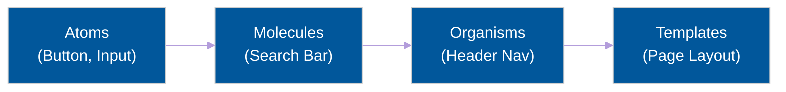

# 🧩 Component-Driven Design

> **Series:** Clean Code › Frontend Architecture · **Level:** Intermediate · **Read Time:** ~8 min

---

## 📖 Table of Contents

- [1. The Monolithic Page Problem](#1-the-monolithic-page-problem)
- [2. Smart vs Dumb Components](#2-smart-vs-dumb-components)
- [3. Atomic Design Methodology](#3-atomic-design-methodology)
- [4. Storybook & Design Systems](#4-storybook-design-systems)

---




## 1. The Monolithic Page Problem

Junior frontend developers often build "Monolithic Pages". They create a single file (`Dashboard.jsx`) that is 1,500 lines long. It fetches data, maps over arrays, handles CSS styles, and renders 50 different buttons and modals.

This file becomes impossible to test, impossible to reuse, and causes massive merge conflicts when multiple developers edit it.

**Component-Driven Design** solves this by breaking the UI into tiny, reusable, isolated LEGO blocks.

---

## 2. Smart vs Dumb Components

The most important architectural rule in React/Vue is separating **Logic** from **Presentation**.

### Dumb Components (Presentational)
These components have no idea that your application even exists. They do not fetch data. They do not connect to Redux. They simply receive data via `props` and render HTML. 
*(e.g., `<Button>`, `<UserProfileCard>`, `<Avatar>`)*

```jsx
// ✅ A Perfect Dumb Component
const UserAvatar = ({ imageUrl, altText }) => (
  
);
```

### Smart Components (Container)
These components do not render any CSS. Their only job is to fetch data from the API, manage complex state, and pass that data down to the Dumb components.
*(e.g., `<UserProfileContainer>`, `<DashboardLayout>`)*

```jsx
// ✅ A Perfect Smart Component
const UserProfileContainer = ({ userId }) => {
  const { data, isLoading } = useQuery(`/api/users/${userId}`);
  
  if (isLoading) return <Spinner />;
  return <UserProfileCard user={data} />;
};
```

---

## 3. Atomic Design Methodology

Created by Brad Frost, **Atomic Design** is the industry standard folder structure for organizing thousands of components.

1. **Atoms:** The smallest possible building blocks. Cannot be broken down further. *(Buttons, Inputs, Labels, Icons).*
2. **Molecules:** Groups of atoms bonded together. *(A `<SearchForm>` molecule consists of an Input atom, a Label atom, and a Button atom).*
3. **Organisms:** Complex UI sections composed of molecules and atoms. *(A `<Header>` organism contains a Logo, Navigation Links, and a SearchForm).*
4. **Templates:** Page-level layouts without actual real data. Wireframes.
5. **Pages:** Specific instances of templates populated with real data from the backend.

```text
src/
└── components/
    ├── atoms/
    │   └── Button.jsx
    ├── molecules/
    │   └── SearchBar.jsx
    ├── organisms/
    │   └── NavigationBar.jsx
    └── pages/
        └── DashboardPage.jsx
```

---

## 4. Storybook & Design Systems

If your company has 50 developers, how do you stop Developer A from building a new Blue Button when Developer B already built one last week?

You use a tool like **Storybook**. Storybook runs completely independently of your main application. It renders a visual catalog of every single Atom, Molecule, and Organism in your codebase.
Developers browse Storybook to find existing LEGO blocks before writing new code. This is how massive companies (like Uber or Airbnb) maintain visual consistency across hundreds of different web pages.

## 🔗 External References & Required Reading
- **Brad Frost:** [Atomic Design Methodology](https://bradfrost.com/blog/post/atomic-web-design/)
- **Component Driven:** [UI Development Standard](https://www.componentdriven.org/)

---

*← [Back to Series Overview](../README.md)*

## Related

- [Design Patterns](../../design-patterns/README.md)
- [Software Architecture Patterns](../../software-architecture/README.md)
- [Observability & Monitoring](../../../devops/observability/README.md)
- [Build Tools & CI/CD](../../../devops/cicd-pipelines/README.md)
