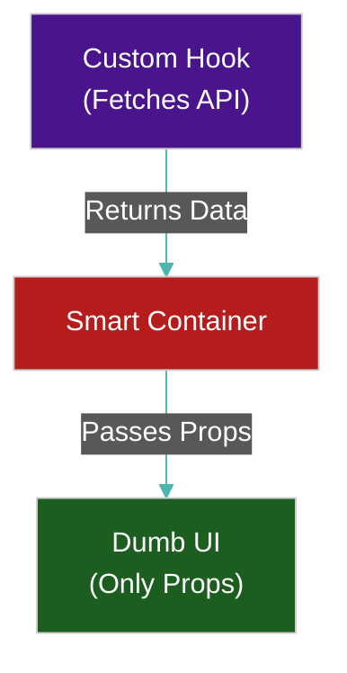

# 🧩 Component Architecture (Smart vs Dumb)

> **Series:** Clean Code › Frontend Architecture · **Level:** Advanced · **Read Time:** ~10 min

---

## 📖 Table of Contents

- [1. The Anatomy of a Component](#1-the-anatomy-of-a-component)
- [2. Dumb Components (Presentational)](#2-dumb-components-presentational)
- [3. Smart Components (Containers)](#3-smart-components-containers)
- [4. Should a UI Fragment Have State?](#4-should-a-ui-fragment-have-state)
- [5. Where Do API Calls Go? (Custom Hooks)](#5-where-do-api-calls-go-custom-hooks)

---




## 1. The Anatomy of a Component

In modern React/Vue, components are heavily abused. A single component often handles CSS styling, state management, complex `useEffect` API calls, and business logic. 

To build maintainable frontends, you must aggressively separate **Presentation** (How things look) from **Logic** (How things work).

---

## 2. Dumb Components (Presentational)

A **Dumb Component** (or "Dummy UI") is a purely visual element.
- **Rule 1:** It **never** calls an API.
- **Rule 2:** It **never** accesses Global State (like Redux or Zustand).
- **Rule 3:** It receives 100% of its data and actions via `props`.

```jsx
// ✅ A Perfect Dumb Component
// It knows NOTHING about the database, APIs, or Redux. It just paints HTML.
export const UserCard = ({ name, email, onFollowClick }) => {
  return (
    <div className="card">
      <h2>{name}</h2>
      <p>{email}</p>
      <button onClick={onFollowClick}>Follow</button>
    </div>
  );
};
```
*Why?* Because a Dumb Component is 100% reusable. You can use `<UserCard>` on the Homepage, the Admin Dashboard, and in Storybook without breaking anything.

---

## 3. Smart Components (Containers)

A **Smart Component** (or "Container") does the exact opposite. 
- **Rule 1:** It **rarely** contains raw HTML/CSS. 
- **Rule 2:** Its only job is to fetch data, manage state, and pass that data down to the Dumb components.

```jsx
// ✅ A Perfect Smart Component
import { useUserApi } from '@/hooks/useUserApi';
import { UserCard } from '@/components/UserCard';

export const UserProfileContainer = ({ userId }) => {
  // 1. Fetch data (Logic)
  const { user, isLoading, followUser } = useUserApi(userId);

  if (isLoading) return <Spinner />;

  // 2. Pass data to the UI (Presentation)
  return (
    <UserCard 
      name={user.name} 
      email={user.email} 
      onFollowClick={() => followUser(user.id)} 
    />
  );
};
```

---

## 4. Should a UI Fragment Have State?

*Question: If I have a small UI fragment (like an Accordion, a Dropdown Menu, or a Carousel), is it allowed to have state?*

**Answer: YES, but ONLY "Ephemeral UI State".**

A Dumb Component is allowed to use `useState` **only** if the state is purely visual and temporary. 

```jsx
// ✅ Acceptable UI State in a Dumb Component
export const Dropdown = ({ options }) => {
  // This state is purely visual. It belongs here!
  const [isOpen, setIsOpen] = useState(false); 

  return (
    <div>
      <button onClick={() => setIsOpen(!isOpen)}>Toggle</button>
      {isOpen && <ul>{options.map(...)}</ul>}
    </div>
  );
};
```

**However**, a Dumb Component is **never** allowed to hold "Business State" (e.g., holding the user's Auth Token or the Shopping Cart array). That belongs in a Container or a Global Store.

---

## 5. Where Do API Calls Go? (Custom Hooks)

*Question: Can a UI Fragment call an API?*
**Answer: ABSOLUTELY NEVER.**

If you put a `fetch()` call inside a `<Button>` component, that Button is now permanently coupled to your backend server. You can never use that Button for anything else.

**The Golden Rule of Hooks:** All API calls must be extracted into Custom Hooks. 

```jsx
// ❌ BAD: API logic mixed into the UI
const UserList = () => {
  const [users, setUsers] = useState([]);
  useEffect(() => {
    fetch('/api/users').then(res => res.json()).then(setUsers);
  }, []);
  return <ul>...</ul>;
}

// ✅ GOOD: Logic is isolated in a Custom Hook
const useUsers = () => {
  // This hook handles the fetching, caching, and error handling
  return useQuery(['users'], () => fetch('/api/users').then(r => r.json()));
}

// The UI component just consumes the hook
const UserList = () => {
  const { data: users, isLoading } = useUsers();
  if (isLoading) return <Spinner />;
  return <ul>...</ul>;
}
```

By extracting API calls into Hooks, you can test your API logic completely independently of your React UI.

## 🔗 External References & Required Reading
- **Dan Abramov:** [Presentational and Container Components](https://medium.com/@dan_abramov/smart-and-dumb-components-7ca2f9a7c7d0)
- **React Docs:** [Reusing Logic with Custom Hooks](https://react.dev/learn/reusing-logic-with-custom-hooks)

---

*← [Back to Series Overview](../README.md)*

## Related

- [Design Patterns](../../design-patterns/README.md)
- [Software Architecture Patterns](../../software-architecture/README.md)
- [Observability & Monitoring](../../../devops/observability/README.md)
- [Build Tools & CI/CD](../../../devops/cicd-pipelines/README.md)
