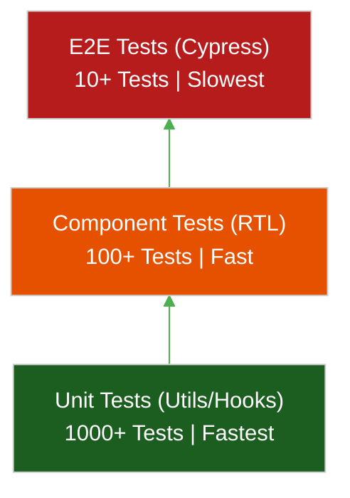

# 🧪 Frontend Testing Strategy

> **Series:** Clean Code › Frontend Architecture · **Level:** Intermediate · **Read Time:** ~8 min

---

## 📖 Table of Contents

- [1. The Testing Pyramid](#1-the-testing-pyramid)
- [2. Unit Testing (Jest / Vitest)](#2-unit-testing-jest-vitest)
- [3. Component Testing (React Testing Library)](#3-component-testing-react-testing-library)
- [4. E2E Testing (Cypress / Playwright)](#4-e2e-testing-cypress-playwright)

---




## 1. The Testing Pyramid

A major mistake teams make is writing exhaustive Unit Tests for React Components. The DOM changes too frequently, and UI unit tests end up breaking every time a designer changes a CSS class.

The **Frontend Test Pyramid** suggests:
1. **End-to-End (E2E) Tests:** Write a few critical tests that spin up a real browser and click through the core flows (e.g., Checkout). High cost, highest confidence.
2. **Component (Integration) Tests:** Test how components render and interact with user events, mocking the APIs. Medium cost.
3. **Unit Tests:** ONLY test pure JavaScript functions (utils, validators, complex Redux/Zustand logic). Do not unit test UI elements. Low cost, extremely fast.

---

## 2. Unit Testing (Jest / Vitest)

Keep your Unit Tests strictly focused on business logic. If a function does not return JSX, it should be unit tested.

```typescript
// ✅ Test the pure logic. Fast and reliable.
import { calculateTax } from './utils';

test('calculates 10% tax correctly', () => {
  expect(calculateTax(100)).toBe(10);
});
```

---

## 3. Component Testing (React Testing Library)

**React Testing Library (RTL)** changed the industry. Instead of testing the internal state or the props of a component (which is testing implementation details), RTL forces you to test the DOM exactly how a real human user interacts with it.

```tsx
import { render, screen, fireEvent } from '@testing-library/react';

test('allows user to submit form', () => {
  render(<LoginForm />);
  
  // 1. Find elements exactly how a screen reader or user would
  const emailInput = screen.getByLabelText(/email/i);
  const submitButton = screen.getByRole('button', { name: /login/i });

  // 2. Interact
  fireEvent.change(emailInput, { target: { value: 'test@test.com' } });
  fireEvent.click(submitButton);

  // 3. Assert what is visible on screen
  expect(screen.getByText(/welcome back/i)).toBeInTheDocument();
});
```

---

## 4. E2E Testing (Cypress / Playwright)

End-to-End tests are the ultimate safety net. They launch a real Chromium browser, load your actual website, and programmatically click around like a ghost user.

**Playwright (or Cypress)** is used for testing the most critical paths (the "Happy Paths").

```javascript
// Playwright Example
test('User can purchase an item', async ({ page }) => {
  await page.goto('https://myapp.com');
  
  await page.click('text=Login');
  await page.fill('input[name="email"]', 'user@test.com');
  await page.fill('input[name="password"]', 'password123');
  await page.click('button:has-text("Submit")');

  await page.click('.product-card >> text=Add to Cart');
  await page.click('text=Checkout');

  await expect(page.locator('.success-message')).toBeVisible();
});
```
*Rule:* E2E tests are slow and brittle. Do not write an E2E test to verify a button changes to blue when hovered. Only use E2E to verify that money can be made!

## 🔗 External References & Required Reading
- **Kent C. Dodds:** [The Testing Trophy](https://kentcdodds.com/blog/the-testing-trophy-and-testing-classifications)
- **Testing Library:** [Guiding Principles](https://testing-library.com/docs/guiding-principles)

---

*← [Component Architecture Deep Dive](./03-component-architecture-deep-dive.md) · [Back to Series Overview](../README.md)*

## Related

- [Design Patterns](../../design-patterns/README.md)
- [Software Architecture Patterns](../../software-architecture/README.md)
- [Observability & Monitoring](../../../devops/observability/README.md)
- [Build Tools & CI/CD](../../../devops/cicd-pipelines/README.md)
