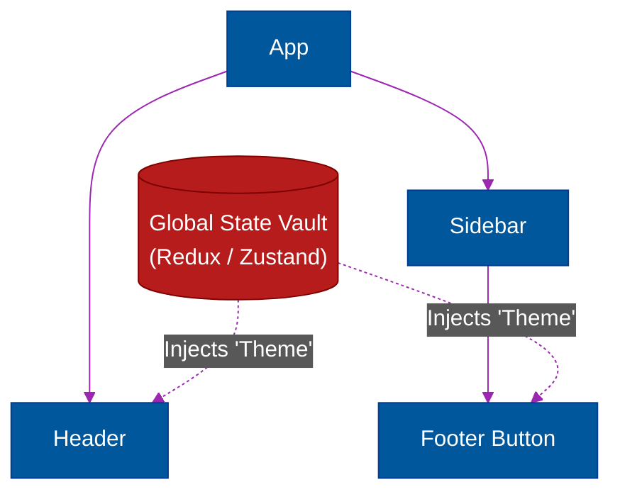

# 🧠 State Management Architecture

> **Series:** Clean Code › Frontend Architecture · **Level:** Advanced · **Read Time:** ~10 min

---

## 📖 Table of Contents

- [1. Prop Drilling (The Anti-Pattern)](#1-prop-drilling-the-anti-pattern)
- [2. The Global Store (Redux / Zustand)](#2-the-global-store-redux-zustand)
- [3. Client State vs Server State](#3-client-state-vs-server-state)
- [4. The Modern Stack (React Query + Zustand)](#4-the-modern-stack-react-query-zustand)

---

## 1. Prop Drilling (The Anti-Pattern)

React enforces "One-Way Data Flow." Data is passed from parent to child via `props`.

If your `<App>` component fetches the user's `theme` (dark or light mode), but the component that actually needs it is nested 10 layers deep inside the `<SidebarFooterButton>`, you have to pass the `theme` prop down through 9 intermediate components that don't care about it.

This is called **Prop Drilling**, and it makes code brittle and impossible to refactor.

---

## 2. The Global Store (Redux / Zustand)

To solve Prop Drilling, the industry shifted to a **Global Store** (e.g., Redux).
You pull the state out of the React component tree entirely and put it in a central vault. Any component, no matter how deep, can directly connect to the vault and grab the data it needs.



**The Redux Backlash:** Redux required massive amounts of boilerplate code (Actions, Reducers, Dispatchers) just to update a simple boolean. The modern industry has largely abandoned Redux in favor of lighter alternatives like **Zustand** or **React Context**.

---

## 3. Client State vs Server State

For years, developers dumped *everything* into Redux. They put UI toggle states alongside arrays of users fetched from the database. This was a massive architectural mistake.

You must cleanly separate state into two categories:

### Client State (Ephemeral UI State)
Data that belongs entirely to the browser. If the user closes the tab, the data is gone, and nobody cares.
- *Examples:* Is the dark mode toggle on? Is the dropdown menu open? What text is typed in the search box?
- *Tooling:* Use `useState`, `useContext`, or `Zustand`.

### Server State (Asynchronous Cache)
Data that is permanently stored in a remote database. The frontend is merely displaying a temporary, stale snapshot of that data.
- *Examples:* The user's bank account balance, a list of blog posts.
- *The Challenge:* Managing Server State manually requires handling `isLoading` spinners, `isError` alerts, caching, background polling, and deduplication.

---

## 4. The Modern Stack (React Query + Zustand)

Modern frontend architecture completely abandons Redux by splitting the responsibilities:

**1. TanStack Query (React Query) for Server State:**
It completely replaces `useEffect` API calls. It automatically caches data, handles loading/error states, and refetches data in the background if the user switches browser tabs.
```jsx
// React Query handles all the complexity of Server State caching
const { data: users, isLoading } = useQuery(['users'], fetchUsers);
```

**2. Zustand for Client State:**
For the rare Global Client State (like user preferences or complex multi-step wizards), you use a tiny, 20-line Zustand store. 

By splitting state this way, you delete 80% of your complex frontend code.

## 🔗 External References & Required Reading
- **Redux Toolkit:** [When should I use Redux?](https://redux.js.org/faq/general#when-should-i-use-redux)
- **TanStack Query:** [Does React Query replace Redux?](https://tanstack.com/query/latest/docs/framework/react/guides/does-this-replace-client-state)

---

*← [Back to Series Overview](../README.md)*

## Related

- [Design Patterns](../../design-patterns/README.md)
- [Software Architecture Patterns](../../software-architecture/README.md)
- [Observability & Monitoring](../../../devops/observability/README.md)
- [Build Tools & CI/CD](../../../devops/cicd-pipelines/README.md)
