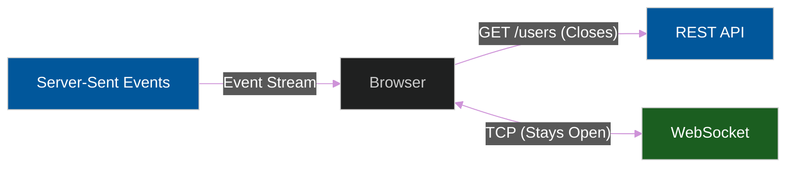

# 🌐 Network & Data Protocols

> **Series:** Clean Code › Frontend Architecture · **Level:** Intermediate · **Read Time:** ~8 min

---

## 📖 Table of Contents

- [1. REST (The Standard)](#1-rest-the-standard)
- [2. GraphQL (The Frontend's Dream)](#2-graphql-the-frontends-dream)
- [3. WebSockets (Bi-Directional)](#3-websockets-bi-directional)
- [4. Server-Sent Events (SSE)](#4-server-sent-events-sse)

---




## 1. REST (The Standard)

**How it works:** The frontend makes an HTTP `GET` request to `/api/users/123`. The server responds with a JSON object. The connection is immediately closed.
**The Problem:** Over-fetching and Under-fetching.
If the UI only needs the user's `firstName`, REST still sends back the entire 50-field JSON object (Over-fetching). If the UI also needs the user's recent orders, you have to make a second HTTP request to `/api/users/123/orders` (Under-fetching).

---

## 2. GraphQL (The Frontend's Dream)

Invented by Facebook to solve REST's problems on mobile networks.

**How it works:** The frontend sends a single HTTP `POST` request to `/graphql`. Inside the body, it explicitly declares exactly what data it wants:
```graphql
query {
  user(id: 123) {
    firstName
    orders {
      total
    }
  }
}
```
**Pros:** The server returns exactly those two fields and nothing else, in a single network request. It dramatically improves frontend performance and decoupled UI teams from Backend teams.

---

## 3. WebSockets (Bi-Directional)

HTTP is stateless and unidirectional. The client must ask the server for data. The server cannot push data to the client unexpectedly.

If you are building a Chat App or a Live Stock Ticker, using REST means you have to use **Polling** (`setInterval` to make an HTTP request every 1 second). This crushes battery life and destroys backend servers.

**WebSockets** solve this. The frontend establishes a persistent TCP connection with the server. It stays open forever. 
Both the client and the server can stream data back and forth instantly with virtually zero latency.
*(Note: Use libraries like `Socket.io` to automatically handle reconnections when a user's Wi-Fi drops).*

---

## 4. Server-Sent Events (SSE)

WebSockets are extremely heavy and difficult to scale on the backend (maintaining 100,000 open TCP connections requires massive RAM).

What if you are building a Live Sports Scoreboard? The client doesn't need to send messages to the server; the client only needs to *listen* to updates from the server.

**Server-Sent Events (SSE)** uses standard HTTP. The frontend opens a connection, and the server keeps the HTTP response stream open, continuously pushing text data (Events) down to the browser.
**Pros:** Much lighter than WebSockets. Supported natively by browsers via the `EventSource` API. Perfect for live feeds, stock tickers, and ChatGPT-style streaming text responses.

## 🔗 External References & Required Reading
- **MDN Web Docs:** [WebSockets API](https://developer.mozilla.org/en-US/docs/Web/API/WebSockets_API)
- **GraphQL:** [Core Concepts](https://graphql.org/learn/)

---

*← [Frontend Security](./06-frontend-security.md) · Next: [PWA & Offline First](./08-pwa-offline-first.md) →*

## Related

- [Design Patterns](../../design-patterns/README.md)
- [Software Architecture Patterns](../../software-architecture/README.md)
- [Observability & Monitoring](../../../devops/observability/README.md)
- [Build Tools & CI/CD](../../../devops/cicd-pipelines/README.md)
