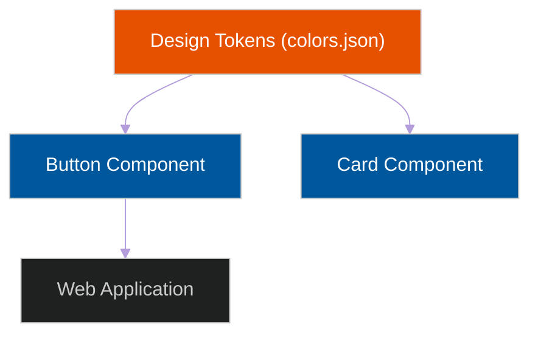

# 🎨 Design Systems & UI Libraries

> **Series:** Clean Code › Frontend Architecture · **Level:** Intermediate · **Read Time:** ~8 min

---

## 📖 Table of Contents

- [1. The UI Inconsistency Problem](#1-the-ui-inconsistency-problem)
- [2. Design Tokens (The Foundation)](#2-design-tokens-the-foundation)
- [3. Building vs Buying (Tailwind / MUI)](#3-building-vs-buying-tailwind-mui)
- [4. The Headless UI Revolution](#4-the-headless-ui-revolution)

---




## 1. The UI Inconsistency Problem

Without a strict Design System, a frontend codebase will inevitably become a garbage dump of CSS.
- You will end up with 15 different shades of "Blue" across the app.
- You will have 6 different `<Button>` components created by 6 different developers.
- Changing the primary brand color from Blue to Purple will take 3 weeks of hunting through CSS files.

A **Design System** is a single source of truth for the visual language of your company. It consists of Design Tokens, reusable UI Components, and interactive documentation (like Storybook).

---

## 2. Design Tokens (The Foundation)

**Design Tokens** are the atomic values of your design system. 
Instead of hardcoding the hex value `#1e88e5` into your CSS, you map it to a semantic Token.

```json
{
  "colors": {
    "primary-500": "#1e88e5",
    "danger-500": "#e53935"
  },
  "spacing": {
    "sm": "8px",
    "md": "16px"
  }
}
```

**Why Tokens Matter:** 
If the iOS App, the Android App, and the Web App all consume the exact same `tokens.json` file from a central repository, a UX Designer can change the "Primary" color in Figma, generate a new JSON file, and instantly update the brand color across all 3 platforms automatically!

---

## 3. Building vs Buying (Tailwind / MUI)

When scaling a React application, you must decide how to handle your CSS architecture.

### Option A: Traditional UI Frameworks (Material-UI, Ant Design)
These libraries give you fully built, beautifully styled components (`<Button variant="contained">`).
- **Pros:** Unbelievably fast to build an MVP. You don't have to write any CSS.
- **Cons:** It is incredibly difficult to override the styles to match your company's custom branding. Your app ends up looking exactly like Google.

### Option B: Utility-First CSS (Tailwind CSS)
Tailwind replaces standard CSS files with thousands of tiny utility classes (`className="bg-blue-500 text-white p-4 rounded"`).
- **Pros:** It enforces the use of Design Tokens perfectly (you can't use a random shade of blue, you must use `blue-500`). You never have to leave your HTML file to write CSS.
- **Cons:** The HTML becomes incredibly noisy and ugly to read.

---

## 4. The Headless UI Revolution

Historically, building an Accessible (a11y) Dropdown Menu from scratch took 3 days (handling keyboard navigation, screen readers, focus traps, aria-labels).

The modern industry standard is **Headless UI** (e.g., Radix UI, Headless UI, React Aria).

A Headless Component provides **100% of the complex logic and accessibility**, but **0% of the CSS styles**. It outputs completely invisible HTML elements.

```jsx
// Example using a Headless UI library
import { Menu } from '@headlessui/react'

// The Menu component handles ALL the complex keyboard logic for you!
// You just attach your Tailwind CSS to make it look however you want.
export const CustomDropdown = () => (
  <Menu>
    <Menu.Button className="bg-blue-500 rounded p-2">More</Menu.Button>
    <Menu.Items className="absolute shadow-lg">
      <Menu.Item><a href="/settings">Settings</a></Menu.Item>
    </Menu.Items>
  </Menu>
)
```

**The Ultimate Stack:**
Currently, the most powerful frontend stack in the world is combining **Headless UI** logic with **Tailwind CSS** styling. This gives you perfectly accessible, bug-free components that match your company's exact custom branding. (This is exactly how libraries like `shadcn/ui` are built!)

## 🔗 External References & Required Reading
- **InVision:** [A Comprehensive Guide to Design Systems](https://www.invisionapp.com/inside-design/guide-to-design-systems/)
- **Shadcn/UI:** [Headless UI Components](https://ui.shadcn.com/docs)

---

*← [Back to Series Overview](../README.md)*

## Related

- [Design Patterns](../../design-patterns/README.md)
- [Software Architecture Patterns](../../software-architecture/README.md)
- [Observability & Monitoring](../../../devops/observability/README.md)
- [Build Tools & CI/CD](../../../devops/cicd-pipelines/README.md)
