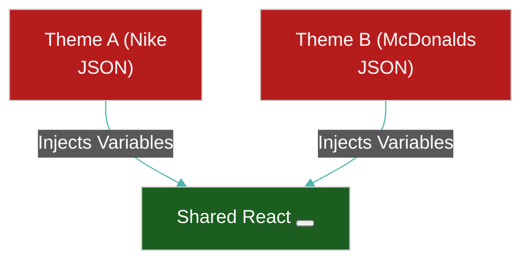

# 🎨 Multiple Design Systems in One App

> **Series:** Clean Code › Frontend Architecture · **Level:** Expert · **Read Time:** ~8 min

---

## 📖 Table of Contents

- [1. Why Multiple Design Systems?](#1-why-multiple-design-systems)
- [2. The Migration Scenario (Legacy vs V2)](#2-the-migration-scenario-legacy-vs-v2)
- [3. The Multi-Tenant Scenario (White-Labeling)](#3-the-multi-tenant-scenario-white-labeling)
- [4. The Micro-App Scenario (Super Apps)](#4-the-micro-app-scenario-super-apps)

---




## 1. Why Multiple Design Systems?

The goal of a Design System is singular consistency. However, in massive Enterprise applications, you will often encounter architectures that require **more than one Design System running inside the same application simultaneously.**

If not architected correctly, the CSS from "System A" will bleed into "System B", causing catastrophic visual bugs (e.g., all buttons suddenly turn green across the entire platform).

---

## 2. The Migration Scenario (Legacy vs V2)

Your company has a 5-year-old React app using **Bootstrap (Design System V1)**. The company undergoes a massive rebranding and creates a brand new **Tailwind-based Design System (V2)**.

You cannot rewrite 1,000 pages in one weekend. You must run both concurrently.

**The Solution: CSS Encapsulation (Scoping)**
You must prevent the global CSS of Bootstrap from destroying the new Tailwind components.
1. **CSS Modules / Styled Components:** Bind styles directly to the component hashes (e.g., `.button_x8f9`).
2. **PostCSS Prefixing:** Use a compiler plugin to automatically wrap all Bootstrap CSS inside a `.legacy-v1` class. Then, you wrap legacy pages in `<div class="legacy-v1">`.
3. **Shadow DOM:** For absolute safety, wrap legacy components inside native Web Components. The Shadow DOM creates a literal firewall that prevents any CSS from entering or escaping the component.

---

## 3. The Multi-Tenant Scenario (White-Labeling)

You are building a B2B SaaS platform (like Shopify). 
- Client A (Nike) logs in, and the dashboard must look like the **Nike Design System** (Black/White, Sharp corners, Bold typography).
- Client B (McDonalds) logs in, and the dashboard must use the **McDonalds Design System** (Red/Yellow, Rounded corners, Playful typography).

**The Solution: Semantic CSS Variables (Design Tokens)**
You write the React HTML exactly once. You do NOT hardcode colors like `bg-red-500`. You use semantic tokens like `bg-primary` and `rounded-brand`.

When the user logs in, the backend sends a JSON payload of their specific Design Tokens. The frontend injects those tokens into the root of the document as CSS Variables:

```css
/* Nike Theme */
:root[data-theme="nike"] {
  --color-primary: #000000;
  --radius-brand: 0px;
  --font-family: 'Helvetica Neue', sans-serif;
}

/* McDonalds Theme */
:root[data-theme="mcdonalds"] {
  --color-primary: #FFC72C;
  --radius-brand: 9999px; /* Fully rounded */
  --font-family: 'Comic Sans MS', sans-serif;
}
```
The exact same React `<Button>` instantly morphs into an entirely different Design System simply by toggling the `data-theme` attribute on the `<html>` tag.

---

## 4. The Micro-App Scenario (Super Apps)

If you are building a Super App (an App Shell that loads 3rd-party Micro-frontends), each Micro-App might have its own completely unique Design System.
- The Core Shell uses `Material UI`.
- Micro-App A uses `Tailwind`.
- Micro-App B uses `Chakra UI`.

**The Solution: Strict Iframe or Prefix Isolation**
If you use Webpack Module Federation to stitch these together in the same DOM, the global reset CSS from Material UI will crash into the global reset CSS of Tailwind, breaking both.
You must mandate that Micro-Apps **never use global CSS**. They must use strict CSS Modules, Scoped Vue styles, or be forced into `<iframe>` tags to maintain perfect visual isolation.

## 🔗 External References & Required Reading
- **MDN Web Docs:** [Using CSS custom properties (variables)](https://developer.mozilla.org/en-US/docs/Web/CSS/Using_CSS_custom_properties)
- **CSS Tricks:** [A Complete Guide to Custom Properties](https://css-tricks.com/a-complete-guide-to-custom-properties/)

---

*← [Design Systems Core](./01-design-systems.md) · Next: [Accessibility & i18n](./03-a11y-and-i18n.md) →*

## Related

- [Design Patterns](../../design-patterns/README.md)
- [Software Architecture Patterns](../../software-architecture/README.md)
- [Observability & Monitoring](../../../devops/observability/README.md)
- [Build Tools & CI/CD](../../../devops/cicd-pipelines/README.md)
