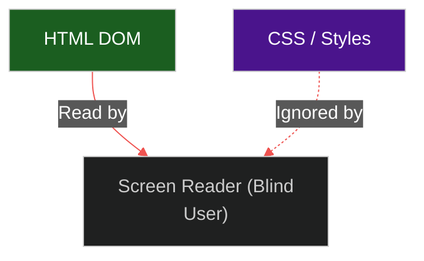

# ♿ Accessibility (a11y) & Internationalization (i18n)

> **Series:** Clean Code › Frontend Architecture · **Level:** Advanced · **Read Time:** ~10 min

---

## 📖 Table of Contents

- [1. The Cost of Ignoring Users](#1-the-cost-of-ignoring-users)
- [2. Accessibility (a11y) Fundamentals](#2-accessibility-a11y-fundamentals)
- [3. Focus Trapping & Keyboard Navigation](#3-focus-trapping-keyboard-navigation)
- [4. Internationalization (i18n) Architecture](#4-internationalization-i18n-architecture)
- [5. RTL (Right-to-Left) Layouts](#5-rtl-right-to-left-layouts)

---




## 1. The Cost of Ignoring Users

In enterprise software, **Accessibility (a11y)** and **Internationalization (i18n)** are not optional features; they are legal requirements. 
- Ignoring a11y exposes your company to massive lawsuits (e.g., Domino's Pizza was famously sued because a blind user could not order a pizza on their website).
- Ignoring i18n prevents your software from being sold globally.

---

## 2. Accessibility (a11y) Fundamentals

Blind users navigate the internet using **Screen Readers** (like JAWS or VoiceOver). Screen readers do not care about your CSS; they only read the raw HTML DOM.

If you build a button using a generic `<div>` tag:
```jsx
// ❌ BAD: A screen reader will just say "Submit". 
// The user won't know it's clickable, and cannot trigger it with the Enter key.
<div onClick={submit} className="bg-blue-500 rounded text-white">Submit</div>

// ✅ GOOD: A screen reader says "Button, Submit". It is natively clickable via keyboard.
<button onClick={submit} className="bg-blue-500 rounded text-white">Submit</button>
```

**ARIA Roles:** When you build complex UI (like a custom dropdown), standard HTML isn't enough. You must use ARIA (Accessible Rich Internet Applications) attributes to explain the state to the screen reader.
```jsx
// The screen reader announces: "Menu expanded"
<div role="menu" aria-expanded="true">...</div>
```

---

## 3. Focus Trapping & Keyboard Navigation

Many users (especially power users and those with motor disabilities) navigate the web entirely using the `Tab` key.

**The Focus Trap Problem:** If a user clicks a button and opens a Modal window, they should only be able to `Tab` between the inputs *inside* the modal. If they press `Tab` and the focus jumps to an invisible button hidden behind the modal, the application is broken.
*Solution:* When a Modal opens, you must mathematically trap the browser's focus inside the Modal loop, and you must instantly close the Modal if the user presses the `Escape` key. (This is why using Headless UI libraries is highly recommended).

---

## 4. Internationalization (i18n) Architecture

You should **never** hardcode English text directly into your React components.

```jsx
// ❌ BAD
<h1>Welcome to the Dashboard</h1>

// ✅ GOOD (Using libraries like react-i18next or vue-i18n)
import { useTranslation } from 'react-i18next';

const { t } = useTranslation();
<h1>{t('dashboard.welcomeMessage')}</h1>
```

**The Architecture:**
1. All text strings are stored in JSON dictionaries (`en.json`, `fr.json`, `es.json`).
2. The JSON files should be lazy-loaded over the network. If the user speaks French, do not force them to download 5MB of English and Spanish JSON dictionaries.
3. Complex string interpolation is handled by the library: `t('inbox.messages', { count: 5 })` automatically handles singular vs plural rules for different languages (e.g., "1 message" vs "5 messages").

---

## 5. RTL (Right-to-Left) Layouts

If you translate your app to Arabic or Hebrew, the text reads Right-to-Left (RTL).
This breaks your entire UI. The sidebar must flip to the right side, margin-left must become margin-right, and the back button arrow must point in the opposite direction.

**The Solution: Logical CSS Properties**
Stop using physical directions in CSS.
- ❌ `margin-left: 10px;` (Fails in Arabic)
- ✅ `margin-inline-start: 10px;` (Perfect)

`inline-start` dynamically means "Left" in English, and automatically flips to mean "Right" in Arabic. By using Logical CSS variables, your entire layout will flawlessly mirror itself the second the user switches languages, without writing a single line of custom CSS overrides.

## 🔗 External References & Required Reading
- **W3C:** [Web Content Accessibility Guidelines (WCAG)](https://www.w3.org/WAI/standards-guidelines/wcag/)
- **MDN Web Docs:** [CSS Logical Properties (RTL)](https://developer.mozilla.org/en-US/docs/Web/CSS/CSS_Logical_Properties)

---

*← [Multi-Design Systems](./02-multi-design-systems.md) · [Back to Series Overview](../README.md)*

## Related

- [Design Patterns](../../design-patterns/README.md)
- [Software Architecture Patterns](../../software-architecture/README.md)
- [Observability & Monitoring](../../../devops/observability/README.md)
- [Build Tools & CI/CD](../../../devops/cicd-pipelines/README.md)
