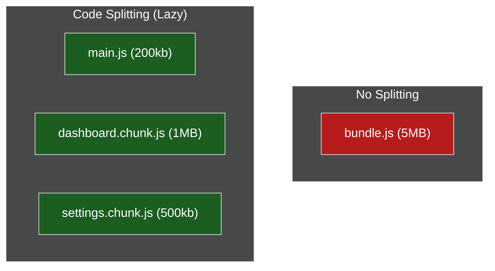

# 🚀 Web Performance & Optimization

> **Series:** Clean Code › Frontend Architecture · **Level:** Advanced · **Read Time:** ~10 min

---

## 📖 Table of Contents

- [1. The JavaScript Bundle Problem](#1-the-javascript-bundle-problem)
- [2. Code Splitting & Lazy Loading](#2-code-splitting-lazy-loading)
- [3. Tree Shaking](#3-tree-shaking)
- [4. DOM Virtualization (Windowing)](#4-dom-virtualization-windowing)
- [5. Core Web Vitals (LCP, CLS, FID)](#5-core-web-vitals-lcp-cls-fid)

---




## 1. The JavaScript Bundle Problem

When you build a React/Vue app, Webpack or Vite takes all your hundreds of `.ts` files and compiles them into a single massive file called `bundle.js`. 
If you import heavy libraries (like `moment.js` or `three.js`), your bundle might swell to **5 Megabytes**.

When a user on a 3G mobile network opens your app, their screen stays completely white for 10 seconds while their phone downloads and parses 5MB of JavaScript. This guarantees they will leave your site.

---

## 2. Code Splitting & Lazy Loading

You do not need to send the entire application to the user at once. 

If the user is on the `/login` page, they do not need the JavaScript for the `/dashboard` or the `/settings` pages.

**Code Splitting** breaks your giant `bundle.js` into dozens of smaller chunks.
**Lazy Loading** dynamically downloads those chunks only when the user actually navigates to that page.

```jsx
// React Router example of Route-Level Lazy Loading
import { lazy, Suspense } from 'react';

// The browser will NOT download the Settings code until the user clicks the link
const SettingsPage = lazy(() => import('./pages/Settings'));

export const App = () => (
  <Suspense fallback={<Spinner />}>
    <Routes>
      <Route path="/settings" element={<SettingsPage />} />
    </Routes>
  </Suspense>
);
```

---

## 3. Tree Shaking

Imagine you buy a Swiss Army Knife, but you only ever use the toothpick. You are carrying around 20 heavy tools you don't need.

**Tree Shaking** is a build step (handled by tools like Rollup/Vite) that scans your codebase for unused code and physically deletes it from the final production bundle.

```javascript
// ✅ GOOD: Tree-shaking will delete the other 99 lodash functions from your bundle.
import { debounce } from 'lodash-es'; 

// ❌ BAD: You just forced the user to download the entire lodash library!
import _ from 'lodash'; 
```
*Rule:* Always use ES6 Named Imports so your bundler can tree-shake the dead code.

---

## 4. DOM Virtualization (Windowing)

If you fetch 50,000 rows from a database and map them into React `<tr>` elements, the browser will attempt to insert 50,000 DOM nodes into the page at once. The browser will instantly freeze and crash.

**Virtualization** (using libraries like `react-window` or `vue-virtual-scroller`) solves this. 
If the user's screen can only fit 20 rows at a time, the library only renders exactly 20 `<tr>` elements into the DOM. As the user scrolls down, it mathematically recycles those exact same 20 DOM nodes, swapping out the text inside them. 
You can scroll through 1,000,000 rows at 60 Frames Per Second.

---

## 5. Core Web Vitals (LCP, CLS, FID)

Google ranks your website in search results based strictly on these three performance metrics:

1. **LCP (Largest Contentful Paint):** How long does it take for the largest image or text block on the screen to become visible? *(Goal: < 2.5 seconds. Fix: Optimize images, use SSR).*
2. **FID (First Input Delay):** When a user clicks a button, how long does it take for the browser to respond? *(Goal: < 100ms. Fix: Reduce main-thread JavaScript execution).*
3. **CLS (Cumulative Layout Shift):** Does the page visually jump around as it loads? (e.g., An image suddenly loads at the top, pushing the button you were about to click down). *(Goal: < 0.1. Fix: Always set strict `width` and `height` attributes on images and ad banners).*

## 🔗 External References & Required Reading
- **web.dev:** [Core Web Vitals (LCP, FID, CLS)](https://web.dev/vitals/)
- **React Docs:** [Code-Splitting and Lazy Loading](https://react.dev/reference/react/lazy)

---

*← [Standalone vs Micro-Apps](./04-standalone-vs-micro-apps.md) · Next: [Frontend Security](./06-frontend-security.md) →*

## Related

- [Design Patterns](../../design-patterns/README.md)
- [Software Architecture Patterns](../../software-architecture/README.md)
- [Observability & Monitoring](../../../devops/observability/README.md)
- [Build Tools & CI/CD](../../../devops/cicd-pipelines/README.md)
