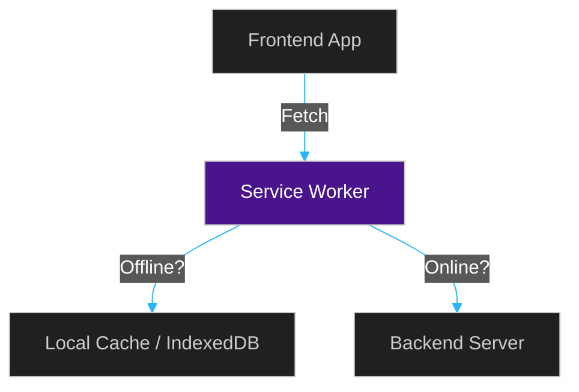

# 📱 PWAs & Offline-First Architecture

> **Series:** Clean Code › Frontend Architecture · **Level:** Expert · **Read Time:** ~8 min

---

## 📖 Table of Contents

- [1. The Fragility of the Web](#1-the-fragility-of-the-web)
- [2. Service Workers (The Proxy)](#2-service-workers-the-proxy)
- [3. IndexedDB (Client-Side Database)](#3-indexeddb-client-side-database)
- [4. Progressive Web Apps (PWA)](#4-progressive-web-apps-pwa)

---




## 1. The Fragility of the Web

By default, web applications are completely useless without an internet connection. If a user loses Wi-Fi while filling out a massive form, and clicks "Submit", they get a Chrome Dinosaur error page and lose all their work.

**Offline-First Architecture** mandates that your application should boot up, render, and function even if the device has zero internet connectivity, syncing the data to the server only when the connection returns.

---

## 2. Service Workers (The Proxy)

A **Service Worker** is a JavaScript file that runs in the background of the browser, completely separate from the main thread (meaning it doesn't slow down the UI).

It acts as a programmable network proxy. **It intercepts every single HTTP request your app makes.**

```javascript
// Inside service-worker.js
self.addEventListener('fetch', (event) => {
  event.respondWith(
    // 1. Check if the file is in the local cache
    caches.match(event.request).then((cachedResponse) => {
      // 2. Return local cache instantly (even if offline), OR fetch from network
      return cachedResponse || fetch(event.request);
    })
  );
});
```
With a Service Worker caching your HTML, CSS, JS, and Images, a user can visit `your-app.com` in Airplane Mode, and the site will load instantly.

---

## 3. IndexedDB (Client-Side Database)

While the Cache API (used by Service Workers) is great for storing static files (images, JS), it is not meant for complex JSON data.

**IndexedDB** is a fully functioning, transactional NoSQL database built directly into the user's browser. It can store Gigabytes of data.

**The Offline-First Flow:**
1. The user creates a new "Order" while offline.
2. The frontend saves the Order as a JSON object into IndexedDB.
3. The frontend registers a "Background Sync" event with the Service Worker.
4. The user closes the browser entirely.
5. Three hours later, the phone connects to Wi-Fi. The Service Worker wakes up in the background, reads the Order from IndexedDB, and safely POSTs it to your backend API without the user ever opening the app!

---

## 4. Progressive Web Apps (PWA)

If you combine a `manifest.json` file, a Service Worker, and IndexedDB, you have created a **PWA**.

A PWA allows a user on Android or iOS to click "Add to Home Screen". The web app is installed exactly like a native app. It gets its own App Icon, it hides the Safari/Chrome URL bar, it loads offline, and it can even receive Push Notifications. 

You get the power of a Native Mobile App without having to pay the 30% Apple App Store tax or learn Swift/Kotlin.

## 🔗 External References & Required Reading
- **MDN Web Docs:** [Service Worker API](https://developer.mozilla.org/en-US/docs/Web/API/Service_Worker_API)
- **Google Developers:** [Offline-First Apps with IndexedDB](https://developer.chrome.com/docs/workbox/caching-strategies-overview/)

---

*← [Network Protocols](./07-network-protocols.md) · [Back to Series Overview](../README.md)*

## Related

- [Design Patterns](../../design-patterns/README.md)
- [Software Architecture Patterns](../../software-architecture/README.md)
- [Observability & Monitoring](../../../devops/observability/README.md)
- [Build Tools & CI/CD](../../../devops/cicd-pipelines/README.md)
