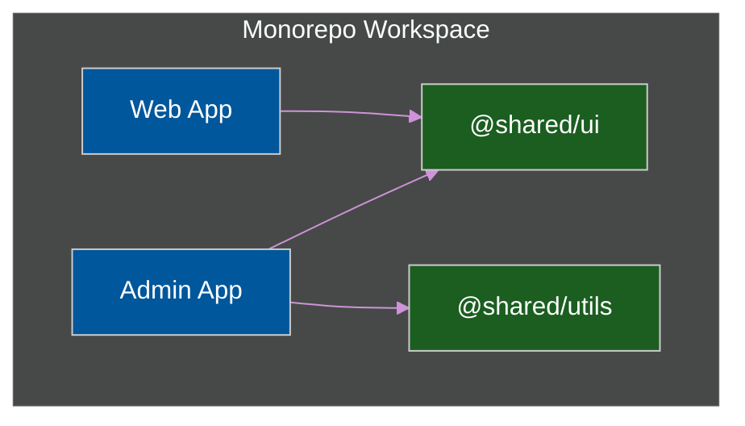

# 📦 Monorepo Architecture (Nx / Turborepo)

> **Series:** Clean Code › Frontend Architecture · **Level:** Advanced · **Read Time:** ~12 min

---

## 📖 Table of Contents

- [1. The Multi-Repo Problem (Polyrepo)](#1-the-multi-repo-problem-polyrepo)
- [2. The Monorepo Solution (Nx / Turborepo)](#2-the-monorepo-solution-nx-turborepo)
- [3. Code Sharing at Build-Time](#3-code-sharing-at-build-time)
- [4. Remote Caching (The Superpower)](#4-remote-caching-the-superpower)
- [5. The "Ejection" Strategy (Splitting to Standalone)](#5-the-ejection-strategy-splitting-to-standalone)
- [6. Multiple Design Systems in One Monorepo](#6-multiple-design-systems-in-one-monorepo)

---




## 1. The Multi-Repo Problem (Polyrepo)

Imagine your company has 3 separate frontend applications:
1. `Admin Dashboard` (React)
2. `Customer Web App` (React)
3. `Mobile App` (React Native)

In a traditional **Polyrepo** setup, these are 3 completely separate Git repositories.
If you want all 3 apps to use the exact same `<Button>` component, you have to create a 4th Git repository (`UI-Library`), publish it to NPM, and then manually `npm install` it into the 3 apps. If you find a bug, you have to fix it, bump the version, publish to NPM, open 3 different Git repositories, run `npm update`, and create 3 different Pull Requests. This is a nightmare.

---

## 2. The Monorepo Solution (Nx / Turborepo)

A **Monorepo** places all 3 applications and the UI library inside a single, massive Git repository. Google, Meta (Facebook), and Microsoft all use Monorepos.

```text
my-company-monorepo/
├── apps/
│   ├── admin-dashboard/       # React SPA
│   ├── customer-web/          # Next.js App
│   └── mobile-app/            # React Native
│
├── packages/                  # Shared Code (No NPM publishing required!)
│   ├── ui-components/         # The shared <Button>
│   ├── shared-types/          # TypeScript interfaces shared with the backend
│   └── validation-logic/      # Zod schemas used by all apps
│
├── package.json               # One global list of dependencies
└── turbo.json                 # Turborepo build pipeline configuration
```

---

## 3. Code Sharing at Build-Time

Unlike *Micro-Frontends* (which share code dynamically in the browser at run-time), a Monorepo shares code at **build-time**.

The `admin-dashboard` can directly import the `<Button>` from the local `packages/ui-components` folder. If you update the `<Button>` code, the `admin-dashboard` instantly receives the update. You don't have to publish anything to NPM. You make one Git commit, and it updates the entire company.

---

## 4. Remote Caching (The Superpower)

If you put 50 applications into one Git repository, won't `npm run build` take 4 hours in your CI/CD pipeline?
Yes, unless you use a modern build tool like **Turborepo** or **Nx**.

If Developer A changes a CSS file inside `admin-dashboard/`:
1. The tool realizes that the `customer-web` app was not affected by this change.
2. It completely skips building `customer-web`.
3. It instantly downloads the pre-built files for `customer-web` from a **Remote Cache** in the cloud.
4. Your CI/CD pipeline drops from 45 minutes down to 10 seconds.

---

## 5. The "Ejection" Strategy (Splitting to Standalone)

*Scenario: You have 5 apps in your Monorepo, but the company decides to sell the `Customer Web App` to a different company. You need to split it out into its own Standalone repository.*

If your Monorepo is a tangled mess (where `admin-dashboard` accidentally imports files directly from `customer-web`), you will never be able to extract it. It has become a Distributed Monolith.

**The Solution: Strict Module Boundaries (Nx Boundary Rules)**
You must configure your Monorepo tools (like `eslint-plugin-nx`) to strictly enforce dependency directions.
1. `apps/` are allowed to import from `packages/`.
2. `packages/` are **never** allowed to import from `apps/`.
3. `apps/admin-dashboard` is **never** allowed to import from `apps/customer-web`.

Because you enforced this strict unidirectional flow, ejecting an app is easy: you just copy the `apps/customer-web` folder and the `packages/` it depends on into a new repository, and it will compile perfectly.

---

## 6. Multiple Design Systems in One Monorepo

*Scenario: Your Monorepo contains a 5-year-old Legacy App using Bootstrap, and a brand-new Next.js App using Tailwind.*

A Monorepo is the **perfect** place to host multiple Design Systems simultaneously without them colliding. 

```text
my-company-monorepo/
├── apps/
│   ├── legacy-admin-app/      # Depends strictly on @packages/ui-legacy
│   └── modern-customer-app/   # Depends strictly on @packages/ui-modern
│
├── packages/
│   ├── ui-legacy/             # Contains Bootstrap, jQuery, old CSS
│   │   ├── Button.tsx
│   │   └── package.json       # Defines its own dependencies
│   │
│   └── ui-modern/             # Contains Tailwind, Headless UI, Framer Motion
│       ├── Button.tsx
│       └── package.json       # Defines its own dependencies
```

**How it works:**
1. **Total Isolation:** Because `ui-legacy` and `ui-modern` are physically separate packages, their `package.json` files manage their own CSS dependencies. 
2. **Incremental Migration:** You can build a third app (`apps/migration-app`) and import *both* packages during a transition phase! You just alias them in your imports:
```typescript
import { Button as OldButton } from '@packages/ui-legacy';
import { Button as NewButton } from '@packages/ui-modern';
```
This is the ultimate superpower of Nx and Turborepo—it allows your organization to evolve and re-write design systems progressively over years without breaking existing production apps.

## 🔗 External References & Required Reading
- **Nx Docs:** [Mental Model of a Monorepo](https://nx.dev/concepts/mental-model)
- **Turborepo:** [Core Concepts & Remote Caching](https://turbo.build/repo/docs/core-concepts/remote-caching)

---

*← [PWAs & Offline-First](./08-pwa-offline-first.md) · Next: [Build Tools & Bundlers](./10-build-tools-bundlers.md) →*

## Related

- [Design Patterns](../../design-patterns/README.md)
- [Software Architecture Patterns](../../software-architecture/README.md)
- [Observability & Monitoring](../../../devops/observability/README.md)
- [Build Tools & CI/CD](../../../devops/cicd-pipelines/README.md)
