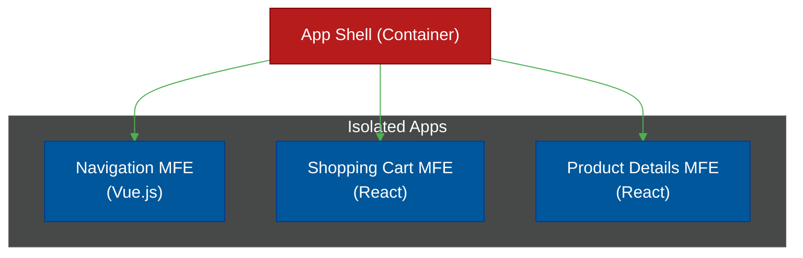

# 🧩 Micro-Frontends

> **Series:** Clean Code › Frontend Architecture · **Level:** Expert · **Read Time:** ~10 min

---

## 📖 Table of Contents

- [1. The Frontend Monolith Problem](#1-the-frontend-monolith-problem)
- [2. What Is a Micro-Frontend?](#2-what-is-a-micro-frontend)
- [3. Integration Strategies](#3-integration-strategies)
- [4. Module Federation (Webpack/Vite)](#4-module-federation-webpackvite)

---

## 1. The Frontend Monolith Problem

You successfully split your monolithic backend into 50 beautiful, isolated Microservices. 
The Billing Team manages `Billing API`. The Shopping Team manages `Cart API`.

However, you still have one massive, 1-million-line React Application serving as the UI. When the Billing Team wants to update a button color, they have to commit code to the massive React Monolith, wait 30 minutes for the CI/CD pipeline, and risk breaking the Shopping Team's cart logic.

You have created a **Frontend Monolith**.

---

## 2. What Is a Micro-Frontend?

Micro-frontends apply the exact same philosophy of Microservices to the browser.
You split the giant React application into smaller, independently deployable mini-applications owned by different teams.

An **App Shell** (the master container) loads in the browser. It then dynamically fetches the `Navigation`, `Cart`, and `Product` mini-apps over the network and stitches them together seamlessly on the screen. The user has no idea they are looking at 3 completely different applications.

---

## 3. Integration Strategies

How do you actually stitch them together?

### 1. Iframes (The Legacy Way)
You simply embed the mini-apps inside HTML `<iframe>` tags.
- *Pros:* Ultimate isolation. Global CSS conflicts are impossible.
- *Cons:* Terrible performance. Passing data (like "Add to Cart") between iframes is a nightmare using `postMessage`.

### 2. Build-Time Integration (NPM Packages)
Every team publishes their mini-app as an NPM package (`@company/cart`). The App Shell installs them via `package.json`.
- *Pros:* Extremely stable. Great developer experience.
- *Cons:* It defeats the purpose of independent deployment. If the Cart team updates their package, the App Shell team *still* has to trigger a massive CI/CD pipeline to rebuild and deploy the shell.

### 3. Run-Time Integration (The Modern Way)
The App Shell downloads the JavaScript code for the mini-apps directly from URLs in the browser at the exact moment the user needs them.

---

## 4. Module Federation (Webpack/Vite)

Webpack 5 introduced a revolutionary feature called **Module Federation**, which became the industry standard for Micro-Frontends.

It allows a Javascript application to dynamically load code from *another* deployed Javascript application at runtime.

**The Superpower: Shared Dependencies.**
If the `Cart` MFE uses React, and the `Product` MFE uses React, Module Federation is smart enough to only download the React library once. 

If the Cart team deploys a new feature, they simply update their files on S3. The next time a user refreshes the page, the App Shell automatically fetches the new Cart code. **Zero downtime, zero App Shell redeployments.**

### When NOT to use Micro-frontends
Do not use this pattern unless you have 50+ frontend developers stepping on each other's toes. The complexity of sharing state, CSS conflicts, and managing global routing across multiple repositories will crush a small startup.

## 🔗 External References & Required Reading
- **Martin Fowler:** [Micro Frontends Architecture](https://martinfowler.com/articles/micro-frontends.html)
- **Webpack:** [Module Federation Concepts](https://webpack.js.org/concepts/module-federation/)

---

*← [Back to Series Overview](../README.md)*

## Related

- [Design Patterns](../../design-patterns/README.md)
- [Software Architecture Patterns](../../software-architecture/README.md)
- [Observability & Monitoring](../../../devops/observability/README.md)
- [Build Tools & CI/CD](../../../devops/cicd-pipelines/README.md)
