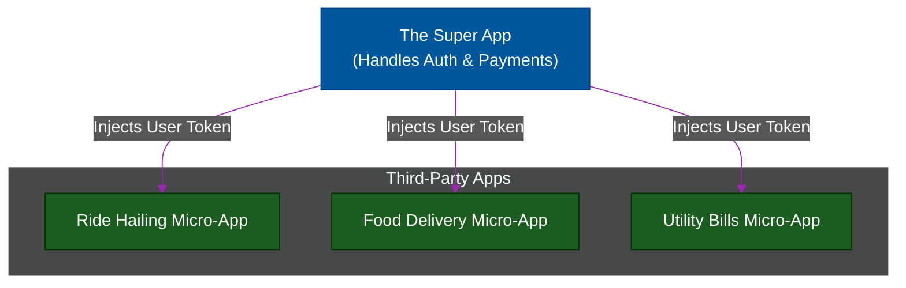

# 📱 Standalone Apps vs Micro-Apps

> **Series:** Clean Code › Frontend Architecture · **Level:** Advanced · **Read Time:** ~8 min

---

## 📖 Table of Contents

- [1. The Standalone App (The Default)](#1-the-standalone-app-the-default)
- [2. The Micro-App Concept](#2-the-micro-app-concept)
- [3. The "Super App" Pattern (WeChat / Grab)](#3-the-super-app-pattern-wechat-grab)
- [4. Choosing the Right Architecture](#4-choosing-the-right-architecture)

---

## 1. The Standalone App (The Default)

A **Standalone App** is what 95% of the industry builds. It is a completely independent application (usually a React Monolith) that controls its own destiny.
- It has its own `index.html`.
- It manages its own global routing (`/login`, `/dashboard`).
- It has its own dedicated domain (`app.mycompany.com`).

**Pros:** It is incredibly simple to develop, test, and deploy. You don't have to worry about clashing CSS or sharing state with other applications.

---

## 2. The Micro-App Concept

A **Micro-App** is a tiny, highly focused application that is designed to be *embedded* inside a larger ecosystem (a "Host" or "Shell"). 

Unlike a standalone app, a Micro-App rarely controls the top-level URL routing. It expects to be handed its Authentication token by the Host application.

*(Note: In web development, building an ecosystem of Micro-Apps is called **Micro-Frontends**. We cover the technical implementation of this—like Webpack Module Federation—in the [Micro-Frontends module](./03-micro-frontends.md)).*

---

## 3. The "Super App" Pattern (WeChat / Grab)

While Micro-Frontends solve *internal* team scaling, the **Super App** pattern solves *external* product scaling.

Pioneered in Asia by apps like WeChat, Grab, and Gojek, a Super App is a single Standalone App (the Shell) that allows third-party companies to build their own "Micro-Apps" (Mini Programs) that run inside it.

### How Super Apps Work:
1. **The Core:** The Super App handles the hardest parts of software: User Authentication, Storing Credit Cards, and Push Notifications.
2. **The Micro-Apps:** A third-party company writes a tiny Micro-App using HTML/JS. 
3. **The Bridge:** When the Micro-App needs to charge the user $10, it doesn't build a Stripe checkout form. It uses a JavaScript Bridge to ask the Super App, *"Hey, charge this user $10 for me."*

---

## 4. Choosing the Right Architecture

| Feature | Standalone App | Micro-App |
| :--- | :--- | :--- |
| **Deployment** | Independent, full pipeline | Independent, but must verify Host compatibility |
| **Routing** | Owns the browser URL (`/checkout`) | Usually rendered inside a specific sub-route or Modal |
| **Auth** | Handles its own Login screen | Relies on the Shell to pass down an Auth Context |
| **Styling** | Defines global CSS | Must strictly scope CSS to avoid breaking the Host |

**The Golden Rule:** Always start with a Standalone App. Do not attempt to build a Micro-App or a Super App architecture unless you are explicitly building an extensible platform or trying to scale past 50+ frontend developers.

## 🔗 External References & Required Reading
- **Patterns:** [The Super App Architecture](https://www.thoughtworks.com/radar/techniques/super-apps)
- **WeChat:** [Mini Programs Overview](https://developers.weixin.qq.com/miniprogram/en/dev/framework/)

---

*← [Micro-Frontends](./03-micro-frontends.md) · [Back to Series Overview](../README.md)*

## Related

- [Design Patterns](../../design-patterns/README.md)
- [Software Architecture Patterns](../../software-architecture/README.md)
- [Observability & Monitoring](../../../devops/observability/README.md)
- [Build Tools & CI/CD](../../../devops/cicd-pipelines/README.md)
