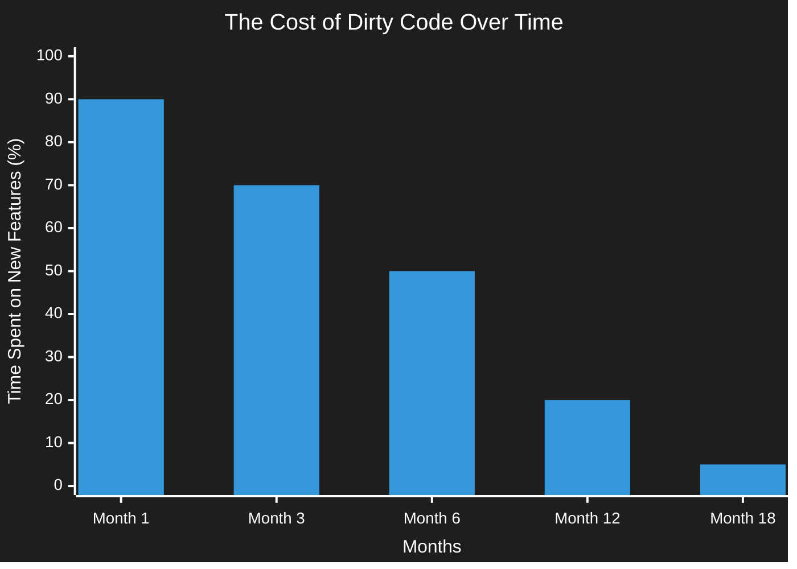
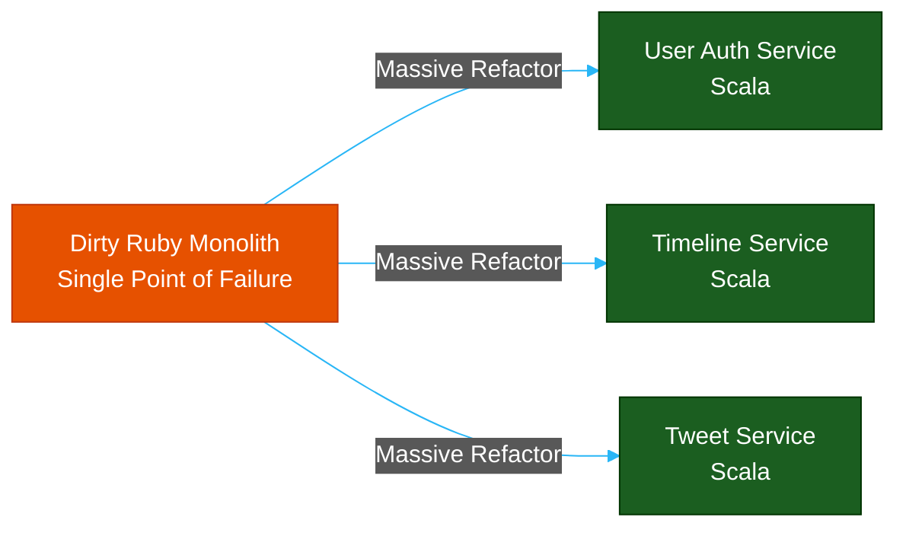

# Dirty Code vs. Clean Code: The Enterprise Cost

**Author:** ichamrong  
**Category:** Clean Code & Architecture  
**Read Time:** ~15 min  

---

## 📌 Table of Contents
- [1. The Anatomy of Dirty Code](#1-the-anatomy-of-dirty-code)
  - [The Accelerants of Dirty Code:](#the-accelerants-of-dirty-code)
  - [The Consequences: Technical Debt](#the-consequences-technical-debt)
- [2. Real-World Enterprise Case Studies](#2-real-world-enterprise-case-studies)
  - [Case Study #1: Twitter's "Fail Whale" (The Cost of Dirty Scaling)](#case-study-1-twitters-fail-whale-the-cost-of-dirty-scaling)
  - [Case Study #2: Knight Capital Group (The $460 Million Dirty Code Bug)](#case-study-2-knight-capital-group-the-460-million-dirty-code-bug)
- [3. The Anatomy of Clean Code](#3-the-anatomy-of-clean-code)
  - [The Hallmarks of Clean Code:](#the-hallmarks-of-clean-code)
- [4. The Transformation](#4-the-transformation)
- [🔗 External References & Required Reading](#external-references-required-reading)

---

## 1. The Anatomy of Dirty Code

> **Dirty code** is the result of inexperience multiplied by tight deadlines, mismanagement, and nasty shortcuts taken during the development process.

Nobody wakes up in the morning and decides to write bad code. Dirty code is almost always a byproduct of intense organizational pressure. It occurs when a company prioritizes "Time to Market" over "Long-Term Sustainability."

### The Accelerants of Dirty Code:
1. **The Artificial Deadline:** A Product Manager demands a feature by Friday to impress investors. The developer skips writing tests and hardcodes variables to make the deadline.
2. **The "We'll Fix It Later" Lie:** The team tells themselves they will refactor the shortcut next sprint. Next sprint never comes because new features are immediately prioritized by leadership.
3. **Inexperience:** A Junior developer copies and pastes a massive chunk of logic from StackOverflow without understanding how it fits into the broader system architecture.

### The Consequences: Technical Debt
Dirty code results in **Technical Debt**. Just like financial debt, it accumulates interest. The longer you wait to fix a messy file, the more intertwined it becomes with the rest of the system. Eventually, the interest payments become so high that all development grinds to a halt.

---

## 2. Real-World Enterprise Case Studies

### Case Study #1: Twitter's "Fail Whale" (The Cost of Dirty Scaling)
In its early days, Twitter was built rapidly using Ruby on Rails to meet explosive user demand. The code was highly coupled and optimized for speed of delivery, not scale. This resulted in the infamous "Fail Whale"—frequent site outages during high traffic.
- **The Problem:** The dirty, monolithic codebase meant that a spike in one area (e.g., Justin Bieber tweeting) crashed the entire server.
- **The Solution:** Twitter had to execute a massive, multi-year refactoring effort to break the dirty monolith down into JVM/Scala-based microservices.

### Case Study #2: Knight Capital Group (The $460 Million Dirty Code Bug)
In 2012, Knight Capital Group went bankrupt in 45 minutes, losing $460 million. Why? Because of **Dead Code** (a classic dirty code smell). 
- **The Problem:** An old, unused trading algorithm flag (Power Peg) had been left in the codebase for 10 years without being deleted or refactored. A developer accidentally reused the flag's variable for a new feature.
- **The Result:** When deployed, the dirty, dead code was resurrected, executing 4 million erroneous trades in under an hour. **Refactoring is not just about aesthetics; it is about risk mitigation.**

---

## 3. The Anatomy of Clean Code

> **Clean code** is code that is easy to read, understand, and maintain. Clean code makes software development predictable and increases the quality of a resulting product.

Code is read 10x more often than it is written. Therefore, the most important attribute of code is not how clever it is, or even how fast it runs—it is how easily another human being can understand it six months from now.

### The Hallmarks of Clean Code:
- **It Does One Thing Well:** Classes and functions adhere to the Single Responsibility Principle. They are small and focused.
- **It is Expressive:** Variables and methods are named clearly (`getUserAccountBalance()` instead of `calcVal()`).
- **It is Predictable:** There are no hidden side effects. A function called `validatePassword` does not secretly save data to the database.
- **It is Tested:** Clean code is covered by automated unit and integration tests.

---

## 4. The Transformation

The bridge between Dirty Code and Clean Code is **Refactoring**. 

When you encounter dirty code, you apply the *Boy Scout Rule*: **"Always leave the campground cleaner than you found it."** You don't have to rewrite the entire system. Just by renaming a variable or extracting a method while you are working in a file, you slowly transform a massive technical debt liability into a clean, predictable asset.

---

## 🔗 External References & Required Reading
- **Book:** *Clean Code: A Handbook of Agile Software Craftsmanship* by Robert C. Martin.
- **Case Study:** [Twitter's Architecture Shift from Ruby to Scala](https://blog.twitter.com/engineering/)
- **Case Study:** [The Knight Capital Software Glitch (SEC Report)](https://www.sec.gov/)

**Navigation:** [Next: The Refactoring Process](./02-the-refactoring-process.md) | [Refactoring Index](./README.md)

*Last updated: 2026-05-17*

## Related

- [Uncle Bob's Clean Code Rules](../uncle-bob-rules/README.md)
- [Design Patterns](../design-patterns/README.md)
- [Data Structures & Algorithms](../dsa/README.md)
