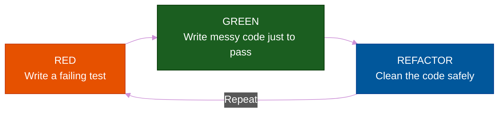
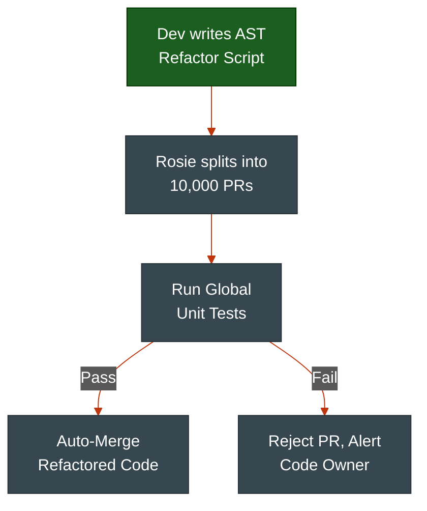

# The Refactoring Process: Safe Surgery

**Author:** ichamrong  
**Category:** Clean Code & Architecture  
**Read Time:** ~15 min  

---

## 📌 Table of Contents
- [1. The Core Rule of Refactoring](#1-the-core-rule-of-refactoring)
- [2. The Prerequisite: Automated Safety Nets](#2-the-prerequisite-automated-safety-nets)
  - [The TDD Cycle (Red - Green - Refactor)](#the-tdd-cycle-red-green-refactor)
- [3. Real-World Enterprise Case Studies](#3-real-world-enterprise-case-studies)
  - [Case Study #3: Google's "Rosie" (Large-Scale Automated Refactoring)](#case-study-3-googles-rosie-large-scale-automated-refactoring)
  - [Case Study #4: Netflix's Chaos Engineering (Refactoring for Resilience)](#case-study-4-netflixs-chaos-engineering-refactoring-for-resilience)
- [4. The Step-by-Step Refactoring Approach](#4-the-step-by-step-refactoring-approach)
- [🔗 External References & Required Reading](#external-references-required-reading)

---

## 1. The Core Rule of Refactoring

> Performing refactoring **step-by-step** and **running tests after each change** are key elements of refactoring that make it predictable and safe.

Refactoring is a surgical procedure on a live patient. You cannot rip out the entire heart and lungs at the same time and hope the system survives. You must make tiny, microscopic incisions, ensure the patient is stable, and then proceed.

**Rule #1 of Refactoring:** You NEVER add new features while refactoring. 
If you are changing the internal structure of the code, the external behavior must remain 100% identical. 

---

## 2. The Prerequisite: Automated Safety Nets

**You cannot refactor code that does not have automated tests.**

If you change the internal logic of a massive 500-line billing function, how do you know you didn't accidentally break something? If you have to test it manually by clicking around the UI, the refactoring process becomes dangerous, slow, and exhausting.

Before you touch dirty code, you must write a comprehensive suite of Unit Tests that lock down the current behavior (even if the current behavior is messy). 

### The TDD Cycle (Red - Green - Refactor)

---

## 3. Real-World Enterprise Case Studies

How do the biggest companies in the world refactor millions of lines of code without bringing their networks offline?

### Case Study #3: Google's "Rosie" (Large-Scale Automated Refactoring)
Google manages a 2-billion-line monorepo. If an engineer wants to rename a core library function, doing it manually across thousands of projects would take years. 
- **The Refactoring Process:** Google built a tool called **Rosie**. It allows developers to write an Abstract Syntax Tree (AST) patch that automatically refactors code globally.
- **The Safety Net:** Rosie automatically creates thousands of micro-PRs, runs millions of unit tests against the refactored code, and auto-merges only if the tests stay green. Google proved that refactoring must be treated as a programmatic, heavily tested pipeline.

### Case Study #4: Netflix's Chaos Engineering (Refactoring for Resilience)
When Netflix refactored their architecture from massive Oracle databases into distributed AWS microservices, they realized they couldn't just test their code in isolated environments.
- **The Process:** They invented **Chaos Monkey**, a script that randomly kills production servers to force engineers to refactor their microservices to survive outages.
- **The Lesson:** Refactoring is not just about making code look pretty. Netflix refactored their architecture specifically to handle catastrophic failure asynchronously.

---

## 4. The Step-by-Step Refactoring Approach

When you are tasked with refactoring a massive, scary legacy file, follow this strict pipeline:

1. **Identify the Code Smell:** Find the messy part of the code (e.g., a function that is 300 lines long).
2. **Lock it Down:** Write a test that covers the exact inputs and outputs of the messy function. Ensure it passes (Green).
3. **Take a Micro-Step:** Apply exactly *one* refactoring technique (e.g., extract the first 20 lines into a new helper function).
4. **Run Tests:** Immediately run the test suite. Did it break? If yes, `git revert`. If no, proceed.
5. **Commit:** Commit the tiny change to version control.
6. **Repeat:** Move to the next micro-step.

By taking microscopic steps, you ensure that if the system breaks, you know exactly which 5 lines of code caused the break, and you only lose 2 minutes of work.

---

## 🔗 External References & Required Reading
- **Book:** *Test-Driven Development: By Example* by Kent Beck.
- **Case Study:** [Large-Scale Automated Refactoring Using ClangMR (Google)](https://research.google/pubs/pub41342/)
- **Case Study:** [The Netflix Simian Army (Chaos Engineering)](https://netflixtechblog.com/)

**Navigation:** [Previous: Dirty vs Clean Code](./01-dirty-vs-clean-code.md) | [Next: Code Smells](./03-code-smells.md) | [Refactoring Index](./README.md)

*Last updated: 2026-05-17*

## Related

- [Uncle Bob's Clean Code Rules](../uncle-bob-rules/README.md)
- [Design Patterns](../design-patterns/README.md)
- [Data Structures & Algorithms](../dsa/README.md)
