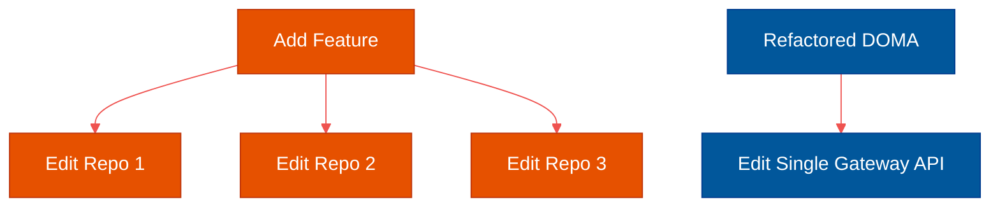

# Code Smells: Diagnosing Architectural Disease

**Author:** ichamrong  
**Category:** Clean Code & Architecture  
**Read Time:** ~15 min  

---

## 📌 Table of Contents
- [1. What is a Code Smell?](#1-what-is-a-code-smell)
- [2. Real-World Enterprise Case Studies](#2-real-world-enterprise-case-studies)
  - [Case Study #5: Uber's "Shotgun Surgery" Crisis (Change Preventers)](#case-study-5-ubers-shotgun-surgery-crisis-change-preventers)
- [3. The Five Categories of Code Smells](#3-the-five-categories-of-code-smells)
  - [A. Bloaters](#a-bloaters)
  - [B. Object-Orientation Abusers](#b-object-orientation-abusers)
  - [C. Change Preventers](#c-change-preventers)
  - [D. Dispensables](#d-dispensables)
  - [E. Couplers](#e-couplers)
- [🔗 External References & Required Reading](#external-references-required-reading)

---

## 1. What is a Code Smell?

> **Code smells** are indicators of problems that can be addressed during refactoring. Code smells are easy to spot and fix, but they may be just symptoms of a deeper problem with the code.

A "smell" isn't a bug. The code still compiles, and the feature still works. But it smells bad. It is a surface-level symptom that points to a systemic disease in the system architecture. 

If you walk into a house and smell smoke, the smoke isn't the problem—the fire inside the walls is the problem. Fixing a code smell often reveals fundamental design flaws that require major refactoring.

---

## 2. Real-World Enterprise Case Studies

### Case Study #5: Uber's "Shotgun Surgery" Crisis (Change Preventers)
Uber originally built thousands of microservices to allow teams to move fast. However, they soon developed a massive "Change Preventer" code smell: **Shotgun Surgery**.
- **The Smell:** Because their microservices were too granular, if Uber wanted to add a simple feature (like a new payment method), developers had to touch 15 different microservices across 5 different repositories. Making one logical change required "shotgun surgery" across the entire company.
- **The Refactor:** Uber refactored their architecture from "Microservices" into **Domain-Oriented Microarchitecture (DOMA)**, grouping related microservices into "Domains" with strict API gateways to cure the coupling smell.

---

## 3. The Five Categories of Code Smells

### A. Bloaters
Bloaters are code, methods, and classes that have increased to such gargantuan proportions that they are impossible to work with.
- **Long Method:** A function that is 100+ lines long. It tries to do too many things.
- **Large Class (God Object):** A class with 2,000 lines of code and 50 methods. It has too many responsibilities.
- **Primitive Obsession:** Using primitives (strings, ints) instead of small objects for simple tasks (e.g., passing `String phoneNumber` instead of creating a `PhoneNumber` class that handles its own validation and formatting).

### B. Object-Orientation Abusers
These smells indicate incomplete or incorrect application of Object-Oriented Programming (OOP) principles.
- **Switch Statements:** Having massive `switch` or `if/else` chains instead of using Polymorphism. If you add a new condition, you have to find and update every switch statement in the codebase.
- **Alternative Classes with Different Interfaces:** Two classes that perform identical functions but have different method names.

### C. Change Preventers
These smells mean that if you need to change something in one place in your code, you have to make many changes in other places too.
- **Shotgun Surgery:** Making a single modification requires you to make small changes to many different classes.
- **Divergent Change:** One class is commonly changed in different ways for different reasons. (E.g., you have to edit the `User` class when the database changes *and* when the formatting rules for the UI change. This violates the Single Responsibility Principle).

### D. Dispensables
A dispensable is something pointless and unneeded whose absence would make the code cleaner, more efficient, and easier to understand.
- **Comments:** Comments are often used to explain bad code. If you need a comment to explain what a variable does, your variable is named poorly. Refactor the code to be self-documenting.
- **Dead Code:** Variables, parameters, methods, or classes that are no longer used anywhere. Delete them. (Remember the $460M Knight Capital failure).

### E. Couplers
All smells in this group contribute to excessive coupling between classes.
- **Feature Envy:** A method accesses the data of another object more than its own data. (E.g., Class A constantly calls getters on Class B to do a calculation. That calculation method belongs inside Class B).
- **Inappropriate Intimacy:** Classes that are overly intertwined and spend too much time delving into each other's private fields.

---

## 🔗 External References & Required Reading
- **Book:** *Refactoring: Improving the Design of Existing Code* by Martin Fowler.
- **Case Study:** [Uber's Domain-Oriented Microarchitecture (DOMA)](https://eng.uber.com/architecture/)

**Navigation:** [Previous: The Refactoring Process](./02-the-refactoring-process.md) | [Next: Refactoring Techniques](./04-refactoring-techniques.md) | [Refactoring Index](./README.md)

*Last updated: 2026-05-17*

## Related

- [Uncle Bob's Clean Code Rules](../uncle-bob-rules/README.md)
- [Design Patterns](../design-patterns/README.md)
- [Data Structures & Algorithms](../dsa/README.md)
