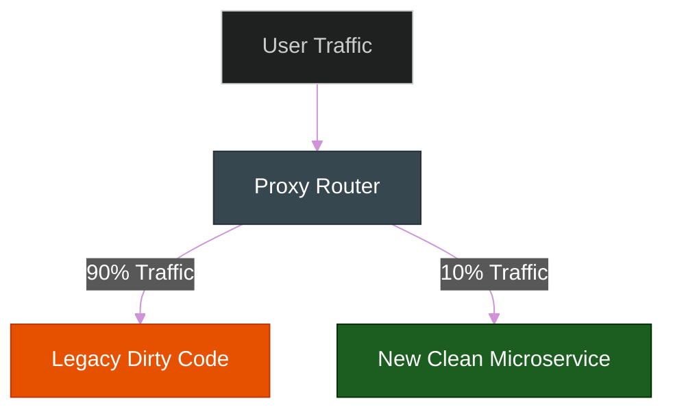

# Refactoring Techniques: The Surgeon's Scalpel

**Author:** ichamrong  
**Category:** Clean Code & Architecture  
**Read Time:** ~20 min  

---

## 📌 Table of Contents
- [1. The Execution Strategy](#1-the-execution-strategy)
- [2. Real-World Enterprise Case Studies](#2-real-world-enterprise-case-studies)
  - [Case Study #6: Stripe's "Strangler Fig Pattern"](#case-study-6-stripes-strangler-fig-pattern)
- [3. Composing Methods](#3-composing-methods)
  - [A. Extract Method](#a-extract-method)
- [4. Organizing Data](#4-organizing-data)
  - [A. Replace Magic Number with Symbolic Constant](#a-replace-magic-number-with-symbolic-constant)
  - [B. Replace Conditional with Polymorphism](#b-replace-conditional-with-polymorphism)
- [5. Simplifying Conditional Expressions](#5-simplifying-conditional-expressions)
  - [A. Return Early (Guard Clauses)](#a-return-early-guard-clauses)
- [🔗 External References & Required Reading](#external-references-required-reading)

---

## 1. The Execution Strategy

> **Refactoring techniques** describe actual refactoring steps. Most refactoring techniques have their pros and cons. Therefore, each refactoring should be properly motivated and applied with caution.

You do not refactor just for the sake of refactoring. You apply these techniques to cure specific Code Smells. Every technique involves a tradeoff (e.g., extracting a method increases readability, but jumping between too many tiny methods can fragment logic).

---

## 2. Real-World Enterprise Case Studies

### Case Study #6: Stripe's "Strangler Fig Pattern"
When Stripe needed to refactor their massive legacy payment gateway into a new architecture, they couldn't just turn off the old system—millions of businesses rely on Stripe every second.
- **The Technique:** They used the **Strangler Fig Refactoring Pattern**. Instead of rewriting the whole system, they built a new proxy router. They routed 1% of traffic to the new clean code, and 99% to the old dirty code. Over months, they "strangled" the old code, rewriting it endpoint by endpoint until the old system was dead.
- **The Lesson:** In the enterprise, refactoring is done while the plane is flying. 



---

## 3. Composing Methods

Much of refactoring revolves around composing methods properly to cure **Bloaters** (Long Methods).

### A. Extract Method
- **The Problem:** You have a code fragment that can be grouped together.
- **The Solution:** Move this code to a separate new method and replace the old code with a call to the new method.
- **Why:** This makes the original method highly readable, almost like reading an English paragraph.

```typescript
// ❌ Dirty Code: Too many responsibilities
function printOwing(invoice: Invoice) {
    printBanner();
    
    // Calculate outstanding
    let outstanding = 0;
    for (let order of invoice.orders) {
        outstanding += order.amount;
    }
    
    // Print details
    console.log("name: " + invoice.name);
    console.log("amount: " + outstanding);
}

// ✅ Clean Code: Extracted logic
function printOwing(invoice: Invoice) {
    printBanner();
    let outstanding = calculateOutstanding(invoice);
    printDetails(invoice.name, outstanding);
}
```

---

## 4. Organizing Data

Used to cure **Primitive Obsession** and reduce cognitive load.

### A. Replace Magic Number with Symbolic Constant
- **The Problem:** Your code contains raw numbers or strings with no obvious meaning.
- **The Solution:** Replace the number with a constant that has a human-readable name.

```go
// ❌ Dirty Code
func calculatePotentialEnergy(mass float64, height float64) float64 {
    return mass * 9.81 * height // What is 9.81?
}

// ✅ Clean Code
const GravitationalConstant = 9.81

func calculatePotentialEnergy(mass float64, height float64) float64 {
    return mass * GravitationalConstant * height
}
```

### B. Replace Conditional with Polymorphism
- **The Problem:** You have a massive `switch` statement that checks an object's type code to execute behavior. This causes **Shotgun Surgery** when a new type is added.
- **The Solution:** Create subclasses/interfaces for each type, and use Polymorphism to execute the correct behavior.

---

## 5. Simplifying Conditional Expressions

### A. Return Early (Guard Clauses)
- **The Problem:** Deeply nested `if-else` statements forming an "Arrow Anti-Pattern." This makes the code almost impossible to read.
- **The Solution:** Isolate all special checks, errors, and edge cases and put them at the very top of the function. Return early if they fail. This leaves the "Happy Path" flat and un-nested at the bottom of the function.

```typescript
// ❌ Dirty Code (The Arrow Pattern)
function processPayment(user: User): string {
    if (user != null) {
        if (user.hasActiveCard) {
            if (user.balance > 0) {
                return "Payment Processed"; // Deeply nested success
            } else {
                return "Insufficient Funds";
            }
        } else {
            return "No Active Card";
        }
    } else {
        return "User is null";
    }
}

// ✅ Clean Code (Guard Clauses)
function processPayment(user: User): string {
    // Fail fast at the top
    if (user == null) return "User is null";
    if (!user.hasActiveCard) return "No Active Card";
    if (user.balance <= 0) return "Insufficient Funds";
    
    // The Happy Path is flat!
    return "Payment Processed"; 
}
```

---

## 🔗 External References & Required Reading
- **Book:** *Working Effectively with Legacy Code* by Michael Feathers.
- **Architecture Pattern:** [The Strangler Fig Application Pattern (Martin Fowler)](https://martinfowler.com/bliki/StranglerFigApplication.html)

**Navigation:** [Previous: Code Smells](./03-code-smells.md) | [Refactoring Index](./README.md)

*Last updated: 2026-05-17*

## Related

- [Uncle Bob's Clean Code Rules](../uncle-bob-rules/README.md)
- [Design Patterns](../design-patterns/README.md)
- [Data Structures & Algorithms](../dsa/README.md)
