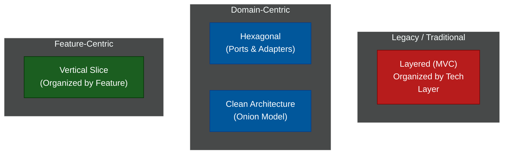

# 🏛️ Software Architecture (Spring Boot Structures)

A comprehensive guide to organizing the codebase of enterprise applications. While these examples use Java and Spring Boot, the architectural principles apply to .NET, Node.js, and Golang alike.

---

## 📖 Table of Contents

- [The Evolution of Code Organization](#the-evolution-of-code-organization)
- [📚 Module Index](#module-index)
- [Architecture Landscape](#architecture-landscape)

---

## The Evolution of Code Organization

When a Spring Boot application is small, you can put all your classes in one folder. As it grows to 500+ classes, it becomes unmanageable. 

Historically, we organized code by **Technical Role** (Layered Architecture). We put all Controllers together, all Services together, and all Repositories together. 

As Domain-Driven Design (DDD) became popular, we realized this was a mistake. Modern architectures like **Hexagonal** and **Vertical Slice** organize code by **Business Capability**, keeping the core domain pure and isolated from frameworks and databases.

---

## 📚 Module Index

| Module | Title | Level | Read Time | Key Topics |
| :--- | :--- | :--- | :--- | :--- |
| **01** | [Layered Architecture (N-Tier)](./code-organization/01-layered-architecture.md) | Fundamental | ~6 min | Controller/Service/Repository, Anemic Domain |
| **02** | [Hexagonal Architecture (Ports & Adapters)](./code-organization/02-hexagonal-architecture.md) | Advanced | ~10 min | Inside vs Outside, Dependency Inversion |
| **03** | [Clean Architecture (Onion)](./code-organization/03-clean-architecture.md) | Advanced | ~10 min | Entities, Use Cases, Interfaces, Frameworks |
| **04** | [Vertical Slice Architecture](./code-organization/04-vertical-slice.md) | Advanced | ~8 min | Feature Folders, CQRS, High Cohesion |
| **05** | [Domain-Driven Design (DDD)](./code-organization/05-domain-driven-design.md) | Advanced | ~12 min | Bounded Contexts, Aggregates, Entities |
| **06** | [Microkernel Architecture](./code-organization/06-microkernel-architecture.md) | Advanced | ~8 min | Plugin Pattern, Extensibility, Contracts |
| **07** | [The Actor Model](./code-organization/07-actor-model.md) | Expert | ~10 min | Extreme Concurrency, Mailboxes, Akka |

### System & Deployment Architecture

Moving beyond folder structures to how the entire system is physically deployed.

| Module | Title | Level | Read Time | Key Topics |
| :--- | :--- | :--- | :--- | :--- |
| **01** | [The Monolith vs Microservices](./system-design/01-monolith-vs-microservices.md) | Intermediate | ~8 min | Distributed Computing, Network Fallacies |
| **02** | [The Modular Monolith](./system-design/02-modular-monolith.md) | Advanced | ~10 min | Domain Isolation, Spring Modulith, Events |
| **03** | [Serverless Architecture (FaaS)](./system-design/03-serverless-architecture.md) | Intermediate | ~8 min | Scale to zero, Cold starts, AWS Lambda |
| **04** | [Space-Based Architecture](./system-design/04-space-based-architecture.md) | Expert | ~8 min | In-Memory Data Grids, Eliminating the Database |
| **05** | [Database Scaling (Replicas)](./system-design/05-database-scaling-replication.md) | Intermediate | ~10 min | Read Replicas, Sharding, CAP Theorem |
| **06** | [Caching Strategies](./system-design/06-caching-strategies.md) | Intermediate | ~10 min | Cache Aside, Redis, LRU, Thundering Herd |

### Distributed System Patterns

Patterns required to solve complex scaling and distributed state problems.

| Module | Title | Level | Read Time | Key Topics |
| :--- | :--- | :--- | :--- | :--- |
| **01** | [CQRS Pattern](./distributed-patterns/01-cqrs-pattern.md) | Advanced | ~10 min | Splitting Reads/Writes, Eventual Consistency |
| **02** | [Saga Pattern (Distributed Tx)](./distributed-patterns/02-saga-pattern.md) | Advanced | ~10 min | 2PC, Choreography vs Orchestration |
| **03** | [Inter-Service Communication](./distributed-patterns/03-inter-service-communication.md) | Intermediate | ~10 min | REST, gRPC, OpenFeign, Circuit Breakers |
| **04** | [Transactional Outbox Pattern](./distributed-patterns/04-transactional-outbox.md) | Advanced | ~10 min | Dual-Writes, Change Data Capture (Debezium) |
| **05** | [API Gateway & BFF](./distributed-patterns/05-api-gateway-bff.md) | Intermediate | ~8 min | Backend-for-Frontend, API Composition, GraphQL |
| **06** | [Strangler Fig Pattern](./distributed-patterns/06-strangler-fig.md) | Advanced | ~6 min | Migrating legacy monoliths to microservices |
| **07** | [Event Sourcing](./distributed-patterns/07-event-sourcing.md) | Advanced | ~12 min | Append-only ledgers, Snapshots, Time Travel |
| **08** | [Bulkhead Pattern](./distributed-patterns/08-bulkhead-pattern.md) | Intermediate | ~6 min | Resource exhaustion, Thread pool isolation |
| **09** | [Service Mesh & Sidecar Pattern](./distributed-patterns/09-service-mesh-sidecar.md) | Advanced | ~8 min | Istio, Envoy, mTLS, Decoupling network logic |

---

## Architecture Landscape

