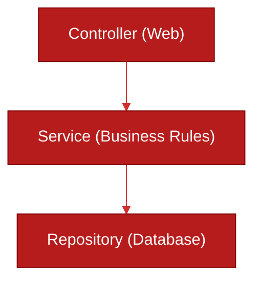

# 🥞 Layered Architecture (N-Tier)

> **Series:** Clean Code › Software Architecture · **Level:** Fundamental · **Read Time:** ~6 min

---

## 📖 Table of Contents

- [1. What Is Layered Architecture?](#1-what-is-layered-architecture)
- [2. The Spring Boot Folder Structure](#2-the-spring-boot-folder-structure)
- [3. The Dependency Direction](#3-the-dependency-direction)
- [4. The "Anemic Domain" Problem](#4-the-anemic-domain-problem)

---

## 1. What Is Layered Architecture?

**Layered Architecture** (often called 3-Tier or MVC) is the default architectural pattern taught in university and used in 90% of basic Spring Boot tutorials.

It organizes code horizontally by **Technical Concern**.

---

## 2. The Spring Boot Folder Structure

In this architecture, your root package is organized into folders that represent the technical layers of the application.

```text
com.company.app
├── controller/        # Presentation Layer (HTTP/JSON)
│   ├── UserController.java
│   └── OrderController.java
├── service/           # Business Logic Layer
│   ├── UserService.java
│   └── OrderService.java
├── repository/        # Data Access Layer (JPA/SQL)
│   ├── UserRepository.java
│   └── OrderRepository.java
└── model/             # Data Entities
    ├── User.java
    └── Order.java
```

---

## 3. The Dependency Direction

The defining characteristic of Layered Architecture is the **top-down dependency flow**:
1. The **Controller** depends on the **Service**.
2. The **Service** depends on the **Repository**.
3. The **Repository** depends on the **Database**.



**The Trap:** Because the Service depends on the Repository, the core business rules of your application are permanently coupled to your database framework (like Spring Data JPA/Hibernate). If you try to test your business logic, you are forced to mock the database or spin up an H2 in-memory database.

---

## 4. The "Anemic Domain" Problem

Layered architectures almost always lead to the **Anemic Domain Anti-Pattern**.

Because all the "logic" lives in the `OrderService.java` file, the `Order.java` model becomes nothing more than a dumb bag of getters and setters. 
In true Object-Oriented Programming, the `Order` object should manage its own state (e.g., `order.applyDiscount()`). In Layered Architecture, the `Order` is stripped of behavior, and procedural scripts in the Service layer modify its state (`orderService.applyDiscount(order)`).

### When to Use Layered Architecture
✅ **Simple CRUD Apps:** If your application is literally just taking JSON and saving it to a database with zero complex business logic, Layered Architecture is the fastest way to build it.
❌ **Complex Enterprise Domains:** As the application grows, navigating between `UserController` and `UserRepository` requires jumping across the entire codebase.

---

*← [Series Overview](../README.md) · Next: [Hexagonal Architecture](./02-hexagonal-architecture.md) →*

## Related

- [Design Patterns](../../design-patterns/README.md)
- [Distributed Architecture Patterns](../distributed-patterns/README.md)
- [API Gateways & Reverse Proxies](../../../devops/api-gateways/README.md)
- [Network Protocols & API Architectures](../../../devops/fundamentals/01-network-protocols-and-api-architectures.md)
