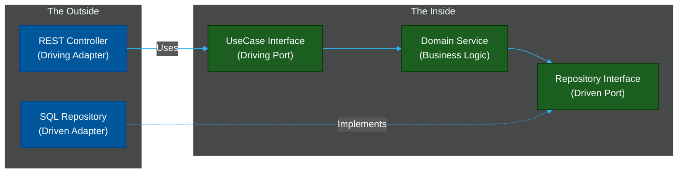

# 🛑 Hexagonal Architecture (Ports & Adapters)

> **Series:** Clean Code › Software Architecture · **Level:** Advanced · **Read Time:** ~10 min

---

## 📖 Table of Contents

- [1. The Philosophy of Independence](#1-the-philosophy-of-independence)
- [2. Inside vs Outside](#2-inside-vs-outside)
- [3. Ports & Adapters](#3-ports-adapters)
- [4. The Spring Boot Folder Structure](#4-the-spring-boot-folder-structure)

---

## 1. The Philosophy of Independence

Created by Alistair Cockburn, **Hexagonal Architecture** exists to solve the problem of the Layered Architecture: *Coupling to the database and frameworks.*

The core philosophy is: **Your business logic is the most important thing in your application. It must not depend on Spring Boot, MySQL, RabbitMQ, or Tomcat.**

You should be able to run your entire core business logic via command-line interface or automated tests without spinning up a web server or a database.

---

## 2. Inside vs Outside

The architecture divides the system into two distinct zones:

1. **The Inside (Domain/Application):** This contains your pure Java business logic. It has **zero dependencies** on Spring Framework annotations (`@Entity`, `@Autowired`, `@RestController`).
2. **The Outside (Infrastructure):** This contains Web controllers, database repositories, external API clients, and the Spring Boot framework itself.

**The Golden Rule:** Dependencies can *only* point inward. The Outside can know about the Inside, but the Inside *must never* know about the Outside.

---

## 3. Ports & Adapters

How does the Inside save to a database if it isn't allowed to know the database exists? **Dependency Inversion.**

1. **Ports (Interfaces):** The Inside defines an Interface (e.g., `OrderRepositoryPort`). This Interface belongs to the Inside.
2. **Adapters (Implementations):** The Outside creates a Spring Data JPA class (e.g., `SqlOrderAdapter`) that implements the Port.



Because the `Domain Service` only talks to the `Repository Interface`, it is completely unaware that MySQL is actually saving the data.

---

## 4. The Spring Boot Folder Structure

```text
com.company.app
├── domain/                  # 🟢 THE INSIDE (Pure Java Only, No Spring)
│   ├── model/
│   │   └── Order.java       # Pure business object (NO @Entity, NO @Table)
│   ├── ports/
│   │   ├── in/              # Use cases the Outside can call
│   │   │   └── CreateOrderUseCase.java
│   │   └── out/             # Interfaces the Inside needs implemented
│   │       └── SaveOrderPort.java
│   └── service/
│       └── OrderService.java # Implements 'in', calls 'out'
│
└── infrastructure/          # 🔵 THE OUTSIDE (Spring Boot land)
    ├── adapters/
    │   ├── in/
    │   │   └── web/
    │   │       └── OrderController.java # Calls CreateOrderUseCase
    │   └── out/
    │       └── db/
    │           ├── OrderEntity.java # The JPA @Entity class
    │           ├── SpringDataOrderRepo.java
    │           └── SqlOrderAdapter.java # Implements SaveOrderPort
    └── config/
        └── BeanConfig.java  # Wires Domain to Infrastructure
```

### Why Do We Have Two `Order` Classes?
Yes, in Hexagonal Architecture, you map the Domain `Order` object to an Infrastructure `OrderEntity` object before saving it to the database. This seems like duplication, but it is actually **Decoupling**. 

If your DBA requires you to split the database table into two tables, you only change the `OrderEntity`. The Domain `Order` object—and all your business logic—remains untouched.

---

*← [Layered Architecture](./01-layered-architecture.md) · Next: [Clean Architecture](./03-clean-architecture.md) →*

## Related

- [Design Patterns](../../design-patterns/README.md)
- [Distributed Architecture Patterns](../distributed-patterns/README.md)
- [API Gateways & Reverse Proxies](../../../devops/api-gateways/README.md)
- [Network Protocols & API Architectures](../../../devops/fundamentals/01-network-protocols-and-api-architectures.md)
