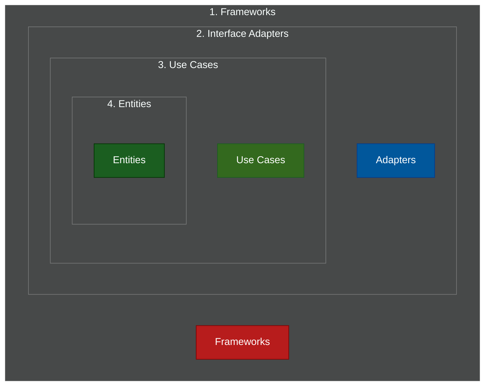

# 🧅 Clean Architecture

> **Series:** Clean Code › Software Architecture · **Level:** Advanced · **Read Time:** ~10 min

---

## 📖 Table of Contents

- [1. Uncle Bob's Synthesis](#1-uncle-bobs-synthesis)
- [2. The Four Rings](#2-the-four-rings)
- [3. The Dependency Rule](#3-the-dependency-rule)
- [4. The Spring Boot Folder Structure](#4-the-spring-boot-folder-structure)

---

## 1. Uncle Bob's Synthesis

In 2012, **Robert C. Martin (Uncle Bob)** wrote an article called *The Clean Architecture*. He looked at Hexagonal Architecture, Onion Architecture, and Screaming Architecture, and realized they were all trying to achieve the exact same thing: **Separation of Concerns and Framework Independence**.

Clean Architecture is essentially a more rigorously defined version of Hexagonal Architecture, visually represented as a series of concentric rings.

---

## 2. The Four Rings



1. **Entities (Enterprise Business Rules):** The absolute core. These are pure Java objects holding the most critical business rules. They don't know anything about the application surrounding them.
2. **Use Cases (Application Business Rules):** These orchestrate the flow of data to and from the entities. (e.g., `TransferMoneyUseCase`).
3. **Interface Adapters:** These convert data from the format most convenient for the Use Cases, into the format most convenient for the external agency (like the Web or the Database). This is where your Spring MVC Controllers and SQL Presenters live.
4. **Frameworks & Drivers:** The outermost ring. This is where Spring Boot, MySQL, and the UI live. You don't write much code here, you just configure frameworks.

---

## 3. The Dependency Rule

> *"Source code dependencies must point only inward, toward higher-level policies."*

Code in the inner rings can know **nothing** about the outer rings. 
- An Entity cannot import a Use Case.
- A Use Case cannot import a Spring `@RestController`.
- If a Use Case needs to talk to the database, it uses **Dependency Inversion** (just like the Ports & Adapters in Hexagonal Architecture) by defining an Interface in the Use Case ring, which is implemented in the Interface Adapters ring.

---

## 4. The Spring Boot Folder Structure

The folder structure for Clean Architecture heavily mirrors Hexagonal, but uses Uncle Bob's nomenclature.

```text
com.company.app
├── core/                    # 🟢 THE INNER RINGS (No Frameworks)
│   ├── entity/              # Ring 4: Enterprise Rules
│   │   ├── Account.java
│   │   └── Money.java
│   └── usecase/             # Ring 3: Application Rules
│       ├── TransferMoneyUseCase.java
│       └── TransferMoneyOutputPort.java (Interface)
│
├── adapter/                 # 🔵 THE OUTER RINGS (Frameworks)
│   ├── controller/          # Ring 2: Interface Adapters
│   │   ├── AccountController.java
│   │   └── AccountPresenter.java
│   └── gateway/             # Ring 2: Database Adapters
│       ├── SqlAccountRepository.java (Implements OutputPort)
│       └── AccountJpo.java (JPA Object)
│
└── configuration/           # Ring 1: Spring Boot Setup
    ├── SpringBootApp.java
    └── UseCaseConfig.java   # Manual Bean creation
```

### The Difference Between Clean and Hexagonal
Practically speaking, there is very little difference. Hexagonal focuses heavily on the concept of "Ports" (APIs) and "Adapters" (Plugins). Clean Architecture provides a stricter set of rules for exactly where specific types of business logic should live (Entities vs Use Cases).

---

*← [Hexagonal Architecture](./02-hexagonal-architecture.md) · Next: [Vertical Slice Architecture](./04-vertical-slice.md) →*

## Related

- [Design Patterns](../../design-patterns/README.md)
- [Distributed Architecture Patterns](../distributed-patterns/README.md)
- [API Gateways & Reverse Proxies](../../../devops/api-gateways/README.md)
- [Network Protocols & API Architectures](../../../devops/fundamentals/01-network-protocols-and-api-architectures.md)
