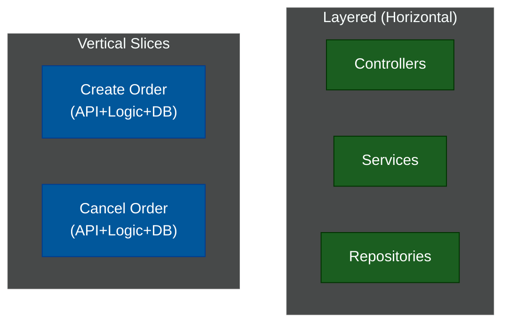

# 🍰 Vertical Slice Architecture

> **Series:** Clean Code › Software Architecture · **Level:** Advanced · **Read Time:** ~8 min

---

## 📖 Table of Contents

- [1. The Problem with Horizontal Layers](#1-the-problem-with-horizontal-layers)
- [2. What Is a Vertical Slice?](#2-what-is-a-vertical-slice)
- [3. The Spring Boot Folder Structure](#3-the-spring-boot-folder-structure)
- [4. Treating Features as Isolated Units](#4-treating-features-as-isolated-units)

---




## 1. The Problem with Horizontal Layers

Whether you use Layered, Hexagonal, or Clean Architecture, they all organize code **horizontally**. 

If you want to add a new feature like "Update User Profile", you have to open:
1. `UserController.java` (Presentation Layer)
2. `UpdateUserProfileUseCase.java` (Domain Layer)
3. `UserRepository.java` (Data Layer)

You are forced to jump across the entire codebase, making tiny changes in 4 different folders, just to implement a single business feature. This violates the rule of **Cohesion** (things that change together should be kept together).

---

## 2. What Is a Vertical Slice?

Created by Jimmy Bogard, **Vertical Slice Architecture** organizes code purely by **Feature**.

Instead of grouping all Controllers together, you group the specific Controller, Service, and Repository required for "Updating a User Profile" into a single, highly cohesive folder.

---

## 3. The Spring Boot Folder Structure

```text
com.company.app
├── features/
│   ├── users/
│   │   ├── register/
│   │   │   ├── RegisterUserController.java
│   │   │   ├── RegisterUserCommand.java
│   │   │   ├── RegisterUserValidator.java
│   │   │   └── RegisterUserRepository.java
│   │   └── getprofile/
│   │       ├── GetProfileController.java
│   │       ├── GetProfileQuery.java
│   │       └── GetProfileDto.java
│   │
│   └── orders/
│       └── placeorder/
│           ├── PlaceOrderController.java
│           ├── PlaceOrderCommandHandler.java
│           └── PlaceOrderRepository.java
│
└── shared/
    ├── security/
    └── exceptions/
```

Notice how `register` and `getprofile` are completely isolated. 
When a developer is assigned a Jira ticket to fix a bug in the "Register User" flow, they open exactly one folder (`features/users/register/`). Every single class they need is in that folder.

---

## 4. Treating Features as Isolated Units

The superpower of Vertical Slice Architecture is that **each feature can choose its own architecture.**

In a strict Hexagonal system, you are forced to use Ports and Adapters even for simple reads.
In a Vertical Slice system:
- The **PlaceOrder** slice is extremely complex. It can use Domain-Driven Design, Aggregates, and Hexagonal Ports internally.
- The **GetProfile** slice is extremely simple. It doesn't even need a Service class. The Controller can literally inject an SQL `JdbcTemplate` and run a `SELECT` statement directly, completely skipping the Domain layer.

This relies heavily on the **CQRS (Command Query Responsibility Segregation)** pattern, treating complex Commands (Writes) differently from simple Queries (Reads).

### When to Use Vertical Slices
✅ **Agile Teams:** If your Jira board is organized by features, your codebase should be too.
✅ **Microservices:** It makes extracting a feature into its own microservice incredibly easy, because all the code is already isolated in one folder.
❌ **Shared Logic:** If you find 10 different slices all rewriting the exact same complex tax calculation logic, you are losing the benefits of shared domain models.

---

*← [Clean Architecture](./03-clean-architecture.md) · [Back to Series Overview](../README.md) →*

## Related

- [Design Patterns](../../design-patterns/README.md)
- [Distributed Architecture Patterns](../distributed-patterns/README.md)
- [API Gateways & Reverse Proxies](../../../devops/api-gateways/README.md)
- [Network Protocols & API Architectures](../../../devops/fundamentals/01-network-protocols-and-api-architectures.md)
