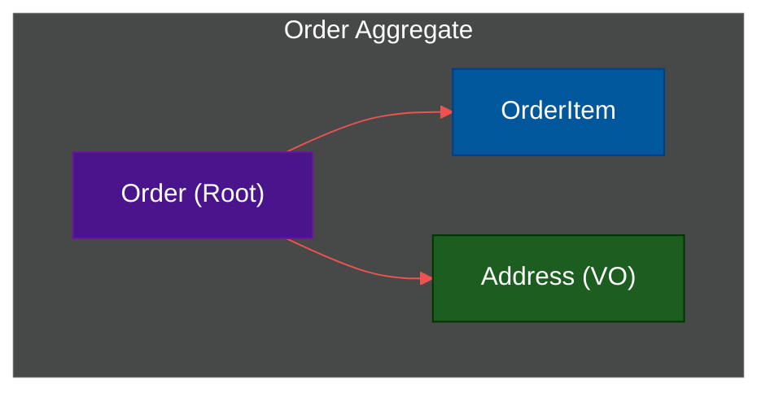

# 🧠 Domain-Driven Design (DDD)

> **Series:** Clean Code › Code Organization · **Level:** Advanced · **Read Time:** ~12 min

---

## 📖 Table of Contents

- [1. The Heart of Software](#1-the-heart-of-software)
- [2. The Ubiquitous Language](#2-the-ubiquitous-language)
- [3. Bounded Contexts](#3-bounded-contexts)
- [4. Entities vs Value Objects](#4-entities-vs-value-objects)
- [5. Aggregates and Aggregate Roots](#5-aggregates-and-aggregate-roots)

---




## 1. The Heart of Software

Coined by Eric Evans in 2003, **Domain-Driven Design (DDD)** is an approach to software development that centers the architecture around the core business domain.

If you are building banking software, the code shouldn't look like a technical framework (e.g., `SqlTransactionManager`, `JsonParser`). The code should look like a bank (`Account`, `Transfer`, `OverdraftPolicy`).

DDD pairs perfectly with Hexagonal and Clean Architectures because it provides the rules for what actually goes inside the "Core" (The Inside).

---

## 2. The Ubiquitous Language

The most common reason software projects fail is a breakdown in communication. Developers speak in tables and foreign keys. Business experts speak in workflows and processes.

DDD mandates the creation of a **Ubiquitous Language**: a strict, shared vocabulary used by both developers and business experts.
If the business expert calls the customer a "Client", you do not name the database table `users`. You name the class `Client`. You use the exact terminology of the business everywhere—in meetings, in Jira, in code, and in database schemas.

---

## 3. Bounded Contexts

Words mean different things to different departments.
- To the **Shipping Department**, an `Order` means a cardboard box with a physical weight and a tracking number.
- To the **Billing Department**, an `Order` means a credit card authorization status and a tax rate.

If you try to build one giant `Order` class with 100 properties to satisfy both departments, you create an unmaintainable monster.

**The Solution:** Create explicit **Bounded Contexts**.
You create a `ShippingContext` (which has its own `Order` class focused on logistics) and a `BillingContext` (which has its own `Order` class focused on money). These are entirely separate models.

*(Note: Bounded Contexts form the perfect architectural boundaries for cutting a Monolith into Microservices).*

---

## 4. Entities vs Value Objects

Inside your Bounded Context, you model the domain using two building blocks:

### Entities
An object defined by its **Identity**, not its attributes. If you change a person's name and age, they are still the exact same person. In code, an Entity usually has an `UUID` or an `ID`.
*(e.g., `Customer`, `BankAccount`, `Order`)*

### Value Objects
An object defined entirely by its **Attributes**. It has no identity. If you change a $5 bill to a $10 bill, it is a fundamentally different object. Value Objects must be **Immutable**.
*(e.g., `Money`, `Address`, `Color`, `DateRange`)*

```java
// Money is a Value Object. It has no ID. It cannot be changed once created.
public class Money {
    private final BigDecimal amount;
    private final String currency;
    
    public Money add(Money other) {
        return new Money(this.amount.add(other.amount), this.currency);
    }
}
```

---

## 5. Aggregates and Aggregate Roots

An **Aggregate** is a cluster of Domain Objects (Entities and Value Objects) that are treated as a single unit for data changes.

For example, an `Order` (Entity) contains multiple `OrderLineItems` (Entities).
If you delete an `Order`, all the `LineItems` must be deleted with it. You should never be able to access a `LineItem` directly from the database without first loading the `Order`.

The `Order` is the **Aggregate Root**.
The rule of DDD is: **External objects can only hold references to the Aggregate Root.** You cannot directly modify a child object. All changes must go through the Root to ensure business rules are enforced.

```java
// ✅ Good: Modifying the child via the Aggregate Root
order.addItem(new Product("Laptop"), 1);

// ❌ Bad: Fetching the child directly and modifying it (violates the Aggregate)
lineItemRepository.findById(5).setQuantity(10);
```

---

*← [Vertical Slice Architecture](./04-vertical-slice.md) · [Back to Series Overview](../README.md) →*

## Related

- [Design Patterns](../../design-patterns/README.md)
- [Distributed Architecture Patterns](../distributed-patterns/README.md)
- [API Gateways & Reverse Proxies](../../../devops/api-gateways/README.md)
- [Network Protocols & API Architectures](../../../devops/fundamentals/01-network-protocols-and-api-architectures.md)
