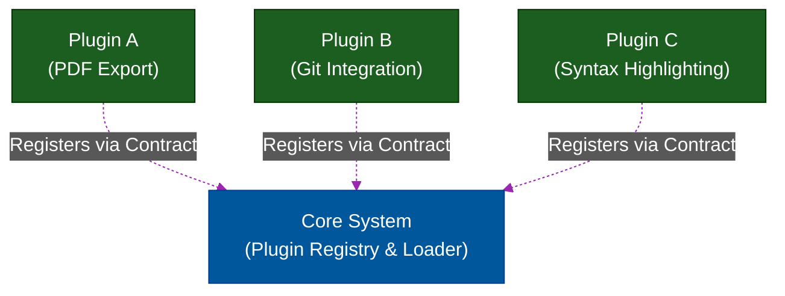

# 🧩 Microkernel Architecture (Plugin Pattern)

> **Series:** Clean Code › Code Organization · **Level:** Advanced · **Read Time:** ~8 min

---

## 📖 Table of Contents

- [1. Extensibility Over Everything](#1-extensibility-over-everything)
- [2. The Core vs The Plugins](#2-the-core-vs-the-plugins)
- [3. Registry and Contracts](#3-registry-and-contracts)
- [4. Real-World Examples](#4-real-world-examples)

---

## 1. Extensibility Over Everything

Sometimes, building a rigid Layered Architecture or Clean Architecture doesn't make sense if the primary goal of the application is **infinite extensibility by third-party developers.**

**Microkernel Architecture** (also known as the Plugin Architecture) is a pattern where the core application contains almost zero business logic. Instead, all features are injected into the application at runtime via isolated plugins.

---

## 2. The Core vs The Plugins

The architecture is strictly divided into two components:

### 1. The Core System (Microkernel)
The Core System is responsible for only the absolute bare minimum required to make the application run. Its primary job is lifecycle management: discovering, loading, and orchestrating plugins. 
It usually contains a central registry, a plugin loader, and the core UI window frame.

### 2. Plug-in Modules
These are standalone, independently compiled components that contain specialized processing, additional features, and custom business logic. Plugins are strictly forbidden from modifying the Core System, but they can hook into it.



---

## 3. Registry and Contracts

How does the Core System know what the plugins do?

**The Contract:** The Core System defines strict Java `Interfaces` (or API contracts). 
**The Registry:** When the application boots, it scans a specific folder (e.g., `/plugins/`), finds all `.jar` or `.dll` files, and checks if they implement the Contract. If they do, they are loaded into a central Map/Registry.

```java
// The Contract defined by the Core System
public interface PaymentPlugin {
    boolean processPayment(Money amount);
    String getProviderName();
}

// The Core System iterates dynamically
for (PaymentPlugin plugin : pluginRegistry.getAll()) {
    System.out.println("Loaded provider: " + plugin.getProviderName());
}
```

---

## 4. Real-World Examples

You use Microkernel architectures every single day:
- **VS Code & Eclipse:** The core IDE is just a text editor. Java support, Git support, and themes are all downloaded as Plugins.
- **Web Browsers:** Google Chrome's extensions are plugins that hook into the core rendering engine.
- **Jenkins:** The core CI/CD pipeline does very little. Docker integration, AWS deployment, and Slack notifications are all plugins.

### When to use in Backend Systems?
While heavily used in desktop software, it is incredibly useful in enterprise backends for **Rules Engines** or **Payment Gateways**. Instead of hardcoding 50 different payment methods into your Monolith, you build a Microkernel core, and drop a `Stripe.jar` or `PayPal.jar` into the plugins folder at runtime.

---

*← [Domain-Driven Design](./05-domain-driven-design.md) · [Back to Series Overview](../README.md) →*

## Related

- [Design Patterns](../../design-patterns/README.md)
- [Distributed Architecture Patterns](../distributed-patterns/README.md)
- [API Gateways & Reverse Proxies](../../../devops/api-gateways/README.md)
- [Network Protocols & API Architectures](../../../devops/fundamentals/01-network-protocols-and-api-architectures.md)
