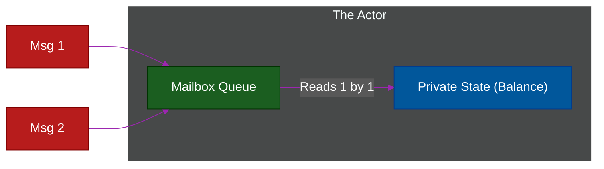

# 🎭 The Actor Model

> **Series:** Clean Code › Code Organization · **Level:** Expert · **Read Time:** ~10 min

---

## 📖 Table of Contents

- [1. The Curse of Shared Memory](#1-the-curse-of-shared-memory)
- [2. What Is an Actor?](#2-what-is-an-actor)
- [3. Mailboxes and Messages](#3-mailboxes-and-messages)
- [4. The Erlang / Akka Ecosystem](#4-the-erlang-akka-ecosystem)

---

## 1. The Curse of Shared Memory

In traditional Object-Oriented Programming (like Java or C#), objects are stored in a shared heap of memory. 

If two different threads try to modify a `User` object at the exact same time, you get a **Race Condition**, resulting in corrupted data. To solve this, developers use `Mutexes` and `Locks`. 
However, locks destroy performance (threads sit idle waiting for the lock to release) and often cause **Deadlocks** (where two threads freeze forever waiting on each other).

Writing highly concurrent, multi-threaded code using shared memory is notoriously difficult and prone to catastrophic bugs.

---

## 2. What Is an Actor?

Invented in 1973, the **Actor Model** solves the concurrency problem by completely banning shared memory.

An **Actor** is a lightweight, isolated object. It contains its own private state, and absolutely nothing from the outside world can ever access or modify that state directly. There are no getter or setter methods.

Because an Actor's state is strictly private to itself, it never needs a lock. A single Actor processes exactly one thing at a time, completely eliminating race conditions.

---

## 3. Mailboxes and Messages

If you can't call an Actor's methods, how do you interact with it?
**Asynchronous Messaging.**

Every Actor has a "Mailbox". If you want the `BankAccountActor` to update its balance, you send a `DepositMoneyMessage` to its mailbox. 
The Actor reads messages from its mailbox one by one in a sequential queue.

When an Actor receives a message, it can do three things:
1. Update its own private state.
2. Send messages to other Actors.
3. Spawn new, child Actors.

---

## 4. The Erlang / Akka Ecosystem

The Actor Model is the foundational architecture of the **Erlang** programming language (and its modern successor, **Elixir**). 
WhatsApp used Erlang's Actor Model to handle billions of concurrent chat messages with only 50 engineers.

In the JVM world (Java/Scala), the Actor Model is implemented via the **Akka** framework.

### "Let It Crash"
Because Actors are completely isolated, they are incredibly cheap to create and destroy (you can run 10 million Actors on a standard laptop). 

This leads to the famous Actor philosophy: **"Let It Crash"**. 
Instead of writing massive `try/catch` blocks to protect an Actor from an error, you simply let the Actor crash and die. Its "Supervisor" (the parent Actor) notices it died, and instantly spins up a fresh, healthy replacement Actor in a fraction of a millisecond. 
This results in systems with "Nine Nines" of reliability (99.9999999% uptime).

---

*← [Microkernel Architecture](./06-microkernel-architecture.md) · [Back to Series Overview](../README.md) →*

## Related

- [Design Patterns](../../design-patterns/README.md)
- [Distributed Architecture Patterns](../distributed-patterns/README.md)
- [API Gateways & Reverse Proxies](../../../devops/api-gateways/README.md)
- [Network Protocols & API Architectures](../../../devops/fundamentals/01-network-protocols-and-api-architectures.md)
