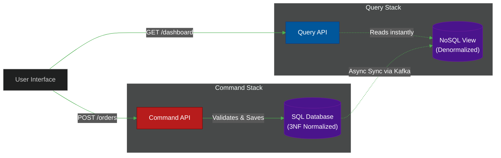

# 🔄 CQRS (Command Query Responsibility Segregation)

> **Series:** Clean Code › Software Architecture · **Level:** Advanced · **Read Time:** ~10 min

---

## 📖 Table of Contents

- [1. The Problem with CRUD](#1-the-problem-with-crud)
- [2. What Is CQRS?](#2-what-is-cqrs)
- [3. The Two Models (Write vs Read)](#3-the-two-models-write-vs-read)
- [4. Eventual Consistency & Message Brokers](#4-eventual-consistency-message-brokers)
- [5. When to Use CQRS](#5-when-to-use-cqrs)

---

## 1. The Problem with CRUD

In a standard CRUD (Create, Read, Update, Delete) architecture, you use the exact same Data Model (e.g., `User` entity) to both save data to the database and retrieve it for the UI.

**The Problem:** The way we *write* data is fundamentally different from the way we *read* data.
- **Writes** require complex validation, business rules, and strict ACID transaction locking to ensure data integrity.
- **Reads** are usually simple, but require aggregating data from 5 different tables to display on a single dashboard screen, leading to terribly slow `JOIN` queries.

If you force both operations to use the same Model and the same Database schema, both operations suffer.

---

## 2. What Is CQRS?

**CQRS** solves this by physically splitting the architecture into two distinct halves:
1. **Commands:** Methods that change state (Create, Update, Delete). They do not return data (except maybe an ID).
2. **Queries:** Methods that return data. They strictly do not change state.

This goes beyond just having separate methods in a class. In true CQRS, you create entirely different classes, entirely different API endpoints, and often entirely different databases for Commands vs Queries.

---

## 3. The Two Models (Write vs Read)

### The Command Stack (Write Model)
Optimized for data integrity. You use strict Domain-Driven Design (Aggregates, Entities) and a heavily normalized SQL database (3NF) to ensure you never double-charge a user.

### The Query Stack (Read Model)
Optimized for speed. You use "dumb" Data Transfer Objects (DTOs) and a denormalized NoSQL database (like MongoDB or Elasticsearch) or a SQL Materialized View. The data is pre-joined and pre-calculated so the API can return it in 2 milliseconds.

---

## 4. Eventual Consistency & Message Brokers

If you have two different databases, how do you keep them synchronized?

When the Command Stack successfully saves an `Order` to the SQL database, it publishes an `OrderPlacedEvent` to a Message Broker (like Apache Kafka or RabbitMQ). 
The Query Stack listens to that topic. When it receives the event, it updates the MongoDB dashboard view.

**The Catch: Eventual Consistency.**
Because the sync happens asynchronously over a message broker, there is a tiny delay (usually milliseconds). If a user clicks "Save" and the UI immediately refreshes, the read database might not be updated yet, and they might see stale data. You must design your UI to handle this (e.g., using WebSockets, or optimistic UI updates).

---

## 5. When to Use CQRS

CQRS adds immense complexity (you now have two sets of code, two databases, and a message broker to maintain).

✅ **Use CQRS when:**
- Your application is highly collaborative (many users editing the same data simultaneously).
- Your Read loads are 100x higher than your Write loads, and you need to scale them independently.
- You are using **Event Sourcing** (Event Sourcing inherently requires CQRS, because you cannot efficiently query an append-only log of events for a dashboard).

❌ **Do NOT use CQRS when:**
- You are building a simple CRUD application (like a basic content management system). Stick to Layered Architecture.

---

*← [The Modular Monolith](../system-design/02-modular-monolith.md) · Next: [The Saga Pattern](./02-saga-pattern.md) →*

## Related

- [Design Patterns](../../design-patterns/README.md)
- [Code Organization Architectures](../code-organization/README.md)
- [API Gateways & Reverse Proxies](../../../devops/api-gateways/README.md)
- [Message Brokers & Integration](../../../devops/message-brokers-integration/README.md)
