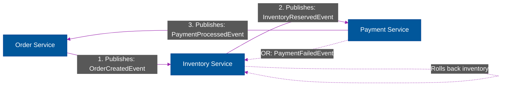
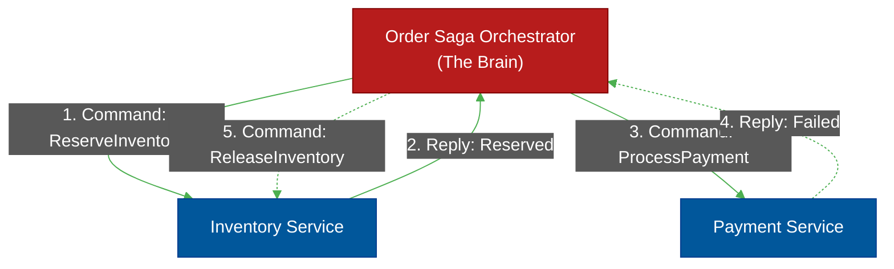

# 🔗 The Saga Pattern (Distributed Transactions)

> **Series:** Clean Code › Software Architecture · **Level:** Advanced · **Read Time:** ~10 min

---

## 📖 Table of Contents

- [1. The Death of ACID Transactions](#1-the-death-of-acid-transactions)
- [2. Two-Phase Commit (Why it fails)](#2-two-phase-commit-why-it-fails)
- [3. What Is a Saga?](#3-what-is-a-saga)
- [4. Choreography (Event-Based)](#4-choreography-event-based)
- [5. Orchestration (Command-Based)](#5-orchestration-command-based)

---

## 1. The Death of ACID Transactions

In a majestic Monolith, if a user places an order, you have to do three things:
1. Deduct Inventory.
2. Charge the Credit Card.
3. Create the Order.

In a Monolith, you wrap these in a single SQL `@Transactional` block. If the credit card declines at step 2, the database automatically rolls back step 1. Data remains perfectly consistent (ACID).

**In Microservices, this is impossible.** The `Inventory` service owns its own database, and the `Billing` service owns its own database. You cannot open a single SQL transaction across two different physical servers over an HTTP network.

---

## 2. Two-Phase Commit (Why it fails)

Historically, engineers tried to solve this with a **Two-Phase Commit (2PC)** protocol. A master coordinator tells all databases to "Prepare" to commit, locks all the rows across all servers, and then tells them all to "Commit" at the exact same millisecond.

**Why we abandoned it:** It locks the database rows for way too long. If the `Billing` server goes offline during the "Prepare" phase, the `Inventory` rows are locked indefinitely, taking down the entire company. 2PC does not scale in the cloud.

---

## 3. What Is a Saga?

A **Saga** is a sequence of *local* transactions. 
Instead of trying to lock everything at once, each microservice updates its own database in a normal, short-lived SQL transaction, and then publishes an event to trigger the next microservice.

**Compensating Transactions (The Rollback):**
Because you can't magically "rollback" a database on another server, if a Saga fails halfway through, you must explicitly run *Compensating Transactions* to undo the previous steps. 
If Step 2 (Billing) fails, the system must trigger a new event telling Step 1 (Inventory) to "Add the item back to the shelf."

---

## 4. Choreography (Event-Based)

In a Choreography Saga, there is no central brain. Services simply publish domain events to a Message Broker (like RabbitMQ or Kafka), and other services react to them.

**Pros:** Extremely decoupled. `Order` doesn't even know `Inventory` exists. It just shouts "Order Created" into the void.
**Cons:** If you have a complex 10-step Saga, it becomes impossible to see the "Big Picture" because the logic is scattered across 10 different codebases. It becomes incredibly difficult to debug a stalled transaction.

---

## 5. Orchestration (Command-Based)

In an Orchestration Saga, you create a central "Brain" (an Orchestrator class or a dedicated state machine like AWS Step Functions). The Orchestrator strictly commands the other services on what to do.

**Pros:** The entire 10-step flow is written in one single class. It is incredibly easy to read, test, and understand the workflow.
**Cons:** You risk putting too much business logic inside the Orchestrator, turning it into an overloaded "God Service" while the other services become dumb databases.

### Strategic Recommendation
- Use **Choreography** for simple workflows with 2 or 3 steps.
- Use **Orchestration** for complex workflows that involve 4+ steps, external APIs, or complex rollback (compensating) logic.

---

*← [CQRS Pattern](./01-cqrs-pattern.md) · [Back to Series Overview](../README.md) →*

## Related

- [Design Patterns](../../design-patterns/README.md)
- [Code Organization Architectures](../code-organization/README.md)
- [API Gateways & Reverse Proxies](../../../devops/api-gateways/README.md)
- [Message Brokers & Integration](../../../devops/message-brokers-integration/README.md)
