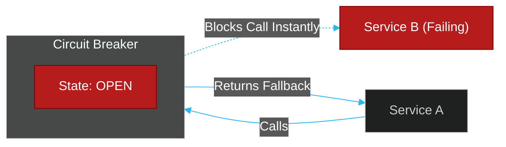

# 📞 Inter-Service Communication

> **Series:** Clean Code › Software Architecture · **Level:** Intermediate · **Read Time:** ~10 min

---

## 📖 Table of Contents

- [1. The Evolution of Communication](#1-the-evolution-of-communication)
- [2. In-Memory (JVM Method Calls)](#2-in-memory-jvm-method-calls)
- [3. Synchronous HTTP (REST & OpenFeign)](#3-synchronous-http-rest-openfeign)
- [4. High-Performance RPC (gRPC)](#4-high-performance-rpc-grpc)
- [5. Resiliency (Circuit Breakers)](#5-resiliency-circuit-breakers)

---

## 1. The Evolution of Communication

When you break a Monolith into Microservices, the biggest technical challenge becomes **Communication**. How does Service A talk to Service B?

If you choose the wrong communication protocol, your microservice architecture will become a "Distributed Monolith," where one slow service causes a cascading failure that takes down the entire company.

---

## 2. In-Memory (JVM Method Calls)

In a Monolith (or Modular Monolith), Service A and Service B exist inside the same JVM (Java Virtual Machine).

```java
// Inside a Modular Monolith
public void placeOrder() {
    billingService.charge(); // Instant, guaranteed, 1 nanosecond
}
```

This is a simple memory pointer jump. It is guaranteed to execute instantly. If it fails, the stack trace is perfectly preserved. There is zero network latency, no JSON serialization, and no dropped packets. 
**This is the fastest, safest form of communication in existence.**

---

## 3. Synchronous HTTP (REST & OpenFeign)

When you split the services across a network, the default choice is usually **REST over HTTP/1.1**.

Service A serializes a Java object into a JSON string, opens a TCP connection, sends it over the physical network, and Service B deserializes the JSON string back into a Java object. This is **1,000,000x slower** than a JVM method call.

### Spring Cloud OpenFeign
In the Spring Boot ecosystem, writing manual `RestTemplate` or `WebClient` code is tedious. **OpenFeign** is a declarative REST client that makes HTTP calls look exactly like local JVM method calls.

```java
// Feign makes the network call look like a local method call
@FeignClient(name = "billing-service", url = "http://internal-billing:8080")
public interface BillingClient {
    
    @PostMapping("/api/v1/charge")
    PaymentResponse chargeCreditCard(@RequestBody PaymentRequest request);
}
```

**The Trap:** Because Feign makes the code *look* like a local JVM call, junior developers treat it like one. They put it inside a `for` loop and accidentally blast the Billing service with 10,000 HTTP requests, crashing the network.

---

## 4. High-Performance RPC (gRPC)

REST over HTTP/1.1 is slow because JSON is a heavy, human-readable text format, and HTTP/1.1 requires opening a new connection for every request.

If you have 50 microservices constantly talking to each other internally, you should use **gRPC**.

Developed by Google, gRPC uses **Protocol Buffers (Protobuf)** and **HTTP/2**.
1. **Binary:** Instead of sending massive JSON strings, it sends highly compressed binary arrays.
2. **Multiplexing:** HTTP/2 allows sending thousands of requests concurrently over a single, persistent TCP connection.
3. **Strong Contracts:** You define the API in a `.proto` file, and it automatically generates the exact Client and Server code in Java, Python, or Go.

*Note: Use REST/JSON for external public APIs (talking to the browser). Use gRPC for internal backend-to-backend communication.*

---

## 5. Resiliency (Circuit Breakers)

When Service A calls Service B synchronously (whether via Feign or gRPC), Service A must **block and wait** for a response.

What if Service B is offline? 
The HTTP request hangs for 30 seconds before timing out. If 1,000 users click the button, Service A suddenly has 1,000 blocked threads waiting for Service B. Service A runs out of memory and crashes. The failure has cascaded.

### The Circuit Breaker Pattern (Resilience4j)
To prevent cascading failures, you must wrap all inter-service calls in a Circuit Breaker.



1. **Closed (Normal):** Traffic flows normally.
2. **Open (Failing):** If Service B fails 50% of the time in the last 10 seconds, the Circuit Breaker "Opens". It instantly intercepts all future calls and returns an error (or fallback data) in 1 millisecond, without even trying to contact Service B. This gives Service B time to recover.
3. **Half-Open:** Every 30 seconds, it lets 1 request through to test if Service B is healthy again.

*(For purely asynchronous, non-blocking communication, refer to the [Message Brokers (Kafka/RabbitMQ)](../../devops/message-brokers-integration/README.md) series).*

---

*← [The Saga Pattern](./02-saga-pattern.md) · [Back to Series Overview](../README.md) →*

## Related

- [Design Patterns](../../design-patterns/README.md)
- [Code Organization Architectures](../code-organization/README.md)
- [API Gateways & Reverse Proxies](../../../devops/api-gateways/README.md)
- [Message Brokers & Integration](../../../devops/message-brokers-integration/README.md)
