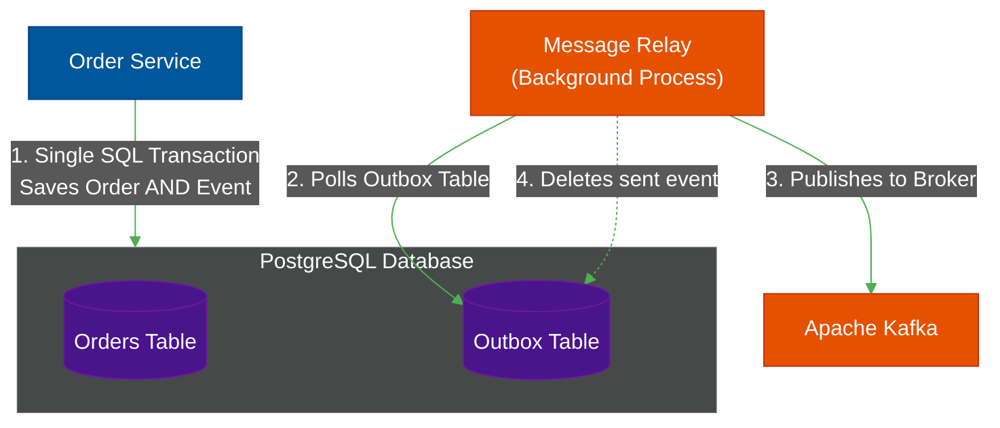

# 📦 The Transactional Outbox Pattern

> **Series:** Clean Code › Distributed Patterns · **Level:** Advanced · **Read Time:** ~10 min

---

## 📖 Table of Contents

- [1. The Dual-Write Problem](#1-the-dual-write-problem)
- [2. Why "Just Try/Catch" Fails](#2-why-just-trycatch-fails)
- [3. The Outbox Solution](#3-the-outbox-solution)
- [4. The Message Relay (Debezium)](#4-the-message-relay-debezium)

---

## 1. The Dual-Write Problem

In modern Microservices, CQRS, or Event-Driven Architectures, a service often has to do two things at the exact same time:
1. Update its own local database.
2. Publish an event to a Message Broker (like Kafka or RabbitMQ) to notify other services.

This is called the **Dual-Write Problem**. You are trying to write to two entirely different distributed systems simultaneously.

---

## 2. Why "Just Try/Catch" Fails

Junior engineers often try to solve this with simple procedural code:

```java
@Transactional
public void createOrder(Order order) {
    // 1. Save to database
    database.save(order);
    
    // 2. Publish to Kafka
    kafka.publish("OrderCreatedEvent", order);
}
```

**Scenario A (Kafka goes down):**
The database saves successfully. Kafka is offline, so `publish()` throws an exception. Because of `@Transactional`, the database rolls back. You show an error to the user. *This is safe.*

**Scenario B (The Database crashes *during* commit):**
The database saves locally. Kafka publishes successfully. The method ends and Spring tries to commit the SQL transaction. Suddenly, the SQL connection drops. The database rolls back.
**Result:** Kafka told the whole company an order was created, but the order does not exist in your database! You ship a physical product to a customer who never paid. *Catastrophe.*

---

## 3. The Outbox Solution

The **Transactional Outbox Pattern** solves this by storing the event *inside the exact same database* as the business entity.

Because they are in the same database, you can wrap them both in a single ACID SQL transaction. They either both succeed, or they both fail.



1. **The Transaction:** The application saves the `Order` into the `orders` table, and simultaneously inserts an `OrderCreatedEvent` JSON payload into the `outbox` table.
2. **The Guarantee:** Because it's a single SQL transaction, there is a 100% guarantee that if the order exists, the event exists.

---

## 4. The Message Relay (Debezium)

How does the event get from the SQL `outbox` table into Kafka?

### Polling Publisher
A simple background thread wakes up every 1 second, runs `SELECT * FROM outbox WHERE sent = false`, publishes the rows to Kafka, and then marks them as `sent = true`. 

### Change Data Capture (CDC) with Debezium
Polling a database every 1 second is terrible for performance. 
The industry standard is to use **Debezium**, an open-source tool that hooks directly into PostgreSQL's internal Write-Ahead Log (WAL). The millisecond a row is inserted into the `outbox` table, Debezium detects the physical disk change and instantly streams the payload directly into Kafka. 

This creates a bulletproof, real-time event publishing system with zero risk of data loss.

---

*← [Inter-Service Comm.](./03-inter-service-communication.md) · Next: [API Gateway & BFF](./05-api-gateway-bff.md) →*

## Related

- [Design Patterns](../../design-patterns/README.md)
- [Code Organization Architectures](../code-organization/README.md)
- [API Gateways & Reverse Proxies](../../../devops/api-gateways/README.md)
- [Message Brokers & Integration](../../../devops/message-brokers-integration/README.md)
