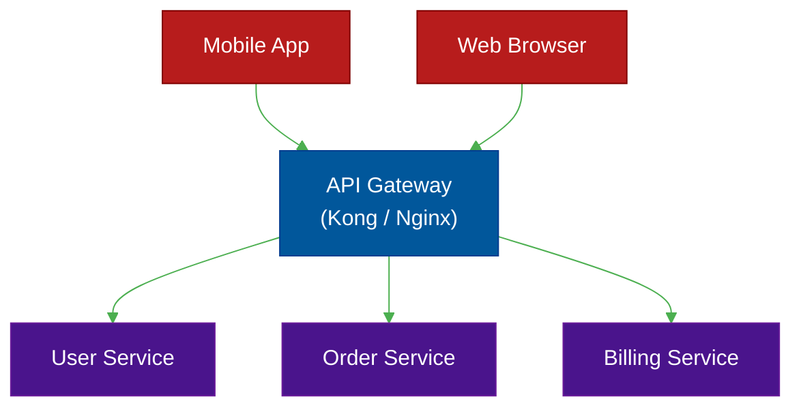

# 🚪 API Gateway & BFF Pattern

> **Series:** Clean Code › Distributed Patterns · **Level:** Intermediate · **Read Time:** ~8 min

---

## 📖 Table of Contents

- [1. The Microservice Client Problem](#1-the-microservice-client-problem)
- [2. The API Gateway](#2-the-api-gateway)
- [3. Backend-for-Frontend (BFF)](#3-backend-for-frontend-bff)
- [4. API Composition (GraphQL)](#4-api-composition-graphql)

---

## 1. The Microservice Client Problem

Imagine you have 50 microservices on your backend. A user opens your Mobile App to view their dashboard.
To render the dashboard, the mobile app needs data from:
- `UserService` (Profile picture)
- `OrderService` (Recent purchases)
- `BillingService` (Current balance)
- `RecommendationService` (Suggested items)

If the Mobile App makes 4 separate HTTP calls to 4 different servers over a slow 3G cellular network, the app will feel incredibly sluggish, drain the user's battery, and require the mobile app to know the exact IP address of every single backend service.

---

## 2. The API Gateway

An **API Gateway** is a single, centralized entry point for all external traffic. The mobile app makes exactly *one* request to the Gateway, and the Gateway routes the traffic to the correct internal microservices.

### Gateway Responsibilities (Cross-Cutting Concerns)
Because all traffic flows through the Gateway, you can offload complex infrastructure tasks from your microservices:
- **SSL Termination:** Decrypting HTTPS into HTTP.
- **Authentication:** Validating JWT tokens before the request hits the internal services.
- **Rate Limiting:** Blocking scrapers from making 10,000 requests per second.

---

## 3. Backend-for-Frontend (BFF)

As the company grows, the Web App team and the Mobile App team start fighting.
The Mobile App wants a tiny JSON payload to save bandwidth. The Web App team wants a massive JSON payload with all the historical data for their complex desktop dashboard.

The **Backend-for-Frontend (BFF)** pattern solves this by giving each client its own dedicated API Gateway.

You build a `MobileBFF` (maintained by the iOS/Android team) and a `WebBFF` (maintained by the React/Angular team). 
Now, the Mobile team can heavily compress and trim the JSON data specifically for their platform without breaking the Web team's API.

---

## 4. API Composition (GraphQL)

To solve the specific problem of a mobile app needing data from 4 different services, the BFF usually acts as an **API Composer**.

The mobile app makes a single call to the BFF: `GET /mobile/dashboard`.
The BFF (which sits in the same high-speed datacenter as the microservices) makes 4 incredibly fast internal calls to the User, Order, Billing, and Recommendation services. It stitches the 4 JSON responses together into a single, perfect payload, and sends that 1 payload back to the mobile phone.

### The GraphQL Revolution
Writing manual API composition code in a BFF is tedious. This is exactly why Facebook invented **GraphQL**. 
GraphQL allows the frontend to send a single query explicitly declaring exactly which fields it wants. A GraphQL server acts as the ultimate API Gateway, automatically executing resolvers to fetch data from the underlying microservices and merging it into a single response.

---

*← [Transactional Outbox](./04-transactional-outbox.md) · Next: [Strangler Fig Pattern](./06-strangler-fig.md) →*

## Related

- [Design Patterns](../../design-patterns/README.md)
- [Code Organization Architectures](../code-organization/README.md)
- [API Gateways & Reverse Proxies](../../../devops/api-gateways/README.md)
- [Message Brokers & Integration](../../../devops/message-brokers-integration/README.md)
