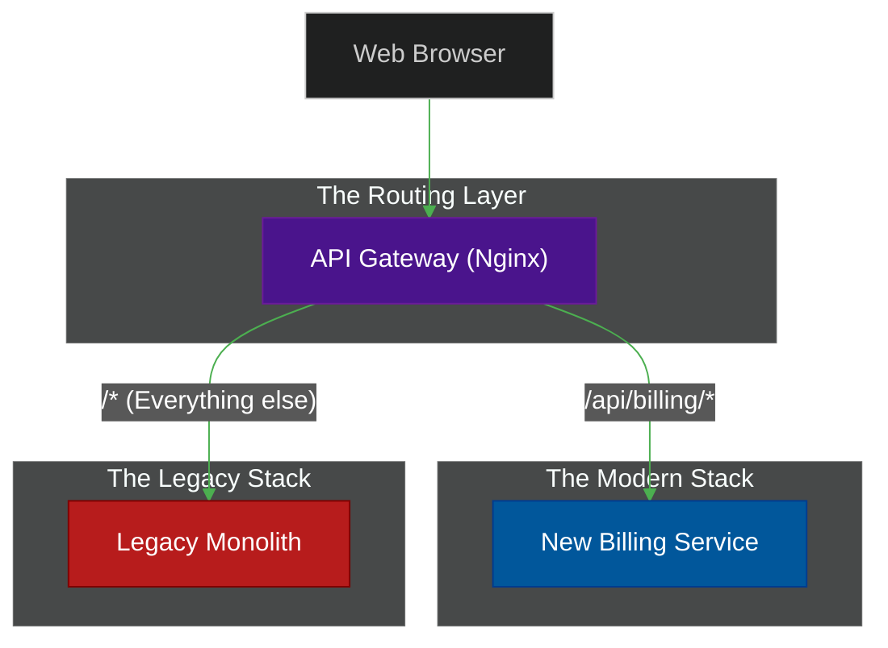

# 🌳 The Strangler Fig Pattern

> **Series:** Clean Code › Distributed Patterns · **Level:** Advanced · **Read Time:** ~6 min

---

## 📖 Table of Contents

- [1. The "Big Bang" Rewrite Disaster](#1-the-big-bang-rewrite-disaster)
- [2. The Strangler Fig Metaphor](#2-the-strangler-fig-metaphor)
- [3. How to Execute the Pattern](#3-how-to-execute-the-pattern)
- [4. Dealing with Data](#4-dealing-with-data)

---

## 1. The "Big Bang" Rewrite Disaster

Your company has a massive, 10-year-old legacy Monolith. The code is unmaintainable. The team decides they are going to freeze development on the old system for 12 months, build a brand new Microservice architecture from scratch, and flip the switch on New Year's Day.

This is called the **"Big Bang" Rewrite**, and it is the single most common cause of catastrophic engineering failures.
While you spend 12 months building the new system, your competitors are adding features to their apps. When you finally "flip the switch", you discover 500 edge-case bugs the legacy system had solved over 10 years that you forgot to implement.

---

## 2. The Strangler Fig Metaphor

Martin Fowler invented the **Strangler Fig Pattern** after observing massive fig trees in Australia. They seed in the upper branches of an existing tree and gradually grow their roots down to the ground. Over many years, the fig tree completely engulfs and kills the original host tree.

Instead of a "Big Bang", you incrementally replace specific functionality of the legacy Monolith with new microservices, one piece at a time, until the Monolith is completely dead.

---

## 3. How to Execute the Pattern

### Step 1: Install the Facade
Place an **API Gateway** (like Nginx) in front of the Legacy Monolith. Configure it to simply pass 100% of the traffic straight to the Monolith. The system is unchanged, but you now have a routing layer.

### Step 2: Build the First Service
Extract one specific domain (e.g., `Billing`). Build a brand new, modern `Billing Microservice` with its own database. 

### Step 3: Redirect Traffic
Update the API Gateway routing rules. Tell it to route all requests matching `/api/billing/*` to the new Microservice, while routing everything else to the legacy Monolith.

### Step 4: Repeat and Kill
Gradually, over 2 years, extract `Inventory`, `Users`, and `Shipping`. Once the API Gateway is routing 100% of traffic to the new microservices, you physically turn off the server running the legacy Monolith. It has been strangled.

---

## 4. Dealing with Data

The hardest part of the Strangler Pattern is the database. If the legacy Monolith and the new Microservice need to share the same data during the migration phase, you have a problem.

**The Solution (Anti-Corruption Layer):**
Do not let the new Microservice connect to the legacy Monolith's messy database. Instead, build an Anti-Corruption Layer (ACL). This is a translation layer that syncs data between the legacy DB and the new DB (often using tools like Debezium or Kafka). This ensures your brand new Microservice remains "pure" and untainted by the legacy schema.

---

*← [API Gateway & BFF](./05-api-gateway-bff.md) · [Back to Series Overview](../README.md) →*

## Related

- [Design Patterns](../../design-patterns/README.md)
- [Code Organization Architectures](../code-organization/README.md)
- [API Gateways & Reverse Proxies](../../../devops/api-gateways/README.md)
- [Message Brokers & Integration](../../../devops/message-brokers-integration/README.md)
