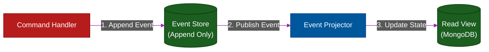

# 📼 Event Sourcing

> **Series:** Clean Code › Distributed Patterns · **Level:** Advanced · **Read Time:** ~12 min

---

## 📖 Table of Contents

- [1. The Problem with State](#1-the-problem-with-state)
- [2. The Ledger Concept](#2-the-ledger-concept)
- [3. Replaying the Past (Time Travel)](#3-replaying-the-past-time-travel)
- [4. The CQRS Connection](#4-the-cqrs-connection)
- [5. Snapshots](#5-snapshots)

---

## 1. The Problem with State

In a traditional CRUD database, you store the **current state** of an entity.
If a user adds an item to their cart, the `Cart` table is updated. If they remove the item, that row is `DELETE`d. 

**The Problem:** You have permanently lost history. You don't know that the user *almost* bought the item. The marketing department cannot analyze abandoned carts because the data was physically overwritten and destroyed.

---

## 2. The Ledger Concept

**Event Sourcing** fundamentally changes the definition of a database. Instead of storing the *current state*, you store an append-only log of **every event that ever occurred**.

This is exactly how a bank account works. Your bank does not have a single row in a database that says `Balance = $50`. 
Instead, they have a ledger:
1. `AccountOpenedEvent` (Balance: $0)
2. `DepositedEvent($100)` (Balance: $100)
3. `WithdrewEvent($50)` (Balance: $50)

To find your current balance, the system starts at the beginning of the ledger and **replays the events**.

---

## 3. Replaying the Past (Time Travel)

Because the database is an immutable, append-only log of events (often stored in an Event Store database or Apache Kafka), you gain superpowers:

- **100% Auditability:** You have absolute cryptographic proof of exactly how a system reached its current state.
- **Time Travel:** Want to know what the user's cart looked like last Tuesday at 4:00 PM? Just replay the events up until that exact timestamp and stop.
- **Bug Fixing:** If a bug in your code calculated taxes incorrectly for the last 6 months, you simply deploy the fixed code, delete your read database, and replay all the events from the beginning of time. The new state will be recalculated perfectly.

---

## 4. The CQRS Connection

Event Sourcing is practically impossible to use on its own. 
If a user wants to view their profile page, you cannot query an Event Store and force the CPU to replay 5,000 events just to figure out their current first name.

**Event Sourcing strictly requires CQRS (Command Query Responsibility Segregation).**
- **The Write Model:** Appends the events to the Event Store.
- **The Read Model:** Listens to the Event Store in real-time, builds the final "Current State" object, and saves it in a fast NoSQL database (like MongoDB) so the UI can query it instantly.

---

## 5. Snapshots

If an `Account` has been active for 10 years, it might have 500,000 events. Replaying 500,000 events every time you need to load the aggregate into memory to validate a new command will crush your CPU.

**The Solution:** Snapshots.
Every 100 events, you save the calculated "current state" (the Snapshot). The next time you load the aggregate, you load the Snapshot, and only have to replay the 3 or 4 events that happened *after* the snapshot was taken.

---

*← [Strangler Fig](./06-strangler-fig.md) · Next: [Bulkhead Pattern](./08-bulkhead-pattern.md) →*

## Related

- [Design Patterns](../../design-patterns/README.md)
- [Code Organization Architectures](../code-organization/README.md)
- [API Gateways & Reverse Proxies](../../../devops/api-gateways/README.md)
- [Message Brokers & Integration](../../../devops/message-brokers-integration/README.md)
