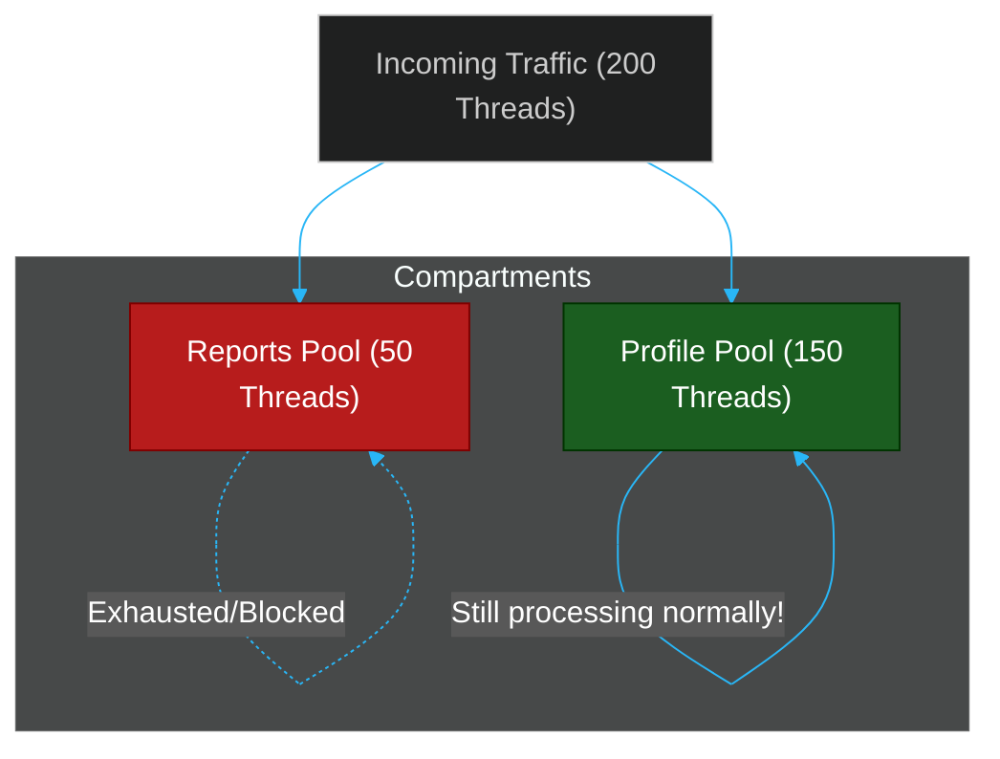

# 🚢 The Bulkhead Pattern

> **Series:** Clean Code › Distributed Patterns · **Level:** Intermediate · **Read Time:** ~6 min

---

## 📖 Table of Contents

- [1. The Sinking Ship](#1-the-sinking-ship)
- [2. The Bulkhead Concept](#2-the-bulkhead-concept)
- [3. Implementing Thread Isolation](#3-implementing-thread-isolation)
- [4. Combining with Circuit Breakers](#4-combining-with-circuit-breakers)

---

## 1. The Sinking Ship

Imagine a Monolithic Web Server (like Apache Tomcat) running a Spring Boot application. The server is configured with a maximum pool of **200 worker threads** to handle incoming HTTP requests.

The application has two APIs:
1. `GET /api/profile` (Fast, takes 10ms)
2. `POST /api/reports` (Slow, talks to a legacy Database, takes 5 seconds)

If the legacy Database slows down to 30 seconds, and 200 users click the "Generate Report" button, **all 200 worker threads become blocked**, waiting for the database.
Now, when a user tries to load their simple profile (`GET /api/profile`), the web server has 0 threads available. The entire application crashes, even though the profile database is perfectly healthy.

This is called **Resource Exhaustion**.

---

## 2. The Bulkhead Concept

In shipbuilding, a **Bulkhead** is a watertight steel wall that divides a ship into separate compartments. If the hull is breached in the cargo bay, the water fills only that one compartment. The doors are sealed, and the ship stays afloat.

In software architecture, the Bulkhead Pattern physically isolates system resources (threads, database connections, memory pools) so that a failure in one component cannot consume all the resources and sink the whole application.

---

## 3. Implementing Thread Isolation

To fix the sinking web server, you use a library like **Resilience4j** to partition your threads.

Instead of letting all requests share the global pool of 200 threads, you explicitly allocate limits:
- **Profile API:** Allowed to use up to 150 threads.
- **Reporting API:** Allowed to use up to 50 threads.

If 200 users click "Generate Report", the Reporting API will max out its 50 threads. The 51st user will immediately receive an HTTP 503 (Service Unavailable) error. 
Meanwhile, the remaining 150 threads are completely isolated and protected. Users loading their profiles won't even notice the system is under attack.

---

## 4. Combining with Circuit Breakers

Bulkheads and Circuit Breakers are the twin pillars of resilient software:
1. **The Circuit Breaker** protects the *remote service* you are calling (by stopping you from hammering it while it's down).
2. **The Bulkhead** protects *your own application* (by stopping the remote service from consuming all of your local threads).

*Rule of Thumb: Every time you make a synchronous network call to another microservice, it should be wrapped in both a Circuit Breaker and a Bulkhead.*

---

*← [Event Sourcing](./07-event-sourcing.md) · [Back to Series Overview](../README.md) →*

## Related

- [Design Patterns](../../design-patterns/README.md)
- [Code Organization Architectures](../code-organization/README.md)
- [API Gateways & Reverse Proxies](../../../devops/api-gateways/README.md)
- [Message Brokers & Integration](../../../devops/message-brokers-integration/README.md)
