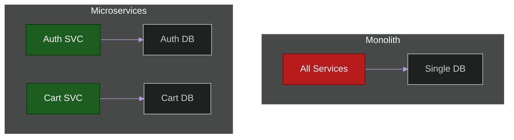

# 📦 The Monolith vs Microservices

> **Series:** Clean Code › Software Architecture · **Level:** Intermediate · **Read Time:** ~8 min

---

## 📖 Table of Contents

- [1. The Majestic Monolith](#1-the-majestic-monolith)
- [2. The Microservices Revolution](#2-the-microservices-revolution)
- [3. The Fallacies of Distributed Computing](#3-the-fallacies-of-distributed-computing)
- [4. The Microservice Premium](#4-the-microservice-premium)

---

## 1. The Majestic Monolith

A **Monolith** is an application where all the business logic for the entire company (Billing, Users, Inventory, Shipping) is compiled into a single executable artifact (like a single `.jar` file) and runs in a single process.

**Pros:**
- Incredibly easy to develop, test, and deploy (just run the `.jar`).
- Zero network latency between modules (calling `BillingService.charge()` is a nanosecond memory pointer jump).
- Data integrity is guaranteed via simple SQL ACID transactions.

**Cons:**
- **The Big Ball of Mud:** Without immense discipline, developers will write spaghetti code, tightly coupling the `User` logic to the `Inventory` logic.
- **Deployment Bottlenecks:** A typo in the CSS of the frontend requires redeploying the entire billing engine.
- **Scaling:** You cannot scale the heavy `Billing` service without also scaling the lightweight `Shipping` service, because they are bound together.

---

## 2. The Microservices Revolution

To solve the organizational problems of a massive team stepping on each other's toes, the industry shifted to **Microservices**.
The Monolith is sliced into 50 tiny, independent applications. Each application has its own database, its own codebase, and is deployed independently by a small, autonomous team.

**Pros:**
- **Independent Deployability:** The Billing team can deploy 5 times a day without talking to the Shipping team.
- **Independent Scalability:** If it's Black Friday, you can scale the `Inventory` service to 100 servers, while keeping the `User` service at 2 servers.
- **Polyglot Persistence:** The Data Science team can use Python + MongoDB, while the Billing team uses Java + PostgreSQL.

---

## 3. The Fallacies of Distributed Computing

> *"If you can't build a well-structured monolith, what makes you think you can build a well-structured set of microservices?"* — Simon Brown

Microservices introduce **Distributed Systems** problems. When you split the codebase, you lose the ability to do standard method calls. `BillingService.charge()` now becomes an HTTP REST call over a network.

Suddenly, you have to deal with:
1. **Network Latency:** An in-memory call takes 1 nanosecond. An HTTP call takes 10,000,000 nanoseconds.
2. **Network Failures:** What if the network drops the packet? You must implement Retries, Circuit Breakers, and Timeouts.
3. **Data Consistency:** You can no longer use simple SQL Transactions. If the `Inventory` service successfully reserves an item, but the `Billing` service crashes, you have a distributed data anomaly. You must now implement complex distributed transaction patterns like **Sagas**.

---

## 4. The Microservice Premium

Martin Fowler famously documented the **Microservice Premium**. 

Microservices require an immense amount of foundational infrastructure to work safely:
- Automated CI/CD Pipelines
- Advanced Monitoring and Distributed Tracing (OpenTelemetry)
- Service Meshes (Istio) for mTLS and routing
- Container Orchestration (Kubernetes)

If you are a startup trying to find product-market fit, spending 6 months building Kubernetes clusters and configuring Kafka queues so your 3 developers don't step on each other's toes is a fatal mistake. 

**Start with a Monolith.** Extract microservices only when your organizational size (number of developers) or specific scaling bottlenecks force you to.

---

*← [Vertical Slice Architecture](../code-organization/04-vertical-slice.md) · Next: [The Modular Monolith](./02-modular-monolith.md) →*

## Related

- [Design Patterns](../../design-patterns/README.md)
- [Distributed Architecture Patterns](../distributed-patterns/README.md)
- [Databases](../../../devops/databases/README.md)
- [Observability & Monitoring](../../../devops/observability/README.md)
