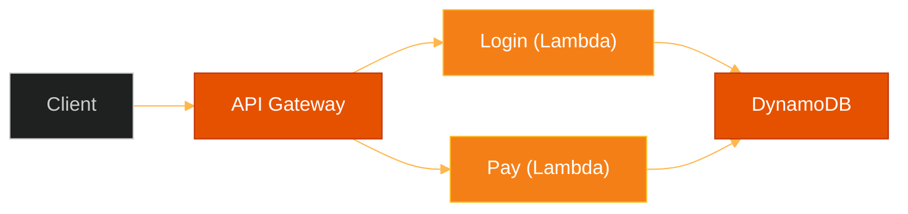

# ☁️ Serverless Architecture (FaaS)

> **Series:** Clean Code › System Design · **Level:** Intermediate · **Read Time:** ~8 min

---

## 📖 Table of Contents

- [1. What Is Serverless?](#1-what-is-serverless)
- [2. Function-as-a-Service (FaaS)](#2-function-as-a-service-faas)
- [3. The Scale-to-Zero Superpower](#3-the-scale-to-zero-superpower)
- [4. The Cold Start Penalty](#4-the-cold-start-penalty)
- [5. When to Use Serverless](#5-when-to-use-serverless)

---




## 1. What Is Serverless?

"Serverless" is a terrible name. There are obviously still servers running your code in an Amazon or Google data center. 

Serverless actually means **Server Management-less**.
You no longer provision Linux instances. You don't manage operating system patches. You don't configure load balancers. You don't worry about Kubernetes node autoscaling. You simply write code, hand it to the cloud provider, and say: *"Run this when an event happens."*

---

## 2. Function-as-a-Service (FaaS)

The core compute engine of Serverless is **FaaS** (e.g., AWS Lambda, Google Cloud Functions, Azure Functions).

Instead of deploying a massive Spring Boot Monolith that runs continuously 24/7 listening for HTTP requests, you write a single, tiny function.

```javascript
// A simple AWS Lambda function
exports.handler = async (event) => {
    const userId = event.pathParameters.id;
    const user = await database.getUser(userId);
    return { statusCode: 200, body: JSON.stringify(user) };
};
```

You configure AWS to map the API Gateway URL `/users/{id}` directly to this specific function.

---

## 3. The Scale-to-Zero Superpower

In a traditional architecture, if your staging environment gets 0 traffic on a Sunday, you still pay $100/month because the EC2 server or Kubernetes Pod is sitting there spinning, waiting for traffic.

**Serverless scales to zero.** If no one hits your API, the cloud provider shuts the function down. You pay exactly **$0.00**.
If your API suddenly gets hit by a Super Bowl commercial, the cloud provider instantly spins up 10,000 parallel copies of your function. You don't configure auto-scaling rules; it happens magically. You pay by the *millisecond* of execution time.

---

## 4. The Cold Start Penalty

Because the cloud provider shuts your function down when it's not being used, what happens when a user finally makes a request?

The cloud provider has to find an empty server, copy your code to it, boot up the runtime (e.g., Node.js or the Java JVM), and execute your function. This is called a **Cold Start**.
A cold start might take 500ms to 2 seconds. For a snappy user interface, a 2-second delay is terrible.

*Note: This is why JavaScript, Python, and Go dominate Serverless. The Java JVM is notoriously slow to boot. (Though modern tools like GraalVM are solving this by compiling Java into instant-booting native binaries).*

---

## 5. When to Use Serverless

✅ **Use Serverless when:**
- Your workloads are incredibly spiky and unpredictable (e.g., concert ticket sales).
- You are building background event-driven tasks (e.g., resizing an image every time a file is uploaded to an S3 bucket).
- You are a small startup that wants to pay $0 until you get actual users.

❌ **Do NOT use Serverless when:**
- You have constant, predictable, massive traffic. Running a serverless function 24/7/365 is dramatically more expensive than just renting a dedicated server.
- Your workload requires keeping a persistent WebSocket connection open for hours.
- You absolutely cannot tolerate a 500ms Cold Start delay on random requests.

---

*← [The Modular Monolith](./02-modular-monolith.md) · [Back to Series Overview](../README.md) →*

## Related

- [Design Patterns](../../design-patterns/README.md)
- [Distributed Architecture Patterns](../distributed-patterns/README.md)
- [Databases](../../../devops/databases/README.md)
- [Observability & Monitoring](../../../devops/observability/README.md)
