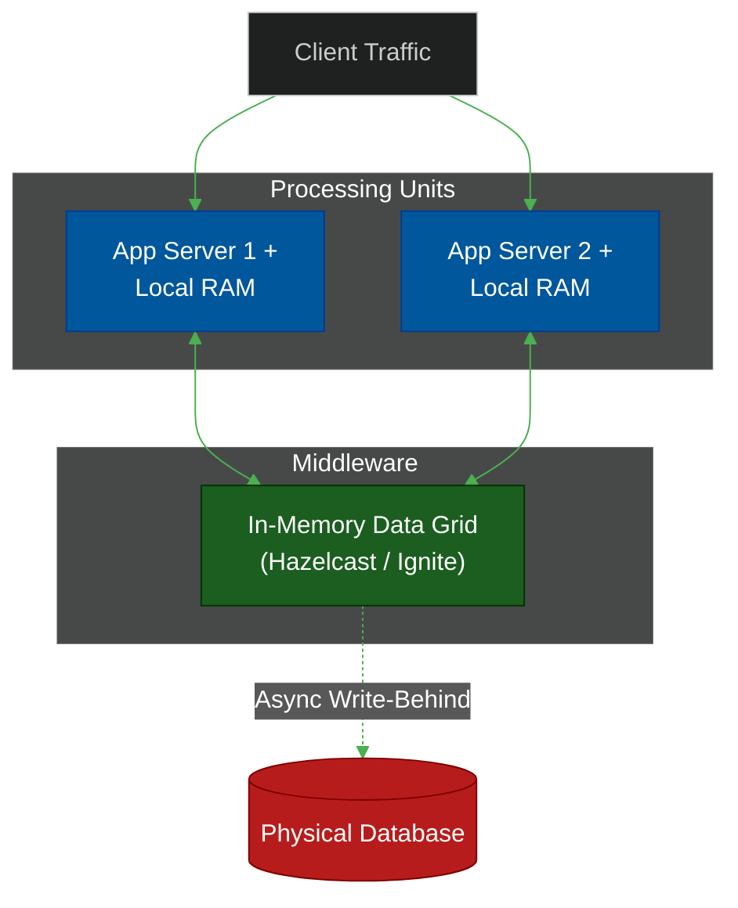

# 🚀 Space-Based Architecture

> **Series:** Clean Code › System Design · **Level:** Expert · **Read Time:** ~8 min

---

## 📖 Table of Contents

- [1. The Database Bottleneck](#1-the-database-bottleneck)
- [2. The Tuple Space Concept](#2-the-tuple-space-concept)
- [3. How Space-Based Architecture Works](#3-how-space-based-architecture-works)
- [4. When to Use It](#4-when-to-use-it)

---

## 1. The Database Bottleneck

In standard web architectures, the application servers are stateless. You can scale from 1 to 10,000 web servers instantly. 
However, all 10,000 of those servers eventually have to read and write to the same central SQL Database. The database becomes the ultimate, unscalable bottleneck.

Even if you use CQRS and Sharding, physical disk I/O and network latency to the database server will eventually lock up a high-frequency trading platform or a massive ticketing system.

---

## 2. The Tuple Space Concept

**Space-Based Architecture** (SBA) eliminates the database from the critical path entirely. 

It is based on the concept of a "Tuple Space" (a shared distributed memory space). Instead of saving data to a hard drive, the application saves data directly into a massively distributed cluster of RAM (an In-Memory Data Grid, or IMDG, like Hazelcast, Redis Cluster, or Apache Ignite).

Because RAM is thousands of times faster than SSDs, the system can handle extreme, unpredictable spikes in throughput without breaking a sweat.

---

## 3. How Space-Based Architecture Works

### The Processing Unit
Instead of a separate App Server and Database Server, the application code and the data live on the exact same machine. The "Processing Unit" holds a chunk of the In-Memory Data Grid locally in its own RAM. 
When it updates a user's balance, it updates the RAM instantly.

### Virtualized Middleware
The Middleware constantly syncs the RAM across all the Processing Units in the cluster so data is never lost if a single node crashes.

### Asynchronous Data Pump
Wait, RAM is volatile! If the data center loses power, the data is gone forever!
To prevent this, an asynchronous "Data Pump" runs in the background, quietly writing the RAM data to a permanent, physical database on disk. The physical database is used purely for cold storage and disaster recovery; the application *never* reads from it directly.

---

## 4. When to Use It

✅ **Use Space-Based Architecture when:**
- You have extreme, unpredictable spikes in traffic (e.g., Ticketmaster selling Taylor Swift tickets, online auctions, high-frequency trading).
- The system must process millions of concurrent transactions with sub-millisecond latency.

❌ **Do NOT use Space-Based Architecture when:**
- Your system deals with massive amounts of cold, historical data (RAM is very expensive; you cannot store 10 Petabytes of old receipts in Hazelcast).
- You are building a standard CRUD application. The complexity of SBA will destroy your team's velocity.

---

*← [Serverless Architecture](./03-serverless-architecture.md) · [Back to Series Overview](../README.md) →*

## Related

- [Design Patterns](../../design-patterns/README.md)
- [Distributed Architecture Patterns](../distributed-patterns/README.md)
- [Databases](../../../devops/databases/README.md)
- [Observability & Monitoring](../../../devops/observability/README.md)
