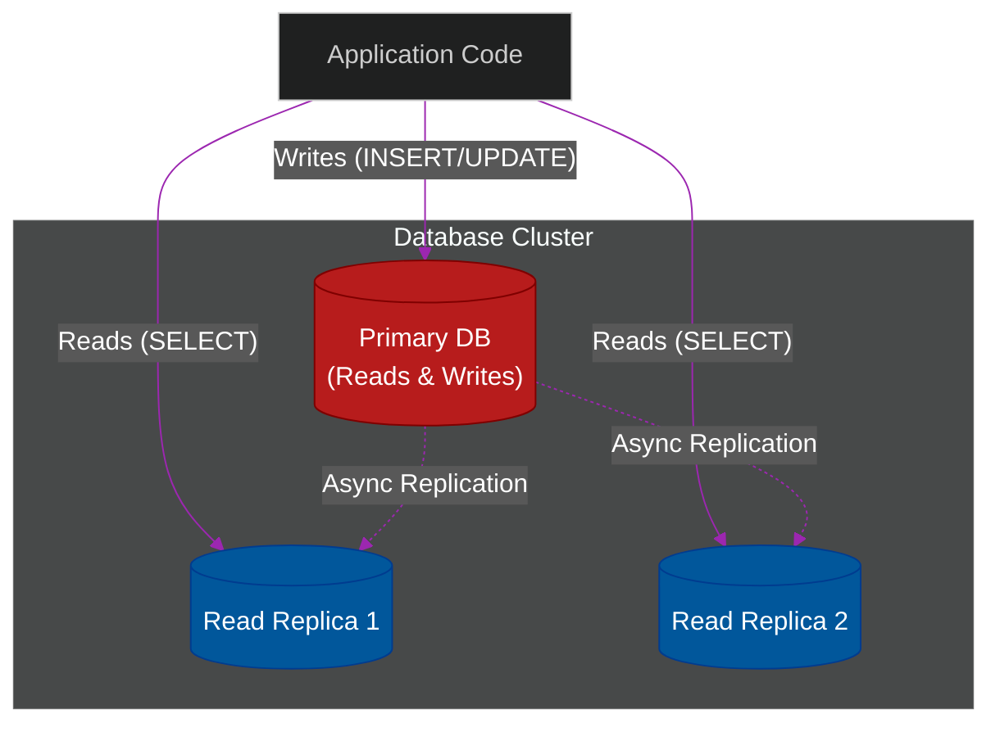

# ⚖️ Database Scaling (Replicas & Sharding)

> **Series:** Clean Code › System Design · **Level:** Intermediate · **Read Time:** ~10 min

---

## 📖 Table of Contents

- [1. The Limits of Vertical Scaling](#1-the-limits-of-vertical-scaling)
- [2. Primary-Replica Architecture (Read Replicas)](#2-primary-replica-architecture-read-replicas)
- [3. Multi-Primary (Active-Active)](#3-multi-primary-active-active)
- [4. Sharding (Data Partitioning)](#4-sharding-data-partitioning)
- [5. The CAP Theorem](#5-the-cap-theorem)

---

## 1. The Limits of Vertical Scaling

When a database becomes slow, the easiest solution is **Vertical Scaling (Scaling Up)**. You simply buy a larger server with more RAM and a faster CPU. 
However, Vertical Scaling has a hard physical limit. Eventually, you cannot buy a bigger server.

To solve this, you must shift to **Horizontal Scaling (Scaling Out)**—adding more servers to distribute the load. Because databases hold state, scaling them horizontally is the hardest problem in distributed systems.

---

## 2. Primary-Replica Architecture (Read Replicas)

Most applications are **read-heavy** (e.g., 90% of queries are reading profiles, 10% are updating data). 

The **Primary-Replica** (formerly Master-Slave) architecture exploits this by splitting reads from writes.

1. **The Primary:** All `INSERT`, `UPDATE`, and `DELETE` queries must go to the single Primary database.
2. **The Replicas:** The Primary asynchronously streams its Write-Ahead Log (WAL) to multiple Replicas. All `SELECT` queries are load-balanced across the Replicas.

**The Catch:** Because replication is asynchronous, a user might update their profile picture, immediately refresh the page, and see their old picture because the Replica hasn't received the update yet (Eventual Consistency).

---

## 3. Multi-Primary (Active-Active)

What if your application has massive **write** volumes? A single Primary database will eventually crash.

A **Multi-Primary** setup allows multiple nodes to accept Write queries simultaneously.
This is incredibly dangerous. If Node A updates User 1's balance to $50, and Node B simultaneously updates User 1's balance to $20, you have a **Write Conflict**. Resolving these conflicts across a network is extremely complex, which is why Multi-Primary SQL databases are rare, though NoSQL databases (like Cassandra) are designed specifically for this.

---

## 4. Sharding (Data Partitioning)

If a single database table grows to 10 Billion rows, even basic indexes will not fit in RAM. You must split the table.

**Sharding** physically splits a single logical table across multiple different database servers.

- **Range Sharding:** Users A-M go to Database 1. Users N-Z go to Database 2. (Dangerous: If 'A' names are more common, Database 1 will crash).
- **Hash Sharding:** You run a math equation on the User ID (e.g., `UserId % 4`). The result determines which of the 4 databases stores the record. This evenly distributes data.

**The Catch:** If you want to run a `JOIN` query between a User and their Orders, but the User is on Shard 1 and the Order is on Shard 3, the database cannot perform the query. Your application code must manually fetch from both and merge the data in memory.

---

## 5. The CAP Theorem

When configuring replicas and shards, you must understand the **CAP Theorem**. It states that a distributed data store can only provide two of the following three guarantees:

1. **Consistency:** Every read receives the most recent write (or an error).
2. **Availability:** Every request receives a non-error response (but it might be stale data).
3. **Partition Tolerance:** The system continues to operate despite network cables being cut between nodes.

Because network partitions (P) *will* happen in the cloud, you are forced to choose between **CP** and **AP**.
- **CP (Consistency):** If the network fails between the Primary and Replica, the Primary locks up and refuses all writes until the network recovers. (Used in Banking).
- **AP (Availability):** If the network fails, the Replicas keep serving old, stale data so the website stays online. (Used in Social Media feeds).

---

*← [Space-Based Arch.](./04-space-based-architecture.md) · [Back to Series Overview](../README.md) →*

## Related

- [Design Patterns](../../design-patterns/README.md)
- [Distributed Architecture Patterns](../distributed-patterns/README.md)
- [Databases](../../../devops/databases/README.md)
- [Observability & Monitoring](../../../devops/observability/README.md)
